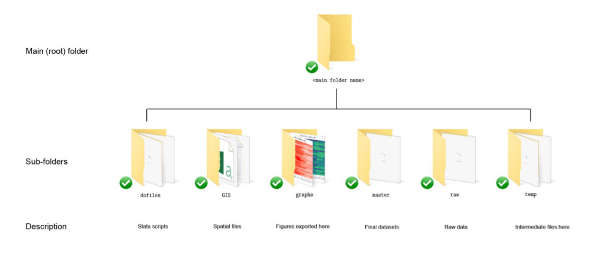
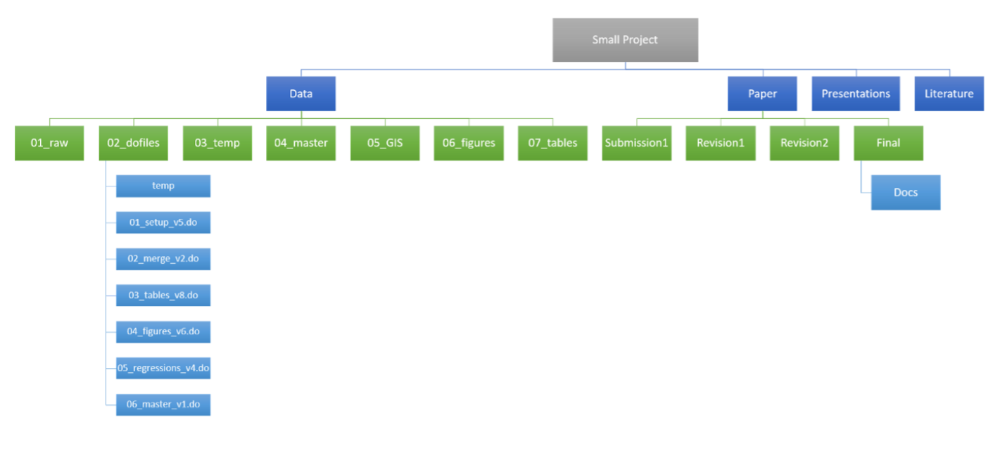
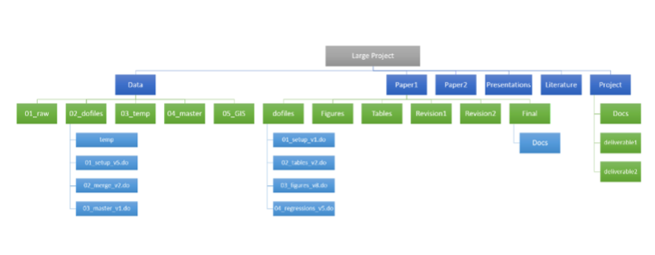
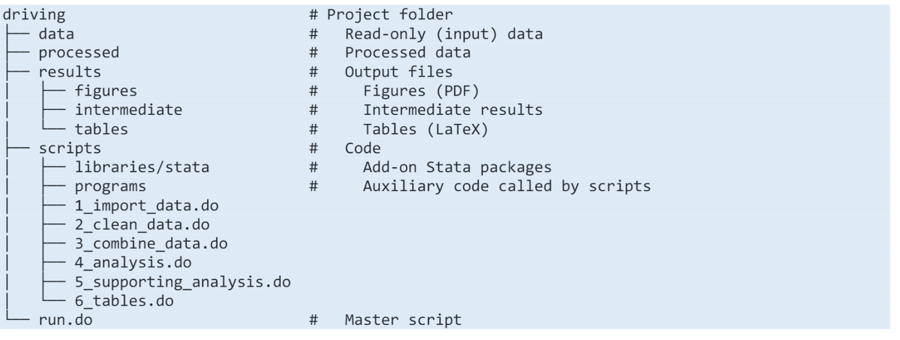

---
editor_options:
  markdown:
    wrap: 72
---

```{r global options, include=FALSE}
knitr::opts_chunk$set(message = FALSE, echo = TRUE, warning = FALSE, error = TRUE, results="hide", eval = FALSE)
```

# Buenas prácticas de programación y visualización

### Introducción

#### Programación defensiva

**Las personas somos malas escribiendo códigos**

Esta sección esta basada en los trabajos y recursos publicados por [Nick Eubank](https://www.nickeubank.com/).
    
* La filosofía de escribir un código esta motivada por el hecho de que las personas somos **malas escribiendo códigos**.
* Si queremos evitar errores **no es suficiente con ser cuidadoso(a)**
* Es necesario diseñar estrategias que tomen en cuenta el hecho de que vamos a cometer errores al escribir un código.
* Tener buenas estrategias es más relevante cuando existe trabajo colaborativo, que puede **amplificar los errores**.

En esta sección revisaremos cuatro ``buenas practicas'' de programación. Estas practicas no son solo aplicables a Stata, más bien son guías generales para escribir códigos en cualquier lenguaje. 

1. Usar testeos o pruebas.
2. No duplicar información.
3. No transcribir información, siempre exportarla.
4. Usar un estilo correcto. 
 
Con estos elementos podremos:
    
* **Minimizar** las oportunidades de generar errores al codificar.
* **Maximizar** la probabilidad de que cuando se cometa un error (lo que ocurrirá!) se pueda detectar con mayor facilidad. 

**¿Necesito entender estos principios?**


@chang2015economics testearon la reproducibilidad de 67 artículos **publicados**. Todos con alguna sección empírica. Encuentran que: 
    
* Solo 29 artículos fueron totalmente replicables.
* 29 artículos tenían problemas al tratar \textit{missing values.}
* 9 poseen datos incorrectos o errores de codificación.
    
\citet{christensen2018transparency} indican que Chang y Li utilizan una versión poco estricta de replicabilidad. 
    
<div class="alert alert-block alert-info">
<b></b> (...) Chang and Li (2015) use a qualitative definition of replication, and test only key results of the paper, and this appears to lead to a fairly generous interpretation of replicability. (...) </div>

<div class="alert alert-block alert-info">
<b></b>  (...) To our minds, this is evidence that even when data are available (which they sometimes are not) \textbf{a non-negligible fraction of empirical economics research cannot be reproduced}, even when using the original data and a relatively non-stringent conceptual understanding of what constitutes replication success. </div>
  
¿Qué podemos aprender de esta historia?

* Todos y todas tienen problemas para codificar.
* Hoy el **trabajo es colaborativo**. También tienes que confiar en los demás. 
* Hay cosas que no se pueden resolver con ser cuidadoso(a) al codificar. ¿Si los datos están mal? 
* Reproducibilidad y replicabilidad son claves. Buenas referencias se encuentran en la página de [Julia Schulte-Cloos](https://jschultecloos.github.io/).

#### Practica I: escribir pruebas

¿Qué es escribir pruebas?

[Nick Eubank](https://www.nickeubank.com/) indica que si el tuviese que elegir solo una practica elegiría agregar pruebas o tests a los códigos.

¿Qué es una prueba?

* Son afirmaciones que tienen como respuesta un valor lógico.
* Buscan chequear una condición particular, en caso de que no se cumpla esta condición, la ejecución se detiene. 

¿Por qué agregar estos chequeos, si yo siempre chequeo o reviso mis códigos? 

1. Test se ejecutan **cada vez** que corres tu código
  + La mayoría testea la **primera** vez que escribe un código.
  + Si hay una entrega el testeo disminuye rápidamente.
  + Si ya ha pasado algún tiempo. Únicamente ejecuto el código y espero los resultados. Entender un código (incluso el que uno(a) misma escribió es difícil). 
  + Un error que se comete en una de las múltiples ediciones del código pueda ser detectado con facilidad al testear. 
2. Genera el hábito de chequear permanentemente a un **costo razonable**
  + La mayoría se para a chequear los datos cuando detecta algún error o bien sospecha que existe un problema.
  + Si nos acostumbramos a escribir pruebas al final de los códigos o bien cada vez que se hagan cierto tipo de operaciones (ej. siempre después de unir bases de datos), iremos generando el hábito de chequear constantemente, pero sin sobre-invertir en revisiones posteriores. 
3. Ayuda a **detectar** problemas rápidamente
  + Se donde esta el error. Puedo corregirlo rápidamente. 
  + Esto es especialmente importante en Stata dado que no nos indica en que linea del código se produjo el error. % Chequear bien esto. 
4. Escribir pruebas ayuda a detectar más problemas de los **previstos**
  + Los errores de un código se manifiestan de múltiples formas y muchas veces son consecuencia de errores anteriores. 
  + Por ejemplo...
  + Si tengo valores duplicados mi estadística descriptiva estará mala. 
  + El problema surge de no darle un tratamiento correcto a los valores duplicados. No surge de algún problema en el código que genera la estadística descriptiva. 

**Ejemplo 1:** Para escribir pruebas en Stata utilizaremos el comando `|assert|`. Notar que este comando detiene la ejecución del código cuando **la condición no se cumple**. 

Testear si la base de datos tiene 100 observaciones:
```{stata, results="hide"}
count 
assert `r(N)' == 100
```

Testear si la variable ` tasa_desempleo` toma valores razonables:
```{stata, results="hide"}
assert tasa_desempleo| > 0 & tasa_desempleo| < 100
```

Testear si la variable `edad` es siempre positiva: 
```{stata, results="hide"}
edad > 0
```

<div class="alert alert-block alert-warning">
<b>Ejercicio 3.1.1:</b>

Instrucciones:

* Descargar carpeta *ejercicios - Clase 1*
* Abrir `ejercicios_clase1.do` y fijar directorio de trabajo en la carpeta descargada.

Preguntas:

1. La base de datos *World Development Indicator (WDI)* tiene observaciones duplicadas. **Escriba un test que falle cuando existen valores duplicados**.
2. Los países en la base de datos `Polity` deberían ser un subconjunto de los países que están en la base WDI. **Escriba un test que falle debido a este problema**.
</div>

¿Cuando escribir tests?

* Después de juntar bases: **Siempre** incluir test después de utilizar  un `merge`.
* Después manipulaciones complejas de datos: Si piensas que fue difícil, incluye un test. 
* Después de eliminar observaciones: **Siempre** incluir test después de utilizar  un `drop`.

<div class="alert alert-block alert-info">
<b>Regla general</b> siempre que te veas a ti misma(o) revisando o chequeando algún segmento de código interactivamente **escribe un test**.
</div>

#### Practica II: no duplicar información

Todo en un solo sitio

* Información  debe estar expresada una sola vez en un código. 
* Si la información esta en muchas partes en el código, tendrás que buscar todos esos lugares. 
* Veamos un ejemplo...

Imaginemos que quiero eliminar todas las observaciones que toman un valor mayor a un cierto límite.
```{stata, results="hide"}
drop if var1 > 110 
drop if var2 > 110 
drop if var3 > 110 
```

Lo anterior funciona... ¿Cual es el problema entonces? 

* Imaginemos que queremos cambiar el límite de 110 a 100. Del modo en que esta escrito, vamos a tener que hacer cambios **3 veces!**
* Si estas restricciones se encuentran en distintas partes de tú código, se puede inducir un error. 

**Ejemplo 2:** Para evitar el problema anterior, es mejor escribir:
```{stata, results="hide"}
local lim = 110 
    drop if var1 > `lim'
    drop if var2 > `lim' 
    drop if var3 > `lim' 
```
    
De esta forma, en caso de decidir cambiar la restricción, solo tendrás que hacer **un cambio**. Minimizando la posibilidad de cometer un error. 

<div class="alert alert-block alert-warning">
<b>Ejercicio 3.1.2:</b>

* Todas las regresiones que se encuentran en el código tienen la misma base, es decir, el mismo conjunto de variables que se repite. 
* La idea es consolidar la base con el fin de evitar duplicación de información. 
* Con este fin, agregar `population` como control en todas las regresiones. Nuevamente, no dupliques información. 
</div>

#### Practica III: no transcribir, exportar información

Nunca transcribir

* **Nunca se debe transcribir resultados**. Todo debe ser exportado de forma tal que pueda ser actualizado automáticamente.  
* No cumplir con esta practica es una importante fuente de errores: 
* **Errores de transcripción:** Si me equivoco en el décimo decimal no es tan grave, si cambio un signo si lo es. 
* **Problemas para actualizar:** Es probable que al actualizar un código (como sucede usualmente en cualquier proyecto), olvidemos traspasar los resultados. 
* ¿Como evitar este problema? 
  + Para usuarios de $\LaTeX$  cada resultado debe ser guardado en archivos `.tex`. 
  + Hacer esto no solo con las tablas (ej. `putexcel`). También hacerlo con cualquier estadística que aparezca en el texto. 
  + Generar el número que se desea citar. Convertirlo a `string` y guardarlo (ej. `midato.tex`). Llamarlo con `\input{midato.tex}`.
  + Para usuarios de Word es un poco más complejo. Veremos que se puede hacer en la Clase 6. 
  + También veremos Stata Markdown. 

Ejemplo 3:
```{stata, results="hide"}
eststo clear
eststo: reg polity gdp_per_cap
eststo: reg polity gdp_per_cap under5_mortality
esttab using nombredelarchivo.tex, replace ///
       title("Mis estimaciones")
```
Importar a $\LaTeX$: `\input{nombredelarchivo.tex}`

<div class="alert alert-block alert-warning">
<b>Ejercicio 3.1.3:</b>

Calcula el promedio de `literacy_rate` y guárdalo en una macro local. Generar un formato tal que solo tenga dos decimales. Guarda el valor como *string* en un archivo `.tex` en la misma carpeta. 
</div>

#### Practica IV: estilo importa

Algunos comentarios sobre estilo

* Estilo no se refiere a la estética del código ni al orden (para bien o para mal!). 
* Tiene que ver con la facilidad con el que este se puede **leer**. El objetivo final es siempre poder detectar errores.   
* Tres aspectos son claves:
  + **Utilizar espacios.** Usar espacios siempre después de utilizar un operador. Por ejemplo: 
```{stata, results="hide"}
gen var1=var2+var3      /// Mal
gen var1 = var2 + var3  /// Bien
```
  
  + \item Con criterio... 
```{stata, results="hide"}
hours + minutes / 60 + seconds / 3600 
hours + minutes/60 + seconds/3600
```
  
  + **Usar variables que sean informativas en si mismas.** No escribir `var1`, si puedes escribir: `tasa_desempleo`. Requiere más trabajo, pero facilita la lectura. Agregar unidades también facilita la lectura (`labels`).  
 \medskip
 
* Escribir comentarios

  + Ejercicio para explicar en pocas palabras lo que se ha hecho. 
  + Existe un equilibrio entre parsimonia y calidad del comentario. 
  + Establecer el objetivo del comentario claramente es muy importante. 
  
* No hay una regla para escribir comentarios

  + Utilizar imperativo si lo tiene que corregir otra persona (ej. modifica parámetros aquí, fija directorio). 
  + Debe incluir suficiente contexto para que alguien que no trabaje directamente en eso entienda que se debe hacer.
  + Los comentarios largos deben explicar secciones de código. Importante escribir el código por bloques. 
  + La brevedad no debe afectar nunca la comprensión. Esto también aplica para los comandos (ejemplo de [Michael Shill](https://michaelshill.net/2015/07/31/in-stata-coding-style-is-the-essential/)). 
```{stata, results="hide"}
summarize var1
sum var1
su var1
```

### Estilo de codificación en Stata

#### Más allá del orden

Un buen estilo es seguir una estrategia

* Revisaremos un poco más sobre estilo en base a dos referencias adicionales:  \citet{gentzkow2014code} y de una guía confeccionada por [Michael Stepner](https://michaelstepner.com/).
* Los códigos tienen distintas audiencias. La primera es tu computadora. Si tu computadora no entiende tú código es el peor de los mundos. 
* Una de las audiencias más importantes son tus colaboradores y colaboradoras. Si ellos/as no lo entienden. **El problema es tuyo en primer lugar.**
* No hay un solo buen estilo. No hay una guía que pueda sustituir experiencia o estrategias ya probadas de trabajo de equipo. 
* Lo importante es \alert{tener estrategias} y **utilizarlas** en la medida de que sea positivo para el producto final. 
* Ahora veremos algunas estrategias y buenas practicas que pueden ayudar a mejorar el estilo de codificación individual y de tu equipo. 
      
#### Códigos cortos

* Ningún segmento de código debiese ser mayor a 100 - 150 carácteres. 
* Códigos largos, debiesen ser escritos de forma más pequeña como funciones (Clase 4). 
* Si tienes dificultades para reducir un código a estos estándares, es probable que tengas que pensar en como estructurarlo de mejor forma. 
* Cada segmento de código o funciones debiesen tener un propósito **claro e intuitivo** para lectores experimentados en el lenguaje de programación que se este utilizando. 

do - files cortos y con foco

* Todo do-file debe tener un propósito que pueda ser **explicado en una oración.** De hecho, hay que hacerlo. En el preámbulo.  
* Un proyecto debe tener varios `do-files` con las siguientes características.
  + **Cortos:** Debes ser capaz de leer un do-file completo en poco minutos y entender el objetivo. Una buena regla es que no sean más largos de 250 - 350 lineas. No es estricta esta regla. Hay ocasiones que se justifican códigos más largos. %Lo importante es claridad. No sacrificarla nunca. 
  + **Autocontenidos:** Cada do-file interactúa con otros solo a través de los archivos que carga y de los que guarda. 
  + **Enfocados:** Un `do-file` cumple un propósito determinado. Cada parte se debe entender como un paso intuitivo para lograr ese propósito. 

Funciones claras

* Un lector debe saber exactamente cuales son los `inputs` de las funciones.  
* Las funciones debiesen declarar explicitamente `inputs` y `outputs`. Solo deben funcionar en variables locales. 
* Las funciones deben trabajar solo en el conjunto de datos para el cual están diseñadas. Por ejemplo: parametros regresión. 
* Usar variables globales rara vez. 

#### Nombres Descriptivos
* Nombres adecuados remplazan comentarios y hacen del código un archivo auto contenido. * **Utilizar nombres completos**. Abreviaciones solo en el caso de estar seguro que cualquier lector puede entenderlo sin ambigüedad.
* Si se utilizan abreviaciones. Ser consistente. Utilizar siempre las mismas a lo largo del código. 
* Cuando no se pueda ser suficientemente claro en un nombre, utilizar si o si \verb|label variable| para dar una descripción (ej. agregar unidad de medida).
* `labels` especifican información. (ej, `edad` con el `label` *edad al 31 de enero* es más informativa que `edad` y más corto que `edad_31enero`.
* No utilizar nombres en dos (o más) archivos que no expliciten porque son diferentes. Por ejemplo: `version_final.do` y `version_final_ahorasiquesi.do`. 
* Los nombres pueden ser más cortos cuando se utilicen con frecuencia o el objeto este inmediatamente después. Por ejemplo: 
```{stata, results="hide"}
beta_mco = (educacion' * educacion)^(-1) * ///
           (educacion' * log_salarios)
```

Mejor escrito sería:
```{stata, results="hide"}
X = educacion
Y = log_salarios
beta_educ_salarios = (X'*X)^(-1)*(X'*Y) 
```

* No ser tacaño(a) al nombrar variables, archivos, carpetas. 
* Probablemente lo escribas solo una vez. No ahorres espacio. Siempre pensar en la claridad. 
* Para el caso de una figura:
  + `c_1.pdf` es un pesimo nombre. 
  + `correlaciones.pdf` es un mal nombre. 
  + `T1_CORRELACIONES_INGRESO_MORTALIDAD.PDF` es un mejor nombre.
* Para el caso de una carpeta:
  + `datos/brutos/interregional` es un mal nombre.
  + `datos/brutos/Estimaciones Censo Interregional 2010 - 2021` es un buen nombre. 
* Estos nombres nos permiten pensar en el flujo del proyecto sin tener que mirar los códigos. 

#### Ojo con el álgebra
Separa el álgebra en partes.
```{stata, results="hide"}
gen pib_percapita_real = ///
    (cons + ggob + export - import - impuestos)* 10^6 ///
    /(indice_precios * poblacion_miles * 1000)
```

Más largo, pero mucho más entendible:
```{stata, results="hide"}
gen pib_millones_nominal = ///
    (cons + ggob + export - import - impuestos)
gen pib_total_real = pib_millones_nominal * 10^6 ///
    / indice_precios
gen pop_total = poblacion_miles * 1000
gen pib_percapita_real = pib_total_real / pob_total 
```

#### Consistencia

Ser consistentes
* Hay cosas de estilo que son solo un tema de gusto. Por ejemplo, hay quienes escriben `nivel_empleo_anual` y otras que escribe `NivelEmpleoAnual`. 
* No importa la elección de un estilo u otro. Lo que importa es que todas y todos los miembros del equipo utilicen **la misma** convención. 
   
#### Chequear errores

* Hemos aprendido que es importante escribir pruebas o testeos. Especialmente relevante después de operaciones complicadas o pegado de bases de datos.
* Stata en algunas ocasiones indica los errores que se comenten, sin la necesidad de colocar estas pruebas. Por ejemplo:  
```{stata, results="hide"}
gen string x = "hola"
gen y = x^2
```
   
   Stata retorna el siguiente error: 
```{stata, results="hide"}
type mismatch 
r(109);
```
Normalmente el error da suficiente información. A pesar de lo anterior, en algunas circunstancias, no es tan claro saber cual es el error. Cuando ustedes se hayan encontrado con un error, que no les fue fácil descifrar, ** tienen que escribir un comentario que lo indique**. Facilitara mucho el trabajo colaborativo.

#### Separar tipos de códigos

Separar códigos lentos de los rápidos

* Códigos lentos que rara vez se piensan ejecutar idealmente debiesen estar separados de los códigos rápidos que se quieren ejecutar múltiples ocasiones. 
* Evito tener que ejecutar un código lento cada vez que necesito actualizar algún resultado. 
* Este criterio cambia en caso de que todos los códigos sean rápidos. 

#### Automatización

* Todo lo que se pueda automatizar debe ser automatizado. 
* Nunca hacer trabajo que vaya a obtener resultados de forma interactiva. Lo interactivo es siempre para inspeccionar.  
   
#### Abstracción

* Abstraer para eliminar pasos redundantes.  
* Abstraer con fines de hacer códigos más claros. **No por otras razones**. 
* Abstracción es esencial para escribir un buen código por al menos dos razones: 
  + Al eliminar la redundancia se reducen las posibilidades de cometer errores.
  + Aumenta la claridad. Para cualquier lector será más facil leer un código no redundante. 

**Ejemplo 4:** Supongamos que queremos ver la correlación espacial del consumo de papas fritas. Queremos testear si el consumo per-capita de papas fritas esta correlacionado con el consumo promedio percapita de las otras comunas de la misma región. 

Primero tenemos que calcular el consumo per-capita del resto: 
```{stata, results="hide"}
egen total_pc_papitas = total(pc_papitas), by(region)
egen total_obs = count(pc_papitas), by(region)
gen consumo_papitas_resto_pc = ///
(total_pc_papitas - pc_papitas)/(total_obs - 1)
```

Ahora podemos ver si existe correlación. ¿Pero si queremos cambiar el nivel de agregación? Tal vez si existe correlación, pero a nivel de área metropolitana. Copiemos el código de nuevo y calculemos esto. 
```{stata, results="hide"}
egen total_pc_papitas = total(pc_papitas), by(metroarea)
egen total_obs = count(pc_papitas), by(region)
gen consumo_papitas_restometro_pc = ///
(total_pc_papitas - pc_papitas)/(total_obs - 1)
```

Noten que hay un error. Se nos olvido remplazar región por `metroarea`. Este error se puede propagar si seguimos haciendo operaciones. 

Una alternativa al copiar y pega es escribir una función con propósito general que calcule la variable que deseamos bajo distintos parámetros. 
```{stata, results="hide"}
program consumo_papitas_resto 
    syntax, invar(varname) outvar(name) byvar(varname)
    tempvar tot_invar count_invar 
    egen `tot_invar' = total(`invar'), by(`byvar')
    egen `count_invar' = count('invar'), by('byvar') 
    gen `outvar' = (`tot_invar' - `invar') ///
    / (`count_invar' - 1) 
end 
```

Con el programa podemos escribir los bloques de código anteriores como: 
```{stata, results="hide"}
* Caso 1 
consumo_papitas_resto, invar(pc_papitas) ///
outvar(consumo_papitas_resto_pc) byvar(region)

* Caso 2
consumo_papitas_resto, invar(pc_papitas)  ///
outvar(consumo_papitas_restometro_pc) byvar(metroarea)
```

Hemos escrito la función de forma totalmente general. Podemos cambiar el nivel de agregación sin inducir errores.

#### Documentación y comentarios

* No escribas documentación que no vas a mantener.
* Códigos deben ser autoexplicativos. 
* Imaginemos queremos estimar una elasticidad de demanda para hacer un análisis de bienestar. 
```{stata, results="hide"}
* Elasticidad = Cambio porcentual en la cantidad ç
   / Cambio Porcentual en precio
* Elasticidad = -0,4 / 0,2 = -2
* Mirar Informe 1, Tabla 2A.
    calcular_perdida_bienestar, elasticidad(3)
```

Problema: código contradice comentario. Cuando tenemos dos fuentes o más fuentes que informan sobre el mismo objeto, es probable que estas se puedan contradecir. El problema de inconsistencia interna es especialmente importante para documentación, comentarios, notas, etc. 

* Para evitar este problema es necesario mantener los comentarios al día tal como se hace con los códigos. 
* Hacer esto es costoso. Mantener un código extenso al mismo tiempo que una larga documentación no es sencillo. 
* Dado esta restricción, es importante \alert{escribir códigos que sean claros sin la necesidad de escribir comentarios extensos}. 
* Volviendo al ejemplo. ¿Como le decimos al lector del código debe tener una elasticidad de 2 y no de 3? 
   
Ejemplo de un código auto-explicativo: 
```{stata, results="hide"}
* Mirar Informe 1: Tabla 2A. 
  local cambio_porcentual_cantidad = -0,4
  local cambio_porcentual_precio = 0,2 
  local elasticidad = `cambio_porcentual_cantidad' ///
  / `cambio_porcentual_precio'
  calcular_perdida_bienestar, elasticidad(`elasticidad') 
```

Menos comentarios que el anterior. **Sin números mágicos**. Pero es más informativo e interno consistentemente dado que no puedo cambiar algunos de los parámetros sin modificar el resultado. Comentarios sirven en su justa medida: es imposible desprender del mismo código sin saber la tabla. 
  
#### Identificadores únicos

Bases de datos con Identificadores únicos

* ID permiten saber la unidad de observación (hogar, empresas, lugares, etc). 
* Conocer ID únicos es esencial para entender los datos. Indican que es lo que describen los datos. 
* También nos sirven para entender como juntar estos datos con otras fuentes de información.  
* Dos reglas que siempre tener en cuenta:
  + No tienen que existir observaciones duplicadas que tengan el mismo ID único. 
  + Los ID no pueden tener *missings*.
* Una forma de verificar estos dos hechos es utilizando el comando `isid`. Este comando chequea si las variables especificadas identifican únicamente a las observaciones. Si esto no ocurre arrojara el siguiente mensaje: 
```{stata, results="hide"}
variable does not uniquely identify the observations
```

Si encuentro plausible que alguna variable tenga *missing* puedo colocar la opción `missok`.

#### No ser repetitivo

Hemos hablado de evitar ser repetitivo. ¿Cuándo hacerlo? Repetir en una operación simple con dos categorías es razonable.
```{stata, results="hide"}
xtile decil_ing_ga = ing if grupo=="A", nq(10)
xtile decil_ing_gb = ing if grupo=="B", nq(10)
```

Si tengo que operar 15 veces, mejor hacerlo iterativamente: 
```{stata, results="hide"}
forvalues y = 2001/2015 {
    xtile decil_ing_`y' = inn if año == `y', nq(10)
}
```

Si involucra múltiples operaciones. A pesar de que solo existan dos categorías, es mejor hacerlo iterativo. 
```{stata, results="hide"}
foreach g in "A" "B" {
	assert ingreso >= 0 if grupo == "`g'"
	xtile decil_ingreso_`g' = ingreso /// 
	if grupo=="`g'"  & ingreso > 0, nq(10)	
	replace decil_ingreso_`g' = 0 /// 
	if grupo=="`g'"  & ingreso == 0
	label var decil_ingreso_`g' "Deciles de ingreso"
}
```

Un ejemplo de convención para evitar ser repetitivos: 

* Cuando necesites cambiar **solo una cosa** en el código utilizar un *loop*. `foreach` y `forvalues` iteran por el mismo código múltiples veces, cambiando el valor de una variable local cada vez. 
* Cuando necesites cambiar **múltiples cosas** dentro de un código, define un programa dentro del do-file utilizando `program`. De este modo tu podrás especificar más de un argumento. 
* Cuando necesites repetir un código en **múltiples do.files**, pueden definir un programa en un `ado-file`, guardarlo y llamarlo cuando lo necesites. Es importante que el código agregue automáticamente la ruta en donde se encuentran guardados estos programas. 

Algunas ayudas: 
* Cuando algunas lineas de código necesiten cambiar entre repeticiones utilizar `if/else` y `forvalues`. Estos iteran por el mismo código múltiples veces, cambiando el valor de una variable local cada vez. 
* Cuando definas programas dentro de un do-file, agrega una linea que diga `cap program drop <program_name>` antes de `program define`. Automáticamente se eliminará y redefinirá el programa cada vez que ejecutes el código. 

Mensajes finales sobre estilo de codificación

* Haz las cosas lo más simples posibles para ti (y tu equipo) de hoy y del futuro.
* No confíes tanto en ti de hoy y menos en el del futuro. Es mejor programar **defensivamente**. 
* Ser consistente en formato, estilo, organización y nombres. Sigue estrategias.
* Reducir en lo posible pegado y repetición. 
* Testear regularmente.
* Documentar a menudo, estratégicamente, pero mínimamente. 

### Organización de un proyecto en Stata

#### Flujo de trabajo en Stata

Hasta el momento uno de los mayores mensajes es **adoptar un sistema de organización** compartirlo en el equipo y adherirse a él. Este debe incluir: 
   
1. Estructuras de directorio. 
2. Estilo de codificación.  
3. Convenciones para escribir nombres.  
4. Convenciones para exportar datos.  

Hemos visto en detalle (2) y (3). Algunas cosas de (4) (más detalles en Sección 3.6). En esta sección nos enfocaremos en (1). Esta sección se basa en una de las guías de [Asjad Nqvi](https://asjadnaqvi.medium.com/). Muy buenos recursos. Muy recomendado. También revisaremos algunos elementos de \alert{The Workflow of Data Analysis} (\cite{long2009workflow}).
* Un proyecto de análisis de datos contempla: planificar el trabajo, documentar las actividades, crear y verificar variables, generar y presentar análisis estadístico, replicar resultados y archivar. 
* Todo lo anterior es a lo que nos referiremos como flujo de trabajo. 
* Un buen flujo de trabajo es esencial para que tu y tus colaboradores(as) y los interesados en tu trabajo puedan replicarlo.
* Replicar es clave para generar información confiable y correcta. 

La administración del flujo de trabajo se hace al **inicio** de un proyecto. No al final. No hacerlo así tiene costos en tiempo y posiblemente induzca errores no forzados. Veremos algunos aspectos relacionados con la administración de datos y *scripts*. Nuevamente, más que reglas a seguir, lo presentado aquí son una serie de buenas practicas que pueden ayudar a mejorar la gestión del trabajo con Stata. La idea de esto es que finalmente podamos dedicarle más y mejor tiempo al análisis de datos. 

<div class="alert alert-block alert-info">
<b>\citet{long2009workflow}, prefacio.</b> 

When I started, I thought my workflow <span style="color:red"> "was very good and that it was simply a matter of recording what I did",  "red"</style>. As writing proceeded (**this book**), I discovered gaps, inefficiencies, and inconsistencies in what I did. Sometimes these involved procedures that I knew were awkward, but where <span style="color:red"> "I never took the time to find a better approach",  "red"</style>. Some problems were due to oversights where I had not realized the consequences of the things I did or failed to do. 
</div>


#### Organización de archivos y carpetas

¿Les suena familiar? 

* Tener múltiples versiones de un archivo y no saber cual es cual.
* No poder encontrar un archivo y pensar que lo has borrado. 
* Tu equipo (y tú) no saben cual es el informe final. Hay dos archivos que con el nombre archivo final, pero con distinto contenido. 
   
Para evitar los problemas anteriores es importante diseñar la estructura de la carpeta de trabajo y comprometerse a seguir una alerta.

Carpetas

* Todo se guarda en carpetas. **TODO**.
* Estas deben seguir un orden lógico e intuitivo. Como consejo. Colocar números en la carpeta. Al ordenar las carpetas seguirán este orden y no el alfabético. 
* No tener espacios en el nombre de las carpetas. 
* Nunca utilizar (-) entre nombres de una carpeta. Utilizar (\_). 
* Evitar nombrar las carpetas con mayúsculas. 
* Siempre escribir un `README.txt`. Puede ser tedioso, pero muy necesario. Corto, informativo, que explique el flujo de trabajo y las carpetas. Sugerencia: colocar las rutas. 










Es importante generar dos tipos de carpetas para los resultados `trabajo` y otras que diga `compartir`. 

* `trabajo` guarda todos los resultados (ej. tablas, gráficos, documentos) que están siendo trabajados. 
* `compartir` guarda resultados terminados y listos para compartir en alguna etapa del proyecto. Por ejemplo, cuando se quieran compartir resultados intermedios del proyecto. 
    
Dos reglas:

* Resultados se comparten solo después que los archivos que lo generan pasen a la carpeta `compartir`.
* Una vez traspasados a la carpeta compartir. No se modifican. Incluso cuando puedan existir errores. 

Ayuda a garantizar que los resultados que se comparte se puedan replicar. Si encuentras errores o decides cambiar algo no cambies los ya posteados. Genera nuevos. Esto también ayuda a la replicabilidad: permite saber que cambios existieron durante un proyecto. 
    
Un directorio de trabajo estructurado es especialmente **importante para proyectos colaborativos** donde todo se puede desordenar mas fácilmente. Dos directorios son sugeridos cuando se trabaja de forma colaborativa: `correo` y otras que diga `privados`. `correo` guarda intercambios entre colaboradoras mientras que `privados` guarda el trabajo propio de cada colaborador(a). Otras carpetas que pueden complementar trabajo son `porhacer` que sea una carpeta que sirva como una lista de tareas `poraprender`. En cualquier caso, estas carpetas pueden ser parte de `privados`. 

Cuando se tengan versiones se pueden utilizar dos modos: 
    
* v1, v2, v3, etc.
* Fechas. Si se utilizan estas escribirlo en año/mes/día. De esta forma se ordenara automáticamente desde el último al primero. 

Cuando versiones anteriores no te sean útiles. **Borralas!** No acumules archivos y códigos porque sí. Si por alguna razón deseas dejarlos (ej. necesidad de respaldar lo hecho). Genera una carpeta temporal. Esta puede estar en tú versión personal del proyecto, pero no en el archivo final. 

Master do-file

* Diferentes `do-files` para diferentes tareas. 
* Separar en secciones y subsecciones. Por ejemplo: Preámbulo, cargar datos, generar variables, figura I, Tabla 3, etc. 
* Crear `master_do.files` cada proyecto o subproyecto debe tener un archivo maestro que ejecute **todos** los códigos de inicio a fin y genere todos los resultados. 
* Cada vez que se termine un proyecto o se obtenga algún resultado es importante ejecutar el `master_do.files`.

Ejemplo de master do-file:
```{stata, results="hide"}
  *** Información del proyecto aquí ***
  *** Información sobre directorios ***
  *** Ejecutar códigos ***
  * Generación de datos
  do ./dofiles/01_datos_v11.do 
  do ./dofiles/02_merge_v2.do 
  * Generación de tablas
  do ./dofiles/03_tablas_v4.do 
  * Estimación principal
  do ./dofiles/04_estimaciones_v11.do 
  * Figuras principales
  do ./dofiles/05_graficos_v11.do 
```

Rutas de las carpetas:

* Es importante tener una carpeta principal y referenciar todas las rutas a esa dirección. 
* Utilizar siempre `/` no `\textbackslash`. Puede causar problemas según el sistema operativo que utilices.
* Utilizar macros para nombrar a las carpetas. Que estos nombres tengan sentido y se relacionen con el flujo de trabajo. 
* Recordar que una variable `local` guarda información temporalmente mientras que `global` guarda información permanentemente. Esto último hace de los `global` algo no recomendable de utilizar constantemente. No obstante, es útil para los directorios. 
    
```{stata, results="hide"}
   *** Nota 1: Remplazar esta ruta ***
   global miproyecto "C://Program Files/Dropbox/miproyecto/"
   
   *** Nota 2: Directorios de subcarpetas ***
   clear
   global datosbrutos "$miproyecto/datos/brutos"
   cd "$datosbrutos"
   use datos1.dta, replace 
```

### Buenas practicas de visualización

#### Principios de una buena visualización de datos

Un gráfico mal hecho desinforma, gráficos mal hechos son inefectivos. Comunican mal la información o incluso la distorsionan. Las personas tenemos un procesamiento visual limitado. Existe uno previo e inconsciente y uno posterior consciente. Entender este aspecto es importante si queremos diseñar visualizaciones que sean efectivas. 

Esta sección esta basada en **An Economist’s Guide to Visualizing Data** (\cite{schwabish2014economist}). 

Tres principios básicos

* Mostrar los datos
  + Es la parte más importante del gráfico. 
  + No mostrar ni mucho, ni muy poco. 
* Disminuir distractores.
  + Disminuir el uso de elementos visuales no útiles para entender los datos. 
  + Símbolos innecesarios, texto, texturas son ejemplos de elementos visuales no útiles. * Integrar el texto al gráfico 
  + El gráfico debe ser capaz de complementar el texto y al mismo tiempo contener suficiente información para estar sin él. 

#### Siete gráficos alternativos

### Sublime Text
Esta sección esta basada en la página web de [Alvaro Carril](https://acarril.github.io/). 

#### ¿Qué es Sublime?

* [Sublime Text](https://www.sublimetext.com/) es un editor de códigos gratuito. Este editor permite compilar códigos de distintos lenguajes de programación tales como Stata, Python, R, \LaTeX, entre muchos otros. 
* Tiene algunas herramientas que facilitan el trabajo de programación tales como atajos (*shortcuts*) o multicolumnas. Veremos varias en esta sección.
Es muy útil cuando tienes un proyecto grande con códigos de distintos tipos de lenguaje. 
Instalar Sublime

* Dirígete a [sublimetext.com](https://www.sublimetext.com/). Descarga e instala Sublime Text 4 (ST4) para tu sistema operativo.
* Es esencial que también instales `Package Control`, que te permite añadir y eliminar fácilmente complementos adicionales. Si esta  bien instalado debiese aparecer en *preferences.*
* Para installar hay que entrar a sublime, apretar `ctrl + shift + p`. 
* Tipear `Install Package Control` y presionar `enter`. 
       
#### Ejecutar Stata desde Sublime 

Para Windows

* **Instalar StataEditor:** En ST4 aprete `ctrl+shift+p`. Escriba `install` y presione `Enter`. Ahora busque `StataEditor` y haga clic en él para instalarlo.
* **Instale Pywin32:** repita el proceso anterior pero instalando el complemento `Pywin32`.

Configure StataEditor:

* En ST4 vaya a `Preferences -> Package Settings -> StataEditor -> Settings - Users`
* En este archivo en blanco debe escribir la ruta de su ejecutable de Stata y la versión que posee. 
* Mi archivo de configuración en Windows se ve así: 
```{stata}
{
  "stata_path": "C:/Program Files/Stata17/StataMP-64.exe",
   "stata_version": 17,
}
```

Registre la biblioteca de automatización de Stata:

* Vaya al ejecutable de Stata del que ha copiado la ruta (por ejemplo, StataMP-64.exe). 
* Cree un acceso directo en su escritorio. 
* Ahora haga clic con el botón derecho en este nuevo acceso directo y seleccione ``Propiedades". 
* En el campo ``Destino", añada /Registro al final (con un espacio precedente). En mi caso es:
```{stata}
"C:\Program Files\Stata17\StataMP-64.exe" /Register
```
Aplicar y aceptar los cambios. Apretar sobre el acceso directo el click derecho y ejecutar como administrador. Y listo!

Para Mac

* Para instalar el Editor Mejorado de Stata en ST4, inicie la paleta de comandos con `Cmd+shift+p`, escriba ``install" y presione `Enter`. 
* Ahora busque `Stata Improved Editor` y haga clic en él para instalarlo. 
* Reinicie ST4 y listo!

Autoguardado

* Sublime permite auto-guardar los códigos. 
* De esta forma no hay que preocuparse en casos de que no hayas respaldado tu código. 
* Para esto hay que escribir vamos a instalar el paquete `autosave` y adicionalmente vamos a agregar a ``preferencias": 
```{stata}
``save_on_focus_lost": true.
```
        
Codificación colaborativa

* Para trabajo colaborativo existen editores de códigos que se enfocan en que dos o más personas puedan programar desde sus computadoras. 
* Una buena página es [Code Share](https://codeshare.io/bvz4Ow)
* Muy útil para pedir ayuda o hacer una revisión final. 
