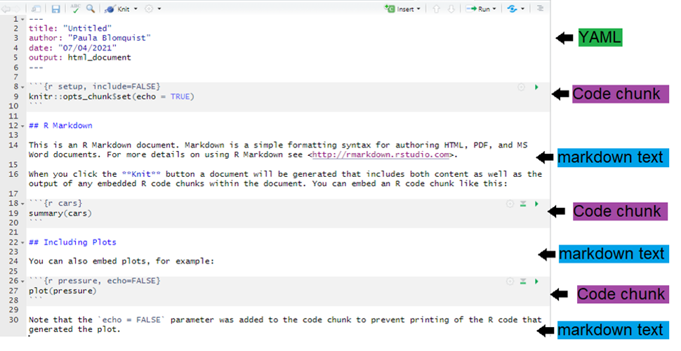

--- 
title: "Análisis de Datos con Stata, R y Python"
author: 
date: 
site: bookdown::bookdown_site
---

# Prólogo

<!--chapter:end:index.Rmd-->


# Análisis de datos con R

## Introducción a R y RStudio

### ¿Por qué utilizar R como lenguaje de programación?

1. **Código abierto:** no tiene costo.
2. **Versátil:** análisis estadístico y econométrico + tareas de programación.
3. **Flexible y reproducible:** garantiza reproducibilidad, es flexible ante cambios y detección de errores de forma más sencilla (ej.Excel).
4. **Demandado:** solicitado en el mercado laboral.

### Términos clave y recurrentes a lo largo del curso

- **RStudio:** Interfaz Gráfica para el usuario. Esta diseñada para un uso más sencillo de R.
- **Objetos:** Cualquier cosa que guardes en R. Por ejemplo: bases de datos, variables, listasdenombres, gráficos.
- **Funciones:** Una operación producida por un código tal que acepta insumos y retorna productos.
- **Paquetes:** Básicamente es un conjunto de funciones útiles para distintos propósitos.
- **Scripts/Códigos:** Documento que contiene todos los comandos utilizados en un proceso de análisis de datos.


### Recursos de Aprendizaje
<div style="text-align: justify">
* Hojas de resumen: material disponible con un resumen de los principales comandos/paquetes/funciones para distintos temas. Disponibles en: https://www.rstudio.com/resources/cheatsheets/
</div>
* Foros y sitios web:
  + [Stackoverflow.](https://stackoverflow.com/questions/tagged/r)
  + [Medium.](https://preettheman.medium.com/awesome-tricks-every-r-coder-should-know-c4220cd2cfbc)
  + [El Blog de RStudio.](https://posit.co/)
* Libros:
  + [R for Data Science.](https://r4ds.had.co.nz/)
  + [Recursos sobre R en español.](https://posit.co/resources/videos/)
  + [Bookdown.](https://bookdown.org/)
  
### Interfaz RStudio

#### Cuatro secciones en Rstudio

Las "más importantes" son: *scripts, consola y environment/files/plots/packages*.

Para personalizar RStudio hay que ir a: **Tools -\> Global Options**. Allí pueden cambiar el color del ambiente, tipo de letra, orden, etc. La idea es utilizar RStudio de la forma mas intuitiva para ustedes.

#### Escribir comentarios

`(#)` para escribir comentarios en el script. Si quiero marcar varias lineas como comentario: `ctrl + shift + c`

#### Índices

Es importante escribir índices para documentar sus códigos. Para observarlo debo escribir: `ctrl + shift + o`

Los títulos pueden estar jerarquizados:


```r
# El mas importante
## Este es un poco menos importante
### Este es un poco menos importante que el anterior
#### El menos importante
```

Es importante actualizarlo constantemente para no perder funcionalidad.

### Instalación de paquetes y ayuda

Los paquetes son basicamente conjuntos de funciones. Los paquetes se instalan una vez, pero se llaman siempre que se vayan a utilizar.

#### Librerías

Esto se puede hacer de dos maneras:

1.  Desde la pestaña *packages* en la esquina inferior derecha.

2.  Con comandos


```r
install.packages("dplyr")
```

Varios paquetes a la vez:


```r
install.packages(c("dplyr","ggplot2","rio"))
```

Error común:


```r
install.packages("dplyr", "ggplot2")
```

Por lo general es bueno instalarlas desde el inicio del trabajo dado que comúnmente usamos las mismas librerías al realizar análisis de datos. Con esta función le decimos a R que instale el paquete si este no está instalado (algo típico cuando cambiamos de computador):


```r
if(!require(dplyr)) {install.packages("dplyr")}
```

Cargar librerías:


```r
library(dplyr)
```

Si queremos ver que hay dentro de cada paquete:


```r
ls("package:dplyr", all = TRUE) #ls = list objects
```

**Importante**: el paquete debe ser instalado una vez, pero cargado cada vez que se utilice. Muchas veces hay actualizaciones. Para revisar e instalarlas.


```r
update.packages()
```

Alternativamente puedo conectar paquete con función utilizando `::`. Si hago esto no es necesario llamar a la librería para utilizar esa función en particular. No obstante, lo recomendable es cargar todas las librerías de los paquetes que voy a utilizar al inicio.

#### Función de ayuda

Sobre una función en particular:


```r
help(mean) 
?mean 
mean #pulsar la tecla F1 
sd
```

Sobre un paquete en particular:


```r
help("dplyr") 
library(help="dplyr")
```

#### *Shortcuts* útiles

-   `Esc`: interrumpir el comando actual
-   `Ctrl + s`: guardar
-   `tab`: autocompletar
-   `Ctrl + Enter`: ejecutar línea
-   `Ctrl + Shift + C`: comentar
-   `<-`: Alt + - / option + -
-   `%>%`: ctrl + shift + m (*pipe*)
-   `Ctrl + l`: limpiar
-   `Ctrl + alt + b`: ejecutar todo hasta aquí (flechas en la consola me permiten ver los últimos comandos utilizados).
-   `Shift + lineas`: seleccionar varias lineas
-   `Ctrl + f`: buscar/remplazar
-   `Ctrl + "flecha arriba" en la consola`: ver comandos utilizados.

#### Limpiar *"environment"* en R

Eliminar todos los objetos:


```r
rm(list=ls())
```

Eliminar sólo un objeto:


```r
rm(data1)
```

Si quiero limpiar la consola tengo que apretar `Ctrl + L`.

#### Identificar el paquete de una función

Hay ocasiones en que queremos saber de que paquete es una función determinada. Para ello, revisar: <https://sebastiansauer.github.io/finds_funs/>

#### Error común

Por ejemplo:


```r
x <- "hola"
```

Noten que en la consola aparece un signo `+`. En estos casos RStudio se detiene porque probablemente se les olvido un `)` o bien un `#`. En estos casos hay que corregir el error para ejecutar nuevamente y luego apretar `esc` en la consola para seguir ejecutando los comandos.

### Manipulación de objetos

#### Usar R como calculadora/ejecutar comandos

De manera separada (seleccionar las `ordenes+ctrl+Enter`):


```r
2+2 
3*5^(1/2)
```

Ejecutar todas las instrucciones:


```r
2+2 ; 3*5^(1/2)
3+4 
5*4 
8/4 
6^7
6^77

log(10) 
log(1)

sqrt(91) # raiz cuadrada

round(7.3) # redondear
```

Incluso grandes operaciones:


```r
sqrt(91) + 4892788*673 - (log(4)*round(67893.9181, digits = 2))
```

Incluso uso de números imaginarios:


```r
2i+5i+sqrt(25i)
```

#### Creacion de objetos: asignaciones y funciones

con el signo `<-` asignamos valores. También se puede utilizar `=`, pero no es recomendable, ya que confunde.


```r
y <- 2 + 4 
y
```

Las asignaciones son MUDAS. Si no las llamo, no aparecen en la consola. Lo anterior es una operación sencilla, pero lo que queremos es generar asignaciones con funciones.

Podemos utilizar funciones. Las funciones son la parte central del uso de R. Algunas funciones vienen instaladas en R. Otras funciones hay que obtenerlas desde paquetes. También es posible escribir tus propias funciones `()`. Las funciones estan por lo general escritas en paréntesis, por ejemplo `filter()`. Hay ocasiones en que las funciones estan relacionadas con un paquete específico `dplyr::filter()`.

-   Ejemplo 1: función simple


```r
sqrt(49)
```

-   Ejemplo 2: sobre una base de datos


```r
summary(mtcars$mpg)
```

*Nota:* mtcars viene incluidad en R.

Para ver mas:


```r
data()
```

Otra función:


```r
x <- 2 
y <- 3
z <-c(x,y) 
z
```

Uso de funciones aritméticas:


```r
mean(z) 
median(z)
```

Relaciones entre objetos:


```r
w <- mean(z)
```

Creación de objetos por asignación:


```r
a <- 3+10 
b <- 2*4
```

Comparar objetos:


```r
a > b
```

Notar que las asignaciones son silenciosas:


```r
a 
b 
# o altenativamente utilizar print 
print(a) 
print(b)
```

Creación de objetos usando funciones:


```r
valores <- c(a,b)
promedio <- mean(valores)
print(promedio)
promedio
```

Podemos escribir un promedio aquí usando función `mean():`


```r
a <- 2 
b <- 5
valores1 <- c(a,b)
promedio1 <-mean(valores1)
print(promedio1)
```

Limpiamos datos nuevamente:


```r
rm(list = ls()) 
rm(promedio)
```

#### Creacion de objetos y asignaciones

Es importante espaciar codigos. Definimos dos vectores utilizando la función `c()`


```r
educ <- c(8,12,8,11,16,14,8,10,14,12)
ingreso <- c(325,415,360,380,670,545,350,420,680,465)
```

Calculamos promedio, desviación estándar y correlación


```r
mean(ingreso)
promedioingreso <- mean(ingreso)

sd(ingreso)
sdingreso <- sd(ingreso)

cor(educ, ingreso)
coreduing <- cor(educ,ingreso)
```

Graficamos


```r
plot(educ, ingreso)
```

Estimar una regresión lineal


```r
lm(ingreso ~ educ)
```

<div class="alert alert-block alert-warning">
<b>Ejercicio 2.1.1:</b> Nombrar objetos

De los siguientes ejemplos, ¿Cuáles son nombres de variables válidas en R?

```r
# min_height
# max.height
# _age
# .mass
# MaxLength
# Min-length
# 2widths
# Calsius2kelvin
```
</div>

### Tipos de objetos

#### Vectores

R opera componente por componente, por lo que es muy sencillo poder trabajar con vectores y matrices.

Para crear un vector utilizamos la funcion `c()`


```r
x <- c(1,2,3,4,5)
#o bien
y <- c(6:8)
```

Veamos los vectores


```r
z <- x + y 
z
```

Supongamos los siguientes vectores:


```r
x<-c(1:4)
y<-c(1:3)
```

¿Cuál es su longitud?


```r
length(x)
length(y)
```

Si no tienen la misma longitud, ¿cual sería el resultado de `x + y`?


```r
z <- x + y 
z
```

**IMPORTANTE**: En este caso R realiza la operación de todos modos, pero nos indica que hay una advertencia de que sus dimensiones difieren. Lo relevante de los vectores es que sólo se puede concatenar elementos del mismo tipo, de lo contrario R nos arroja error.


```r
x <- rep(1.5:9.5,4) #genera repeticiones de los valores definidos 
y <- c(20:30)
x1 <- c(1,2)
x2 <- c(3,4)
x3 <- c(x1,x2)
x4 <- c(c(1,2), c(3,4))
```

Subconjunto de un vector


```r
y[3] # obtener el tercer elemento 
y[2:4] 
y[4:2]
y[c(2,6)]
y[c(2,16)]
```

#### Matrices

##### Definir matrices

Sintaxis general


```r
mi.matriz <- matrix(vector,
                    ncol = num_columnas, nrow = num_filas,
                    byrow = valor_logico,
                    dimnames = list(vector_nombres_filas,
                                   vector_nombres_columnas)
)
```

Para crear matrices utilizamos la función `matrix()`


```r
x <- matrix (data = c(1,2,3,4), 
             nrow = 2, 
             ncol = 2) 


x1 <- matrix(c(1,2,3,4), 
             2, 
             2)
```

No es necesario poner `data=`, pero por orden mental es mejor hacerlo.


```r
x 
x1
```

Notar que por DEFECTO rellena columna por columna. Podemos explicitar que queremos realizar la matriz fila por fila


```r
y <- matrix(data = c(1:4),
          nrow = 3, 
          ncol = 2, 
          byrow = TRUE)
y
```

Podemos saber cual es la dimensión de `x`


```r
dim(y)
dim(y)[1] # cantidad de filas
dim(y)[2] # cantidad de columnas

y<- matrix(c(1,2,3,4), nrow=2, ncol=2, byrow=2)
y
```

Los va a repetir!


```r
y <- matrix(c(1,2,3,4), nrow=2, ncol=3, byrow= 2) 
y
```

Notar que el orden en cualquier matrix es **filas x columnas**. Podemos también omitir la cantidad de filas o columnas en la matriz y obtenemos el mismo resultado


```r
y <- matrix(c(1:4), 2, byrow=T)
y 
```

En el caso de crear matrices vacías hay que definir las dimensiones


```r
y <- matrix(nrow=3, ncol=3)
y #útil para los loops
```

Darle nombre a las filas y columnas


```r
y <- matrix (c(1:4), 2, byrow = FALSE, 
             dimnames=list(c("X1","X2"),c("Y1", "Y2")))
y
```

Se puede realizar desde las funciones colnames y rownames


```r
colnames(x) <- c("Variable 1", "Variable 2")
rownames(x) <- c("a1", "a2")
x
```

Añadir filas o columnas a una matriz


```r
w <- c(5,6)
```

##### Unir matrices

Unir mediante filas (queda con el nombre del vector la observación)


```r
z <- rbind(x,w) 
z
```

Unir mediante columnas


```r
z <- cbind(x,w) 
z
```

¿Y si tienen diferente cantidad de filas y/o columnas? repite el vector o observaci?n con menor longitud


```r
x <- matrix(c(1:9),3)
x
y <- c(5,6)
y

z<-rbind(x,y)
z 
```

Podemos pasar un vector a una matriz


```r
x<-1:10
x

dim(x)<-c(2,5)
x
```

Trasponer matrices:


```r
x <- matrix(c(1:9),3)
xtraspuesta <- t(x)
```

Potencialmente se pueden hacer muchas más operaciones que involucren matrices. Por ejemplo, subconjuntos de una matriz: segundo y cuarto elemento de la segunda fila:


```r
M <- matrix(1:8, nrow=2)
M
M[1,1]
M[1,]
M[,2]
M[2,c(2,4)]
```


## Herramientas de programación

### Objetos adicionales

#### Arreglos

Crear arreglos: La única diferencia con matrices es que acepta mas de dos dimensiones.

Para generarlos:

```r
mi.arreglo <-array(vector, 
                   dimensiones, 
                   dimnames = etiquetas_dim)
```

Para nombrarlos definimos etiquetas y luego las agregamos. Es mucho mejor y mas ordenado hacerlo así:

```r
dim1 <- c("A1", "A2")
dim2 <- c("B1", "B2", "B3", "B4")
dim3 <- c("C1", "C2", "C3")
```

**Ejemplo de arreglo:** Defino un arreglo de 3 matrices de 2 (filas) x 4 (columnas)

```r
x <- array(1:24,
           c(2,4,3),
           dimnames = list(dim1, dim2, dim3))
x
```
Notar la tercera dimensión! 

**Subconjuntos de un arreglo:** x[Fila,Columna, Matriz]

```r
x[1,2,3]       # 1 fila, 2da columna, 3ra matriz
x[,,3]         # 3era matriz completa
x[,4,]         # 4ta columna de todas las matrices
x[,-1,2]       # Todas las filas, sin la primera columna, de la matriz 2. 
x[-1,c(1,2),3] # Todas las columnas, sin la fila 1, de la matriz 3. 
x[-1,1:2,3]    # Columnas 1 y 2, sin la fila 1, de la matriz 3. 
x[,,1]*2
```

#### Listas

Las listas contienen elementos de diferente tipo: matrices, objetos, dataframes, vectores, etc. 

```r
x <- list(c(1:8), "R", TRUE, 2+3i, 5L)
x #separa todo componente
```

Para acceder a un objeto dentro de la lista se debe utilizar DOBLE CORCHETE:

```r
x[[5]]
x[5]
```

Veamos un ejemplo de cómo trabaja:

```r
x <- list(Titulacion = c("Economia", "Administracion", "Politica"), 
           Edad =c(25,23,27))
x
```

Al nombrar los componentes dentro de la lista, podemos llamarlos sin necesidad de los corchetes:

```r
x$Titulacion
x[[1]]
x[["Titulacion"]]

x$Edad
x[[2]]
```

Como los componentes dentro de las listas tienen definida una naturaleza, podemos hacer operaciones con ellas también:

```r
x[["Edad"]]*3

x$Edad[c(1,3)]*3
```

Finalmente, tambien podemos crear listas vacias (útil para rellenar utilizando iteradores):

```r
x <-vector("list", length = 10)
```

**Ejemplo de una lista:** Definimos una lista

```r
milista <- list(
  
  # Primer elemento sera un vector
  hospitales = c("Van Buren", "Gustavo Fricke", "Salvador"),
  
  # Segundo elemento sera un dataframe
  direccion   = data.frame(
    calle = c("San Ignacio", "Av. Alvarez", "Av. Salvador"),
    ciudad   = c("Valparaíso", "Viña del Mar", "Santiago")
  )
)

milista
```

Llamar a subconjuntos

```r
# Retorna el elemento de la lista
milista$hospitales
milista[2]

# Retorna el elemento, pero sin nombre y como vector
milista[[1]]
milista[["hospitales"]]

# Elementos particulares
milista[[1]][3]
milista[[2]][,1]
milista[[2]][1,]
milista[[2]][1,2]
```

Notar que es importante saber el tipo de dato.

#### Dataframes 

**Crear un dataframe:** Es básicamente una matriz donde filas y columnas tienen significado. Contiene tanto valores numericos, carácteres, variables categóricas, etc.

```r
datos <- data.frame(Titulacion = c("Economia", "Administracion", 
                                   "Administracion"),
                    Edad =c(25,23,27), 
                    ocupacion = c(1,0,1))
datos
```

Esto es lo mas cercano a una base de datos. Es uno de los objetos básicos que veremos muchas veces a lo largo del curso. 

**Dimensiones de un dataframe:** Para ver las dimensiones hay que utilizar nrow(), ncol() o bien dim().

```r
nrow(datos)
ncol(datos)
dim(datos)
```

Notar que nrow() y ncol() tambien sirven para matrices.

**Subconjuntos de un dataframe:** Al igual que en las matrices, utilizamos `[ ]` para acceder a elementos dentro de la base.

```r
datos[1,1]
datos[,1]
datos[,-2]
datos[, c(1:2)]
datos[, c("Titulacion")]

# Tambien puedo ocupar $ para llamar. 
datos$Titulacion

# Ojo que esto lo puedo hacer con todo
summary(datos[,2])
summary(datos[,2])[3]
summary(datos[,2])["Max."]
```

**Tibbles:** Una version mas moderna de dataframes. Es la misma idea: lista de vectores con nombres.

```r
Altura <- c(168, 177, 177, 177, 178, 172, 165, 171, 178, 170)
Peso  <- c(88, 72, 85, 95, 71, 69, 61, 61, 51, 75)
M <- cbind(Altura, Peso)
```

Paquete para trabajar con bases de datos (más detalles en secciones 2.3 y 2.4)

```r
install.packages("tidyverse") 
library(tibble) # Una libreria dentro de tidyverse. 
misdatos <- as_tibble(M)
misdatos

# Podemos ver los nombres o bien estadistica básica de cada variable. 
names(misdatos)
summary(misdatos)
```

**Agregar columnas a un dataframe:** Podemos agregar variables a la base. Dos opciones: 

```r
# Opción 1: utilizando $nombre_columna<-vector
datos$id <- c(1:3)
datos

# Opción 2: utilizando el cbind (al igual que con matrices)
id2<-c(1:3)
datos1 <- cbind(id2,datos) 
datos1
```

**Attach:** 

Notación muy inconveniente

```r
misdatos$Altura
misdatos$Peso
```

Para evitar escribir datos cada vez que quiera llamar a una variable voy a utilizar la funcion `attach()`:

```r
attach(datos) # para comenzar

# Ahora puedo llamar a sus variables sin utilizar datos
nueva <- Edad * ocupacion 
nueva <- datos$Edad * datos$ocupacion
nueva 

detach(datos) # para terminar
```

Esta es una forma mucho mas conveniente de trabajar con dataframes o tibble en R.

<div class="alert alert-block alert-warning">
<b>Ejercicio 2.2.1:</b> Crear un dataframe

Cree su primera base de datos. Debe armar una tabla igual a la figura. Tiene 5 minutos.

</div>

Respuesta:

```r
ejer <- data.frame(Tipo_animal = c("Perro", "Perro","Gato","Perro", 
                                   "Gato","Gato","Gato"),
                   Color =c("Café","Blanco","Negro","Manchas","Café","Tricolor","Negro"), 
                   Peso = c(7,5,3,4,2,5,4),
                   Pasea=c("Sí","Sí","Sí","No","No","No","Sí"))
```

### Acceder a elementos de un objeto

#### Vectores

Para acceder a los elementos de un objeto debemos utilizar los corchetes `[ ]`

```r
# Veamos en un vector

x<-c("T", "FALSE", 1:9,1+2i,"t", "c","a",6)
class(x)

# Podemos llamar a un objeto de un vector 
x[1]
x[3]
```

De esta manera podemos extraerlo o utilizarlo en diferentes operaciones. Pero sólo debe ser entre observaciones numericas:

```r
x[1]+x[6] #de lo contrario R nos arroja un error 
y<-c(1:6, 1+2i)
y[3]+y[7]

#O podemos visualizar a x, pero sin el primer objeto
x[-1]

#O eliminar el primer objeto 
x<-x[-1]
x1 <- x[-1]
```

#### Matrices

Si analizamos los objetos de una matriz:

```r
w<-matrix(1:9,3)
w

# Elemento [1,1]
w[1,1]
# Toda la primera columna 
w[,1]
# Toda la segunda fila
w[2,]
# Dos columnas
w[,1:2] # w[,-3]
# Todas las filas menos la primera
w[-1,]
```

#### Listas

Si queremos llamar a un objeto dentro de una lista:

```r
z <- list(c(1:8), "R", T, 2+3i, 5L)
z #separa todo componente
```

Para acceder a un objeto dentro de la lista se debe utilizar doble corchete:

```r
z[[1]]

#Y algo dentro de ese objeto 
z[[1]][5]

#Tambien podemos analizar su clasificacion 
class(z[[1]]) #numerico 

#Si es numerico, entonces tambien podemos hacer operaciones 
z[[1]][3]*z[[1]][5]
```

### Tipos de objetos y datos

#### Identificar tipos de objetos

Veamos en un vector cualquiera

```r
x<-c("T", FALSE, 1:9,1+2i,"t", "c","a",6)
class(x)
```

Como bien sabemos todo en R es un objeto. Para saber que tipo de objeto es puedo utilizar la función `class()`:

```r
class(datos)
class (x)
```

Note que `class()` identifico que es un "data.frame" y una lista. También puedo ver los tipos de elementos dentro de un determinado objeto. Para datos, existen 5 tipos principales, llamados: 

1. **carácteres:** texto. Se escriben con comillas (ej: "3", "swc").
2. **numéricos:** numeros reales (ej. 2, 15.5).
3. **enteros:** numeros enteros ("L" le dice a R que guarde esto como un entero).
4. **logical:** valores logicos (ej. TRUE, FALSE).
5. **complejos:** 1 + 4i (Numero complejos).

#### Identificar tipos de datos


```r
# 1. Carácteres
z<-c("a","b")
class(z)

# 2. Números enteros
w<-c(1L,2L,3L) #la L es para obligar que sea entero
class(w)

# 3. Numéricos 
w1 <- c(1,2,3)
class(w1)

# Notar que la L lo obliga a ser entero ¿Qué ocurre si no coloco la L? 

# 4. Valores logicos
v1 <- c(TRUE, FALSE)
class(v1)

# Notar que si estan entre comillas son caracteres, no logical!. 
v<-c("TRUE", "FALSE")
class(v)

# 5. Números complejos 
t<-c(1+2i,1+3i)
class(t)
```

Hay más clases: Date(fechas), Factor(variables categóricas), data.frame, tibble, list. 

#### ¿Importan los tipos de los objetos?

R intenta mantener dentro de un vector el tipo de objeto. Si es que tratamos de juntar distintos tipos de datos en un vector. Igualar a la clase. Por ejemplo, si intentamos generar un vector con texto y número/logical todo será texto:

```r
h <- c(TRUE,"a", TRUE, 2)
h
class(h)
```

Si intentamos juntar un "Logical" con un número todo será número:

```r
h1 <- c(TRUE,2,3)
h1
class(h1)
```

Aquí carácter todo se va a caracter:

```r
x <- c("T", "FALSE", 1:3, 1+2i, "t", "c", "a")
class(x)

y <- c(1:4)
class(y)

y <- c(1,2,3,4)
class(y)
```

Si utilizo el operador `:` para crear vectores lo interpreta como un *integer*.

#### Forzar a R para que utilice un tipo de dato

Forzar a R a llevar el vector solo a numérico:

```r
z <- as.numeric(x)
class(z)
z 
```

`as.numeric()` fuerza al vector a solo tener números. Noten que remplaza los que no son numérico por NA. 

Forzar a R a llevar el vector solo a carácteres:

```r
z1 <- as.character(y)
class(z1)
z1
```

Noten que ahora se agregaron las dobles comillas. 

Forzar a R a llevar el vector sólo a carácter. 

```r
x
z2 <- as.logical(x)
class(z2)
z2 
```

Noten que "T" fue aceptado como TRUE!

#### ¿Cómo saber que tipo de datos tengo?

```r
# Puedo preguntar a R sobre el tipo. 

is.numeric(y)   # Es numerico?
is.character(y) # Es caracter?
is.logical(y)   # Es logico?

# La respuesta a esta pregunta va a ser un valor lógico
class(is.numeric(y))

# También se puede utilizar la opcion `typeof`
typeof(y)
```

#### Mayúsculas importan

Como vimos en lasección anterior, R es sensible a las mayúsculas. Esto aplica para nombres de funciones, paquetes, comando y también para los datos. Por ejemplo: 

```r
x <- c("A", "a","a","a", "B", "B","b", "A")
length(x)

sum(x == 'a')
sum(x == 'b')
```

Para R las minúsculas y mayúsculas SI IMPORTAN!.

#### Carácteres especiales

Vimos que existen nombres de variables no validos en R. Tambien existe un conjunto de caracteres invalidos. 

* **NA:** Not Available (missing values)
* **NaN:** Not a Numbers (ej. 0/0)
* **Inf:** Infinito (1/0)
* **-Inf:** Menos infinito 

```r
0/0
-1/0 
```

#### Missing values

En R, los valores perdidos ("missing values") se representan con el valor especial `NA` (letras mayusculas N y A - sin comillas). Para saber si tengo valores `NA` en un objeto, puedo ocupar la funcion `is.na()`:

```r
ejemplo <- c(1,3,NA,4)
is.na(ejemplo)

ejemplo[!is.na(ejemplo)]

# El resultado es un vector. Noten que es importante para utilizar algunas funciones:

mean(ejemplo)
mean(ejemplo, na.rm = TRUE)
```

No funciona en el primer caso, si en el segundo. Veremos mas detalles sobre como tratar missing values (ej. recodificar) en las clases de manipulacion y analisis de datos. 

#### Funciones útiles


```r
# Redondear
round(x,digits = n)
round(c(2.53, 3.52), 1)

# Estadística simple
x <- c(1,2,3,4,5,6)

mean(x)    # promedio
median(x)  # mediana
sd(x)      # desviacion estandar
sum(x)     # suma del vector
min(x)     # Valor minimo
max(x)     # Valor maximo
range(x)   # rango 
summary(x) # resumen 

# Notar que tienen que ser vectores!
mean(10, 6, 12, 10, 5, 0) 
mean(c(10, 6, 12, 10, 5, 0))

# En el primer caso sólo toma el primer valor! Ojo, siempre un vector. 

# Otras funciones
seq(1,10,2 )                        # Crear secuencias
rep(c(1,2,3),10)                    # Repetir
cut(x,2)                            # subdividir
sample(x, size = 3, replace = TRUE) # Generar un aleatorio

# El analisis de datos es...

Altura = c(168, 177, 177, 177, 178, 172, 165, 171, 178, 170)
Peso  = c(88, 72, 85, 95, 71, 69, 61, 61, 51, 75)
M = cbind(Altura, Peso)

# Paquete para trabajar con bases de datos (más detalles en secciones 2.3 y 2.4)
install.packages("tidyverse") 
library(tibble) # Una libreria dentro de tidyverse. 
misdatos <- as_tibble(M)
misdatos

attach(misdatos)
max(Altura)
min(misdatos$Peso)
detach(misdatos)
```

### Herramientas en R

#### Escribir Códigos

Algunos comentarios con respecto a la escritura de codigos:

1. Siempre escribir comentarios autocontenidos. 
2. Siempre utilizar índice.
  + Me permite reducir el código. 
  + Me permite ver donde estoy también en un código largo. 
  + Puedo verlo con ctrl + shift + O o bien en la esquina inferior izquierda del script. 

3. Separar códigos largos en varios códigos. Cada código debe tener un objetivo claro que debe explicar en una oración.
4. Escribir códigos en bloques. 
5. Tres consejos básicos de estilo: 
  + utilizar `_` para generar variables o bien otra convención.
  + separar entre objetos y operaciones. 

#### Condicionales y controladores de flujo

Operadores básicos:

```r
rm(list=ls())

# Asignador
a <- 2 * 3
a 

a1 = 2 * 3
a1 

# Nota: Nunca ocupar igual. 

# Igualdad 
TRUE == TRUE 
TRUE == FALSE

# Nota: Para comparar elementos se utiliza doble igual "==".  


# Desigualdad (!=)
TRUE != FALSE 
"Hola" != "Chao"

# Otros comparadores: <, > (>=), (<=) 
3 < 5
5 > 8
5 >= 5

# Nota: No confundir con <- que es para asignar. 

TRUE > FALSE

# Noten que la respuesta en un logical. 

# En vectores y matrices
vector1 <- c(16,9,13)
vector2 <- c(10,12,15)

# Comparar contra un escalar
vector1 > 10
vector2 < 10

# Compararlos entre ellos 
vector1 < vector2

# Veamos en una matriz 
matrix <- matrix(c(vector1, vector2), 
                 byrow = TRUE, 
                 nrow = 2)
matrix

matrix > 10
```

Operador %in%: Un operador muy útil para comparar valores y para evaluar rápidamente si un valor está dentro de un vector o marco de datos.

```r
rm(list=ls())

v1 <- 3
v2 <- 101
t <- c(1,2,3,4,5,6,7,8)

# El valor v1 ¿se encuentra dentro de t?
v1 %in% t 

# Otro ejemplo....
mivector <- c("a", "b", "c", "d")
"a" %in% mivector

# Si no  está en el vector da un FALSE
"h" %in% mivector

# Si le quiero preguntar si NO está, coloco un signo de exclamación al frente. 
!"a" %in% mivector

# Un vector en otro vector 
a <- seq(12, 19, 1)
b <- seq(1, 16, 1)

# Veamos si los elementos de un vector "largo" están en uno "corto" 
b %in% a

# Esto va a ser muy útil cuando trabajemos con bases de datos. 
```

Operadores para seleccionar subconjuntos de datos:

```r
y <- c(2,3,3,4,NA,8)
y

# Vamos a seleccionar solo los que no son NA
y1 <- y[!is.na(y)]
y1 

# Noten que utilizamos la funcion is.NA y un operador (!). Más detalles en parte de análisis de datos, pero noten que la idea principal está aquí. 
```

Operadores lógicos:

```r
# Operador (&): operador "y"
TRUE & TRUE 
TRUE & FALSE
FALSE & TRUE
FALSE & FALSE 

# Ejemplo 
x <- 12 
x > 5 & x < 11  

# Operador (|): operador "o". Condiciones no excluyentes.
TRUE  | TRUE 
TRUE  | FALSE 
FALSE | TRUE
FALSE | FALSE 

# Ejemplo
y <- 4
y < 5 | y > 15 

# Operador de negación (!)
!TRUE 
!FALSE 

# Combinarlo con funciones 
!is.numeric(5)
!is.numeric("Hello")

# Operadores con vectores 
c(TRUE, TRUE, FALSE) & c(TRUE, FALSE, FALSE)
c(TRUE, TRUE, FALSE) | c(TRUE, FALSE, FALSE)
!c(TRUE,TRUE,FALSE)

# Si utilizo dos "&&" sólo compara el primer elemento del vector
c(TRUE,FALSE,FALSE) || c(TRUE,FALSE,FALSE)
c(TRUE,FALSE,FALSE) && c(TRUE,TRUE, TRUE)
```

#### Condicionales

If:

```r
x <- 3
  
#if (condicion){

#  cualquier cosa que quiero que se haga si la condición se cumple 

#}

if (x > 0) {
  
  print("x es número mayor que cero")
  
}

if (x > 0){
  
  print("x es un número mayor que cero ")
  
}

if (x < 0){
  
  print("x es un número menor que cero")
  
}
```

Else:

```r
x <- 0

if (x > 0){
  
  print("x es un número positivo")
  
} else{
  
  print("x es un número negativo")
  
}
```

Elseif:

```r
x <- 0

if (x > 0){
  
  print("x es mayor que cero")
  
} else if (x == 0){
  
  print("x es igual a cero")
} else{
  
  print("x es menor que cero")
  
}

# Importante: `(%%) corresponde al resto de una división`

x <- 6 

if (x %% 2 == 0){
  
  print("x es divisible por 2")
  
} else if (x %% 3 == 0){
  
  print("x es divisible por 3")
} else {
  
  print("x no es divisible ni por 2 ni por 3")
  
}

# Notar que si la primera condición se cumple, la segunda no se ejecuta aunque sea cierta.  
```

#### Funciones

Idea principal: 
$f(x) = 2x + 1$, $x \in R$
$f(x) = 'hola' + x$, $x \in ('pepe', 'pepa', 'marta')$


```r
valores <-  c(1,2,3,4)
mean(valores)
```

Algunas cosas adicionales sobre funciones: `n` me permite ver los argumentos de una función, sin necesidad de ver la documentación. Útil a veces.

```r
# Escribir funciones con un argumento
triple <- function(x){
  
  y <- 3 * x
  return(y)
  
}


triple <- function(x){
  x/2

  
}

triple(500)

# Escribir funciones con mas de un argumento
operacion <- function(a,b){
  
  a*b + a/b
  
  
}

operacion(4,2)

# Escribir funciones fijando opción por defecto.
operacion_defecto <- function(a,b = 1){
  a*b + a/b
  
  
}

operacion_defecto(4)
operacion_defecto(4,0)

# Escribir funciones utilizando if y return.
operacion_condicionales <- function(a,b = 1){
  if (b == 0){
    return(0)
    
  }
  a*b + a/b  
  
}

operacion_condicionales(4,0)

# Funciones con texto 
texto <- function(){
  print("Hola mundo!")
  return(TRUE)
}

texto()

# Funciones por defecto en ambos casos
operacion_dosdefectos <- function(a = 1,b = 1){
  if (b == 0){
    return(0)
    
  }
  
  a*b + a/b  
  
}

operacion_dosdefectos()
```

<div class="alert alert-block alert-warning">
<b>Ejercicio 2.2.2:</b> Funciones

Genere una función que sea igual a la división de dos elementos. Coloque un mensaje que indique cuando la división es indeterminada.
</div>

Respuesta:

```r
operacion_indeterminada <- function(a,b){
  a/b 
  if (b == 0){
    print("Es indeterminado")
  }
}

operacion_indeterminada(1,0)
```


## Manipulación de bases de datos (Parte I)

### Principios de programación

#### Iteradores

For loop:

```r
# Imaginen que queremos mostrar los nombres de un vector de forma reiterada
ciudades <- c("Nueva York", "Paris", "Santiago", "Rancagua")

print(ciudades[1])
print(ciudades[2])
print(ciudades[3])
print(ciudades[4])

# Lo anterior se puede hacer utilizando un iterador.
for (i in 1:4){
  print(ciudades[i])
}

# Utilizando variables ocultas...
for (.j in 1:4){
  print(ciudades[.j])
}

for (.j in 1:length(ciudades)){
  print(ciudades[.j])
}

# o escrito señalando el nombre de cada elemento de un vector. 
for (ciudad in ciudades){
  print(ciudad)
}

# Otro ejemplo:
semana <- c("Domingo",
            "Lunes",
            "Martes",
            "Miercoles",
            "Jueves",
            "Viernes",
            "Sabado")

for (dia in semana)
{
  print(dia)
}
```

For loop con opciones:

```r
ciudades <- c("Nueva York", "Paris", "Santiago", "Tokio")

# Agregar opcion break: quiebra el loop
for (ciudad in ciudades){
  if(nchar(ciudad) == 8){
    break
  }
  print(ciudad)
}

# Agregar  Opción next: se salta ese elemento
for (ciudad in ciudades){
  if (nchar(ciudad) == 8){
    next 
  }
  print(ciudad)
}
```

Flexibilizar el iterador:

```r
ciudades <- c("Nueva York", "Paris", "Santiago", 
              "Tokio", "Rancagua", "Roma")

# Ahora el tamaño del loop es flexible. Esto es muy inportante para cuando trabajemos con bases de datos. 

for (i in 1:length(ciudades)){
  print(ciudades[i])
}

# Noten que ahora llamo a los elementos dentro de un loop como subconjuntos de un vector. 

# En resumen, dos versiones de lo mismo 

for (i in 1:length(ciudades)){
  print(ciudades[i])
}

for (ciudad in ciudades){
  
  print(ciudad)
}

# Ejemplo: para dejar mensajes 

for (i in 1:length(ciudades)){
  print(paste(ciudades[i], "esta en la posicion",i, 
              "en el vector ciudades"))
}

# Lo anterior es aplicable para inspecciones de bases de datos, por ejemplo, podemos dejar un mensaje

for (i in 1:length(mtcars)){
  print(paste("el promedio de la variable",
              names(mtcars[i]), "es",
              mean(mtcars[,i])))
}
```

While: mientras que...

```r
x <- 1 

while (x <= 7){
  print(paste("x es", x))
  
# Actualización 
  x <- x + 1 
}

while (x <= 700){
  print(paste("x es", x))
  # Actualizacion 
  x <- x + 1 
}

# Muy importante la actualización.
```

#### Lapply, Sapply y Vapply 

Lapply:

```r
nyc <- list(poblacion = 8405837, 
            barrios = c("Manhattan", "Bronx", 
                        "Brooklyn", "Queens", 
                        "Staten Island"))
nyc
```

* Equivalencia loop y lapply. Quiero saber todas las clases de la lista:

```r
# Puedo hacer esto con un loop 
for (objeto in nyc){
  print(class(objeto))
}

for (i in 1:length(nyc)){
  print(class(nyc[[i]]))
}

# Pero, si utilizo `lapply()` puedo hacerlo mucho más eficiente. 
# Lapply: que aplica esto como si fuese un `for`. 
lapply(nyc,class)
```

* Resultado de lapply con vector:

```r
# Lapply ejecuta la función, en este caso class, para todo elemento del objeto, en este caso nyc. 

# Si quiero saber el número de carácteres
cities <- c("New york","Paris", "Tokyo", " Rio de Janeiro")
lapply(cities,nchar)
class(lapply(cities,nchar))

# Noten que el resultado aquí es una lista. Si quiero que sea un vector, puedo utilizar la función `unlist()`. 
unlist(lapply(cities,nchar))
class(unlist(lapply(cities,nchar)))
```

* Lapply como función:

```r
precios <- list(2.25, 2.18, 2.89, 2.84, 2.89)

# Creamos una función
multiplicar <- function(x,factor){
  x * factor
}

# Ahora, podemos aplicar lapply y agregar opciones de la función
tresveces <- lapply(precios, multiplicar, factor = 3)
tresveces <- unlist(tresveces)

# Noten que la sintaxis es: objeto, función, opciones. Es decir, igual a lo anterior, pero pudiendo agregar opcionales. 
```

**Sapply:** Es una variacion de `lapply` que sirve para simplificar `lapply`. Ahora el resultado es un vector, no una lista.  

```r
cities <- c("New york","Paris", "Tokyo", " Rio de Janeiro")

lapply(cities,nchar)
sapply(cities,nchar)

# Noten que es bastante ordenado. Sin embargo, falla cuando no es fácil ordenar el resultado. 
```

**Vapply:** Es una variación que sirve para definir explícitamente el tipo de objeto del resultado. 

```r
vapply(cities, nchar, numeric(1))
```

### Manipulacion de bases de datos en R

Analizar datos es parte importante de las labores que uno desea realizar al utilizar R. Vamos a revisar cuatro aspectos iniciales de cualquier trabajo con datos: 

1. Importar datos en distintos formatos. 
2. Inspeccionar y limpiar los datos que tenemos.
3. Transformar los datos con el fin de crear nuevas variables. 
4. Juntar bases de datos de distinto tipo.

#### Importar bases de datos

1. Para poder utilizar, cargar, renovar datos es importante tenerlos todos en un solo lugar. 

2. Esto también aplica para los resultados y codigos. 

3. Para que esto efectivamente ocurra necesitamos decirle a R cual va a ser nuestro directorio de trabajo. Es decir, el lugar donde guardaremos los datos que queremos trabajar, los resultados de nuestros análisis y nuestros códigos. 

Directorios de trabajo en R:

```r
# Me dice donde estoy 
getwd()

# Si quiero indicarle otra ruta tengo dos opciones: 

# Opcion 1: Indicar a R la ruta/carpeta donde tengo mis datos 
setwd("C:/Users/catab/Dropbox/Cursos de R/Curso R - Noviembre 2022/Clase 3")

# Opcion 2: Lo mismo que opcion 1, pero más ordenado. 
ruta <-"C:/Users/catab/Dropbox/Cursos de R/Curso R - Noviembre 2022/Clase 3"
setwd(ruta)

# Noten que es necesario ocupar `/`. Por defecto las rutas al copiarlas vienen con otro tipo de "slash". Para cambiarlas fácilmente, y no una por una, vamos a utilizar `ctrl + f`. 

# Con este atajo podemos remplazar varios elementos a la vez. Cuidado!! Es importante decirle si queremos que modifique todo el documento o bien solo una parte. 
dir(ruta)
```

Ejemplo de ordenar carpetas:

```r
ruta <- "C:/Users/catab/Dropbox/Cursos de R/Curso R - Noviembre 2022/Clase 3"

# Codigos 
codigos <- "C:/Users/catab/Dropbox/Cursos de R/Curso R - Noviembre 2022/Clase 3/codigos"
codigos <- paste(ruta,"/","codigos", sep = "")
setwd(codigos)
dir(codigos)

# Datos 
datos <- "C:/Users/catab/Dropbox/Curso R - Agosto 2022/Clase 3/datos"
datos <- paste(ruta,"/","datos",sep="")
dir(datos)

# Datos raw 
datosraw <- "C:/Users/catab/Dropbox/Cursos de R/Curso R - Noviembre 2022/Clase 3/datos/raw"
dir(datosraw)

# Todo lo anterior no es muy recomendado. 
```

Proyectos de R:

- Proyecto: piensen en muchos proyectos con muchos códigos.
- Es una herramienta incorporada en RStudio que permite manejar un proyecto de análisis de datos.
- Permite dividir el trabajo en múltiples contextos cada uno con su propio directorio de trabajo, espacio de trabajo e historial.
- ¿Por qué utilizarlo?
  + Mantiene códigos y datos en la misma carpeta.
  + Mantiene códigos y datos separados de otros proyectos: evita confusiones o errores.
  + Identifica automáticamente el directorio de trabajo, facilitando cooperación.

Pasos para crear un proyecto:

* Dos opciones: 
  + R crea una carpeta de trabajo.
  + Crear una carpeta primero, y luego decirle a R que la identifique.
* Todos los nuevos archivos serán automáticamente guardados en la carpeta del proyecto.
* Una vez hecho el proyecto se genera un archivo con extensión `R.proj`.
* Aquí R guarda información del proyecto: historial, datos, etc.
* Lo más importante es que fija el directorio de trabajo de forma tal de que siempre sea el mismo una vez que se abre un proyecto. Evita cambiar directorios de trabajo al colaborar.

Package here:

```r
install.packages("pacman")
pacman::p_load("here")

here()
here("datos")
```

Package `rio`: R tiene bases de datos propias. Sin embargo, muchas veces van a querer trabajar con datos propios. o bien de datos públicos que muchas veces estan en distintos formatos. Rio package es una forma flexible de importar datos en distintos. 

Rio debe su nombre por R input/output. Dos funciones principales: `import()` y `export()`. Además, cuando se le indica la extensión a `rio` este leerá y utilizará la herramienta indicada para leer esos datos. 

```r
library(pacman)
p_load(here, # Modificar carpetas
       rio)  # Importar/exportar datos
```

Hay otras opciones tambien para importar datos. Por ejemplo, `read.csv() ("base R")`; `read.xlsx ("openxlsx")`. El problema es que son difíciles de recordar. Mejor utilizar una.

Importar datos en distintos formatos: Utilizar `import()` para importar un conjunto de datos es bastante sencillo. Basta con proporcionar la ruta del archivo (incluyendo el nombre y la extensión del archivo) entre comillas.

```r
# Ocupamos R project, here e import para importar datos fácilmente

datos_xlsx <- import(here("datos", "Data.xlsx"))
datos_dta  <- import(here("datos", "Data.dta"))
datos_txt  <- import(here("datos", "Data.txt"))
datos_csv  <- import(here("datos", "Data.csv"))
```

Opciones:

```r
# 1. Importar distintas hojas: Por defecto se importa la primer hoja de una base de datos, con "which" puedo elegir la hoja.

datos_xlsx_h1 <- import(here("datos", "Data.xlsx"), 
                        which = "hoja1") 
datos_xlsx_h2 <- import(here("datos", "Data.xlsx"), 
                        which = "hoja2") 

# 2. Puedo decirle a priori que valores son missings. 

# Especificar un missing
datos_xlsx <- import(here("datos", "Data.xlsx"), na = "2018") 

# Especificar varios a la vez..
datos_xlsx <- import(here("datos", "Data.xlsx"), 
                     na = c("Missing", "", " "))

# 3. Saltar filas.
datos_xlsx <- import(here("datos", "Data.xlsx"), skip = 1)

# Noten que puedo hacerlo con cualquier tipo de datos, ya que son opciones de la función `rio`. 

datos_dta  <- import(here("datos", "Data.dta") , skip = 1)

# En la tabla de este link pueden ver los distintos paquetes que soporta `rio`, junto a ejemplo adicionales. 
browseURL("https://cran.r-project.org/web/packages/rio/vignettes/rio.html") 
```


## Manipulación de bases de datos (Parte II)

Ya sabemos cargar datos. Ahora vamos a hacer el primer proceso para analizar cualquier base de datos. 

### Funciones clave

`Tidyverse` es una colección de paquetes de R. `Tidyverse` contiene múltiples paquetes que iremos utilizando. Incluye: `dplyr`, `ggplot2`, `tidyr`, `stringr`, `tibble`, `purrr`, `magrittr` y `forcats`. Una paquete clave es `dplyr` que contiene muchas funciones para trabajar con bases de datos. 

Instalamos tidyverse: 

```r
install.packages("tidyverse")
library(tidyverse)
library(pacman)
p_load(tidyverse)
```

### Operador piping

Piping `%>%`: `crtrl + shift + m`. Paquete asociado: `magrittr`

```r
p_load(magrittr)
```

1. Operador que permite encadenar las funciones para realizar de manera sencilla transformaciones complejas en las bases de datos.
2. Lo que dice es pasar el elemento que esta a su izquierda como un argumento de la función que tiene a la derecha. 
3. Coloca el énfasis en las acciones. Pasa un output intermedio de una función a la siguiente. 
4. `magrittr` es el paquete que permite ocupar `piping`. `piping` se utiliza mucho con las librerias de `tidyverse` y `dplyr` enfocadas en análisis de datos. 
5. Excelente cuando existe una secuencia de acciones/operaciones que queremos realizar. 

```r
data(iris)

# Ejemplo 1: usar pipe como encadenador 
head(iris, n = 4)

# Con piping
iris %>% head(n = 4)

# Ejemplo 2: obtener número total de observaciones y un promedio. 
summarize(mtcars, 
           media = mean(disp))

mtcars %>% summarize(promedio = mean(disp))

# Con piping 
mtcars %>%
  filter(mpg > 20) %>% 
  summarise(promedio = mean(disp))

promedio_mpg_20 <- mtcars %>%
                   filter(mpg > 20) %>% 
                   summarise(promedio = mean(disp))
promedio_mpg_20 
```

### Proceso de análisis de datos (Parte I): cargar, inspeccionar y limpiar

Preámbulo:

```r
# Limpiar
rm(list = ls())

# Cargamos paquetes que vamos a utilizar
library(pacman)
p_load(
  rio,        # Importar/Exportar datos 
  here,       # Determinar las rutas de mi carpeta 
  tidyverse,  # Analisis de datos y visualización
  magrittr,   # Para utilizar operador %>%  
  janitor     # Para análisis de datos
)

# Importamos datos
datos <- import(here("datos", "Data.xlsx"), which = "hoja1") 
```

Inspeccionar:

```r
# Visión general 
datos 
view(datos)

# Para una inspección detallada 
p_load(skimr)
skim(datos)
str(datos)

# Mirar algunas filas, columnas, etc.

head(datos)     # muestra las 6 primeras filas 
tail(datos)     # últimas 6 filas 
head(datos, 11) # podemos pedir m?s de 6 
tail(datos, 3)  # o menos de 6

# Mirar nombre variables/columnas
names(datos)
datos %>% names()

# `names()` también puede ser 
names(datos) <- c("YEAR", "GDP", "GROSS_EXPORTS", 
                  "GROSS_IMPORTS", "NET_EXPORTS" )
names(datos)

# Mirar filas 
row.names(datos)
row.names(mtcars)

# Mirar la cantidad de variables de la base de datos
length(datos) # columnas o variables
dim(datos) 
ncol(datos) 
nrow(datos)

# ¿Qué tipo de objeto es? 
class(datos)

# También podemos inspeccionar elementos específicos
datos<- import(here("datos", "Data.xlsx"), which = "hoja1") 

# Si queremos ver la columna de GDP
datos$gdp
datos[2]
datos[,2]

# Para llamarlos solo por su nombre recordar ocupar `attach()`
attach(datos)
gdp
detach(datos)

# Si queremos un objeto dentro de una variable 
datos$gdp[7]
datos[7,2]      #[fila, columna]
datos[7,"gdp"]

# Si queremos seleccionar parte de la columna 
datos$gdp[5:10]

# o bien (solo por `attach()`)
attach(datos)
gdp[1:2]

# o bien 
datos[1:2,2] # mostrar las filas 1:2, de la columna 2

# `table()` me permite hacer una tabla sencilla de frecuencias
table(datos$year)
attach(datos)
table(year)
detach(datos)
```

<div class="alert alert-block alert-warning">
<b>Ejercicio 2.4.1:</b> Utilizando el operador pipping, mostrar las últimas 2 filas de las primeras 11 filas.
</div>

Limpiar:

```r
names(datos) <- c("YEAR", "GDP", "GROSS_EXPORTS", 
                  "GROSS_IMPORTS", "NET_EXPORTS" )
names(datos)

# La función `clean_names()` del paquete `janitor` estandariza nombres: 

datos_nuevos <- clean_names(datos)
names(datos)
names(datos_nuevos)
```

Renombrar variables:

```r
rm(list = ls())

datos<- import(here("datos", "Data.xlsx"), which = "hoja1") 

# Función para renombrar variables. Sintaxis: rename(nuevonombre = viejonombre)

# Escribamos esto, pero con `piping`
datos_renombrados <- datos %>% 
                     rename(tiempo = year, 
                     pib = gdp, 
                     exportaciones = gross_exports)
names(datos_renombrados)
rm(datos_renombrados)
```

Seleccionar variables o columnas:

```r
rm(list= ls())
datos<- import(here("datos", "Data.xlsx"), which = "hoja1") 

# select() de `dplyr` permite seleccionar variables
datos_select <- datos %>% 
                select(year, gdp)  

datos_select1 <- datos %>% 
  select(c(1:4))

datos_select1 <- datos %>% 
  select(c(1:ncol(datos)-1))  

# También puedo seleccionar en base a un criterio (Sólo sirve para string)
datos_select2 <- datos %>% 
  select(year, contains("Gross"))

# Con `select` también se puede renombrar 
datos_select_renombrados <- datos %>% 
                            select(tiempo = year, 
                                    pib = gdp)

# Una opción es ocupar select con `everything()` para ordeanar mis columnas. 
datos_select_ordenados <- datos %>% 
                        select(gdp, year, everything()) 
```

Remover columnas:

```r
# La idea aqui es decir: todas se quedan, menos las que pongo aquí. 
datos_select_remover <- datos %>% 
                      select(-c(gdp, year)) 
```

Mirar si hay duplicados. En ocasiones es importante revisar si hay duplicados. El paquete `dplyr` contiene `distinct()`. Esta función examina cada fila y reduce los datos solo a las que sean valores diferentes: 

```r
datos1 <- datos %>% distinct()

# ¿Cuantos duplicados?
nrow(datos)
nrow(datos1)

dif <- nrow(datos) - nrow(datos1) 
dif
```

### Proceso de análisis de datos (Parte II): cargar, inspeccionar y limpiar

Cargar:

```r
# Limpiamos consola
rm(list = ls())

# Cargamos paquetes que vamos a utilizar
pacman::p_load(
  rio,        # importar/exportar datos. 
  here,       # escribir rutas de las carpetas.  
  janitor,    # limpiar datos y tablas.
  tidyverse,  # Manejo de bases de datos y visualización. 
  magrittr,    # Permite utilizar operador %>% (piping). 
  skimr,       # Inspeccionar datos
  inspectdf,   # Inspeccionar datos
  gapminder    # Base de datos con información de países. 
)
data("gapminder")
gapminder %>% view()

# Cargamos datos que vienen incluidos en R. 
data(starwars) 
starwars 
```

Inspeccionar datos:

```r
#  Inspect_cat() retorna una base de datos que resume características de un data.frame.
inspeccion <- inspect_cat(starwars)
inspeccion
class(inspeccion)

# Las columnas son: 

# col_names: nombre de cada columna
# cnt: número de valores únicos por nivel
# common: el nivel más común
# common_pcnt: el porcentaje de ocurrencia del nivel más común.
# levels: una lista de dataframes (tibbles) cada uno con tablas de frecuencia para todos los niveles. 

# Notar que una de las columnas de un data frame pueden ser listas: 
inspeccion[1,5]
inspeccion[2,5]
inspeccion[3,5]
inspeccion[4,5]
inspeccion[5,5]

# Ahora, si quiero ver el contenido, debo utilizar doble paréntesis cuadrado
inspeccion[1,5]      # Con el nombre
inspeccion[[1,5]]    # El contenido
inspeccion[[5]]      # El contenido de todas las filas, en este caso, listas
inspeccion[[5]][[1]]
inspeccion[[5]][[2]]

# Una forma más simple de mirar esta información es:
inspeccion$levels$eye_color
inspeccion[[5]][[1]]

# Otra cosa interesante de este paquete es la función `show_plot()`
starwars %>% inspect_cat() %>% show_plot()

# Esta función permite ver las categorías de cada variable categórica. Noten que las zonas en gris son los NA. 
```

Limpiar bases de datos (continuación):

```r
rm(list= ls())

datos<- import(here("datos", "Data.xlsx"), which = "hoja1") 
```

* Seleccionar columnas:

```r
# Vimos que `select()` es parte importante. `select()` puede ser utilizado con varias funciones adicionales: 

# 1. everything () - todas las otras columnas no mencionadas.
datos_everything <- datos %>% 
  select (year, gdp, everything()) 

# 2. last_col () - la última columna.
datos_last_col <- datos %>% 
  select(year, last_col())

# 3. where () - aplicar una función a todas las columnas y 
#               selecciona solo las que cumple esta condición 
#               (es decir, cuando es verdadera). 
datos_where <- datos %>% 
  select(where(is.logical))

# 4. contains () - columns containing a character string
datos_contains <- datos %>% 
  select(contains("exports"))

# 5. starts_with () - selecciona la variable si se tiene un prefijo determinado
datos_starts_with <- datos %>% 
                     select(starts_with("gross_")) 

# 6. ends_with () - selecciona la variable si se tiene un sufijo determinado
datos_ends_with <- datos %>% 
  select(ends_with("_imports")) 

# 7. matches () - aplicar una expresión regular 
datos_matches <- datos %>% 
  select(matches("gross|gdp"))

# 8. any_of () - la selecciona si la columna existe pero NO retorna error 
#                si no la encuentra. 
datos_any_of  <-  datos %>% 
  select(any_of(c("year", "gdp", "cualquiercosa")))
```

* Manipulación de NAs: Con vectores. Los NA son parte importante de la limpieza de los datos. Recordemos que la función `is.na()` nos permite identificarlos. 


```r
x <- c(1,2,NA,NA,5)
malos <- is.na(x)  
malos
class(malos)

# Si queremos eliminar los NA es cosa de colocar un vector sobre otro
x[!malos]
x[!is.na(x)]

x <- x[!malos]
x
```

* Manipulación de NAs: con `complete cases()`

```r
# Miremos un caso más práctico con iris
summary(iris)
skim(iris)
data("iris")

# Generar NA en la base de datos (después veremos esto en detalle ahora concéntrense solo en los NA)
iris$Sepal.Length<-ifelse(iris$Sepal.Length<5, NA,iris$Sepal.Length)

# Dos opciones: 

  # (i) como antes
  malos <- is.na(iris$Sepal.Length)
  iris2 <- iris[!malos,] 
  iris2

  # (ii) utilizando `complete.cases()`
  completos <- complete.cases(iris$Sepal.Length)
  head(completos, 100) 

  # Creamos una base nueva solo con casos completos. 
  iris3 <- iris[completos,] 
  head(iris3)  
  summary(iris3) 
```


## Manipulación de bases de datos (Parte III)

### Crear Variables

#### Crear variables binarias

Ahora vamos a ver como crear variables dicótomas o binarias. Estas variables son muy importantes para hacer análisis de datos. Vamos a utilizar la función `ifelse()`.

```r
rm(list= ls())
data <- import(here("datos", "Data.xlsx"), which = "hoja1") 

# Asignar valor 1 si estamos en democracia, 0 caso contrario
data <- data %>% mutate(demo = ifelse(year>=1990,1,0))
table(data$demo)

# Tabla 1: ¿Cual fue el pib promedio en democracia y en dictadura?
tabla1 <- data %>% group_by(demo) %>% 
                   summarize(promediopib = mean(gdp, na.rm = TRUE)) 
tabla1 

# Asignar valor 1 si estamos en democracia y el pib es mayor a su media
data <- data %>%  mutate(avance = ifelse(demo == 1 & gdp > mean(gdp),
                                         1,0))
mean(data$gdp)

# Asignar valor 1 si estamos en democracia y si dentro de esos periodos
# las exportaciones netas son mayores a la mediana de las importaciones 
data$expo <-ifelse(data$demo==1, ifelse(data$gross_exports>
                                          median(data$gross_imports),1,0),0)
table(data$expo)
```

<div class="alert alert-block alert-warning">
<b>Ejercicio 2.5.1:</b> Escriba lo anterior utilizando mutate. 
</div>

Respuesta:

```r
data <- data %>% mutate(expo = ifelse(demo==1, 
                                      ifelse(gross_exports>
                                          median(gross_imports),1,0),0))
```

#### Crear variables categóricas

También podemos crear variables categóricas utilizando `ifelse()`. De manera muy sencilla podemos generar variables según ciertas condiciones:

```r
# De manera muy sencilla podemos generar variables según ciertas condiciones  
data$tipo<-ifelse(data$year<1980 & data$year>1959,1,
                  ifelse(data$year<2000 & data$year>1979,2,
                         ifelse(data$year<2010 & data$year>1999,3,4)
                  )
)
table(data$tipo)  

#  Nota: no es recomendable utilizar o escribir tantos `ifelse()` juntos.
# Es mejor utilizar `case_when()` que veremos un más adelante. 
```

### Factores

R puede codificar automáticamente una variable categorica (factor) con un número entero. Sirven para hacer estadisticas o estimar regresiones. Los factores, pueden ser ordenados o no ordenados, se utilizan para representar variables que se agrupan en categorías. 

Veamos un ejemplo:

```r
x <- rep(c("Ford","BMW","Peugeot"),10)
x

class(x)

# `factor()`
factor_nominal <- factor(x)
factor_nominal
class(factor_nominal)
levels(factor_nominal) #para analizar que niveles tiene el objeto
table(factor_nominal)  # resume la cantidad de observaciones por nivel
```

### Funciones útiles para transformar bases de datos

`across()`: Algunas veces queremos aplicar una función a múltiples variables, para ello vamos a utilizar la función `across()` y especificar la función con `fns`. Por ejemplo:

```r
datos2 <- data %>% 
          mutate(across(cols = everything(), fns = as.numeric))

# Aquí `across()`, que es una función de "dplyr", permite ser utilizada con `mutate()`, `select()`, `filter()`, `summarise()`, etc. 
datos3 <- data %>% 
  mutate(across(.cols = contains("gross"), .fns = as.numeric))
```

`cumsum()`: Suma acumulada

```r
# Para hacer operaciones acumuladas
sum(c(2,4,15,10))     # Retorna la suma del vector
cumsum(c(2,4,15,10))  # Retorna la suma acumulada del vector

# Puedo utilizarla con mutate ()
datos_acumulados <- data %>% 
  arrange(year) %>% 
  count(gdp) %>% 
  mutate(gdp_acumulado = cumsum(n))
datos_acumulados
```

Recodificar variables: A continuación se presentan algunos escenarios en los que es necesario recodificar (cambiar) los valores:
  
1. Editar un valor específico (por ejemplo, una fecha con un año o formato incorrecto)
2. Para conciliar valores que no se escriben igual
3. Crear una nueva columna de valores categóricas
4. Crear una nueva columna de categorías numéricas (por ejemplo, categorías de edad)

`recode ()`: Cambiar valores

```r
rm(list= ls())
data <- import(here("datos", "Data.xlsx"), which = "hoja1") 
data <- data %>% mutate(demo = ifelse(year>=1990,1,0))

# Seguimos con data 
names(data)

# Creamos una nueva variable 
datos <- data %>% mutate(regimen = ifelse(demo == 1, "Democracia", "Dictadura"))
datos 

# Recodificamos (cambiar nombres)
datos <- datos %>% 
         mutate(regimen = recode(regimen, "Democracia" = "Demo", 
                          "Dictadura" = "Dict"))
datos 

# Notar que es vieja variable por nueva variable
```

`replace()`: Reemplazar valores

```r
datos <- datos %>%  mutate(avance = ifelse(demo == 1 & gdp > mean(gdp),
                                           1,0))

# Similar sintaxis a la de recode
datos <- datos %>% 
         mutate(regimen = replace(regimen, avance == 0, "No cambio en el pib"))

# Sintaxis
# mutate(columna a cambiar = replace(columna a cambiar, 
#                                      criterio para las filas, 
#                                      nuevo valor)).

# Un equivalente a `replace()` es utilizar []. 
datos$regimen[datos$avance == 0] <- "No cambio en el pib"
```

`replace_na()`: Para cambiar los valores perdidos (NA) por un valor específico, como "Missing", utilice la función `dplyr` `replace_na()` dentro de `mutate()`:

```r
datos_ficticios <- data.frame(var1 = c(seq(1,10), NA),
                              var2 = c(rep(NA,11)))
datos_ficticios

datos_ficticios1 <- datos_ficticios %>% 
                    mutate(var1 = replace_na(var1, 0))
datos_ficticios1
```

<div class="alert alert-block alert-danger">
<b>Recordatorio:</b> Esta función cambia los missing values solo por valores de la misma clase de la variable/columna, por lo tanto, si trabajamos con valores de clase numérica los reemplazos deben ser también numéricos.
</div>

`case_when()`: una función de `dplyr`. Es útil para asignar múltiples valores. Sirve si se necesita recodificar muchos grupos:

```r
rm(list = ls())

datosedad <- data.frame(edad = c(2,3,4,1,500,2330,8,10,12), 
                        unidad = c("años","años", "años", NA, "meses", "meses", 
                                   "años", "años", "semanas"))
datosedad

# Imaginemos que queremos tener una medida comparable de edad, para ello
# podemos utilizar `case_when()`. 
datos_case_when <-  datosedad %>% 
  mutate(edad_años = case_when(
    unidad == "años"  ~ edad, 
    unidad == "meses" ~ edad/12, 
    unidad == "semanas" ~ edad/52, 
    is.na(unidad) ~ edad))

datos_case_when
```


### Cambio de formato de los datos

#### De ancho a largo

En en siguiente ejemplo, los datos están guardaos en "wide" para las columnas que tienen el número de casos de malaria por tramos de edad. Para un trabajo de análisis de datos es importante transformar los datos a "long". 

```r
rm(list = ls())
count_data <- import(here("datos","malaria_facility_count_data.rds"))
head(count_data)
```

`pivot_longer()`: función del paquete `tidyr`. Paquete incluido en `tidyverse()`. Transforma los datos de wide a long.

```r
df_long <- count_data %>% 
  pivot_longer(
    cols = c("malaria_rdt_0-4", 
             "malaria_rdt_5-14", 
             "malaria_rdt_15", 
             "malaria_tot")
  )

df_long 

# Una mejor opción es con la función starts_with(): 
count_data %>% 
  pivot_longer(
    cols = starts_with("malaria_")
  )

# Para agregar nombres a las nuevas variable creadas
df_long1 <- count_data %>% 
  pivot_longer(
    cols = starts_with("malaria_"),
    names_to = "grupo_edad",
    values_to = "casos_malaria"
  )

df_long1
```

#### De largo a ancho

`pivot_wider()`: Transforma los datos de long a wide. Útil si quiero hacer una tabla mas amigable para el o la lectora.


```r
rm(list = ls())
linelist <- import(here("datos","linelist_cleaned.rds"))

 df_wide <- linelist %>%
   count(age_cat, gender)
 df_wide

# En un mejor formato
 table_wide <- df_wide %>%
  pivot_wider(
     id_cols = age_cat,
     names_from = gender,
     values_from = n
   )

 table_wide
```

Otra opción para hacer esto mismo es `gather()` y `spread()`:

```r
rm(list = ls())
datos <- import(here("datos","Cuadro_1.xls"), skip = 1) 

# Cargamos datos que estan en formato ancho y los preparamos un poco...
datos <- datos[-c(1:2)]  
colnames(datos) <- c(1960:2018)
colnames(datos)

# 1. Como vemos, los años estan en las columnas, y queremos pasar a long data, 
# de forma tal que los años esten en una columna y el pib en otra 
# 2. La funciom "gather()" transforma los datos de formato ancho (wide) a 
# formato largo (long)

# De ancho a largo: utilizando la función gather()
# La primera es la variable "clave" y la segunda es la del valor
data_long <- datos %>% 
  gather(año, pib, 1:59)
data_long

# De largo a ancho: utilizando la función spread()
data_wide <- data_long %>% 
  spread(año,pib)
data_wide
```

### Juntar bases de datos

#### Pegar hacia el lado (por columnas)

En el siguiente ejemplo, tenemos datos de hospitales.

```r
rm(list = ls())
hosp_info <- import(here("datos","hosp_info_final.xlsx"))
linelist_mini <- import(here("datos","linelist_mini_final.xlsx"))
```

Sintaxis: Imaginemos que tenemos dos bases de datos "df1", "df2". df1 tienen una columna llamada "ID". df2 tiene una columna que se llama identificador.

```r
# Caso 1: nombres de identificadores distintos.
data_junta <- join(df1,
                   df2,
                   by = c("ID" = "identificador"))

# Caso 2: imaginemos ambas bases de datos (df1, df2) tienen un
#         identificador llamado "ID"

data_junta <- join(df1,
                        df2,
                        by = "ID")

# Caso 3: imaginemos queremos pegar bases de datos considerando más
#         de un identificador.
data_junta <- join(df1, df2, by = c("nombre" = "primernombre",
                                         "apellido" = "primerapellido",
                                         "Edad" = "edad"))
```

**Left y Right join:**

```r
# Left join: la primera base de datos que aparece es la referencia.
# Right join: la segunda base de datos que aparece es la referencia.

# Left_join
left_join_ex1 <- left_join(linelist_mini,
                           hosp_info,
                           by = c("hospital" = "hosp_name"))


right_join_ex1 <- right_join(hosp_info,
                             linelist_mini,
                             by = c("hosp_name" = "hospital"))

# Ambos son equivalentes. 
right_join_ex2 <- right_join(linelist_mini,
                             hosp_info,
                             by = c("hospital" = "hosp_name"))

left_join_ex2 <- linelist_mini %>%
  left_join(hosp_info,
            by = c("hospital" = "hosp_name"))

# Notas:

# 1. Todas las filas/observaciones de la base de datos de referencia
#    se mantienen.
# 2. Si hay más de un match, se duplican las observaciones.
# 3. Los identificadores se combinan. Según el nombre
#     de la columna de la base de datos de referencia.
# 4. Cuando no hay un "match" las columnas se llenan con un NA
#     para las observaciones de la base de referencia.
# 5. No "match" por la base que no es de referencia se borran.
```

**Full Join:** El más inclusivo de los "joins". Retorna todas las observaciones/filas:

```r
full_join_ex3 <- full_join(linelist_mini,
                           hosp_info,
                           by = c("hospital" = "hosp_name"))

full_join_ex3 <- linelist_mini %>%
  full_join(hosp_info,
            by = c("hospital" = "hosp_name"))
```

**Inner join:** El más restrictivo de los "join". Retorna solo las filas que hicieron match entre ambas bases de datos. 

```r
# Su análogo en stata es:  merge 1:1, keep _merge==3
# Los que se pegaron perfectamente entre ambas bases.

inner_join_example <- linelist_mini %>%
  inner_join(hosp_info,
             by = c("hospital" = "hosp_name"))
```

**Semi - join:** Mantiene todas las observaciones de la base de referencia que tengan un "match" en la base secundaria, pero NO agrega nuevas columnas ni duplicados en casos de multiples "match".

```r
semi_join_example1 <- semi_join(hosp_info, linelist_mini, 
                                by = c("hosp_name" ="hospital"))


semi_join_example <- hosp_info %>%
                     semi_join(linelist_mini,
                     by = c("hosp_name" = "hospital"))
```

**Anti- join:** Se le llama, al igual que semi-join "join de filtros". Retorna las observaciones/filas en la base de datos de referencia que no hacen "match" en base de datos secundaria.

```r
anti_join_example <- hosp_info %>%
  anti_join(linelist_mini,
            by = c("hosp_name" = "hospital"))
```

La función `merge`:

```r
rm(list = ls())

authors <- data.frame(
  surname = (c("Tukey", "Venables", "Tierney", "Ripley", "McNeil")),
  nationality = c("US", "Australia", "US", "UK", "Australia"),
  deceased = c("yes", rep("no", 4)))
authors

books <- data.frame(
  name = (c("Tukey", "Venables", "Tierney",
             "Ripley", "Ripley", "McNeil", "R Core")),
  title = c("Exploratory Data Analysis",
            "Modern Applied Statistics ...",
            "LISP-STAT",
            "Spatial Statistics", "Stochastic Simulation",
            "Interactive Data Analysis",
            "An Introduction to R"),
  other.author = c(NA, "Ripley", NA, NA, NA, NA,
                   "Venables & Smith"))
books

m0 <- merge(authors,
            books,
            by.x = "surname", by.y = "name")
m0

# Por defecto solo mantiene las que hicieron match.
m1 <-  merge(authors,
             books,
             by.x = "surname", by.y = "name", all = TRUE)
m1
```

#### Pegar hacia abajo (por filas)

Otra forma de unir bases de datos es agregar filas. Similar a lo que se hace con `append()` en Stata. Vamos a utilizar la función `bind_rows()` desde el paquete "dplyr".

1. `bind_rows()` es bastante inclusivo. Cualquier columna presente en las bases de datos se incluye en el output.
2. Si ambas columnas se llaman igual, se alinearan correctamente.
3. Adicionalmente, podemos agregar el argumento `.id=`. Este argumento genera una nueva columna que sirve para identificar de donde proviene la informacion.

**Ejemplo 1:** caso sencillo

```r
continente_resumen <- gapminder %>%
  group_by(continent) %>%
  summarise(
    cases = n(),
    gdpPercapmedian = median(gdpPercap, na.rm = TRUE))
continente_resumen

# Crear Tabla 2: sin agrupar
totales <- gapminder %>%
  summarise(
    cases = n(),
    gdpPercapmedian =  median(gdpPercap, na.rm=T)
  )
totales

# Ahora las podemos pegar
combinadas <- bind_rows(continente_resumen, totales)
combinadas

# ¿Como cambiar ese NA? 
combinadas <- combinadas %>% 
              mutate(continent = replace_na("total"))
combinadas

# Muy util colocar "id"
combinadas_id <- bind_rows(continente_resumen, 
                           totales, 
                           .id = "id")
combinadas_id
```

**Ejemplo 2:** ¿Qué ocurre si hay más de un archivo?

```r
# Base de datos maestra
trial <- data.frame(
  year    = c(2016, 2017, 2018, 2019),
  n       = c(501, 499, 498, 502),
  outcome = c(51, 52, 49, 50)
) %>%
  print()

# Base de datos 1
trial_2020 <- data.frame(
  year    = 2020,
  n       = 500,
  outcome = 48
) %>%
  print()

# Base de datos 2
trial_2021 <- data.frame(
  year      = 2021,
  n         = 598,
  outcome   = 57
) %>%
  print()

# Para combinar mas de una base de datos
trial1<- bind_rows(trial,trial_2020, trial_2021)
```

**Ejemplo 3:** ¿Qué ocurre si tengo muchos archivos?

```r
rm(list=ls())
library(pacman)
p_load(plyr)    # Recomendable ocupar paquete plyr.

allfiles <- list.files(path = "datos",
                       pattern = ".csv",
                       full.names = TRUE)
allfiles

# Append data
combined_data<- ldply(allfiles, read_csv)
combined_data

# Transformar a un data.frame.
combined_data_sep <- separate(data = combined_data,
                              col = "year;n;outcome",
                              into = c("year", "n", "outcome"),
                              sep = ";")
combined_data_sep
```

## Análisis de datos

### Inspección de datos

Preámbulo:

```r
# Limpiamos consola
rm(list = ls())

# Cargamos paquetes que vamos a utilizar
pacman::p_load(
  rio,        # importar/exportar datos. 
  here,       # escribir rutas de las carpetas.  
  janitor,    # limpiar datos y tablas.
  tidyverse,  # Manejo de bases de datos y visualización. 
  magrittr,    # Permite utilizar operador %>% (piping). 
  skimr,       # Inspeccionar datos
  inspectdf,   # Inspeccionar datos
  gapminder    # Base de datos con información de países. 
)
```

Ahora vamos a crear tablas de estadística descriptiva que nos interesen para el análisis de datos. 

```r
# Importamos datos
datos <- import(here("datos","linelist_cleaned.rds"))

#Inspeccionamos los datos

# a.  Visión general de la base de datos
skim(datos)

# b. Información sobre cada columna
summary(datos)


# c. Información sobre cada variable categórica. 
insp <- inspect_cat(datos)
insp
insp_figura <- insp %>% show_plot()
insp_figura

# d. Miramos nombre de las variables
names(datos)

# Nota 1: Tenemos 29 variables y el id es igual a case_id. 
```

Transformamos variables de interés:

```r
# a. Miramos la clase de cada variable 
unlist(lapply(datos,class))

# Nota 2: gender esta como texto, podría estar como factor. Lo mismo ocurre con outcome. 

# b. Transformamos gender/outcome en factores 
datos$gender <- as.factor(datos$gender)
levels(datos$gender)

datos$outcome<- as.factor(datos$outcome)
levels(datos$outcome)

# Miramos como esta codificado ahora 
unlist(lapply(datos,class))["gender"]
skim(datos)

# c. Seleccionamos solo variables que nos interesa ocupar: reducir el problema!
datos_trabajo <- datos %>% select(case_id, outcome, gender, age, 
                                  age_years, age_cat, hospital, wt_kg:temp, 
                                  days_onset_hosp)

# d. Vemos que hay variables que están codificadas como "yes" y "no". 
#    Vamos a crearlas como variables binarias. 

datos_trabajo <-  datos_trabajo %>%  
  mutate(chills =  ifelse(chills == "yes",1,0),
         cough  =  ifelse(cough == "yes",1,0), 
         aches  =  ifelse(aches == "yes",1,0), 
         vomit  =  ifelse(vomit == "yes",1,0))

summary(datos_trabajo)

# Limpiamos para quedarnos solo con los datos que nos interesan. 
rm(insp, insp_figura)

# Inspeccionamos nuevamente
skim(datos_trabajo)

# e. Ahora vamos a dejar una base de datos unicamente con valores completos
completos <- complete.cases(datos_trabajo)
completos 
datos_trabajo <- datos_trabajo[completos,]
skim(datos_trabajo)            

# f. Finalmente, vamos a renombrar la base de datos con la que vamos a trabajar.  
rm(datos, completos)
datos <- datos_trabajo
rm(datos_trabajo)
```

### Estadística descriptiva

Describiendo los datos:

```r
pacman::p_load(rstatix)

# Opcion 1: utilizar get_summary_stats() del paquete "rstatix". 
# El resultado se guarda en un dataframe. 
tabla1 <- datos  %>% 
  get_summary_stats(
    everything(),  
    type = "full")                    
tabla1 

# Puedo exportar esta tabla en excel utilizando `rio` y `here`.
export(tabla1, here("resultados", 
                    "ejercicio1", 
                    "tabla1.xlsx"))
```

### Tablas de frecuencia

El paquete "janitor" ofrece la función `tabyl()` para producir tabulaciones simples y tabulaciones cruzadas, que pueden ser "adornadas" o modificadas con funciones de ayuda para mostrar porcentajes, proporciones, recuentos, etc.

El uso por defecto de `tabyl()` en una columna específica produce los valores únicos, los recuentos y los "porcentajes" de la columna (en realidad proporciones). Las proporciones pueden tener muchos dígitos. Puede ajustar el número de décimales con la función `adorn_rounding()` como se describe a continuación.

#### Tablas de frecuencias con una entrada

```r
# Frecuencia para age_cat 
tabla2a <- datos %>% tabyl(outcome)
tabla2a 

tabla2b <- datos %>% tabyl(gender)
tabla2b 

tabla2c <- datos %>% tabyl(age_cat)
tabla2c 

rm(tabla2a, tabla2b, tabla2c)

# ¿Qué pasa si queremos hacer una tabla de frecuencias para 
# todas las variables que son factores? -> iteradores! 

# Nombre de todas las variables de la base de datos
nombres <- names(datos)
nombres 

# Selecciono solo a las que son categóricas (factores)
select <- unlist(lapply(datos, is.factor))
select 

nombres <- nombres[select == TRUE]
nombres 
```

Ahora voy a generar tantas tablas como variables categóricas para ello vamos a hacer uso de iteraciones. Creo una lista vacía, donde voy a guardar las tablas (data frames) que se generen.

```r
tabla2 <-  list()

tabla2a <- datos %>% tabyl(outcome)
tabla2a 

tabla2b <- datos %>% tabyl(gender)
tabla2b 

tabla2c <- datos %>% tabyl(age_cat)
tabla2c 

for (i in 1:length(nombres)){
  
  tabla2[[i]] <- datos %>% tabyl(nombres[i])
}
```

Ahora tengo una lista de tablas. Cada tabla habla de un variable categórica. Si vemos son equivalente a generarlas de otra forma. Si tengo pocas variables categóricas, esta forma puede no ser relevante, sin embargo, si tengo muchas, puede ser una buena forma de generar estadística descriptiva. 

```r
# Comparamos 
datos %>% tabyl(outcome,show_na = FALSE)
tabla2[[1]]

datos %>% tabyl(gender,show_na = FALSE)
tabla2[[2]]

# Exportamos utilizando `rio` y `here` de nuevo 
export(tabla2[[1]],here("resultados", "ejercicio1", "tabla2-1-freq-outcomes.xlsx"))
export(tabla2[[2]],here("resultados", "ejercicio1", "tabla2-2-freq-gender.xlsx"))
export(tabla2[[3]],here("resultados", "ejercicio1", "tabla2-3-freq-age_cat.xlsx"))
```

#### Tablas de frecuencias con más de una entrada

Imaginen que estamos interesados o interesadas en saber cuantas observaciones por categoría de edad por genero. Para ello nos gustaría hacer una tabla de doble entrada. Podemos ocupar `tabyl()` para hacer eso fácilmente: 

```r
tabla3 <- datos  %>% tabyl(age_cat, gender, show_na = FALSE)
tabla3 
rm(tabla3)

# Hacemos una lista 
tabla3 <- list()

tabla3[[1]] <- datos %>% tabyl(outcome, gender)
tabla3[[2]] <- datos %>% tabyl(outcome, age_cat)
tabla3[[3]] <- datos %>% tabyl(age_cat, gender)

tabla3[[1]]
tabla3[[2]]
tabla3[[3]]

# Exportamos pero a diferentes hojas
export(list("tabla 3.1" = tabla3[[1]],"tabla 3.2" = tabla3[[2]],
            "tabla 3.3" = tabla3[[3]]),   #Podemos asignarles nombres
       here("resultados", "ejercicio1", "tabla3_cruzadas.xlsx"))
```

#### Tablas mejoradas con opciones


```r
# Tabular los recuentos y las proporciones por categoría de edad

# Con porcentajes para una de una entrada
tabla4 <- datos %>%               
  tabyl(age_cat) %>%       
  adorn_pct_formatting()   # convertir proporciones en porcentajes
tabla4

# Con porcentajes por fila
tabla5 <- datos  %>%                                  
  tabyl(age_cat, gender) %>%                  # contar para edad y género
  adorn_totals(where = "row") %>%             # agregar totales
  adorn_percentages(denominator = "row") %>%  # cambiar a porcentaje
  adorn_pct_formatting(digits = 2)            # numero de digitos
tabla5 

# Nota: ¿Qué ocurre si cambio col/row en adorn_percentages? 

# Con porcentajes  por columna 
tabla6 <- datos  %>%                                  
  tabyl(age_cat, gender) %>%                  # contar para edad y genero
  adorn_totals(where = "row") %>%             # agregar totales
  adorn_percentages(denominator = "col") %>%  # cambiar a porcentaje
  adorn_pct_formatting(digits = 2)            # nùmero de digitos

tabla6 


# Con total  por columna y fila 
tabla7 <- datos  %>%                                  
  tabyl(age_cat, gender) %>%                  # contar para edad y genero
  adorn_totals(where = list("row","col")) %>%             # agregar totales
  adorn_percentages(denominator = "col") %>%  # cambiar a porcentaje
  adorn_pct_formatting(digits = 2)            # nùmero de digitos
tabla7 

# ¿Como se diferencian estas tablas? 
tabla4
tabla5 # por fila
tabla6 # por la columna
tabla7 # agrega dos totales

# Agregamos titulos 
tabla8 <- datos %>%                                 
  tabyl(age_cat, gender) %>%                  
  adorn_totals(where = "row") %>%            
  adorn_percentages(denominator = "row") %>%  # 
  adorn_pct_formatting(digits = 2) %>%        
  adorn_ns(position = "rear") %>%  # front para colocar parentesis en %        
  adorn_title(                     # Agregar titulos            
    row_name = "Cat. edad",
    col_name = "Genero")
tabla8

# Exportamos tablas utilizando `rio` y `here`. 
lista <- list(tabla4,tabla5,tabla6,tabla7,tabla8)
lista

for (i in 1:5){
  export(lista[i],here("resultados", "ejercicio1", 
                       paste("tabla",i + 3,".xlsx",sep="")))
}

pacman::p_load(flextable)

# Exportamos la tabla directamente desde flextable
tabla8_imagen_word <- datos %>%
  tabyl(age_cat, gender) %>% 
  adorn_totals(where = "col") %>% 
  adorn_percentages(denominator = "col") %>% 
  adorn_pct_formatting(digits = 2) %>% 
  adorn_ns(position = "front") %>% 
  adorn_title(
    row_name = "Categoria Edad",
    col_name = "Genero",
    placement = "combined") %>% 
  flextable::flextable() %>%                  
  flextable::autofit() %>%                       
  flextable::save_as_docx(path = "tabla8_imagen.docx")  
```

### Estadística descriptiva con "dplyr"

Ahora vamos a volver a utilizar los verbos del paquete "dplyr" que vimos la sección anterior. Vamos a generar las mismas cosas, pero de otra forma.

Frecuencias:

```r
# Removemos todo, menos datos 
rm(list=ls()[! ls() %in% c("datos")])

# 1. ¿Cuál es el total de datos?
tabla1 <- datos %>%                 
          summarise(n_rows = n())   
tabla1 

# 2. ¿Cuál es el total por categorías de edad? (con group_by y con summarize)?
tabla2 <- datos %>% 
  group_by(age_cat) %>%     
  summarise(n_rows = n())   
tabla2 

# 3. ¿Cuál es el total por categorías de edad (con count)?
tabla3 <- datos %>% 
    count(age_cat)
tabla3 

# 4. ¿Cuál es el total por categorías de edad y outcome (con count)?
tabla4 <- datos %>% 
  count(age_cat, outcome)
tabla4 

# 5. Equivalente con group_by()
tabla4a <- datos %>% 
  group_by(age_cat, outcome) %>% 
  summarise(n_rows = n())
tabla4a
```

Porcentajes:

```r
tabla5 <- datos %>% 
  count(outcome, age_cat) %>%                     
  mutate(                            
    percent = (n / sum(n))*100) 
tabla5

tabla6 <- datos %>%                  
  group_by(outcome) %>%                          
  count(age_cat) %>%                            
  mutate(percent = (n / sum(n)*100)) 
tabla6 
```

Resumen:

```r
tabla7 <- datos %>%         # armamos la tabla como un nuevo objeto
  group_by(hospital) %>%    # agrupamos todos los cálculos por hospital
  summarise(                # generamos la estadística que nos interesa
    cases       = n(),      # número de observaciones por grupo
    delay_max   = max(days_onset_hosp, na.rm = TRUE),  # maximo retraso
    delay_mean  = round(mean(days_onset_hosp, na.rm = TRUE), digits = 1),  # retraso promedio
    delay_sd    = round(sd(days_onset_hosp, na.rm = TRUE), digits = 1),  # desviacion estandar retraso
    delay_3     = sum(days_onset_hosp >= 3, na.rm = TRUE),   # número de hospitales on retrasos mayores a tres dias
    pct_delay_3 = (delay_3 / cases))                    # porcentaje de lo anterior 
tabla7
```

Estadísticas condicionales:

```r
tabla8 <- datos %>% 
  group_by(hospital) %>% 
  summarise(
    max_temp_fvr = max(temp[fever == "yes"], na.rm = TRUE),
    max_temp_no = max(temp[fever == "no"], na.rm = TRUE)
  )
tabla8

# ¿Cuál es la temperatura promedio para los pacientes que tuvieron fiebre y para los que no?
tabla9 <- datos %>% 
  group_by(hospital) %>% 
  summarise(
    promedio_temp_fvr = mean(temp[fever == "yes"], na.rm = TRUE),
    promedio_temp_no = mean(temp[fever == "no"], na.rm = TRUE)
  )
tabla9
```

Percentiles:

```r
# Percentiles por defecto de la variable edad (0%, 25%, 50%, 75%, 100%). 
# Usamos la función `quantile()`. 
tabla10 <- datos %>% 
  summarise(percentiles_edad = quantile(age_years, na.rm = TRUE))
tabla10

# Agregarlos manualmente
tabla11 <- datos %>% 
  summarise(
    percentiles_edad = quantile(
      age_years,
      probs = c(.05, 0.5, 0.75, 0.98), 
      na.rm=TRUE)
  )
tabla11 

# También los podemos calcular combinando con otro verbos y mas especifico
tabla12 <- datos %>% 
  group_by(hospital,outcome) %>% 
  summarise(
    p05 = quantile(age_years, probs = 0.05, na.rm=TRUE),
    p50 = quantile(age_years, probs = 0.5, na.rm=TRUE),
    p75 = quantile(age_years, probs = 0.75, na.rm=TRUE),
    p98 = quantile(age_years, probs = 0.98, na.rm=TRUE)
  )
tabla12

# También podemos hacerlo utilizando `get_summary_stats()`
tabla13 <- datos %>% 
  group_by(hospital) %>% 
  rstatix::get_summary_stats(age, type = "quantile")
tabla13 
```

Resumir datos agregados:

```r
# Contamos y quitamos los NA
tabla14 <- datos %>% 
  drop_na(gender, outcome) %>% 
  count(outcome, gender)
tabla14

# Contamos por grupos y con condiciones. 
tabla15 <- tabla14 %>% 
  group_by(outcome) %>% 
  summarise(
    total_cases  = sum(n, na.rm=T),
    male_cases   = sum(n[gender == "m"], na.rm=T),
    female_cases = sum(n[gender == "f"], na.rm=T))
tabla15

# Hacer lo mismo, pero para mas grupos y variables
tabla16 <- datos %>% 
  group_by(outcome) %>% 
  summarise(across(.cols = c(age_years, temp, wt_kg, ht_cm),  # columnas
                   .fns = mean,                               # funcion
                   na.rm = TRUE))                             # opciones
tabla16

# Para todas las variables numéricas 
tabla17 <-
  datos %>% 
  group_by(outcome) %>% 
  summarise(across(
    .cols = where(is.numeric), 
    .fns = mean,
    na.rm=T))
tabla17 

# De long a wide
pacman::p_load(scales)

tabla18 <- datos %>%                  
  group_by(outcome) %>%                         
  count(age_cat) %>%                            
  mutate(percent = scales::percent(n / sum(n))) 
tabla18 

# La tabla esta en formato long! 
tabla19 <- tabla18 %>%  
  select(-percent) %>%   # no quiero porcentaje
  pivot_wider(names_from = age_cat, 
              values_from = n)  
tabla19

# Tabla con totales
tabla20 <- datos %>% 
  group_by(gender) %>%
  summarise(
    known_outcome = sum(!is.na(outcome)),           # Número de filas del grupo en las que no falta el resultado
    n_death  = sum(outcome == "Death", na.rm=T),    # Número de filas en el grupo donde el resultado es Muerte
    n_recover = sum(outcome == "Recover", na.rm=T), # Número de filas del grupo cuyo resultado es Recuperado
  ) %>% 
  adorn_totals() %>%                                # Adornar la fila total (suma de cada columna numérica)
  adorn_percentages("row") %>%                      # Proporciones
  adorn_pct_formatting() %>%                        # porcetnaje
  adorn_ns(position = "rear")                      # ()
tabla20 

# Exportamos todas las tablas 
lista_tablas <- list(tabla1,tabla2,tabla3,tabla4,tabla5,
                     tabla6,tabla7,tabla8,tabla9,tabla10,
                     tabla11,tabla12,tabla13,tabla14,tabla15,
                     tabla16,tabla17,tabla18,tabla19,tabla20)
lista_tablas

for (i in 1:20){
  export(lista_tablas[i],here("resultados", "ejercicio2", 
                              paste("tabla",i,".xlsx",sep="")))
}
```

Juntar tablas:

```r
# Algunas estadísticas por hospital y outcome
tabla21 <-datos %>% 
  filter(!is.na(outcome) & hospital != "Missing") %>%  # Dejo todo lo que no sea missing
  group_by(hospital, outcome) %>%                      # agrupo por hospital y outcome
  summarise(                                            
    N = n(),                                                 
    ct_value = median(ct_blood, na.rm=T))               
tabla21

# Algunas estadísticas solo por outcome 
tabla22 <- datos %>% 
  filter(!is.na(outcome) & hospital != "Missing") %>%
  group_by(outcome) %>%                            # Ahora agrupo solo por outcome, no hospital    
  summarise(
    N = n(),                                       # Estadisticas solo por outcome    
    ct_value = median(ct_blood, na.rm=T))
tabla22

# Juntando 
table_long <- bind_rows(tabla21, tabla22) %>% 
  mutate(hospital = replace_na(hospital, "Total"))
table_long

# A formato long y a exportar 
table_long %>% 
  mutate(hospital = replace_na(hospital, "Total")) %>% 
  pivot_wider(                                         # de largo a ancho
    values_from = c(ct_value, N),                       # cambio valores
    names_from = outcome) %>%                           # cambio columnas
  mutate(                                              # agrego nuevas columnas
    N_Known = N_Death + N_Recover,                               # numero total
    Pct_Death = scales::percent(N_Death / N_Known, 0.1),         # % casos que murieron
    Pct_Recover = scales::percent(N_Recover / N_Known, 0.1)) %>% # % casos recuperados
  select(                                              # reordeno columnas
    hospital, N_Known,                                   # totales
    N_Recover, Pct_Recover, ct_value_Recover,            # recuperado
    N_Death, Pct_Death, ct_value_Death)  %>%             # muertes
  arrange(N_Known)  %>%                                  # Ordeno 
  flextable::flextable() %>%                     # a imagen
  flextable::autofit() %>%                       # una linea por fila 
  flextable::save_as_docx(path = here("resultados","ejercicio2","tablefinal.docx"))  # exporto
```

## Visualización

### Visualización: R base

Vamos a hacer graficos unicamente utilizando R básico. 

#### Plot

```r
# Para visualizar datos 
altura <- c(168, 177, 177, 177, 178, 172, 165, 171, 178, 170)
peso <-  c(88, 72, 85, 52, 71, 69, 61, 61, 51, 75)

# Gráfico simple 
plot(altura,
     peso, 
     ylab = "Peso (kg)", 
     xlab = "Altura (cm)")

# Ahora lo vamos a exportar
setwd(here("figuras"))
pdf("g1.pdf")
plot(altura,peso)
dev.off()
rm(altura,peso)
```

#### Histograma

```r
# Buscar ayuda: 
?hist()

# Implementarla 
g2 <- hist(wage,
      breaks = 20,   # número de intervalos
      main = "Distribución del Salario (dólares por hora)",    # título del gráfico
      xlab = "Salario",                                        # título del eje x
      ylab = "Número de personas"                              # título del eje y
)
g2

# Podemos agregar colores
g2 <- hist(wage,
     breaks = 20,   # n?mero de intervalos
     main = "Distribución del Salario (dólares por hora)",    # título del gráfico
     xlab = "Salario",                                        # título del eje x
     ylab = "Numero de personas",                              # título del eje y
     col = "pink"
)

g2

# También podemos agregar límites en los ejes
g2 <- hist(wage,
     breaks = 20,   # número de intervalos
     main = "Distribución del Salario (dólares por hora)",    
     xlab = "Salario",                                        
     ylab = "Número de personas",                              
     col="pink",
     xlim = c(0,50),# Límites del histograma
     freq = TRUE #TRUE = freq. absoluta, FALSE: relativa. 
)
g2


# Podemos hacer lo mismo, pero  agregar la distribución empirica
pdf("g3.pdf")
g3 <- hist(wage,
     breaks = 20,   # número de intervalos
     main = "Distribución del Salario (dólares por hora)",    
     xlab = "Salario",                                        
     ylab = "Número de personas",                              
     col="pink",
     xlim = c(0,30),
     ylim = c(0, .12), # Límites del histograma
     freq = FALSE, #TRUE = freq. absoluta, FALSE: relativa. 
)


# Agrego la distribución empirica de los datos 
lines(density(wage), col="blue", lwd=2)  
```

Opciones:

```r
# lwd = line width
# col = color
# lty = line type
# opciones de lty (0 = blank,  1 = solid (default), 
#                              2 = dashed, 3 = dotted, 
#                              4 = dotdash, 5 = longdash, 
#                              6 = twodash) 

# Agregar más de una distribución 
lines(density(wage, adjust=2), col="red", lwd=2, lty=2) # adjust=2 lo que hace es suavizar un poco la curva 

# Agregar el promedio y la mediana 

# Promedio 
abline(v = mean(wage), 
       lwd = 2, 
       lty = 3, 
       col="darkgreen")

# Mediana 
abline(v = median(wage), 
       lwd = 2, 
       lty = 3, 
       col="darkblue")    
dev.off()

# Notar que solo hemos utilizado paquetes básicos de R.
# Ahora, podemos exportar el gráfico a la carpeta.
```

#### Gráfico de dispersión

```r
# Básico 
dev.off()
plot(experience, wage)
plot(wage~experience)

# Mejorando la presentación 
plot (wage ~ experience,  
      main = "Salario en función de la experiencia",
      xlab = "Experiencia (en años)",
      ylab = "Salario"
)

# Podemos agrupar 
CPS1985 <- CPS1985 %>% mutate(sexo = as.numeric(gender))

pdf("g4.pdf")
g4 <- plot (wage ~ experience, 
      data = CPS1985, 
      pch = sexo, #Diferente simbolo dependiendo del género
      col = sexo,  #Color diferenciado por género
      main = "Salario en función de la experiencia",
      xlab = "Experiencia (en años)",
      ylab = "Salario"
)

# Agregamos Leyenda 
legend("topright", 
       legend=c("Hombres","Mujeres"), 
       pch=1:2, 
       col=1:2,
       bty="n") #Caja de la leyenda

legend("topleft", legend=c("Hombres","Mujeres"), pch=1:2, col=1:2)

# Agregamos una regresión 
with(CPS1985[gender=="male",], 
     abline(lm(wage~experience), col="black"))

with(CPS1985[gender=="female",], 
     abline(lm(wage~experience), col="red"))
dev.off()
```

#### Gráfico de barras

```r
# Primero tenemos que crear las frecuencias 
frecuencias <- table(occupation)  # con variable categórica
frecuencias

# Básico
barplot(frecuencias,
        col = c(1:6)
)

# Ahora con educación 
educacion <- table(education)
pdf("g5.pdf")
g5 <-  barplot(educacion,
        col = 1:dim(educacion),  # para establecer el número de diferentes colores  (=diferentes valores)
        horiz = FALSE,            # orientación de las barras
        ylim = c(0,250)
)

# Agregamos un título
title("Distribución de la educación", 
      xlab= "Educación (en años)", 
      ylab = "Número de personas")
dev.off()
```

#### Gráfico de torta

```r
datos <- table(ethnicity)
datos
pie(datos, 
       labels=c("Caucasicos", "Hispanos", "Otros"), 
       col = heat.colors(3),
       main = "Frecuencia de etnias",
       clockwise = FALSE)

# Podemos cambiar los colores 
colores<-c("darkred","pink","red")

pdf("g6.pdf")
g6 <- pie(datos, 
    labels = levels(ethnicity), 
    col = colores,
    main = "Frecuencia etnias")
dev.off()
```

#### Boxplot

Algunas cosas que tener en cuenta sobre un boxplot:

1. Se le llama grafico de caja y bigote. 
2. Primer quartil (1): borde inferior de la caja.
3. Mediana: Linea de al medio de la caja.
4. Tercer quartil: Borde superior de la caja. 
5. Rango intercuartil: Diferencia entre el tercer cuartil y el primero. 

Sobre el gráfico: 

1. Caja más grande implica que los datos están mas dispersos.
2. Tamaño de la caja es el rango intercuartil.
3. Si la mediana esta al centro, la distribución es simétrica. 
4. ¿Que pasa si la parte superior (sobre la linea) es más grande? Los datos se concentran en la parte baja de la distribución. 
5. Los bigotes determinan el límite para valores atípicos.Su longitud máxima es de un 150% del Rango intercuartil (RIC).

```r
dev.off()
boxplot(wage,
          main = "Salario (dólares por hora)",
          ylab = "Salario",
          col = "pink",
          border = "red")

# Separando por sexo
boxplot(wage ~ gender,
        main = "Salario (dólares por hora) según sexo",
        ylab = "Salario",
        col = c("pink","darkgreen"),
        border = "black")


#Horizontal
boxplot(wage ~ gender,
        main = "Salario (dólares por hora) según sexo",
        ylab = "Salario",
        names = c("Hombres","Mujeres"),    #Cambiar nombres
        horizontal = T,                    #Posición horizontal
        col = rainbow(2, alpha=0.8),       #Paleta rainbow (aleatoria) y transparencia (alpha)
        border = "black")
```

### Uso paquete ggplot

Ahora vamos a utilizar un paquete  avanzado de visualización. Primero, algunos aspectos relacionados con la lógica de su uso.

1. Utilizar `ggplot2` es básicamente ir agregando capas. Entre cada cosa que quiero agregar al gráfico debo colocar un signo `+`. 
2. La sintaxis básica incluye: 
  + a.  Comience con el comando `ggplot()` de la línea de base, esto "abre" el ggplot y permite que las funciones subsecuentes sean agregadas con `+`. Normalmente el conjunto de datos también se especifica en este comando.
  + b. Añadir capas "geom", estas funciones visualizan los datos como geometrías (formas), por ejemplo, como un gráfico de barras, un gráfico de líneas, un gráfico de dispersión, un histograma (¡o una combinación!). Todas estas funciones comienzan con `geom_` como prefijo.
  + c. Añade elementos de diseño al gráfico, como etiquetas de ejes, títulos, fuentes, tamaños, esquemas de color, leyendas o rotación de ejes.

Ejemplo:

```r
ggplot(datos, aes(x = experience, y = wage)) +                               
  geom_point( color = "blue") +                          
  labs()+                                    
  theme()  
```

Ahora ya entendemos la sintaxis general. Para cambiar de tipo de gráficos tenemos distintas geometrías. 

```r
  # geom_point (para puntos)
  # geom_line (para lineas)
  # geom_histogram (para histograma)
  # geom_boxplot (para boxplot)
  # geom_bar o geom_col() (para barras)
  # geom_smooth (lineas suavizadas)
```

#### Geometrías

Otros tienen más sentido con una variable

```r
ggplot(datos, aes(x = experience))+                               
  geom_histogram() +                         
  labs()+                                   
  theme() 

ggplot(datos, mapping = aes(x = experience, y = wage))+                               
  geom_smooth(color = "red") +                         
  labs()+                                   
  theme() 
```

#### Aesthetics

Otro aspecto importante es lo que se denomina "aesthetics". Estas son las características visuales de los datos. En ggplot estos son modificados dentro de la opción `theme()`. No todas las geometrías tienen las mismas opciones. Sin embargo, algunas comunes son: 

* `shape`: Mostrar un punto con `geom_point()` como punto, estrella, triángulo o cuadrado.
* `fill`: El color interior (por ejemplo, de una barra o boxplot)
* `color`: La línea exterior de una barra, boxplot, etc., o el color del punto si se utiliza `geom_point()`
* `size`: Tamaño (por ejemplo, grosor de la línea, tamaño del punto)
* `alpha`: Transparencia (1 = opaco, 0 = invisible)
* `binwidtho`: Ancho de los bins o cajas del histograma
* `width`: Anchura de las columnas del "bar plot".
* `linetype`: Tipo de línea (por ejemplo, sólida, discontinua, punteada)

Los "aesthetics" pueden ser asignados a valores o a vectores. 

Ejemplo:

```r
# Visualización de puntos 
ggplot(datos, aes(x = experience, y = wage))+                               
  geom_point(color = "darkgreen",
             size  = 2.8, 
             alpha = 0.2) + theme()

# Histograma 
ggplot(datos, mapping = aes(x = wage))+                               
  geom_histogram(color = "white", 
                 fill  = "pink", 
                 binwidth = 5 , 
                 alpha = 1)
```

#### Escalar los valores o agrupar

```r
# Si queremos diferenciar alguna variable categorica por color (agrupar)
ggplot(datos, aes(experience, wage, color = gender)) + 
  geom_point()

# Si queremos diferenciar alguna variable continua por tamaño (escalar)
ggplot(datos, aes(x = experience,
                  y = wage,
                  size = age)) + 
  geom_point(shape = "circle",
             alpha = 0.3)

# Ambos (agrupar y escalar)
ggplot(data = datos, 
       mapping = aes(x = experience,
                     y = wage,
                     size = age,
                     color = gender)) + 
  geom_point(shape = "circle",
             alpha = 0.3)
```

#### Equivalencia sintaxis ggplot

```r
# Notar que estas tres sintaxis son equivalentes
ggplot(data = datos, 
       mapping = aes(x = age))+
  geom_histogram()

ggplot(data = datos)+
  geom_histogram(mapping = aes(x = age))

ggplot()+
  geom_histogram(data = datos, mapping = aes(x = age))
```

#### Combinar gráficos

`facet_wrap()`: Mostrar un panel diferente para cada nivel de una sola variable. Un ejemplo de esto podría ser mostrar una figura diferente para cada region de un país. Las facetas se ordenan alfabéticamente, a menos que la variable sea un factor con otro ordenamiento definido. Por ejemplo:

```r
# Datos 
malaria_data <- import(here("datos", "malaria_facility_count_data.rds")) %>%  
  select(-submitted_date, -Province, -newid)                                 

# A plot with facets by district
ggplot(malaria_data, aes(x = data_date, y = malaria_tot)) +
    geom_col(width = 1, fill = "darkred") +   # graficamos datos como columnas
    theme_minimal() +         # simplificamos la parte de atras
    labs(x = "Fecha",         #Etiquetas/labels
         y = "Casos de Malaria",
         title = "Casos de Malaria por distrito") +
    facet_wrap(~District)   # creamos las facetas
```

`facet_grid()`: Se utiliza cuando se quiere introducir una segunda variable en la disposición de las facetas. Aquí cada panel de una cuadrícula muestra la intersección entre los valores de dos columnas. Por ejemplo:

```r
malaria_age <- malaria_data %>%
  select(-malaria_tot) %>% 
  pivot_longer(
    cols = c(starts_with("malaria_rdt_")),  
    names_to = "grupo_edad",      
    values_to = "num_casos"      
  ) %>% 
  mutate(
    age_group = str_replace(grupo_edad, "malaria_rdt_", ""))

ggplot(malaria_age, aes(x = data_date, y = num_casos)) +
  geom_col(fill = "darkred", width = 1) +
  theme_minimal()+
  labs( 
    x = "Fechas",
    y = "Casos",
    title = "Casos de Malaria por grupos de edad y distrito") +
  facet_grid(District ~ age_group)
```

#### Modificar y guardar

Modificar graficos: Una cosa muy positiva de `ggplot()` es que uno puede definirlo con un nombre y luego ir sobre-escribiendolo. Eso es muy útil para la sintaxis. 

```r
# Gráfico original 
histograma <- ggplot(data = datos, mapping = aes(x = age))+
              geom_histogram()
histograma

# Gráfico modificado. 
histograma_modificado <- histograma +
                         geom_vline(xintercept = 50)
histograma_modificado
# Noten que solamente hemos agregado la nueva opción sobre el objeto asignado. 
# Muy útil y recomendable para hacer visualizaciones en R. 
```

Exportar gráficos: Para los gráfico que se generen con `ggplot()` es posible utilizar la opción `ggsave()`.

```r
ggsave(here("figuras", "histograma.pdf"), histograma_modificado)
```

#### Labels

```r
distribucion_salarios <- ggplot(
  data = datos,      # datos
  mapping = aes(     # ejes
    x = age,                        
    y = wage,         
    color = occupation))+     # agrupo
  geom_point()+               # geometria
  labs(
    title = "Salarios por edad",
    subtitle = "Estados Unidos, 1985",
    x = "Edad en años",
    y = "Salario en dólares por hora",
    color = "Ocupación",
    caption = stringr::str_glue("Maxima edad es: {max(datos$age, na.rm=TRUE)}"))

distribucion_salarios
```

#### Temas

```r
# Clasico 
distribucion_salarios + theme_classic()

# Mínimo 
distribucion_salarios + theme_minimal()

# Oscuro 
distribucion_salarios + theme_dark()

# Claro
distribucion_salarios + theme_light()

# Gris 
distribucion_salarios + theme_grey()

# Blanco y negro 
distribucion_salarios + theme_bw()
```

#### Piping y ggplot

```r
rm(list = ls())
  datos <- import(here("datos", "linelist_cleaned.rds"))
  
  datos %>%                                                     
    select(c(case_id, fever, chills, cough, aches, vomit)) %>%    
    pivot_longer(                                                 
      cols = -case_id,                                  
      names_to = "symptom_name",
      values_to = "symptom_is_present")%>%
    mutate(                                                      
      symptom_is_present = replace_na(symptom_is_present, "unknown")) %>% 
      ggplot(                                                        
      mapping = aes(x = symptom_name, fill = symptom_is_present))+
    geom_bar(position = "fill", col = "black") +                    
    theme_minimal() +
    labs(
      x = "Sintoma",
      y = "Sintoma (status)"
    )
```

#### Gráficos para variables continuas

Histograma:

```r
rm(list = ls())
data("CPS1985")
data <- CPS1985
rm(CPS1985)
attach(data)

#Gráfico absoluto
ggplot(data, aes(x=wage)) + 
  geom_histogram()

#Gráfico relativo
ggplot(data, aes(x=wage)) + 
  geom_histogram(aes(y=..density..))

# Histograma con 20 intervalos
ggplot(data, aes(x=wage)) + 
  geom_histogram(bins=100, 
                 color="black", 
                 fill="blue", 
                 alpha = 0.8)

#Agregando títulos y limites
ggplot(data, aes(x=wage)) + 
  geom_histogram(bins=20, color="white", fill="blue") +
  labs(title = "Distribución del salario (dólares por hora)",
       x = "Salario",
       y = "Número de empleados") + 
  xlim(0,30)

#Gráficos de subconjuntos
ggplot(data, aes(x=wage)) + 
  geom_histogram(bins=20, color="white", fill="pink") +
  facet_grid(gender~.)

# U horizontal
ggplot(data, aes(x=wage)) + 
  geom_histogram(bins=20, color="white", fill="pink") +
  facet_wrap(~gender)+
  labs(title = "Distribución del salario (dólares por hora)",
       x = "Salario",
       y = "Número de empleados") + xlim(0,30) + theme_minimal()

# O ambos juntos 
ggplot(data, aes(x=wage)) +
  geom_histogram(bins=20, aes(fill=gender), 
                 position="fill", 
                 alpha=0.6) +
  labs(title = "Distribución del salario (dólares por hora)",
       x= "Salario", 
       y="Empleados", 
       fill="Género") +  # títulos de ejes y leyenda
  scale_fill_discrete(labels=c("Hombre","Mujer")) +    # títulos claves leyenda
  xlim(0,30)
```

Gráfico de densidad:

```r
ggplot(data, aes(x=wage, color=gender)) +
  geom_freqpoly(bins=20, aes(y=..density..)) +
  labs(color="Género")

# Uniendo a y b
ggplot(data, aes(x=wage)) + 
  geom_histogram(aes(y=..density..), 
                 bins=20, 
                 color="white", 
                 fill="pink") + 
  #stat_function(fun = dnorm, colour = "red",
  #              args = list(mean = mean(wage, na.rm = TRUE),
  #                          sd = sd(wage, na.rm = TRUE))) +
  geom_density(color="blue")+
  labs(title="Distribución del salario (dólares por hora)",
       x= "Salario", 
       y="Empleados")
```

Diagrama de dispersión (scatterplot):

```r
ggplot(data, aes(experience, log(wage))) +
  geom_point() +
  labs(title="Diagrama de dispersión",
       subtitle= "ScatterPlot",
       caption="Fuente: CPS1985 (paquete AER)",
       x="Experiencia (en años)",
       y="Salario (en logaritmo)")

# Formas de darle color al gráfico

  # (1) Desde geom_()
  ggplot(data, aes(experience, log(wage))) +
    geom_point(aes(color=gender))

  # (2) Desde ggplot()
  ggplot(data, aes(experience, log(wage), color="red")) +
    geom_point()

# Función jitter (shortcut geom_point(position = "jitter")
ggplot(data, aes(experience,log(wage))) +
  geom_jitter(width=.2, alpha=0.5) +               #Suavizar la visualización de solapamiento
  labs(title="Diagrama de dispersión",
       subtitle= "ScatterPlot",
       caption="Fuente: CPS1985 (paquete AER)",
       x="Experiencia (en años)",
       y="Salario (en logaritmo)")

# Diviendo por categorías
ggplot(data, aes(experience,log(wage), color=gender)) +
  geom_jitter() +
  geom_smooth(method="lm") + 
  labs(title="Diagrama de dispersión",
       x="Experiencia (en años)",
       y="Salario (en logaritmo)") +
  scale_color_discrete(name="Género", labels=c("Hombre","Mujer"))

# Nota: Ojo con realizar de otra manera, cambia la recta de regresión

ggplot(data, aes(experience,log(wage))) +
  geom_point(aes(color=gender)) +
  geom_smooth(method="lm") +
  labs(title="Diagrama de dispersión",
       x="Experiencia (en años)",
       y="Salario (en logaritmo)") +
  scale_color_discrete("Género", labels=c("Hombre","Mujer"))
```

Boxplot:

```r
# Básico
ggplot(data, aes(x=gender, y=wage, fill=gender)) +
  geom_boxplot() +
  labs(title="Boxplot",
       x="Género", 
       y="Salario", 
       fill="Género") +   # titulo ejes y leyenda
  scale_x_discrete(labels=c("Hombre","Mujer")) +   # etiquetas del eje x
  scale_fill_discrete(labels=c("Hombre","Mujer"))  # etiquetas claves leyenda

#Visualizando todos los datos con paletas creadas (armamos una función)
ts4_colors <- c(
  `pink`        = "#B40586",
  `light blue`       = "#00A2E9",
  `green`      = "#00AC8B",
  `orange`     = "#f37735",
  `red`     = "#FF1B6B",
  `purple` = "#805FAA",
  `blue`  = "#0059ff",
  `light green` = "#7EAF64")

ts4_cols <- function(...) {
  cols <- c(...)
  if (is.null(cols)){
    return (ts4_colors)
  }
  ts4_colors[cols]
}
ts4_cols("red")
ts4_cols()

ggplot(data, aes(x=gender, y=wage, fill=gender) ) +
  geom_boxplot(alpha=0.3, 
               fill=ts4_cols("pink","light green"), 
               outlier.colour = ts4_cols("blue")) +
  labs(title="Boxplot",x="Género", y="Salario") +
  scale_x_discrete(labels=c("Hombre","Mujer")) +
  guides(fill=FALSE) +
  coord_flip() +              
  geom_point(stat= "summary", shape=16, size=4, colour=ts4_cols("purple")) +
  geom_jitter(width = 0.1, alpha = 0.2, colour=ts4_cols("orange"))
```

Gráfico de barras:

```r
ggplot(data, aes(ethnicity)) +
  geom_bar() +
  labs(title="Diagrama de barras",
       x= "Raza",
       y="Empleados") +
  scale_x_discrete(labels=c("Caucásico", "Hispano", "Otros"))

# Distintos colores
ggplot(data, aes(ethnicity, fill=ethnicity)) +
  geom_bar() +
  labs(title="Distribución de empleadores según etnia",
       x= "Raza",
       y="Empleados") +
  scale_x_discrete(labels=c("Caucásico", "Hispano", "Otros")) + guides(fill=FALSE)  # Sin/con leyenda

# ¿Cómo se distribuye el género sobre la etnia?
ggplot(data, aes(ethnicity, fill=gender)) +
  geom_bar() +
  labs(title="Diagrama de barras",
       x= "Etnia",
       y="Empleados") +
  scale_x_discrete(labels=c("Caucásico", "Hispano", "Otros")) +
  scale_fill_discrete("Género", labels=c("Hombre","Mujer"))

# Separado por género, pero paralelo
ggplot(data, aes(ethnicity, fill=gender)) +
  geom_bar(position="dodge") +            # también: position=position_dodge()
  labs(title="Distribución de empleadores según etnia",
       x= "Raza",
       y="Empleados") +
  scale_x_discrete(labels=c("Caucásico", "Hispano", "Otros")) +
  scale_fill_brewer(palette = "Accent",                             # Definir la paleta manualmente 
                    "Género",
                    labels=c("Hombre","Mujer"))
```

#### Gráficos con plotly

Ejemplo 1:

```r
g1 <- ggplot(data, aes(ethnicity, fill=gender)) +
  geom_bar(position="dodge") +            # también: position=position_dodge()
  labs(title="Distribución de empleadores según etnia",
       x= "Raza",
       y="Empleados") +
  scale_x_discrete(labels=c("Caucásico", "Hispano", "Otros")) +
  scale_fill_brewer(palette = "Accent",     #Definir la paleta manualmente 
                    "Género",
                    labels=c("Hombre","Mujer"))
g1

ggplotly(g1)
```

Ejemplo 2:

```r
set.seed(100) #semilla

d <- diamonds[sample(nrow(diamonds), 1000), ]

p <- ggplot(data = d, aes(x = carat, y = price)) +
  geom_point(aes(text = paste("Clarity:", clarity)), size = 1) +
  geom_smooth(aes(colour = cut, fill = cut)) + facet_wrap(~ cut)
p

ggplotly(p)
```

<div class="alert alert-block alert-danger">
<b>Recordatorio:</b> Set seed o sembrar la semilla nos permite generar datos seudo aleatorizados pero replicables, de manera que cualquier persona que acceda al script sea capaz de llegar a los mismos resultados que nosotros. El número que se incluye dentro de la función actua como un "código" que genera estos datos aleatorios, y puede ser cualquiera.
</div>

Ejemplo 3: Ocupar directamente plotly

```r
data(iris)

fig <- plot_ly(data = iris, 
               x = ~Sepal.Length, 
               y = ~Petal.Length, 
               color=~Species)
fig

# Sacar barra de opciones y zoom
fig %>%
  layout(yaxis = list(fixedrange = TRUE),
         showlegend = TRUE,
         xaxis = list(fixedrange = TRUE)) %>%
  config(displayModeBar = FALSE)

#Line plot
x <- c(1:50)
random_y <- rnorm(50, mean = 0)
data <- data.frame(x, random_y)

fig <- plot_ly(data, x = ~x, 
               y = ~random_y, 
               type = 'scatter', 
               mode = 'lines')
fig

# Histogramas
fig <- plot_ly(x = ~rnorm(50), 
               type = "histogram")
fig

# Con 2 grupos
fig <- plot_ly(alpha = 0.6)
fig <- fig %>% add_histogram(x = ~rnorm(500))
fig <- fig %>% add_histogram(x = ~rnorm(500) + 1)
fig <- fig %>% layout(barmode = "overlay")
fig

# Boxplot
fig <- plot_ly(y = ~rnorm(50), type = "box")
fig <- fig %>% add_trace(y = ~rnorm(50, 1))
fig
```

## Análisis de datos y generación de informes con R Markdown

### Test de hipótesis

Imaginen que una compañia quiere testear la efectividad de una estrategia de venta. La estrategia A consiste en colocar un letrero que diga "oferta final". La estrategia B consiste en dejar todo como siempre. Aleatoriamente se eligen los días y lugares en donde se utilizara la estrategia A y los días en que se utilizara la estrategia B. Luego, se registran los datos de ventas y se observan que las ventas de la compañía con la estrategia B fueron un 43,4% mayores a las tiendas con la estrategia A. La intuición se contradice con los datos, sin embargo, ¿Es esto debido al azar? ¿o bien es un resultado estadísticamente significativo? 

#### Test de diferencia de media 

Una de las pruebas más comunes en estadística, la prueba t, se utiliza para determinar si las medias de dos grupos son iguales entre sí. La hipótesis de la prueba es que ambos grupos proceden de distribuciones normales con varianzas iguales. La hipótesis nula es que las dos medias son iguales, y la alternativa es que no lo son. Se sabe que bajo la hipótesis nula, podemos calcular un estadístico t que seguirá una distribución t.

También existe una modificación ampliamente utilizada de la prueba t, conocida como prueba t de Welch, que ajusta el número de grados de libertad cuando se cree que las varianzas no son iguales entre sí. Este tutorial cubre los fundamentos de la realización de pruebas t en R.

`t.test()` puede utilizarse para realizar pruebas t de una y dos muestras en vectores de datos. La función contiene una variedad de argumentos. La sintaxis es: 

```r
# Datos 
data("midwest")
names(midwest)
head(midwest)
skim(midwest)

t.test(x, y = NULL, 
       alternative = c("two.sided", "less", "greater"), 
       paired = FALSE,
       mu = 0,
       var.equal = FALSE, 
       conf.level = 0.95)
```

Aquí $x$ es un vector numérico de valores de datos e $y$ es un vector numérico opcional de valores de datos. Si se excluye $y$, la función realiza una prueba t de una muestra sobre los datos contenidos en $x$, si se incluye realiza una prueba t de dos muestras utilizando tanto $x$ como $y$.

El argumento $mu$ proporciona un número que indica el verdadero valor de la media (o la diferencia de medias si se realiza una prueba de dos muestras) bajo la hipótesis nula. Por defecto, la prueba realiza una prueba t de dos caras; sin embargo, puede realizar una hipótesis alternativa cambiando el argumento alternativo a "mayor" o "menor" dependiendo de si la hipótesis alternativa es que la media es mayor o menor que $mu$, respectivamente. 

Por ejemplo: 

```r
t.test(x, alternative = "less", mu = 25)
```

Realiza una prueba t de una muestra sobre los datos contenidos en $x$ donde la hipótesis nula es que $mu = 25$ y la alternativa es menor que 25. El argumento `var.equal` indica si se deben asumir o no varianzas iguales al realizar una prueba t de dos muestras. Por defecto se asume una varianza desigual. 

Por último, el argumento `conf.level` determina el nivel de confianza del intervalo de confianza. 

#### t-test de una cola

La prueba t de una muestra compara la media de una muestra con un valor conocido, cuando la varianza de la población es desconocida. Consideremos que queremos evaluar el porcentaje de adultos con estudios universitarios en el "midwest" y compararlo con un valor determinado. 

Por ejemplo, supongamos que la media nacional de adultos con estudios universitarios es del 32% (licenciatura o superior) y queremos ver si la media del "midwest" es significativamente diferente (en terminos estadísticos) de la media nacional. En concreto, queremos comprobar si la media del medio oeste es inferior a la media nacional.

```r
summary(midwest$percollege)
# Gráficamente 

# En escala absoluta
p1 <- ggplot(midwest, aes(percollege)) + 
      geom_histogram(fill = "white", color = "grey30")

# En escala logarítmica 
p2 <- ggplot(midwest, aes(percollege)) + 
  geom_histogram(fill = "white", color = "grey30") +
  scale_x_log10()

# La escala logarítmica es una transformación que sirve justificar el supuesto de normalidad. 

# La escala logarítmica hace que la distancia entre 10 y 100 sea la misma que entre 100 y 1000.       

grid.arrange(p1, p2, ncol = 2)
# 1. Recordemos que queremos testear si el promedio del 
#    "midwest" es menor que el promedio nacional. 
# 2. Hacemos tres test: 
t.test(midwest$percollege, 
       mu = 32, 
       alternative = "less")
```

El resultado nos indica que p < 0.001 lo que nos dice que rechazamos la hipótesis nula (de que es igual a la nacional) lo que nos da evidencia estadística de que la media poblacional del "midwest" es menor que un 32%. Pero, como vimos anteriormente, tenemos problemas de no normalidad (recuerden el gráfico con las distribuciones empíricas). Para asegurarnos de que nuestra conclusión es correcta vamos a efectuar dos versiones alternativas del test:

```r
# La misma versión, pero en logaritmos... 
t.test(log(midwest$percollege), 
       mu = log(32), 
       alternative = "less")

# Wilcox test sirve cuando no deseamos asumir que los datos provienen de una distribución normal. 
wilcox.test(midwest$percollege, 
            mu = 32, 
            alternative = "less")
```
Ambos resultados apoyan nuestra conclusión inicial de que el porcentaje de adultos con estudios universitarios en el medio oeste es estadísticamente inferior a la media nacional.

#### t-test de dos colas

Ahora digamos que queremos comparar las diferencias entre el porcentaje promedio de adultos con estudios universitarios en Ohio y en Michigan. En este caso, queremos realizar una prueba t de dos muestras.

```r
# Seleccionamos los datos 
df <- midwest %>%
      filter(state == "OH" | state == "MI") %>%
      select(state, percollege)

# Estadisticas para ohio
summary(df %>% filter(state == "OH") %>% .$percollege)

# Estadisticas para michigan 
summary(df %>% filter(state == "MI") %>% .$percollege)
```

Podemos ver que Ohio parece tener ligeramente menos adultos con estudios universitarios que Michigan. No obstante, el gráfico no nos dice si es estadísticamente significativo o no.

```r
ggplot(df, aes(state, percollege)) +
  geom_boxplot()

p1 <- ggplot(df, aes(percollege)) +
  geom_histogram(fill = "white", color = "grey30") +
  facet_wrap(~ state)

# En logaritmos 
p2 <- ggplot(df, aes(percollege)) +
  geom_histogram(fill = "white", color = "grey30") +
  facet_wrap(~ state) +
  scale_x_log10()
grid.arrange(p1, p2, nrow = 2)

# Realizamos los test 

# Sintaxis basica 
t.test(percollege ~ state, 
       data = df)

# Transformando los datos
t.test(log(percollege) ~ state, 
       data = df)

# Sin asumir normalidad
wilcox.test(percollege ~ state, 
            data = df)
```

Los resultados que aparecen a continuación muestran un valor $p < 0.01$ que apoya la hipótesis alternativa de que "la verdadera diferencia de medias no es igual a 0"; esencialmente afirma que existe una diferencia estadística entre las dos medias.

#### paired t - test

Sirve para hacer test de diferencias de media para dos grupos que son estadisticamente iguales, pero que fueron sometidos a un tratamientom distinto. Lo que se quiere testear es si efectivamente la diferencia de promedios de alguna variable puede estar asociada a este tratamiento. 

Vamos a ocupar la base de datos de R llamada "sleep". Imaginen queremos testear si una droga particular tiene un efecto estadisticamente significativo sobre las horas que se duerme. En particular, vamos a ver si la variable "extra" es diferente entre ambos grupos. Vamos a utilizar `t.test()` nuevamente, pero con la opción `paired = TRUE`. 

```r
# Miramos los datos graficamente 
ggplot(sleep, aes(group, extra)) +
  geom_boxplot()

# Testeamos 
t.test(extra ~ group, 
       data = sleep, 
       paired = TRUE)
```

### Regresión Lineal en R

####  MCO con datos generados

```r
# Limpiar 
rm(list = ls())

# Fijar la semilla (Nos permite generar resultados reproducibles)
set.seed(1234)

# Genero número de observaciones 
N <- 50 

# Simular una variable x con una distribución uniforme runif(N,min,max)
x <- runif(N,1,40)
x

# Simular y rnorm(N,media,sd)
y <- 40 + 0.5*x + rnorm(N,0,2)
y

# Crear una base de datos (data.frame) con lo que yo genere. 
mco_data <- data.frame(x,y)
mco_data

# Ahora, vamos a estimar por Minimos Cuadrados ordinarios 
# el modelo
mco <- lm(y ~ x, 
          data = mco_data)
mco 
summary(mco)

# También lo podemos ver gráficamente 
ggplot(mco_data, aes(x,y))+ 
  geom_point(with=.2, alpha=0.5) + 
  geom_smooth(method = "lm", se = TRUE) + 
  labs(title = "Diagrama de dispersión", 
       subtitle = "ScatterPlot", 
       x = "x", 
       y = "y") + theme_minimal()
```

<div class="alert alert-block alert-success">
<b>En resumen....</b>
Para estimar: `mco <- lm(y ~ x1 + x2 + x3, data = misdatos)`
Para mirar resultados: `summary(mco)`
Para mirar gráficamente: `ggplot() + geom_point() + geom_smooth(method = "lm")` 
</div>

#### MCO con datos reales


```r
rm(list = ls())
data("CPS1985")
names(CPS1985)

# Correlación entre variables 
CPS1985 %>%  
  summarize(cor1 = cor(wage, education), 
            cor2 = cor(wage, experience))

# Gráficamente 
ggplot(CPS1985, aes(education, log(wage))) + 
  geom_point() +
  geom_smooth(method = 'lm', se = T) +
  labs(title="Diagrama de dispersión",
       subtitle= "ScatterPlot",
       caption="Fuente: CPS1985 (paquete AER)",
       x="Educación en años",
       y="Salario (en logaritmo)")

# Estimación 

  # Creamos variables que utilizaremos en las estimaciones 

  # Crear dos variables: log(wage) y experiencia al cuadrado. 
  CPS1985$lnwage <- log(CPS1985$wage)
  CPS1985$exp2 <- CPS1985$exp * CPS1985$exp 

  # R no nos permite elevar variables al cuadrado dentro de la función
  # Generamos variables categóricas que queramos incluir en la regresión

  # Variables dicótomicas (sobre variable binarias).  
  table(CPS1985$gender)
  CPS1985$sexo <- ifelse(CPS1985$gender == "male", 1, 0)
  table(CPS1985$union)
  CPS1985$sind <- ifelse(CPS1985$union == "yes", 1, 0)

  # Variables dicótomas (sobre variables categóricas)
  CPS1985 <- cbind(CPS1985, 
                 dummy(factor(CPS1985$occupation), sep = "_"))

  # Generando formas editables 
  f0 <- wage ~ education 
  f1 <- lnwage ~ education 
  f2 <- lnwage ~ education + experience
  f3 <- lnwage ~ education + experience + exp2
  f4 <- lnwage ~ education + experience + exp2 + sexo
  f5 <- lnwage ~ education + experience + exp2 + sexo + sind
  f6 <- lnwage ~ education + experience + exp2 + sexo + sind + CPS1985_services

  # Estimaciones 
  mco_0 <- lm(f0, data=CPS1985, na.action = na.exclude)
  mco_1 <- lm(f1, data=CPS1985, na.action = na.exclude)
  mco_2 <- lm(f2, data=CPS1985, na.action = na.exclude)
  mco_3 <- lm(f3, data=CPS1985, na.action = na.exclude)
  mco_4 <- lm(f4, data=CPS1985, na.action = na.exclude)
  mco_5 <- lm(f5, data=CPS1985, na.action = na.exclude)
  mco_6 <- lm(f6, data=CPS1985, na.action = na.exclude)


# Mirar los resultados de mis estimaciones 
summary(mco_0)
summary(mco_1)
summary(mco_2)
summary(mco_3)
summary(mco_4)
summary(mco_5)
summary(mco_6)

# Exportar resultados 

# El paquete se llama "stargazer"
setwd(here("resultados"))

stargazer(mco_1, mco_2, mco_3, # Modelos
          type = "text", 
          title = "Estimación MCO salarios vs. educ", 
          style = "qje", # Estilos 
          notes = "\\footnotezie ***p=.01; ** p =.05; *p=.1", 
          notes.append = F, # Para remplazar notas puestas anteriormente. 
          single.row = F, # Para que los errores estandar esten en la misma linea que los coeficientes 
          no.space = T, # No se generen espacios entre los regresores.
          out = "est1-3.doc", 
          digits = 2)
```

### R Markdown

* Herramienta para crear informes que sean automáticos, reproducibles y con datos que se puedan actualizar en el tiempo.
* Se pueden generar informes en formato word, pdf, html.
* R markdown (Rmd) es básicamente una intersección entre texto narrativo y código que genera visualizaciones y estimaciones con el fin de analizar datos.
* Rmd puede generar: texto plano, segmentos de co ́digo, gr ́aficos, tablas, tableros interactivos.
* R markdown es especialmente útil:
  + **Informes rutinarios:** Por ejemplo, informe semanal sobre un conjunto de análisis que se actualiza en el tiempo.
  + **Informes de análisis para un subconjunto de datos:** Por ejemplo, informes por país de una base de datos que contiene información de distintos países.


#### Conceptos Básicos

* **Markdown** es el lenguaje que permite escribir documentos en texto plano. Los archivos escritos en Markdown tienen la extensión `.md`.
* **R Markdown** es la variación especifica para R. Permite escribir texto plano con Markdown y adjuntar código proveniente de R. Los archivos escritos en R Markdown tienen la extensión `.Rmd`.
* **knirt:** Paquete de R. Sirve para leer los segmentos de código que queremos introducir en los reportes.
* **Pandoc:** Sirve para convertir el output en un archivo con formato word/pdf/html. Es un software que viene instalado automáticamente en R.

#### Proceso


#### Primer archivo en R Markdown


* Opciones para elegir el tipo de documento y si quiero confeccionar un documento/presentación/un tablero u otros tipos de archivo más detallados.
* Opciones para cambiar título y autor(a).

#### Directorio de trabajo

* El directorio de trabajo de un archivo `.Rmd` será donde esta guardado el archivo con esa extensión.
* De este modo, R buscará los archivos en la carpeta en donde este guardado el archivo `.Rmd`.
* Para este ejercicio simplemente dejaremos los datos que utilizaremos junto al archivo.

#### Componentes de R Markdown


* YAML: fijar título, fecha y tipo de output. 
* Markdown text: introducir texto.
* Code Chunk: cargar paquetes, datos, visualizaciones.


<!--chapter:end:01-curso1.Rmd-->


# Análisis de datos con STATA

## Buenas prácticas de programación y visualización (Parte I)

### Introducción

#### Programación defensiva

**Las personas somos malas escribiendo códigos**

Esta sección esta basada en los trabajos de [Nick Eubank](https://www.nickeubank.com/).
    
* La filosofía de escribir un código esta motivada por el hecho de que las personas somos **malas escribiendo códigos**.
* Si queremos evitar errores **no es suficiente con ser cuidadoso**
* Es necesario diseñar estrategias que tomen en cuenta el hecho de que vamos a cometer errores al escribir un código.
* Las estrategias se hacen más importantes con el trabajo colaborativo que puede \alert{amplificar los errores.

En esta sección revisaremos cuatro ``buenas practicas''

* Usar testeos o pruebas.
* No duplicar información.
* No transcribir información, siempre exportarla.
* Usar un estilo correcto. 
 
Con estos elementos podremos:
    
* **Minimizar** las oportunidades de generar errores al codificar.
* **Maximizar** la probabilidad de que cuando se cometa un error (lo que ocurrirá!) se pueda detectar con mayor facilidad. 
    \end{itemize}
    
¿Necesito entender estos principios?

\citet{chang2015economics} testearon la reproducibilidad de 67 artículos **publicados**. Todos con alguna sección empírica. Encuentran que: 
    
* Solo 29 artículos fueron totalmente replicables.
* 29 artículos tenían problemas al tratar \textit{missing values.}
* 9 poseen datos incorrectos o errores de codificación.
    
\citet{christensen2018transparency} indican que Chang y Li utilizan una versión poco estricta de replicabilidad. 
    
<div class="alert alert-block alert-info">
<b></b> (...) Chang and Li (2015) use a qualitative definition of replication, and test only key results of the paper, and this appears to lead to a fairly generous interpretation of replicability. (...) </div>

<div class="alert alert-block alert-info">
<b></b>  (...) To our minds, this is evidence that even when data are available (which they sometimes are not) \textbf{a non-negligible fraction of empirical economics research cannot be reproduced}, even when using the original data and a relatively non-stringent conceptual understanding of what constitutes replication success. </div>
  
¿Qué podemos aprender de esta historia?

* Todos y todas tienen problemas para codificar.
* Hoy el **trabajo es colaborativo**. También tienes que confiar en otros. 
* Hay cosas que no se pueden resolver con ser cuidadoso(a) al codificar. ¿Si los datos están mal?
* Reproducibilidad y replicabilidad son claves. Buenas referencias se encuentran en la página de [Julia Schulte-Cloos](https://jschultecloos.github.io/).

#### Practica I: escribir pruebas

¿Qué es escribir pruebas?

[Nick Eubank](https://www.nickeubank.com/) indica que si el tuviese que elegir solo una practica elegiría agregar pruebas o tests a los códigos.

¿Qué es una prueba?

* Son afirmaciones que tienen como respuesta un valor lógico.
* Buscan chequear una condición particular, en caso de que no se cumpla esta condición, la ejecución se detiene. 

¿Por qué agregar estos chequeos, si yo siempre chequeo o reviso mis códigos? 

1. Test se ejecutan **cada vez** que corres tu código
  + La mayoría testea la **primera** vez que escribe un código.
  + Si hay una entrega el testeo disminuye rápidamente.
  + Si ya ha pasado algún tiempo. Únicamente ejecuto el código y espero los resultados. Entender un código (incluso el que uno(a) misma escribió es difícil). 
  + Un error que se comete en una de las múltiples ediciones del código pueda ser detectado con facilidad al testear. 
2. Genera el hábito de chequear permanentemente a un **costo razonable**
  + La mayoría se para a chequear los datos cuando detecta algún error o bien sospecha que existe un problema.
  + Si nos acostumbramos a escribir pruebas al final de los códigos o bien cada vez que se hagan cierto tipo de operaciones (ej. siempre después de unir bases de datos), iremos generando el hábito de chequear constantemente, pero sin sobre-invertir en revisiones posteriores. 
3. Ayuda a **detectar** problemas rápidamente
  + Se donde esta el error. Puedo corregirlo rápidamente. 
  + Esto es especialmente importante en Stata dado que no nos indica en que linea del código se produjo el error. % Chequear bien esto. 
4. Escribir pruebas ayuda a detectar más problemas de los **previstos**
  + Los errores de un código se manifiestan de múltiples formas y muchas veces son consecuencia de errores anteriores. 
  + Por ejemplo...
  + Si tengo valores duplicados mi estadística descriptiva estará mala. 
  + El problema surge de no darle un tratamiento correcto a los valores duplicados. No surge de algún problema en el código que genera la estadística descriptiva. 

**Ejemplo 1:** Para escribir pruebas en Stata utilizaremos el comando `|assert|`. Notar que este comando detiene la ejecución del código cuando **la condición no se cumple**. 

Testear si la base de datos tiene 100 observaciones:

```stata
count 
assert `r(N)' == 100
```

Testear si la variable ` tasa_desempleo` toma valores razonables:

```stata
assert tasa_desempleo| > 0 & tasa_desempleo| < 100
```

Testear si la variable `edad` es siempre positiva: 

```stata
edad > 0
```

<div class="alert alert-block alert-warning">
<b>Ejercicio 3.1.1:</b>

Instrucciones:

* Descargar carpeta *ejercicios - Clase 1*
* Abrir `ejercicios_clase1.do` y fijar directorio de trabajo en la carpeta descargada.

Preguntas:

1. La base de datos *World Development Indicator (WDI)* tiene observaciones duplicadas. **Escriba un test que falle cuando existen valores duplicados**.
2. Los países en la base de datos `Polity` deberían ser un subconjunto de los países que están en la base WDI. **Escriba un test que falle debido a este problema**.
</div>

¿Cuando escribir tests?

* Después de juntar bases: **Siempre** incluir test después de utilizar  un `merge`.
* Después manipulaciones complejas de datos: Si piensas que fue difícil, incluye un test. 
* Después de eliminar observaciones: **Siempre** incluir test después de utilizar  un `drop`.

<div class="alert alert-block alert-info">
<b>Regla general</b> siempre que te veas a ti misma(o) revisando o chequeando algún segmento de código interactivamente **escribe un test**.
</div>

#### Practica II: no duplicar información

Todo en un solo sitio

* Información  debe estar expresada una sola vez en un código. 
* Si la información esta en muchas partes en el código, tendrás que buscar todos esos lugares. 
* Veamos un ejemplo...

Imaginemos que quiero eliminar todas las observaciones que toman un valor mayor a un cierto límite.

```stata
drop if var1 > 110 
drop if var2 > 110 
drop if var3 > 110 
```

Lo anterior funciona... ¿Cual es el problema entonces? 

* Imaginemos que queremos cambiar el límite de 110 a 100. Del modo en que esta escrito, vamos a tener que hacer cambios **3 veces!**
* Si estas restricciones se encuentran en distintas partes de tú código, se puede inducir un error. 

**Ejemplo 2:** Para evitar el problema anterior, es mejor escribir:

```stata
local lim = 110 
    drop if var1 > `lim'
    drop if var2 > `lim' 
    drop if var3 > `lim' 
```
    
De esta forma, en caso de decidir cambiar la restricción, solo tendrás que hacer **un cambio**. Minimizando la posibilidad de cometer un error. 

<div class="alert alert-block alert-warning">
<b>Ejercicio 3.1.2:</b>

* Todas las regresiones que se encuentran en el código tienen la misma base, es decir, el mismo conjunto de variables que se repite. 
* La idea es consolidar la base con el fin de evitar duplicación de información. 
* Con este fin, agregar `population` como control en todas las regresiones. Nuevamente, no dupliques información. 
</div>

#### Practica III: no transcribir, exportar información

Nunca transcribir

* **Nunca se debe transcribir resultados**. Todo debe ser exportado de forma tal que pueda ser actualizado automáticamente.  
* No cumplir con esta practica es una importante fuente de errores: 
* **Errores de transcripción:** Si me equivoco en el décimo decimal no es tan grave, si cambio un signo si lo es. 
* **Problemas para actualizar:** Es probable que al actualizar un código (como sucede usualmente en cualquier proyecto), olvidemos traspasar los resultados. 
* ¿Como evitar este problema? 
  + Para usuarios de $\LaTeX$  cada resultado debe ser guardado en archivos `.tex`. 
  + Hacer esto no solo con las tablas (ej. `putexcel`). También hacerlo con cualquier estadística que aparezca en el texto. 
  + Generar el número que se desea citar. Convertirlo a `string` y guardarlo (ej. `midato.tex`). Llamarlo con `\input{midato.tex}`.
  + Para usuarios de Word es un poco más complejo. Veremos que se puede hacer en la Clase 6. 
  + También veremos Stata Markdown. 

Ejemplo 3:

```stata
eststo clear
eststo: reg polity gdp_per_cap
eststo: reg polity gdp_per_cap under5_mortality
esttab using nombredelarchivo.tex, replace ///
       title("Mis estimaciones")
```
Importar a $\LaTeX$: `\input{nombredelarchivo.tex}`

<div class="alert alert-block alert-warning">
<b>Ejercicio 3.1.3:</b>

Calcula el promedio de `literacy_rate` y guárdalo en una macro local. Generar un formato tal que solo tenga dos decimales. Guarda el valor como *string* en un archivo `.tex` en la misma carpeta. 
</div>

#### Practica IV: estilo importa

Algunos comentarios sobre estilo

* Estilo no se refiere a la estética del código ni al orden (para bien o para mal!). 
* Tiene que ver con la facilidad con el que este se puede **leer**. El objetivo final es siempre poder detectar errores.   
* Tres aspectos son claves:
  + **Utilizar espacios.** Usar espacios siempre después de utilizar un operador. Por ejemplo: 

```stata
gen var1=var2+var3      /// Mal
gen var1 = var2 + var3  /// Bien
```
  
  + \item Con criterio... 

```stata
hours + minutes / 60 + seconds / 3600 
hours + minutes/60 + seconds/3600
```
  
  + **Usar variables que sean informativas en si mismas.** No escribir `var1`, si puedes escribir: `tasa_desempleo`. Requiere más trabajo, pero facilita la lectura. Agregar unidades también facilita la lectura (`labels`).  
 \medskip
 
* Escribir comentarios

  + Ejercicio para explicar en pocas palabras lo que se ha hecho. 
  + Existe un equilibrio entre parsimonia y calidad del comentario. 
  + Establecer el objetivo del comentario claramente es muy importante. 
  
* No hay una regla para escribir comentarios

  + Utilizar imperativo si lo tiene que corregir otra persona (ej. modifica parámetros aquí, fija directorio). 
  + Debe incluir suficiente contexto para que alguien que no trabaje directamente en eso entienda que se debe hacer.
  + Los comentarios largos deben explicar secciones de código. Importante escribir el código por bloques. 
  + La brevedad no debe afectar nunca la comprensión. Esto también aplica para los comandos (ejemplo de [Michael Shill](https://michaelshill.net/2015/07/31/in-stata-coding-style-is-the-essential/)). 

```stata
summarize var1
sum var1
su var1
```

### Estilo de codificación en Stata

#### Más allá del orden

Un buen estilo es seguir una estrategia

* Revisaremos un poco más sobre estilo en base a dos referencias adicionales:  \citet{gentzkow2014code} y de una guía confeccionada por [Michael Stepner](https://michaelstepner.com/).
* Los códigos tienen distintas audiencias. La primera es tu computadora. Si tu computadora no entiende tú código es el peor de los mundos. 
* Una de las audiencias más importantes son tus colaboradores y colaboradoras. Si ellos/as no lo entienden. **El problema es tuyo en primer lugar.**
* No hay un solo buen estilo. No hay una guía que pueda sustituir experiencia o estrategias ya probadas de trabajo de equipo. 
* Lo importante es \alert{tener estrategias} y **utilizarlas** en la medida de que sea positivo para el producto final. 
* Ahora veremos algunas estrategias y buenas practicas que pueden ayudar a mejorar el estilo de codificación individual y de tu equipo. 
      
#### Códigos cortos

* Ningún segmento de código debiese ser mayor a 100 - 150 carácteres. 
* Códigos largos, debiesen ser escritos de forma más pequeña como funciones (Clase 4). 
* Si tienes dificultades para reducir un código a estos estándares, es probable que tengas que pensar en como estructurarlo de mejor forma. 
* Cada segmento de código o funciones debiesen tener un propósito **claro e intuitivo** para lectores experimentados en el lenguaje de programación que se este utilizando. 

do - files cortos y con foco

* Todo do-file debe tener un propósito que pueda ser **explicado en una oración.** De hecho, hay que hacerlo. En el preámbulo.  
* Un proyecto debe tener varios `do-files` con las siguientes características.
  + **Cortos:** Debes ser capaz de leer un do-file completo en poco minutos y entender el objetivo. Una buena regla es que no sean más largos de 250 - 350 lineas. No es estricta esta regla. Hay ocasiones que se justifican códigos más largos. %Lo importante es claridad. No sacrificarla nunca. 
  + **Autocontenidos:** Cada do-file interactúa con otros solo a través de los archivos que carga y de los que guarda. 
  + **Enfocados:** Un `do-file` cumple un propósito determinado. Cada parte se debe entender como un paso intuitivo para lograr ese propósito. 

Funciones claras

* Un lector debe saber exactamente cuales son los `inputs` de las funciones.  
* Las funciones debiesen declarar explicitamente `inputs` y `outputs`. Solo deben funcionar en variables locales. 
* Las funciones deben trabajar solo en el conjunto de datos para el cual están diseñadas. Por ejemplo: parametros regresión. 
* Usar variables globales rara vez. 

#### Nombres Descriptivos
* Nombres adecuados remplazan comentarios y hacen del código un archivo auto contenido. * **Utilizar nombres completos**. Abreviaciones solo en el caso de estar seguro que cualquier lector puede entenderlo sin ambigüedad.
* Si se utilizan abreviaciones. Ser consistente. Utilizar siempre las mismas a lo largo del código. 
* Cuando no se pueda ser suficientemente claro en un nombre, utilizar si o si \verb|label variable| para dar una descripción (ej. agregar unidad de medida).
* `labels` especifican información. (ej, `edad` con el `label` *edad al 31 de enero* es más informativa que `edad` y más corto que `edad_31enero`.
* No utilizar nombres en dos (o más) archivos que no expliciten porque son diferentes. Por ejemplo: `version_final.do` y `version_final_ahorasiquesi.do`. 
* Los nombres pueden ser más cortos cuando se utilicen con frecuencia o el objeto este inmediatamente después. Por ejemplo: 

```stata
beta_mco = (educacion' * educacion)^(-1) * ///
           (educacion' * log_salarios)
```

Mejor escrito sería:

```stata
X = educacion
Y = log_salarios
beta_educ_salarios = (X'*X)^(-1)*(X'*Y) 
```

* No ser tacaño(a) al nombrar variables, archivos, carpetas. 
* Probablemente lo escribas solo una vez. No ahorres espacio. Siempre pensar en la claridad. 
* Para el caso de una figura:
  + `c_1.pdf` es un pesimo nombre. 
  + `correlaciones.pdf` es un mal nombre. 
  + `T1_CORRELACIONES_INGRESO_MORTALIDAD.PDF` es un mejor nombre.
* Para el caso de una carpeta:
  + `datos/brutos/interregional` es un mal nombre.
  + `datos/brutos/Estimaciones Censo Interregional 2010 - 2021` es un buen nombre. 
* Estos nombres nos permiten pensar en el flujo del proyecto sin tener que mirar los códigos. 

#### Ojo con el álgebra
Separa el álgebra en partes.

```stata
gen pib_percapita_real = ///
    (cons + ggob + export - import - impuestos)* 10^6 ///
    /(indice_precios * poblacion_miles * 1000)
```

Más largo, pero mucho más entendible:

```stata
gen pib_millones_nominal = ///
    (cons + ggob + export - import - impuestos)
gen pib_total_real = pib_millones_nominal * 10^6 ///
    / indice_precios
gen pop_total = poblacion_miles * 1000
gen pib_percapita_real = pib_total_real / pob_total 
```

#### Consistencia

Ser consistentes
* Hay cosas de estilo que son solo un tema de gusto. Por ejemplo, hay quienes escriben `nivel_empleo_anual` y otras que escribe `NivelEmpleoAnual`. 
* No importa la elección de un estilo u otro. Lo que importa es que todas y todos los miembros del equipo utilicen **la misma** convención. 
   
#### Chequear errores

* Hemos aprendido que es importante escribir pruebas o testeos. Especialmente relevante después de operaciones complicadas o pegado de bases de datos.
* Stata en algunas ocasiones indica los errores que se comenten, sin la necesidad de colocar estas pruebas. Por ejemplo:  

```stata
gen string x = "hola"
gen y = x^2
```
   
   Stata retorna el siguiente error: 

```stata
type mismatch 
r(109);
```
Normalmente el error da suficiente información. A pesar de lo anterior, en algunas circunstancias, no es tan claro saber cual es el error. Cuando ustedes se hayan encontrado con un error, que no les fue fácil descifrar, ** tienen que escribir un comentario que lo indique**. Facilitara mucho el trabajo colaborativo.

#### Separar tipos de códigos

Separar códigos lentos de los rápidos

* Códigos lentos que rara vez se piensan ejecutar idealmente debiesen estar separados de los códigos rápidos que se quieren ejecutar múltiples ocasiones. 
* Evito tener que ejecutar un código lento cada vez que necesito actualizar algún resultado. 
* Este criterio cambia en caso de que todos los códigos sean rápidos. 

#### Automatización

* Todo lo que se pueda automatizar debe ser automatizado. 
* Nunca hacer trabajo que vaya a obtener resultados de forma interactiva. Lo interactivo es siempre para inspeccionar.  
   
#### Abstracción

* Abstraer para eliminar pasos redundantes.  
* Abstraer con fines de hacer códigos más claros. **No por otras razones**. 
* Abstracción es esencial para escribir un buen código por al menos dos razones: 
  + Al eliminar la redundancia se reducen las posibilidades de cometer errores.
  + Aumenta la claridad. Para cualquier lector será más facil leer un código no redundante. 

**Ejemplo 4:** Supongamos que queremos ver la correlación espacial del consumo de papas fritas. Queremos testear si el consumo per-capita de papas fritas esta correlacionado con el consumo promedio percapita de las otras comunas de la misma región. 

Primero tenemos que calcular el consumo per-capita del resto: 

```stata
egen total_pc_papitas = total(pc_papitas), by(region)
egen total_obs = count(pc_papitas), by(region)
gen consumo_papitas_resto_pc = ///
(total_pc_papitas - pc_papitas)/(total_obs - 1)
```

Ahora podemos ver si existe correlación. ¿Pero si queremos cambiar el nivel de agregación? Tal vez si existe correlación, pero a nivel de área metropolitana. Copiemos el código de nuevo y calculemos esto. 

```stata
egen total_pc_papitas = total(pc_papitas), by(metroarea)
egen total_obs = count(pc_papitas), by(region)
gen consumo_papitas_restometro_pc = ///
(total_pc_papitas - pc_papitas)/(total_obs - 1)
```

Noten que hay un error. Se nos olvido remplazar región por `metroarea`. Este error se puede propagar si seguimos haciendo operaciones. 

Una alternativa al copiar y pega es escribir una función con propósito general que calcule la variable que deseamos bajo distintos parámetros. 

```stata
program consumo_papitas_resto 
    syntax, invar(varname) outvar(name) byvar(varname)
    tempvar tot_invar count_invar 
    egen `tot_invar' = total(`invar'), by(`byvar')
    egen `count_invar' = count('invar'), by('byvar') 
    gen `outvar' = (`tot_invar' - `invar') ///
    / (`count_invar' - 1) 
end 
```

Con el programa podemos escribir los bloques de código anteriores como: 

```stata
* Caso 1 
consumo_papitas_resto, invar(pc_papitas) ///
outvar(consumo_papitas_resto_pc) byvar(region)

* Caso 2
consumo_papitas_resto, invar(pc_papitas)  ///
outvar(consumo_papitas_restometro_pc) byvar(metroarea)
```

Hemos escrito la función de forma totalmente general. Podemos cambiar el nivel de agregación sin inducir errores.

#### Documentación y comentarios

* No escribas documentación que no vas a mantener.
* Códigos deben ser autoexplicativos. 
* Imaginemos queremos estimar una elasticidad de demanda para hacer un análisis de bienestar. 

```stata
* Elasticidad = Cambio porcentual en la cantidad ç
   / Cambio Porcentual en precio
* Elasticidad = -0,4 / 0,2 = -2
* Mirar Informe 1, Tabla 2A.
    calcular_perdida_bienestar, elasticidad(3)
```

Problema: código contradice comentario. Cuando tenemos dos fuentes o más fuentes que informan sobre el mismo objeto, es probable que estas se puedan contradecir. El problema de inconsistencia interna es especialmente importante para documentación, comentarios, notas, etc. 

* Para evitar este problema es necesario mantener los comentarios al día tal como se hace con los códigos. 
* Hacer esto es costoso. Mantener un código extenso al mismo tiempo que una larga documentación no es sencillo. 
* Dado esta restricción, es importante \alert{escribir códigos que sean claros sin la necesidad de escribir comentarios extensos}. 
* Volviendo al ejemplo. ¿Como le decimos al lector del código debe tener una elasticidad de 2 y no de 3? 
   
Ejemplo de un código auto-explicativo: 

```stata
* Mirar Informe 1: Tabla 2A. 
  local cambio_porcentual_cantidad = -0,4
  local cambio_porcentual_precio = 0,2 
  local elasticidad = `cambio_porcentual_cantidad' ///
  / `cambio_porcentual_precio'
  calcular_perdida_bienestar, elasticidad(`elasticidad') 
```

Menos comentarios que el anterior. **Sin números mágicos**. Pero es más informativo e interno consistentemente dado que no puedo cambiar algunos de los parámetros sin modificar el resultado. Comentarios sirven en su justa medida: es imposible desprender del mismo código sin saber la tabla. 
  
#### Identificadores únicos

Bases de datos con Identificadores únicos

* ID permiten saber la unidad de observación (hogar, empresas, lugares, etc). 
* Conocer ID únicos es esencial para entender los datos. Indican que es lo que describen los datos. 
* También nos sirven para entender como juntar estos datos con otras fuentes de información.  
* Dos reglas que siempre tener en cuenta:
  + No tienen que existir observaciones duplicadas que tengan el mismo ID único. 
  + Los ID no pueden tener *missings*.
* Una forma de verificar estos dos hechos es utilizando el comando `isid`. Este comando chequea si las variables especificadas identifican únicamente a las observaciones. Si esto no ocurre arrojara el siguiente mensaje: 

```stata
variable does not uniquely identify the observations
```

Si encuentro plausible que alguna variable tenga *missing* puedo colocar la opción `missok`.

#### No ser repetitivo

Hemos hablado de evitar ser repetitivo. ¿Cuándo hacerlo? Repetir en una operación simple con dos categorías es razonable.

```stata
xtile decil_ing_ga = ing if grupo=="A", nq(10)
xtile decil_ing_gb = ing if grupo=="B", nq(10)
```

Si tengo que operar 15 veces, mejor hacerlo iterativamente: 

```stata
forvalues y = 2001/2015 {
    xtile decil_ing_`y' = inn if año == `y', nq(10)
}
```

Si involucra múltiples operaciones. A pesar de que solo existan dos categorías, es mejor hacerlo iterativo. 

```stata
foreach g in "A" "B" {
	assert ingreso >= 0 if grupo == "`g'"
	xtile decil_ingreso_`g' = ingreso /// 
	if grupo=="`g'"  & ingreso > 0, nq(10)	
	replace decil_ingreso_`g' = 0 /// 
	if grupo=="`g'"  & ingreso == 0
	label var decil_ingreso_`g' "Deciles de ingreso"
}
```

Un ejemplo de convención para evitar ser repetitivos: 

* Cuando necesites cambiar **solo una cosa** en el código utilizar un *loop*. `foreach` y `forvalues` iteran por el mismo código múltiples veces, cambiando el valor de una variable local cada vez. 
* Cuando necesites cambiar **múltiples cosas** dentro de un código, define un programa dentro del do-file utilizando `program`. De este modo tu podrás especificar más de un argumento. 
* Cuando necesites repetir un código en **múltiples do.files**, pueden definir un programa en un `ado-file`, guardarlo y llamarlo cuando lo necesites. Es importante que el código agregue automáticamente la ruta en donde se encuentran guardados estos programas. 

Algunas ayudas: 
* Cuando algunas lineas de código necesiten cambiar entre repeticiones utilizar `if/else` y `forvalues`. Estos iteran por el mismo código múltiples veces, cambiando el valor de una variable local cada vez. 
* Cuando definas programas dentro de un do-file, agrega una linea que diga `cap program drop <program_name>` antes de `program define`. Automáticamente se eliminará y redefinirá el programa cada vez que ejecutes el código. 

Mensajes finales sobre estilo de codificación

* Haz las cosas lo más simples posibles para ti (y tu equipo) de hoy y del futuro.
* No confíes tanto en ti de hoy y menos en el del futuro. Es mejor programar **defensivamente**. 
* Ser consistente en formato, estilo, organización y nombres. Sigue estrategias.
* Reducir en lo posible pegado y repetición. 
* Testear regularmente.
* Documentar a menudo, estratégicamente, pero mínimamente. 

## Buenas practicas de programación y visualización (Parte II)

### Organización de un proyecto en Stata

#### Flujo de trabajo en Stata

Hasta el momento uno de los mayores mensajes es **adoptar un sistema de organización** compartirlo en el equipo y adherirse a él. Este debe incluir: 
   
1. Estructuras de directorio. 
2. Estilo de codificación.  
3. Convenciones para escribir nombres.  
4. Convenciones para exportar datos.  

Hemos visto en detalle (2) y (3). Algunas cosas de (4) (más detalles en Sección 3.6). En esta sección nos enfocaremos en (1). Esta sección se basa en una de las guías de [Asjad Nqvi](https://asjadnaqvi.medium.com/). Muy buenos recursos. Muy recomendado. También revisaremos algunos elementos de \alert{The Workflow of Data Analysis} (\cite{long2009workflow}).
* Un proyecto de análisis de datos contempla: planificar el trabajo, documentar las actividades, crear y verificar variables, generar y presentar análisis estadístico, replicar resultados y archivar. 
* Todo lo anterior es a lo que nos referiremos como flujo de trabajo. 
* Un buen flujo de trabajo es esencial para que tu y tus colaboradores(as) y los interesados en tu trabajo puedan replicarlo.
* Replicar es clave para generar información confiable y correcta. 

La administración del flujo de trabajo se hace al **inicio** de un proyecto. No al final. No hacerlo así tiene costos en tiempo y posiblemente induzca errores no forzados. Veremos algunos aspectos relacionados con la administración de datos y *scripts*. Nuevamente, más que reglas a seguir, lo presentado aquí son una serie de buenas practicas que pueden ayudar a mejorar la gestión del trabajo con Stata. La idea de esto es que finalmente podamos dedicarle más y mejor tiempo al análisis de datos. 

<div class="alert alert-block alert-info">
<b>\citet{long2009workflow}, prefacio.</b> 

When I started, I thought my workflow <span style="color:red"> "was very good and that it was simply a matter of recording what I did",  "red"</style>. As writing proceeded (**this book**), I discovered gaps, inefficiencies, and inconsistencies in what I did. Sometimes these involved procedures that I knew were awkward, but where <span style="color:red"> "I never took the time to find a better approach",  "red"</style>. Some problems were due to oversights where I had not realized the consequences of the things I did or failed to do. 
</div>


#### Organización de archivos y carpetas

¿Les suena familiar? 

* Tener múltiples versiones de un archivo y no saber cual es cual.
* No poder encontrar un archivo y pensar que lo has borrado. 
* Tu equipo (y tú) no saben cual es el informe final. Hay dos archivos que con el nombre archivo final, pero con distinto contenido. 
   
Para evitar los problemas anteriores es importante diseñar la estructura de la carpeta de trabajo y comprometerse a seguir una alerta.

Carpetas

* Todo se guarda en carpetas. **TODO**.
* Estas deben seguir un orden lógico e intuitivo. Como consejo. Colocar números en la carpeta. Al ordenar las carpetas seguirán este orden y no el alfabético. 
* No tener espacios en el nombre de las carpetas. 
* Nunca utilizar (-) entre nombres de una carpeta. Utilizar (\_). 
* Evitar nombrar las carpetas con mayúsculas. 
* Siempre escribir un `README.txt`. Puede ser tedioso, pero muy necesario. Corto, informativo, que explique el flujo de trabajo y las carpetas. Sugerencia: colocar las rutas. 


Es importante generar dos tipos de carpetas para los resultados `trabajo` y otras que diga `compartir`. 

* `trabajo` guarda todos los resultados (ej. tablas, gráficos, documentos) que están siendo trabajados. 
* `compartir` guarda resultados terminados y listos para compartir en alguna etapa del proyecto. Por ejemplo, cuando se quieran compartir resultados intermedios del proyecto. 
    
Dos reglas:

* Resultados se comparten solo después que los archivos que lo generan pasen a la carpeta `compartir`.
* Una vez traspasados a la carpeta compartir. No se modifican. Incluso cuando puedan existir errores. 

Ayuda a garantizar que los resultados que se comparte se puedan replicar. Si encuentras errores o decides cambiar algo no cambies los ya posteados. Genera nuevos. Esto también ayuda a la replicabilidad: permite saber que cambios existieron durante un proyecto. 
    
Un directorio de trabajo estructurado es especialmente **importante para proyectos colaborativos** donde todo se puede desordenar mas fácilmente. Dos directorios son sugeridos cuando se trabaja de forma colaborativa: `correo` y otras que diga `privados`. `correo` guarda intercambios entre colaboradoras mientras que `privados` guarda el trabajo propio de cada colaborador(a). Otras carpetas que pueden complementar trabajo son `porhacer` que sea una carpeta que sirva como una lista de tareas `poraprender`. En cualquier caso, estas carpetas pueden ser parte de `privados`. 

Cuando se tengan versiones se pueden utilizar dos modos: 
    
* v1, v2, v3, etc.
* Fechas. Si se utilizan estas escribirlo en año/mes/día. De esta forma se ordenara automáticamente desde el último al primero. 

Cuando versiones anteriores no te sean útiles. **Borralas!** No acumules archivos y códigos porque sí. Si por alguna razón deseas dejarlos (ej. necesidad de respaldar lo hecho). Genera una carpeta temporal. Esta puede estar en tú versión personal del proyecto, pero no en el archivo final. 

Master do-file

* Diferentes `do-files` para diferentes tareas. 
* Separar en secciones y subsecciones. Por ejemplo: Preámbulo, cargar datos, generar variables, figura I, Tabla 3, etc. 
* Crear `master_do.files` cada proyecto o subproyecto debe tener un archivo maestro que ejecute **todos** los códigos de inicio a fin y genere todos los resultados. 
* Cada vez que se termine un proyecto o se obtenga algún resultado es importante ejecutar el `master_do.files`.

Ejemplo de master do-file:

```stata
  *** Información del proyecto aquí ***
  *** Información sobre directorios ***
  *** Ejecutar códigos ***
  * Generación de datos
  do ./dofiles/01_datos_v11.do 
  do ./dofiles/02_merge_v2.do 
  * Generación de tablas
  do ./dofiles/03_tablas_v4.do 
  * Estimación principal
  do ./dofiles/04_estimaciones_v11.do 
  * Figuras principales
  do ./dofiles/05_graficos_v11.do 
```

Rutas de las carpetas:

* Es importante tener una carpeta principal y referenciar todas las rutas a esa dirección. 
* Utilizar siempre `/` no `\textbackslash`. Puede causar problemas según el sistema operativo que utilices.
* Utilizar macros para nombrar a las carpetas. Que estos nombres tengan sentido y se relacionen con el flujo de trabajo. 
* Recordar que una variable `local` guarda información temporalmente mientras que `global` guarda información permanentemente. Esto último hace de los `global` algo no recomendable de utilizar constantemente. No obstante, es útil para los directorios. 
    

```stata
   *** Nota 1: Remplazar esta ruta ***
   global miproyecto "C://Program Files/Dropbox/miproyecto/"
   
   *** Nota 2: Directorios de subcarpetas ***
   clear
   global datosbrutos "$miproyecto/datos/brutos"
   cd "$datosbrutos"
   use datos1.dta, replace 
```

### Buenas practicas de visualización

#### Principios de una buena visualización de datos

Un gráfico mal hecho desinforma, gráficos mal hechos son inefectivos. Comunican mal la información o incluso la distorsionan. Las personas tenemos un procesamiento visual limitado. Existe uno previo e inconsciente y uno posterior consciente. Entender este aspecto es importante si queremos diseñar visualizaciones que sean efectivas. 

Esta sección esta basada en **An Economist’s Guide to Visualizing Data** (\cite{schwabish2014economist}). 

Tres principios básicos

* Mostrar los datos
  + Es la parte más importante del gráfico. 
  + No mostrar ni mucho, ni muy poco. 
* Disminuir distractores.
  + Disminuir el uso de elementos visuales no útiles para entender los datos. 
  + Símbolos innecesarios, texto, texturas son ejemplos de elementos visuales no útiles. * Integrar el texto al gráfico 
  + El gráfico debe ser capaz de complementar el texto y al mismo tiempo contener suficiente información para estar sin él. 

#### Siete gráficos alternativos

### Sublime Text
Esta sección esta basada en la página web de [Alvaro Carril](https://acarril.github.io/). 

#### ¿Qué es Sublime?

* [Sublime Text](https://www.sublimetext.com/) es un editor de códigos gratuito. Este editor permite compilar códigos de distintos lenguajes de programación tales como Stata, Python, R, \LaTeX, entre muchos otros. 
* Tiene algunas herramientas que facilitan el trabajo de programación tales como atajos (*shortcuts*) o multicolumnas. Veremos varias en esta sección.
Es muy útil cuando tienes un proyecto grande con códigos de distintos tipos de lenguaje. 
Instalar Sublime

* Dirígete a [sublimetext.com](https://www.sublimetext.com/). Descarga e instala Sublime Text 4 (ST4) para tu sistema operativo.
* Es esencial que también instales `Package Control`, que te permite añadir y eliminar fácilmente complementos adicionales. Si esta  bien instalado debiese aparecer en *preferences.*
* Para installar hay que entrar a sublime, apretar `ctrl + shift + p`. 
* Tipear `Install Package Control` y presionar `enter`. 
       
#### Ejecutar Stata desde Sublime 

Para Windows

* **Instalar StataEditor:** En ST4 aprete `ctrl+shift+p`. Escriba `install` y presione `Enter`. Ahora busque `StataEditor` y haga clic en él para instalarlo.
* **Instale Pywin32:** repita el proceso anterior pero instalando el complemento `Pywin32`.

Configure StataEditor:

* En ST4 vaya a `Preferences -> Package Settings -> StataEditor -> Settings - Users`
* En este archivo en blanco debe escribir la ruta de su ejecutable de Stata y la versión que posee. 
* Mi archivo de configuración en Windows se ve así: 

```stata
{
  "stata_path": "C:/Program Files/Stata17/StataMP-64.exe",
   "stata_version": 17,
}
```

Registre la biblioteca de automatización de Stata:

* Vaya al ejecutable de Stata del que ha copiado la ruta (por ejemplo, StataMP-64.exe). 
* Cree un acceso directo en su escritorio. 
* Ahora haga clic con el botón derecho en este nuevo acceso directo y seleccione ``Propiedades". 
* En el campo ``Destino", añada /Registro al final (con un espacio precedente). En mi caso es:

```stata
"C:\Program Files\Stata17\StataMP-64.exe" /Register
```
Aplicar y aceptar los cambios. Apretar sobre el acceso directo el click derecho y ejecutar como administrador. Y listo!

Para Mac

* Para instalar el Editor Mejorado de Stata en ST4, inicie la paleta de comandos con `Cmd+shift+p`, escriba ``install" y presione `Enter`. 
* Ahora busque `Stata Improved Editor` y haga clic en él para instalarlo. 
* Reinicie ST4 y listo!

Autoguardado

* Sublime permite auto-guardar los códigos. 
* De esta forma no hay que preocuparse en casos de que no hayas respaldado tu código. 
* Para esto hay que escribir vamos a instalar el paquete `autosave` y adicionalmente vamos a agregar a ``preferencias": 

```stata
``save_on_focus_lost": true.
```
        
Codificación colaborativa

* Para trabajo colaborativo existen editores de códigos que se enfocan en que dos o más personas puedan programar desde sus computadoras. 
* Una buena página es [Code Share](https://codeshare.io/bvz4Ow)
* Muy útil para pedir ayuda o hacer una revisión final. 

## Programar do - files (Parte I)

### Programar en Stata

Esta sección esta basada en: **An introduction to Stata Programing** (\cite{baum2009introduction}), en notas de clase de la profesora [Erin Hengel](https://www.erinhengel.com/), en **Advanced Stata Topics** del profesor Alexander C. Lembcke, en **Seventy-six Stata tips** \cite{newton2009seventy}, en **Top 10 ``gotchas"** de \cite{shaw2015top} y en **Data Management Using Stata. A Practical Handbook** de \cite{mitchell2010data}. 

#### ¿Qué es programar en Stata?

Programar en Stata es: 

* Escribir `do - files`: una secuencia de comandos ejecutables a través de un archivo `.do`.
* Escribir los que formalmente en Stata es un *programa*: un conjunto de comandos que incluyen el comando `program`.  Un programa en Stata se guarda como un *ado - file*.
* Escribir lenguaje de programación matricial: denominado mata.

#### do - files

El uso de `do-file` garantiza la replicabilidad del análisis de datos utilizando Stata. Recordar que un `do-file` puede llamar a otros (ej. `master do.file`. La jerarquización de los `do-file` puede ser importante para proyectos grandes o complejos. Es importante evitar trabajar en Stata interactivamente. Únicamente hay que hacerlo para inspeccionar datos (recordar practicas Sección 3.1). 

#### ado - files

Sirven para crear tus propios \textit{comandos} en Stata. Una vez que armes tu programa y lo guardes en la carpeta de `ado-file` puedes utilizarlo como cualquier otro comando de Stata. Por ejemplo, puedes agregar las opciones *if*, *in range* y otras. También puedes escribir un documento de ayuda (*help*} que explique el programa. Crear tus propios comandos es una muy buena forma de ser más eficiente al trabajar con Stata (recordar Sección 1). 

Mata para ado-files: Los `ado-files` pueden realizar tareas más complejas que involucren ejecutar el comando múltiples veces. 

* El lenguaje de programación mata es mucho más rápido que un `ado-file`.
* Útil para realizar tareas que sean intensivas computacionalmente. 
* No es solo un lenguajes de programación que utiliza matrices. También sirve para tareas que involucran texto o listas. 
* Próximante discutiremos este lenguaje. 

### Comandos y funciones claves (y algunos detalles)}

Revisaremos algunos aspectos necesarios para mejorar la eficiencia al trabajar en Stata.

* Directorios y uso de `profile.do`.
* Tipos de comandos. 
* Tipos de datos y uso de `compress`. 
* Uso de `capture`, `preserve` y `restore`.  

#### Directorios

* `cd` y `pwd` sirven para fijar y conocer mis directorios. Es importante utilizar **dobles comillas** en los casos en que la ruta del directorio tenga espacios. 
* El comando `sysdir` provee una lista de los directorios importantes para Stata. 
* El comando `update` sirve para actualizar los comandos. 
* La carpeta `PLUS` es el directorio donde se guardan comandos descargados. Si utilizas `ssc`, se guardara en esta carpeta.   
* `PERSONAL` para tus propios `ado-files`. 

#### Profile do

¿Qué es profile do? 

* Una opción no tan conocida es la utilización de `profile.do`
* Este archivo se ejecuta cada vez que Stata se inicia. Si no tienes uno guardado no pasa nada. 
* Este `do-file` permite, por ejemplo, fijar tu directorio de trabajo inicial, cambiar características de los gráficos, generar atajos.  
* También se puede hacer que Stata abra un log-file y lo guarde siempre en el mismo lugar. 
* Cada vez que inicies sesión Stata ira por `profile.do`. Si lo encuentra lo va a ejecutar.     
* Stata recomienda guardar `profile.do` en *home directory* (ver *help profilew para ususarios de windows y profilem para Mac*). 
* Vamos a ver como modificar `profile.do`. En particular: 
  + Ajustes generales. 
  + Establecer las características de los gráficos.
  + Establecer atajos 
  + Abrir, cerrar y guardar un log-file con la fecha.

<div class="alert alert-block alert-warning">
<b>Ejercicio 3.3.1:</b>

Instrucciones

1. Descargar carpeta *ejercicios-clase3*.
2. Abrir `profile.do` e inspeccionar cada una de las lineas del código. 

Preguntas

1. Agrega dos elementos a alguna sección. 
2. Modifica las carpetas según las características de tu computadora.
3. Guarda `profile.do` en el *home directory*. Ejecutar nuevamente Stata y verificar que el código se ha ejecutado.
</div>

#### Tipos de comandos

Comandos r-class y e-class

* Muchos comandos en Stata (ej. `summarize`, `correlate`, `regress`) hacen que sea posible utilizar sus resultados una vez que estos son ejecutados. 
* `summarize` y `correlate` son comandos `r-class`. Es decir, comandos que guardan sus resultados en `r()`. 
* `regress` es un comando `e-class`. Es decir, comandos que guardan sus resultados en `e()`.
* `return list` retorna los valores guardados en `r()`


```stata
* r-class
sysuse auto.dta, clear 
summarize mpg 
return list 

summarize mpg, detail 
return list 
display "La asimetría de mpg es" r(skewness) 
summarize price, detail 
return list 
```

Su limitación es que solo están disponibles los valores del último comando `r-class` ejecutado. 

Los comandos `e-class` son comandos de *estimación*. Para verlos `ereturn list` y para llamarlos individualmente `e(nombre)`. Guardan más información que los de `r-class` : matrices, vectores y funciones. La información de los comandos `e-class` sigue estando disponible una vez que utilizamos algún comando `r`-class`. **Aquí una diferencia!**

Un ejemplo clásico son las estimaciones de regresión lineal. 

```stata
regress mpg weight length rep78 
display "La regresión se estimo para " e(N) " observaciones." 
ereturn list
```

En general cualquier comando de estimación se guarda en esta clase de formato.

#### Tipos de datos

numeric y string

* La mayor distinción entre tipos de datos es entre *numeric* y *string*. 
* Al trabajar con datos muchas veces es necesario realizar conversiones entre estos dos formatos. Los comandos `destring`, `tostring` y `encode` son útiles para estas tareas (si alguien tiene dudas con alguno me escriben). 
* *strings* pueden soportar un máximo de 244 caracteres con un `byte` por cada carácter. 
* Por ejemplo, una variable del tipo `str20` requiere 20 `bytes` por observación.

Clasificación de los datos

* Para las variables en formato *numeric* los tipos de datos son: `byte`, `int`, `long`, `float` y `double`.
* Los tres primeros solo puede almacenar valores enteros. `long` puede almacenar todos los números de 9 dígitos, pero es limitado para 10 dígitos.
* `float` y `double` pueden almacenar números grandes. 
* No asumir que `float` será aritméticamente exacto. Por ejemplo: 

```stata
    display float(16777216)
        16777216
    display float(16777217)
        16777216
```

¿Como utilizar esto para programar efectivamente en Stata? 

* IDs con muchos dígitos (y caracteres) guardarlos como *string*. No como `integers`, `float` o `doubles`. 
* No confiar en test exactos contra una constante con datos en formato `float`. Utilizar formato `double` para cualquier serie que necesita ser precisa (ej. suma de los residuos de una regresión). 
* Utiliza `integers` cuando sea apropiado (ej. variables dicotómicas). Guardar valores como `int` o `byte` ayuda a utilizar de forma más eficiente el espacio en el disco. 
* `compress` examina cada variable y determina si estas pueden ser guardadas de forma más eficiente. **Utilizarlo**.

Si se especifican valores iniciales fuera de los rangos permitidos para cada tipo de dato el resultado será un *missing*.

```stata
clear all 
set obs 10 
generate byte var1 = 101
summarize var1 
```
Notar que no se genera ninguna alerta de *missing* cuando este se crea. Esto es distinto para variables que ya existen. 


```stata
clear all
set obs 10
generate byte var1 = 1
replace var1 = 101
```

Si el valor esta fuera de los rangos permitidos, la variable se guarda en un formato mayor. `byte` a `int`, `int` a `long`, a `float` a `double`. En este caso un mensaje aparece.

#### capture, preserve y restore

Manejando errores: capture

* Sirve para evitar que Stata aborte cuando detecta un error. 
* Bueno para cuando quieres borrar algo que ya no se encuentra. Lo malo es que suprime todos los errores y oculta todo lo que puede ir mal. 

```stata
set obs 10
generate byte var1 = 5
generate byte var2 = 10 
capture drop var1 var2 var3 
describe var1 var2
```

Código crea `var1` y `var2`, luego las elimina incluyendo una variable que no existe. Al contrario de lo que se intuye, no se borran las variables, dado que hay una variable que no existe. La recomendación es siempre utilizar `capture` con moderación. Puede ser utilizado en bloque para así no tener que utilizarlo en cada linea. 

```stata
sysuse auto.dta, clear
capture{
reg price mpg-trunk
reg price mpg-weight
reg price mpg-foreign
}
ereturn list 
```

preserve y restore

* Algunos comandos en Stata remplazan la base actual por una nueva (ej. `collapse` o  `contract`).
* Utilizar `preserve` y `restore` es útil en estos casos. 
* En caso de que queramos obtener estadística descriptiva agregada y asociarla a observaciones podemos utilizar estos comandos. 

```stata
* Ejemplo con collapse
sysuse auto.dta, clear
generate lprice = log(price)
preserve
collapse (max) max_lprice=lprice max_mpg=mpg ///
(iqr) iqr_lprince = lprice iqr_mpg = mpg if !missing(rep78), by(rep78) 
sort rep78 
tempfile repstats
save `repstats'
restore 
sort rep78 
merge m:1 rep78 using `repstats'
assert _merge != 2
summarize lprice max_lprice max_mpg 

* Ejemplo con contract
sysuse auto.dta, clear
preserve
contract mpg, cfreq(cumfreq) percent(percentage) cpercent(cumpercent)
sort mpg 
tempfile mpgfreq
save `mpgfreq'
restore 
sort mpg
merge m:1 mpg using `mpgfreq'
assert _merge != 2
summarize _freq cumfreq percentage cumpercent
```

#### Missing values

* En general uno utiliza `if variable !=.` para evitar incluir **missings**.
* Mejor practica es `variable <.` para excluir todos los valores en *missing*. Otra opción es `if !missing(variable)`.
* Los *missing*  están codificados internamente como valores mayores a cualquier número. El menor valor de todos los *missing* es el punto. Al utilizar `if variable <.` es como decir, solo utiliza los números. 
* Como vimos en la Sección 3.1 hay muchos problemas al no tratar bien los *missings*. Este problema se incrementa al momento de trabajar con bases de datos imposibles de inspeccionar. Veremos algunas recomendaciones que pueden ser utiles para evitar estos errores. 

Los comandos tratan distinto a los missings

* Cualquier función de datos *missing* será *missing*. 
* Cuando se calcula un promedio o una desviación estándar solo valores no missing son considerados (ej. `sum`).  
* Algunos comandos en Stata manejan los *missing* de otras formas. Por ejemplo, las funciones `max`, `min` y las funciones para filas de `egen`:  `rowmax()`,  `rowmean()`,  `rowmin()`,  `rowsd()` y  `rowtotal()` ignoran los *missing*. Por ejemplo, `rowmean(x1,x2,x3)` calcula el promedio de las variables y solo retornara *missing* si todas lo son. 
* Por ejemplo, `rowmean(x1,x2,x3)` calcula el promedio de las variables y solo retornara *missing* si todas lo son. 
* `collapse (sum)` trata a los *missing* como ceros.

Calcular un promedio con missings

```stata
clear
set obs 10 
gen var1 = rnormal()
gen var2 = 5 
gen var3 = .
gen promedio = (var1 + var2 + var3)/3
egen promedio1 = rowmean(var1 var2 var3)
```

PromedioSinMissing da como resultado *missings*. PromedioConMissing no considera *missings*. Es importante tratar de entender como funcionan los `missings` de los comandos que utilizas. 

Generar variables considerando missings: Al crear una variable *dicotómica*, `gen` y `gen byte` tratan a los *missing* de formas distintas. 

```stata
    local N = 500
    set obs `N'
    gen indicador = uniform() < .5
    replace indicador =. if mod(_n, 2) == 0
    
    * Si indicador es missing, variable sera missing
    gen variable_primercaso = 1 if indicador == 1 
    replace variable_primercaso = 0 if indicador == 0
    * Si indicador es missing, variable sera cero. 
    gen variable_segundocaso=(indicador==1)
    \end{minted}
    \end{itemize}
```

`sum()` considera *missing* como ceros. 

```stata
    clear all 
    set obs 4 
    generate byte var1 = cond(mod(_n,2)==1, 1, .)
    generate byte var1sum = sum(var1)
    list, noobs
```

`max()` trata a los *missing* como si no estuviesen allí.

```stata
  display max(-5,.)
```

tabmiss, mvdecode y mvencode

* En ocasiones los *missing* difieren en notación (ej. al importar datos de otro paquete). Siempre que trabajes con una base de datos nueva es importante recodificar. Notar que no todos tienen que ir a un punto. Todo depende del origen de los *missing*.
* `mvdecode` y `mvencode` pueden ser útiles en este tipo de casos.
* `mvdecode` permite recodificar valores numéricos como *missing*. Útil cuando valores son representados como -99, -999. 
* `mvencode` hace lo inverso. Mapea *missing* como numéricos. 
* El comando `tabmiss` inspecciona todas las variables de una base de datos y reporta los `missing` totales y como fracción del total de observaciones. 

```stata
clear all 
set seed 1234
local N = 50
set obs `N'
gen income = abs(int(rnormal(0,5)))
assert income >= 0
replace income =. if mod(_n, 2) == 0
* Para ver los missing en variables
tabmiss 

* Transformar un valor númerico a missing
mvdecode income, mv(2)

* Transformar varios valores númericos a missing.
mvdecode income, mv(2 5)

* Transformar varios a missing, pero identific ́andolos.
mvdecode income, mv(3 = .a \ 6 = .b)

* Missings se cambian de vuelta a su valor original.
mvencode income, mv(.a = 3 \ .b = 6)
```

<div class="alert alert-block alert-warning">
<b>Ejercicio 3.3.2: </b> 

Instrucciones

Abrir `ejercicios-clase3.do` y ejecute las líneas correspondientes al ejercicio 2. 

Pregunta

Compare las opciones 1, 2 y 3 en relación a como tratan los *missing*. Explique las diferencias entre cada una de estas opciones.  
</div>

generate, replace y missing: Sólo unas pequeños detalles. 

```stata
clear 
cd "$ejercicio3"
use census2c, clear

* Opción 1
gen smallpop_o1 = 1 if pop<=5000
replace smallpop_o1 = 0 if pop>5000

* Opción 2
gen smallpop_o2 = (pop <= 5000) 

* Opcion 3
gen smallpop_o3 = (pop <= 5000) if !missing(pop)
```

Opción 1 es la típica. Ojo no esta considerando *missing*. Es necesario agregar `& !missing(pop)`. Escrito de esta forma, si `pop` es *missing*, `smallpop` será *cero*. Opción 2 es más simple, pero si cualquier valor de `pop` es *missing* será evaluado como un cero también. La razón es que los *missing* en Stata son considerados como números muy grandes para el programa. La Opción 3 soluciona el problema. 

#### String a numeric y al revés

De string a numeric

* Si las variables han sido mal clasificadas como *string* puedes utilizar la función `real()`.
* Por ejemplo: `generate idpaciente = real(pacienteid)`. 
* El comando anterior genera *missing* para todas las observaciones que no puedan ser interpretadas como numéricas. 
* Mucho mejor es utilizar  `destring, replace`.
* Otro caso usual es que tenemos datos en formato `string` y queremos que tengan un equivalente. El comando `encode`. No es aconsejable utilizar este comando para valores numéricos guardados como *string*.

De numeric a string

* Hay veces en las que se quiere generar un equivalente *string* a valores numéricos. 
* Tres comandos: `string()` , `tostring()` y `decode()`. 
* Un ejemplo es querer mantener los 0 que estan al inicio de un código ID. 
* El comando `tostring zip, format(\%05.0f) generate(idstring)` genera un *string* de cinco digitos con los ceros al inicio. 
* `decode()` sirve para un caso en que tengas un id en numérico, pero que no la tengas en *string*.

Strings entre comillas: importa poner las comillas bien. 

```stata
display "Este es un string normal"

display "Este no es un string con "comillas" "

display `"Este si es un string con "comillas""'
```

#### Funciones para generar variables

generate y replace: función `cond()`

* Si quiero que un resultado sea "a" si una *condición es verdadera* y "b" si es *falsa*. 
* La función `cond(x,a,b)` posee esta capacidad sin la necesidad de utilizar `if`. 

```stata
* Útil para construir una tabla
generate netmarr2x = cond(marr/divr > 2, 1, 2) 
label define netmarr2xc 1 "marr > 2 divr" 2 "marr <= 2 divr" 
label values netmarr2x netmarr2xc 
tabstat pop medage, by(netmarr2x) 
```

Las observaciones en Stata estás numeradas desde el 1. `_N` es el mayor número de observaciones, mientras que el actual es `_n`. `sort` (ascendete) y `gsort` (ascendete o descendente) alteran el orden de las observaciones. Como recomendación eviten generar variables o condiciones que dependan de la posición especifica de una observación.

```stata
* Ejemplo 1: uso de gsort
gsort region -pop 
by region: generate totpop = sum(pop)

* Ejemplo 2: uso de _n y _N
by region: list region totpop if _n == _N

* Ejemplo 3: sort
generate largepop = 0
replace largepop = 1 if pop > 5000 & !missing(pop)
gen smallpop = (pop <= 5000) if !missing(pop)
generate popsize = smallpop + 2*largepop
label variable popsize "Population size code"
label define popsize 1  "<= 5 million" 2 "> 5 million", modify
label values popsize popsize 
bysort region popsize: egen meanpop2 = mean(pop) 
```

`recode` para variables discretas: `recode` crea una nueva variable basada en otra variable.

```stata
* Esta no es una buena opción 
replace newcode = 5 if oldcode == 2 
replace newcode = 8 if oldcode == 3 
replace newcode = 12 if inlist(oldcode, 5, 6, 7)
* Esta si es una buena opción 
recode oldcode (2 = 5) (3 = 8) (5/7 = 12), gen(newcode) 
```

El signo ($=$) es para indicar valor antiguo a valor nuevo. No es necesario aplicarlo linea por linea. `recode` produce **un código más eficiente**.

`recode` para variables continuas: `recode(x,x1,x2,x3,x4,xn)` para variables continuas de forma tal de generar intervalos tal que $x \leq x_1 ; x_1 \leq x \leq x_2$ y así sucesivamente. Los resultados son iguales a los límites creados. 

```stata
use census2c, clear
generate breaks = recode(medage, 29, 30, 31, 32, 33)
```

Otros comandos que cumplen una función parecida son `floor` y `ceil()`. Ambos sirven para generar un valor entero. El primero para redondear hacia abajo y el otro hacia arriba. `floor(x)` retorna el entero $n$ tal que $n \leq x < n + 1$ mientras que `ceil(x)` es tal que $n - 1 < x \leq n$.

```stata
use census2c, clear
generate popurbfloor = floor(popurb)
generate popurbceil = ceil(popurb)
```

`irecode` para variables continuas: `irecode(x,x1,x2,x3,x4,x_n)` es una alternativa para categorizar grupos también. Por ejemplo: 

```stata
generate size = irecode(pop, 1000, 4000, 8000, 20000)
label define popsize 0 "<1m" 1 "1-4m" 2 "4-8m" 3 ">8m" 
label values size popsize
tabstat pop, stat(mean min max) by(size)
```
 Categorizara cada grupo según el intervalo en el que este. **Parte del cero!**. $x \leq x_1 \rightarrow 0 $, $x_1 \leq x \leq x_2 \rightarrow 1$ y así sucesivamente. 

Crear cuartiles con `xtile`: Con `xtile` podemos querer clasificar las variables según cuantiles (quintiles, deciles, cuartiles, etc). 

```stata
* Creamos cuartiles para población 
xtile popcuart = pop , nq(4)
tabstat pop, stat(n mean min max) by(popcuart)
```

<div class="alert alert-block alert-warning">
<b>Ejercicio 3.3.3:</b> 

Instrucciones

1. Cargar la base `auto.dta`

Pregunta

1. Genere una variable que sirva para redondear hacia abajo la variable `mpg` en  en múltiplos de 5, de modo que cualquier valor de 10 a 14 se redondee a 10, cualquier valor de 15 a 19 a 15 y así sucesivamente.
</div>

#### Funciones de egen

Todos y todas conocemos algunas de las típicas funciones de `egen`. 

```stata
clear 
* Ejemplo del uso de egen
generate size = irecode(pop, 1000, 4000, 8000, 20000)
label define popsize 0 "<1m" 1 "1-4m" 2 "4-8m" 3 ">8m" 
label values size popsize
bysort size: egen avgpop = mean(pop)
generate popratio = 100 * pop / avgpop 
format popratio \%7.2f
list state pop avgpop popratio if size == 0 
```

Otras funciones son `iqr()`, `kurt()`,`mad()`, `mdev()`, `median()`, `mode()`, `pc()`, `pctile()`, `rank()`, `sd()`, `skwe()`, `std()`. 

egenmore

* Menos conocida es la colección de funciones adicionales de `egen` hechas por [Nicholas J. Cox.](https://www.durham.ac.uk/staff/n-j-cox/)
* Estas funciones están contenidas en el comando `egenmore`. 
* `bom()` y `eom()` crean variables de fechas que corresponde al primer y último día de un mes determinado. 
* `corr()` calcula correlaciones y covarianzas mientras que `var()` calcular la varianza. 
* `semean()` calcula la desviación estándar del error de una media. 
* `record()` permite calcular el valor más alto o más bajo de una serie.

```stata
* Ejemplo 1: Generar variable que tenga la primera palabra de una frase (wordof)
egen firstword = wordof(make),	word(1)
list firstword make in	1/15

* Ejemplo 2: Para generar automáticamente valores extremos (outside, 1,5 RIQ)
egen	extrmpg = outside(mpg)
tab	extrmpg,	missing

```

`rall()` y `rany()` son útiles para el análisis de datos. Evaluan una condición y genera un indicador si todas o alguna observación la cumple. 

```stata
set obs 12
gen a = 1 in 1 
gen b = 2 in 2/4
gen c  = -3  in 5/7
gen d = 4  in 8/10
gen e = . in 11/12
egen any = rany(a b c d e) , c(@ > 0 & !missing(@))
egen all = rall(a b c d e) , c(@ > 0 & !missing(@)) 
```

### Macros locales y globales

#### Nombrar macros

* Una macro es un **contenedor** que puede almacenar números o nombres de variables.
* Puede ser `local` o `global`. La primera es temporal, la segunda no.  
* Un ejemplo de variable local es:

```stata
local NivelEstres Nada Medio Moderado Severo 
display "Los niveles de estrés son: `NivelEstres'"
```
El primer comando define la macro y sus valores.  Para llamar a la macro hay que utilizar las comillas ("). `local nombre texto` $\rightarrow$ `local nombre = text` $\rightarrow$ `local nombre = "text"`. 

Ojo con las rutas:

* En ocasiones voy a querer utilizar una macro dentro de la ruta de una carpeta. 
* Es importante utilizar siempre `/` o bien `\\`. De otra forma no lo reconocerá.  

```stata
local filename base.dta 
use "H:\ECStata\`filename'"
r(601);
* Para corregir el error, dos caminos: 
use "H:\ECStata\\`filename'" 
use "H:/ECStata/`filename'"
```

<div class="alert alert-block alert-warning">
<b>Ejercicio 3.3.4:</b> Compare los siguientes comandos y comente las diferencias:

* `display "Dos mas dos = 2 + 2"`
* `display "Dos mas dos `= 2 + 2'"`
</div>

Ojo con el signo igual: Algunas veces es bueno colocar un signo $=$ al definir macros. Por ejemplo, cuando redefinimos variables. 

```stata
local contador 0
local NivelEstres Nada Medio Moderado Severo 
foreach a of local NivelEstres { 
local contador = `contador' + 1 
display "Nivel de Estres `contador' : `a'"
}
```
La primera parte sirve para definir la `macro` mientras que la segunda sirve para dar cuenta de su valor actual. Al actualizar, ocupen igual. 

Sin signo igual: En algunas ocasiones queremos escribir una `macro` dentro de un *loop*. En estos casos es conveniente evitar el signo igual. 

```stata
local contador 0
local NivelEstres Nada Medio Moderado Severo 
foreach a of local NivelEstres {
local contador = `contador' + 1 
local nuevalista `nuevalista' `contador' 'a' 
} 
display "`nuevalista'" 
```
El `local nuevalista` define una macro como *string* que posee su propio contenido, el valor de contar y el valor del iterador. 

#### Generar variables, contadores y condiciones con macros

Podemos utilizar macros para renombrar variables. 

```stata
clear 
forvalues a = 10/20{ 
gen v`a' = rnormal()
}

* Renombramos variables 
forvalues i = 11/15 { 
rename v`i' x`=1960 + `i''
}

```
En este fragmento de código, Stata evalúa la expresión `1960 + 'i'` antes de evaluar la macro externa. Por ejemplo, cuando pase por el iterador `i = 11`, el nuevo nombre de la variable será `x1971`. 
    
Resumir condiciones: Podemos utilizar macros para resumir condiciones. Esto es útil para estimar modelos o generar estadística descriptiva.

```stata
clear 
sysuse auto 
local cond "if foreign==0"
local varlist "mpg rep78 trunk weight turn"

* Estimar la regresión considerando la condicíòn
reg price `varlist' `cond'
```

Agrupar en base a una condición: Imaginemos que ahora queremos estimar una regresión para todas las compañías de auto que empiezan empiezan con B.

```stata
local autoname B 
reg price mpg weight if substr(make,1,1)=="`autoname'"
```

La mejor manera de pensar en esto es hacer lo que hace Stata: reemplazar `"ctyname"` por su contenido `substr(país,1,1)=="`ctyname'"`. Al hacerlo, se convierte en `substr(país,1,1)=="B"`. Si se omiten las comillas dobles, se obtiene `substr(country,1,1)==B`, lo que da lugar a un error. 

Contadores: Las macros también pueden ser útiles para contadores. 

```stata
* Para adelante
local i = 1 
local ++i 
di `i' 

* Para atrás
local i = 1
local --i 
di `i' 
```
Muy útil para hacer gráficos o guardar datos en matrices. 

Utilizar una macro para estimar regresiones: Imaginen que desean estimar regresiones sobre un conjunto de variables donde una parte de este conjunto esta fija y la otra parte es variable. 

```stata
local rhs mpg weight
reg price `rhs' if foreign == 0 
local rhs "`rhs' headroom trunk"  
reg price `rhs' if foreign == 0 
```

¿Qué ocurre si queremos hacerlo por separado? ¿Uno a uno? 

```stata
local rhs "mpg weight \`add_var'" 
local add_var "headroom"
reg price `rhs' if foreign == 0  
local add_var "trunk" 
reg price `rhs' if foreign == 0  
local add_var "turn" 
reg price `rhs' if foreign == 0  
```

Lo que ocurre cuando hacemos referencia a una macro es que su valor se introduce en ese punto. El uso de una barra invertida en su lugar hace que se introduzca la referencia de la macro, es decir, no se sustituirá el valor de `add_var` sino el término ``add_var'`. Así que cada vez que llamamos a la local `rhs` el valor actual de el local `add_var` es sustituido.

<div class="alert alert-block alert-warning">
<b>Ejercicio 3.3.5: </b> 

Instrucciones

1. Cargar la base `auto.dta`

Preguntas

1. Defina una variable macro llamada `control` que contenga `mpg`, `rep78` y `headroom`. Estime una regresión entre `price` y `control` para vehículos extranjeros y de nuevo para vehículos domésticos. 

2. Ejecute `summarize mpg` junto con `return list`. Defina dos macros `display` `local mean1 r(mean)` y `local mean2 = r(mean)`. ¿Son iguales? 
</div>

#### Globales

Crear macros globales

* Se crean con el comando `global`.
* Útiles para fijar directorios o programas. 
* En otros casos es mejor utilizar `local`.

```stata
* Para generarla 
global variable

* En caso de querer llamarla
display $variable
```

#### Funciones extendidas de macros

¿Qué son las funciones de macros extendidas?

* Stata también define ciertas macro. Estas se denominan *extended macro functions* o macros extendidas. 
* En algunos casos contienen información sobre tu sistema operativo, sobre la última estimación que se realizo o sobre la base de datos. 
* El `help extended_fcn` y la documentación que la acompaña proporcionan una descripción completa de la sintaxis de cada función de macro extendida (hay muchas). Muchas tienen ligeras variaciones de sintaxis entre ellas (por ejemplo, algunas requieren que las macros estén entre comillas dobles; otras no lo permiten).

```stata
* La sintaxis general es: 
local nombremacro: función macro extendida
```

Mirar labels

```stata
* Para mirar los labels de trunk
sysuse auto, clear
local tlab : variable label trunk 
display "`tlab'"
```
`variable label` recupera el nombre asignado a una variable.  

Contar dentro de un local

```stata
* Para contar dentro de un local
local NivelEstres Nada Medio Moderado Severo 
local wds: word count `NivelEstres' 
display "Hay `wds' niveles de estres:"
forvalues i = 1/`wds' {
local wd: word `i' of `NivelEstres'
display "Nivel `i' is `wd'"
}
```
`word count` y `word` como funciones de extensión que operan sobre *strings*.

Conocer tipos de datos

```stata
* Para conocer tipos de datos
sysuse auto, clear
local stortype : type make 
display "`stortype'"
```

Ojos con las comillas dobles (nuevamente): Algunas veces las macros contienen comillas dobles. Para poder escribirlos sin errores es necesario modificar levemente la forma en que se llama a la variable `local`

```stata
* Con error 
local answers yes no "do not know" 
display "`answers'"

* Sin error 
local answers yes no "do not know" 
display `"`answers'"'
```

<div class="alert alert-block alert-warning">
<b>Ejercicio 3.3.6: </b> 

Preguntas

1. Use una macro extendida para mostrar el tipo de dato (ej. `int`, `float`, `long`,...) de `mpg`. Revise el `help` de `extended_fcn`. 
2. Use una macro extendida para retornar el valor del label asociado a `foreign` cuando es igual a 1. 
3. Use una macro extendida para mostrar solo la primera variable de ``controls'`.
4. Utilice una función extendida de macros para mostrar todos los archivos de su directorio actual (sugerencia: utilice comillas compuestas cuando muestre los nombres de los archivos).
</div>

#### Funciones de macro extendidas para listas

Stata también define ciertas macro para operar sobre listas. Estas funciones permiten combinar listas, buscar elementos dentro de una lista o bien buscar elementos comunes entre dos listas. Conveniente revisar `help macrolist` para más funciones.

```stata
* Sintaxis: 
local nombre macro: list función

* Ejemplo de lista
local animales "gato perro gato loro loro" 
local uniqanimales : list uniq animales 
display "`uniqanimales'"
```

Función levelsof: El comando `levelsof` lista los valores distintos de una variable. Al agregar la opción `local(nombremacro)` esto se guardara como una macro.  

```stata
* Sintaxis básica
sysuse auto, clear
levelsof rep78 
display "`r(levels)'"

* Sintaxis cuando hay variables categóricas.
levelsof foreign, local(levels)
foreach l of local levels {
di "-> foreign = `: label (foreign) `l''"
reg price mpg if foreign == `l'
}
```

#### Manipulación de locales vía listas de macros

Listas de macros: Las `macro lists` permiten obtener el número de elementos de una macro, trabajar con valores duplicados, ordenar elementos. Veremos cuatro aplicaciones:

1. Elementos duplicados.
2. Agregar y remover elementos.
3. Uniones e intersecciones.
4. Ordenar elementos.

Elementos duplicados: `dups` extrae todos los elementos sobrantes.

```stata
* Deja solo los unicos
local fib 0 1 1 2 3
local fib_nodups : list uniq fib
display "`fib_nodups'"

* Quita todo los duplicados
local fib 0 1 1 2 3
local fib_dups : list dups fib
display "`fib_dups'"
```

Agregar y remover elementos: Es básicamente pegar elementos de una macro con otra. Definamos dos variables locales: `vars` y `coef` y peguémoslos. 

```stata
local vars x y z 
local coefs a b c 
local vars_coefs `vars' `coefs'
display "`vars_coefs'"
```

Para remover tenemos que definir un nuevo local con los elementos que queremos quitar y sustraerlo del original. Supongamos que queremos actualizar el contenido de `vars` eliminado  "y". 

```stata
local not y
local vars : list vars - not
display "`vars'"
```

Unión de elementos: Podemos pegar todos los elementos diferentes entre dos listas. 

```stata
local A house tree car
local B computer car bike
local all_things : list A | B
display "`all_things'"
```
Noten que los elementos de `car` no fueron pegados. Notar que esto es distinto a simplemente pegar macros entre sí. 

Intersección de elementos: Podemos hacer la intersección entre dos elementos de una lista. Esto corresponde a los elementos que pertenecen a ambas macros.  

```stata
local A house tree car
local B computer car bike
local common_things : list A & B
display "`common_things'"
```
Noten que en este caso solo `car` se mantiene. 

Ordenar elementos: En ocasiones queremos ordenar los elementos de una lista contenida en una macro. 

```stata
local names camila camilo pedro paula
local names : list sort names
display "`names'"
```

Para hacer que los elementos de una macro se ordenen aleatoriamente es conveniente utilizar mata

```stata
local nums 1 2 3 4 5
mata : st_local("random_nums", ///
invtokens(jumble(tokens(st_local("nums"))')'))
display "`random_nums'"
```

#### creturn

Macros con creturn

* En algunos casos al utilizar `local` o `global` vamos a querer fijar algunos parámetros. 
* Para este propósito utilizar `creturn`. Algunos ejemplos son: `c(current_date)`, `c(pwd)`, `c(current_time)`, `c(stata_version)`, `c(pi)`, `c(alpha)`, `c(Wdays)`.
 
<div class="alert alert-block alert-warning">
<b>Ejercicio 3.3.7: </b> 

Preguntas

1. Define una macro llamada comestibles con peras, manzanas, fresas, yogur, vino y queso en ella. Ponla en orden alfabético.
2. Define una macro llamada unión que contenga los miembros de la macro *animales* y *comestibles* y luego utiliza una función de lista extendida de la macro para mostrar el número de palabras que contiene.
3. Ordena *unión* y muestra la posición de la palabra "vino" utilizando una función de lista extendida de macros. 
</div>
   
## Programar do - files (Parte II)

### Estructuras de datos

#### Escalares

* Los escalares pueden contener valores numéricos o *strings*. Un escalar solo puede contener un valor. 
* La sintaxis para generar un escalar es `scalar scalar_name = exp`.

```stata
quietly: summarize mpg 
scalar mean_mpg = r(mean)
quietly: summarize rep78
scalar mean_rep78 = r(mean)
display "r(mean) guarda el promedio de rep78: " r(mean) 
display "Pero tambien podemos recuperarlo:" mean_mpg
```

Para utilizar un escalar en una operación solo es necesario llamarlo por su nombre. Para listar el contenido de todos los escalares `scalar list`. Para borrar `scalar drop scalar_name` o si quiero eliminar todo `scalar drop _all`. Los escalares permiten parametrizar un `do-file`.

```stata
use fem2, clear 
scalar lb1 = 80 
scalar ub1 = 88 
scalar lb2 = 89 
scalar ub2 = 97 
forvalues i = 1/2 {
display _n "IQ" "lb`i'" "-" "ub`i'" 
tabulate anxiety if inrange(iq, lb`i', ub`i')
}
```

#### Elementos y operaciones con matrices

Stata puede generar matrices. 

```stata
reg weight age age2
matrix b = e(b)
matrix list b
matrix V = e(V)
matrix list V
```

Las matrices son muy importantes para guardar resultados y exportarlos de forma conveniente. También son útiles para cuando se quieren hacer estimaciones de muchos parámetros y para distintos conjuntos de datos. 

Operaciones con matrices: Se puede operar con matrices. Por ejemplo, sabemos que $b = (X'X)^{-1}X'y$ y que $V = \sigma^{2}(X'X)^{-1}$. Si queremos extraer solo la matriz $X'y$ tenemos que operar, calculando $\frac{1}{\sigma^{2}}V^{-1}b$. 

```stata
matrix define b = e(b)' 
matrix define xty = inv(V) * b /e(rmse)^2
matrix list xty 
```

`e(b)’` indica la traspuesta, mientras que `inv()` es para calcular la matriz inversa. 

Llamar a los elementos de una matriz: Se puede acceder a los escalares contenidos en las matrices. Por ejemplo, si queremos obtener los elementos de la matriz $e(b)$ tenemos:

```stata
display "The coefficient on weight is: " _b[weight] 
display "Its standard error is: " _se[weight] 
* Valores predichos 
generate anxietyhat = _b[_cons] + _b[weight] * weight + /// 
_b[age] * age + _b[age2] * age2
```

También podemos utilizar las posiciones de los elementos de la matriz (`b[i,k)]`).

#### Funciones

Solo disponibles para comandos `e-class`. Por ejemplo, si estimamos una regresión veremos que la unica función disponible es `e(sample)`. 

```stata
sysuse auto 
regress mpg weight length rep78
ereturn list
```

`e(sample)` nos indica si una determinada observación se utilizó para estimar la regresión. Es decir, es igual a uno si una observación estaba en la muestra de estimación y 0 si fue excluida.

<div class="alert alert-block alert-warning">
<b>Ejercicio 3.4.1:</b> 

Preguntas:

1. Estime una regresión de mpg  contra weight length rep78 utilizando base de datos auto, pero solo para los autos extranjeros (`foreign == 1`). 
2. Genere una nueva variable, llamada `enmuestra` que tome los valores dados por la función `e(sample)`.
3. Utilizando `br`, observe los valores de `enmuestra`. ¿Qué observa?
4. Calcule la estadística de `mpg` solo para las observaciones que fueron incluidas en la regresión. 
</div>

### Iteradores

#### Foreach

`foreach` y `forvalues`: `forvalues` itera sobre una lista de números y `foreach` recorre los elementos de una macro, o los nombres de las variables de una lista de variables, o los elementos de una lista de números. 

```stata
* Foreach
foreach animal in cats and dogs { 
display "`animal'"
}

* Forvalues 
forvalues i = 1(1)100 { 
generate x`i' = runiform()
}
```

Hay algunas variaciones en `foreach` según el tipo de lista. La sintaxis es similar a la recien presentada, pero difiere en dos aspectos: 

* `in` se remplaza por `of`.
* Hay que llamar al identificador. 
* Veamos como iterar sobre una lista de **globales y locales**.
\end{itemize}


```stata
* Sobre locales y globales
local money "Franc Dollar Lira Pound" 
foreach currency of local money { 
display "`currency'"
}
```

Veamos como iterar sobre una **lista de variables**:

```stata
* Sobre lista de variables
foreach var of varlist mpg weight-turn { 
quietly summarize `var' summarize `var' if `var' > r(mean)
}
```

Veamos como iterar sobre una **lista de de nuevas variables**:

```stata
* Sobre lista de nuevas variables
foreach var of newlist z1-z20 { 
generate `var' = runiform()
}
```

Veamos como iterar sobre una **lista de números**:

```stata
foreach num of numlist 1 4/8 13(2)21 103 { 
display `num'
}
```

#### Combinar macros con iteradores

`foreach` y `forvalues` combinados con macros pueden utilizarse para ahorrarnos mucho trabajo. Podemos generar tun conjunto de locales a partir de iteraciones. 

```stata
use replicate.dta, replace
levelsof cty
local ctries "`r(levels)'" 

foreach ctr in `ctries' { 
        sum hours_t if cty == "`ctr'" 
        local nombre `ctr' = `r(mean)'
} 
```

Como ya hemos visto, el comando `levelsof` devuelve una lista de todos los valores distintos de una variable categórica y los guarda en la macro `r(levels)`. Esto lo hace en el caso de que nosotros no le asignemos un nombre. Podemos utilizar esta lista para los países y años de nuestra muestra para definir dos iteraciones que recorran todos los valores posibles. Para cada valor resumimos la población y definimos una macro local compuesta por el código de país y el año (por ejemplo, USA1990) que toma el valor de la población en ese año para ese país. 

Una aplicación del `forvalues`:

```stata
use gdp4cty, clear 
forvalues i = 1/4 {
generate double lngdp'i' = log(gdp'i')
summarize lngdp'i'
}
```

Utilizando dos `forvalues`:

```stata
forvalues y = 1995(2)1999 {
    forvalues i = 2(2)4 {
        summarize gdp`i'_`y'
    }
}
```

`foreach` y `recode`:

```stata
use gdp4cty, clear 
local ctycode 111 112 136 134 
local i 0
foreach c of local ctycode{ 
        local ++i 
        local rc "`rc' (`i'=`c')" 
}
display "`rc'"
recode cc `rc', gen(newcc)
```

Loops anidados: `foreach` y `forvalues`

```stata
use gdp4cty, clear 
local country US UK DE FR 
local yrlist 1995 1999 
forvalues i = 1/4 {
    local cnaine: word `i' of `country'
    display "`cnaine'"
    foreach y of local yrlist {
            rename gdp`i'_`y' gdp`cnaine'_`y'
    } 
}
```

En estos casos es bueno utilizar espacios para hacer el código más amigable. Ojo que a Stata no le interesa esto para ejecutar, es solo una cuestión de estilo. 

```stata
sysuse auto, clear
foreach y of varlist mpg rep78 headroom trunk weight length { 
    foreach x of varlist rep78 price displacement gear_ratio foreign { 
    regress `y' `x'
} 
```

También útil para estimar regresiones.

Tokenize: Podemos almacenar los elementos de la lista de países en macros numeradas con `tokenize`. 

```stata
use gdp4cty, clear
local country US UK DE FR 
local yrlist 1995 1999 
local ncty: word count `country'
display "`ncty'"
tokenize `country'
forvalues i = 1/`ncty'{
    foreach y of local yrlist {
            rename gdp`i'_`y' gdp``i''_`y'
        }
}
```

Aquí los nombres de los países se almacenan como valores de las macros numeradas. Debemos referenciar doblemente la macro $i$. El contenido de esa macro la primera vez que se pasa por el bucle es el número 1. Para acceder al primer código de país, debemos referenciar la macro $`1'$. 

#### While loop

Realiza la iteración o se repite una lista de comandos mientras la condición `while` sea verdadera. La sintaxis es:  

```stata
while exp { 
hace algo
}
```
    
¿Cuando es útil? : **Cuando no este seguro(a) cuantas veces se realizará la iteración**. Notar que si no hay convergencia, va iterar infinitamente. 

```stata
while reldif (nueva, antigua) > 0.001 { 
}
```

También se puede combinar con macros. Es importante utilizar los incrementales:

```stata
local i=1 
while `i'<=5 {
display "loop number" `i' 
local i = `i'+1
}
```
La primera parte define el inicio del contador, mientras que la segunda indica la condición para que sea ejecutado. El `local` final actualiza (incremental). Si el incremento es unitario podemos utilizar `local ++i`.

#### Branching

Hacer una cosa en caso de que alguna condición sea cierta y otra cosa en caso de que sea falsa. La sintaxis básica es: 

```stata
if algo es verdadero { 
hacer esto
} else {
hacer lo contrario
}
```

<div class="alert alert-block alert-warning">
<b>Ejercicio 3.4.2:</b> 

Preguntas

1. Defina una macro llamada mimacro que sea igual a un número entero aleatorio entre 1 y 99. 
2. Utilizando `if` y `else` muestre un mensaje que diga si es par o impar. 
</div>

#### Aplicaciones

Seguir secuencias especiales: `creturn` posee varias constantes y valores a los que se puede acceder. Por ejemplo: 

* `c(filename)` nombre del último nombre del archivo guardado. 
* `c(alpha/ALPHA)` lista de letras minúsculas/mayusculas.  
* `c(Mons)` lista de nombres de los meses abreviados. 
* `c(Months)` lista de los nombres de los meses no abreviados.
* `c(Wdays)` lista de los dias de la semana abreviados a tres caracteres. 
* `c(Weekdays)` lista de los días de la semana no abreviados. 

Con un iterador es posible aplicar estas listas para agregar labels. Suponga que tenemos valores de 1 a 12 que representan meses. 

```stata
clear all
set obs 12
gen month = _n 
tokenize `c(Months)' 
forvalues i = 1/12 {
    label define monthlab `i' "``i''" , modify 
                   }
label val month monthlab
```

#### Monitorear un loop

Ejemplo proveniente de \cite{newton2009seventy} (Stata tip 41). Cualquier *loop* puede ser modificado para que muestre su progreso con el comando `_dots`. Esto es importante para cuando se requieren hacer procesos que toman varias horas y es necesario monitorear avances.  

```stata
_dots 0, title(Loop ejecutando) reps(75) 
forvalues i = 1/75 { 
_dots ‘i’ 0
}

----+--- 1 ---+--- 2 ---+--- 3 ---+--- 4 ---+--- 5
..................................................    50
.........................
```

El primer comando `_dots` establece las lineas. Titulo y número de repeticiones son opcionales. `reps` solo acepta enteros como argumento. `_dots ‘i’ 0`  tiene dos elementos: 
    
* El primer argumento es el número de repetición, que registra el número de intentos en curso. En el ejemplo, esta automáticamente determinado por el *loop*.
* El segundo argumento es el código de retorno, el cual indica el tipo de símbolo. En el ejemplo tenemos un 0. 
* Los códigos de retorno alternativos producen una "s" (-1), "." (), "x" roja (1), una "e" (2), una "n" (3) o un "?" (cualquier otro valor). 

Ejemplo no numérico: La idea es definir una macro local para que actue como un contador. 

```stata
sysuse auto
_dots 0, reps(10)
foreach var of varlist price - gear_ratio {
  sum `var', d
  local i = `i'+1
  _dots `i' 0
}
```

Contar repeticiones:

* El número de repeticiones en `rep` no es calculado por `_dots`. Es necesario contar manualmente las variables e introducir el número. 
* Esto lo vamos a hacer con la ayuda de una función de macro extendida `sizeof`. 
* `unab` permite ingresar una lista de variable abreviada y expandirla, de forma tal de que la pueda contar. 


```stata
sysuse auto
unab myvars : price - gear_ratio
local N : list sizeof myvars
_dots 0, reps(`N')
foreach var of varlist `myvars' {
  ...
  local i = `i'+1
  _dots `i' 0
}
```

Un ejemplo más complejo es: 

```stata
noisily _dots 0, title(Looping until 70 successes...) 
local rep 1 
local nsuccess 0 
while ‘nsuccess’ < 70 { 
local fail = uniform() < .2 
local nsuccess = ‘nsuccess’ + (‘fail’ == 0) 
noisily _dots ‘rep++’ ‘fail’
}
```

Se ejecuta hasta que logre 70 aciertos. En este ejemplo artificial, cada iteración tiene un éxito aleatorio con una probabilidad del 80%. Los éxitos se indican con un punto (.) y los fracasos con una x.

### Manejo de bases de datos

#### Prefijo: by

Los prefijos en Stata ejecutan tareas repetitivas sin la necesidad de especificar el rango de valores sobre la tarea que es ejecutada. Un prefijo muy conocido es `by`. Por ejemplo, `by varlist [, sort]: command`. `command` es repetido para cada valor de la variable. Es más, repeticiones siguen el orden de la variable sea *string* o *numeric*.

```stata
use bpress, clear
bysort sex agegrp: summarize bp 
```

#### Prefijo: xi

`xi` es útil para cuando queremos producir un variable indicador para las observaciones que son distintas entre si.  

```stata
xi i.agegrp
```
El ejemplo le esta diciendo a Stata que genere variables indicadores. Esto es muy útil para reducir los códigos.  

Interpretando prefijo xi: `xi` es comúnmente utilizado como un prefijo. La principal ventaja es cuando existen múltiples interacciones entre las variables. 

```stata
* Caso 1: incluye indicadores de ambas variables.
xi: regress bp i.agegrp i.sex

* Caso 2: incluye además interacciones entre ellas.
xi: regress bp i.agegrp*i.sex

* Caso 3: Interactúa una variable continua con una discreta.
xi: regress bp i.agegrp*bp0

* Caso 4: Incluye solo interacciones con variable continua (además de principal). 
xi: regress bp i.agegrp|bp0 
```

#### Prefijo: statsby

`statsby` permite ampliar `by`. Este último tiene la limitación de permitir únicamente un comando. 

```stata
statsby mean=r(mean) sd=r(sd) n=r(N), by(agegrp sex): summarize bp
```
Se produce una nueva base de datos con una observación por grupo con los estadísticos incorporados. **Útil para calcular estadística descriptiva**. 

#### Prefijo: rolling

`statsby` permite obtener estadísticas para sub-muestras que no se traslapan. `rolling` sirve para sub-muestras traslapadas. Por ejemplo, al trabajar con series de tiempo se quiere calcular estadísticas para datos que están traslapados (el. calcular una media móvil). 

Vamos a calcular medias y medianas utilizando una ventana de 90 días:

```stata
use ibm, clear 
rolling mean=r(mean) median=r(p50), window(90): summarize spx, d 
tsset end 
tsline mean
```

`start` y `end` indican el inicio y fin de la ventana. 

#### Merge y Append

Recomendaciones para utilizar merge

* Especifique siempre el tipo de fusión (1:1, m:1 o 1:m). Si no se especifica el tipo de fusión, se llama a la versión antigua y no robusta de la fusión.
* Nunca haga fusiones de muchos a muchos (m:m), o al menos, sólo hágalo cuando tenga una muy buena razón.
* Incluya siempre la opción `assert()` para indicar qué patrón de observaciones coincidentes espera.
* Incluya siempre la opción `keep()` para indicar qué observaciones deben conservarse del conjunto de datos fusionados.
* Siempre que sea posible, incluya la opción `keepusing()` y enumere explícitamente qué variables pretende añadir al conjunto de datos; puede incluir esta opción incluso cuando mantenga todas las variables de los datos utilizados.
* Utilice la opción `nogen`, excepto cuando piense utilizar explícitamente la variable `_merge` más adelante. Nunca debe guardar un conjunto de datos que tenga `_merge`; si necesita esta variable más adelante, dele un nombre más informativo.

Con respecto a especificar `_merge` y `assert` notar que: 

```stata
     merge ..., assert(match master) keep(match)

     * Es equivalente a: 
     merge ...
     assert _merge==1 | _merge==3
     keep if _merge==3
```

Append con ciudado: 

* El comando `append` es muy útil para manejos de bases de datos. Una precaución común es con respecto al nombre de las variables. Si dos variables (ej. PRECIO y precio) difieren, se generaran dos columnas nuevas al hacer el `append` en vez de una. 
* Una precaución un poco menos conocida guarda relación con el tipo de variables. ¿Qué ocurre si dos variables se llaman igual, pero **estan guardadas en formatos distintos**? 
* En este caso, el orden en el cual se combine la base de datos va a importar y puede generar diferencias al momento de pegar datos. Esto es especialmente importante cuando una variable esta guardada en numérico en una base de datos y en `string` en la otra. 

Veamos un ejemplo con la base `auto.dta`. Vamos a crear dos bases de datos según la procedencia de los autos y ejecutar el comando `append`. 

```stata
sysuse auto 
drop if foreign
save autodom 
sysuse auto 
drop if !foreign 
rename foreign nondom 
generate str foreign = "foreign" if nondom 
save autofor

use autdom 
append using autofor 
describe foreign 
```
Notar que `append` genera el siguiente mensaje: `foreign is str 7 in using data byt will be byte now`. Noten que el contenido de la variable string se ha perdido: 22 casos son ahora *missing*.

¿Qué ocurre si hacemos el proceso al revés? Vamos a cargar autos extranjeros y le vamos a pegar autos domésticos:

```stata
use autfor 
append using autodom, force
describe foreign 
codebook foreign
```
El formato de los datos de la primer base de datos manda.
* No utilizar force sin cuidado. 
* Con distintos tipos de datos, `append` es sensible al orden en que los archivos son pegados. **Tener cuidado y revisar consistencia en los datos**. Hacer test aquí tambíen es importante.  

## Programar ado - files (Parte I)

### Escribir programas en Stata

En esta sección aprenderemos a escribir nuestros propios comandos en Stata. Escribir programas en Stata tiene muchas ventajas relacionadas con las buenas practicas que vimos en la Sección 1. 

Vamos a utilizar `program` para escribir los programas. Es posible equipar cualquier comando con las opciones típicas usuales (ej. `if` o `inrange`. Discutiremos mayormente programas del tipo `r-class` y algunos comentarios con respecto a los del tipo `e-class`. 

**¿Por qué debiese escribir mis propios programas en Stata?** Automatizar procesos que se ejecutan frecuentemente y donde los resultados dependen de algún tipo de heterogeneidad.  

### ¿Por qué escribir programas?: Abstracción

* Abstraer para eliminar pasos redundantes.  
* Abstraer con fines de hacer códigos más claros. **No por otras razones**. 
* Abstracción es esencial para escribir un buen código por al menos dos razones: 
  + Al eliminar la redundancia se reducen las posibilidades de cometer errores.
  + Aumenta la claridad. Para cualquier lector será más facil leer un código no redundante. 

Veamos un ejemplo: Supongamos que queremos ver la correlación espacial del consumo de papas fritas. Queremos testear si el consumo per-capita de papas fritas esta correlacionado con el consumo promedio percapita de las otras comunas de la misma región. Primero tenemos que calcular el consumo per-capita del resto: 

```stata
egen total_pc_papitas = total(pc_papitas), by(region)
egen total_obs = count(pc_papitas), by(region)
gen consumo_papitas_resto_pc = ///
(total_pc_papitas - pc_papitas)/(total_obs - 1)
```

Ahora podemos ver si existe correlación. ¿Pero si queremos cambiar el nivel de agregación? Tal vez si existe correlación, pero a nivel de área metropolitana. Copiemos el código de nuevo y calculemos esto. 

```stata
egen total_pc_papitas = total(pc_papitas), by(metroarea)
egen total_obs = count(pc_papitas), by(region)
gen consumo_papitas_restometro_pc = ///
(total_pc_papitas - pc_papitas)/(total_obs - 1)
```
Noten que hay un error. Se nos olvido remplazar región por `metroarea`. Este error se puede propagar si seguimos haciendo operaciones. Una alternativa al copiar y pegar es escribir una función con propósito general que calcule la variable que deseamos bajo distintos parámetros. 

```stata
program consumo_papitas_resto 
    syntax, invar(varname) outvar(name) byvar(varname)
    tempvar tot_invar count_invar 
    egen `tot_invar' = total(`invar'), by(`byvar')
    egen `count_invar' = count('invar'), by('byvar') 
    gen `outvar' = (`tot_invar' - `invar') ///
    / (`count_invar' - 1) 
end 
```

Con el programa podemos escribir los bloques de código anteriores como: 

```stata
* Caso 1 
consumo_papitas_resto, invar(pc_papitas) ///
outvar(consumo_papitas_resto_pc) byvar(region)

* Caso 2
consumo_papitas_resto, invar(pc_papitas)  ///
outvar(consumo_papitas_restometro_pc) byvar(metroarea)

```

Hemos escrito la función de forma totalmente general. Podemos cambiar el nivel de agregación sin inducir errores.

Estructura de un programa en Stata: La sintaxis más simple es: 

```stata
    program nombredelprograma
        display "Lo que va a hacer el programa"
    end 
```

Cuando se ha definido un programa con `program`, este se vuelve indistinguible de cualquier otro comando de Stata. Es importante estar seguros(as) de que no estoy escribiendo el mismo nombre que otro programa. Para garantizar lo anterior, es bueno utilizar el comando `which`. 

```stata
which tabmiss
```

Guardar un programa en Stata

* Hay dos lugares en donde puedes guardar tus `ado-files`.
* Cuando se ha definido un programa con `program`, este se vuelve indistinguible de cualquier otro comando de Stata. 
* En el directorio de trabajo del proyecto. 
* Se puede hacer una carpeta nueva en la sección de códigos que indique los programas. 
* Otra opción es guardarlo en el directorio `Personal` de Stata. Para entrar escriban `personal` en la consola. 

Nombrar un programa en Stata

* Es posible darle cualquier nombre a un programa mientras no sea un nombre que ya es utilizado por Stata.
* Si por ejemplo, creas un programa llamado `summarize` Stata lo va a ignorar y utilizará su propio comando. 

### Mis primeros programas en Stata

#### Programa 1
Vamos  escribir nuestro primer programa:

```stata
  * Mi primer programa en Stata
    program minombrees 
        display "Hola, mi nombre es "
    end 
```
Noten que al ejecutarlo no se genera ningún resultado. Lo que hemos hecho es definir un comando llamado `minombrees` con una simple función. Esta es la idea principal de un programa. Ejecuten nuevamente el programa. Al hacer esto observaran que se genera un error. Esto es porque al igual que las variables, no es posible asignar dos nombres iguales a un programa. Para evitar esto, es importante utilizar `program drop minombrees` antes de cargar el comando nuevamente. Este es un buen momento para utilizar `capture`. 

#### Programa 2

Vamos  escribir un programa que permita calcular un promedio. Vamos a escribir un comando que nos permita crear una nueva variable que contenga los valores promedio y que muestre el resultado en la pantalla. Esto sería igual que escribir: 

```stata
    sysuse auto, clear
    egen mimedia_mpg = mean(mpg)
    tab mean_mpg 
```

Podemos evitar la repetición de estos dos comandos armando un programa:

```stata
program drop _all 
capture program drop mymean
program mymean 
    egen media_`1' = mean(`1')
    tab media_`1'
end 

* Aplicamos este programa 
sysuse auto, clear
mimedia mpg
```

Noten que hemos utilizado ``1'`. Este nos indica cualquier variable que este en la primera posición. Si incluimos más de una variable. **Solo va a considerar la primera variable**.

<div class="alert alert-block alert-warning">
<b>Ejercicio 3.5.1: </b> 

Preguntas

1. Escriba un programa que permita ver todas las etiquetas (`labels`) de una base de datos.
2. Aplique este programa a la base `auto.dta`.
</div>

#### Programa 3

Vamos a reescribir el programa para permitir un número arbitrario de variables. La macro '0' contiene toda la cadena, '1' el primer elemento, '2' el segundo, etc. Podemos hacer una iteración sobre todos los elementos sin saber cuántos hay utilizando la técnica de desplazamiento incremental que implementaremos con `macro_shift`. 

```stata
capture program drop mimedia 
program define mimedia 
    while "`1'"!="" { 
        egen mean_`1'=mean(`1') 
        tab mean_`1' 
        macro shift
    }
end

sysuse auto, clear
mimedia price mpg rep78 
```

El comando `macro shift` sirve como incremental. Termina cuando encuentra un vacio, lo que explica la presencia del `while`. Notar que `"`1'"` habla de la posición. Es una buena tecnica para garantizar que el iterador seguirá cuando este vacio. 

#### Programa 4

Modificamos un poco el programa para que despliegue los resultados en la consola de Stata. Adicionalmente, agregamos un `quietly`.

```stata
capture program drop mimedia 
program define mimedia 
    while "`1'"!="" { 
        qui: egen `1'_mean = mean(`1') 
        display "Media de `1' = " `1'_mean 
        macro shift
    }
end

sysuse auto, clear
mimedia price mpg rep78 
```

#### Programa 5

El comando `macro shift` es útil, pero puede ser lento. Agregando variables locales usuales y un incremental es mucho mejor. Ojo con las dobles comillas. 

```stata
capture program drop mimedia 
program define mimedia 
    local i = 1
    while "``i''"~="" { 
        qui: egen ``i''_mean = mean(``i'') 
        display "Media de `i' = " ``i''_mean 
        local ++i
    }
end
```

### Programa con distintos argumentos

El programa de los ejemplos anteriores soporta un solo argumento. Ahora vamos a ver un programa que considere explícitamente que los argumentos de un programa pueden tomar roles distintos. 

```stata
program drop _all 
capture program drop show 
program define show
    tempvar obs 
    quietly gen `obs' = `1' ///
    if (ctycode == "`2'" & year ==`3')
    sort `obs'
    display "`1' of country `2' in `3' is: " `obs' 
end
```

`tempvar` crea una variable temporal que existe mientras el programa se ejecuta pero que se elimina automáticamente una vez que el programa termina su ejecución. Es importante estar seguros(as) de que cualquier *string* están en comillas dobles. 

<div class="alert alert-block alert-warning">
<b>Ejercicio 3.5.2:</b> 

Preguntas

1. Escriba un programa que reporte la mediana de la diferencia entre dos variables.
2. Aplique este programa a la base `auto.dta`.
</div>

### Opción Syntax

Renombrando argumentos:

* De momento hemos escrito los programas utilizando `'1', '2', '3'` con el fin de introducir el uso de programas en Stata. 
* Sin embargo, esta notación puede ser un poco confusa y provocar errores en la codificación. Podemos asignar nombres de mayor significado a los argumentos del programa. 

```stata
program drop _all 
capture program drop show 
program define show
    args var cty yr
    tempvar obs 
    quietly gen `obs' = `var' ///
    if (ctycode == "`cty'" & year ==`yr')
    sort `obs'
    display "`1' of country `2' in `3' is: " `obs' 
end
```

El comando`args` asigna a las variables locales `var`, `cty`, `yr` los valores de `'1'`, `'2'`, `'3'`. Noten que si llaman al programa con cuatro argumentos **no** retorna un error. Un método mucho más robusto y mejor para llamar a los argumentos de un programa es utilizar `syntax`. En vez de referirnos a cada elemento de un programa por su posición, vamos a especificar la "gramática" del programa. 

La sintaxis de Stata es: 

```stata
[by varlist:] command [varlist] [=exp] [in range] [, options]
```

`varlist` denota la lista de variables, `command` el comando a ejecutar, `exp` denota una expresión algebraica, `range` denota un rango para las observaciones mientras que `,options` denota la lista de opciones propias de un comando. Utilizar `syntax` en un programa hace que Stata verifique  si un programa satisface la sintaxis. En caso de que no la cumpla, arrojara un error. 

Syntax
* El comando `syntax` almacena en macros locales todos los elementos típicos de un comando en Stata. 
* Por ejemplo, `syntax` también puede definir condicionales como `if` o `in`. 

```stata
    program ... 
        syntax varlist(min = 2) [if] [in]
```

Si quieren hacer programas más complejos, con otras características es importante revisar [syntax](https://www.stata.com/manuals/psyntax.pdf#psyntax).

Uno de los primeros elementos de `syntax` es `varlist`. Es posible indicar el mínimo o máximo de variables. 
* Por ejemplo: `varlist(min = 2 max = 2)`. 
* Si tienes solo una variable puedes utilizar `varname`. 
* Es equivalente a `varlist(min = 1 max = 1)`.
* La macro que guarda las variables siempre se llama `varlist`. 

Ejemplo 1: programa para calcular percentiles

```stata
program pctrange, rclass 
version 17 
    syntax varlist(max = 1 numeric)
    quietly summarize `varlist', detail 
    scalar range = r(max) - r(min)
    scalar p7525 = r(p75) - r(p25)
    scalar p9010 = r(p90) - r(p10)
    display as result _n "Rangos de percentiles para `varlist'"
    display as txt "75-25 : " p7525
    display as txt "90-10:  " p9010 
    display as txt "Range: " range
end 
```

El programa anterior nos permite obtener los percentiles de alguna variable al mismo tiempo que los muestra en la consola. Noten que tambíen he incluido que tipo de comando es. En este caso es un comando `r-class`. `program` es quien determina el nombre del programa. `syntax` permite determinar los elementos de tu programa. En el ejemplo define el tipo y el límite de variables. También puede definir condicionales como `if` o `in`. 

Los escalares definidos durante el programa se pueden utilizar. Esto no siempre es conveniente. Como recomendación es bueno **guardar los programas como variables temporales**. 

Ejemplo 2: programa para calcular percentiles con variables locales

```stata
program pctrange, rclass 
version 17 
    syntax varlist(max = 1 numeric)
    local res "range p7525 p9010"
    tempname `res'    
    display as result _n "Rangos de percentiles para `varlist'"
    quietly summarize `varlist', detail 
    scalar `range' = r(max) - r(min)
    scalar `p7525' = r(p75) - r(p25)
    scalar `p9010' = r(p90) - r(p10)
    display as txt "75-25 : " `p7525'
    display as txt "90-10:  " `p9010'
    display as txt "Range: " `range'
```

### Return

* Una característica importante de los comandos de Stata es su capacidad de reportar los resultados de forma tal de que los usuarios y usuarias podamos utilizarlos posteriormente. 
* El comando `return` nos permite guardar los escalares y hacerlos accesibles, sin tener el problema que vimos en el ejemplo anterior.  
* Notar que el lado izquierdo del escalar de retorno se refiere al nombre de la macro, el lado derecho debe hacer referencia a la macro una vez más para extraer el valor almacenado en ese nombre, por lo que debe utilizar dos comillas. 

Ejemplo 3: programa para calcular percentiles con return

```stata
program pctrange, rclass 
version 17 
    syntax varlist(max = 1 numeric)
    local res "range p7525 p9010"
    tempname `res'    
    display as result _n "Rangos de percentiles para `varlist'"
    quietly summarize `varlist', detail 
    scalar `range' = r(max) - r(min)
    scalar `p7525' = r(p75) - r(p25)
    scalar `p9010' = r(p90) - r(p10)
    display as txt "75-25 : " `p7525'
    display as txt "90-10:  " `p9010 '
    display as txt "Range: " `range'
    foreach r of local res {
        return scalar `r' = ``r''
        }
end 
```

### Implementar opciones al programa

Podemos agregar distintas opciones al programa. Una opción es agregar como opcional que el programa de un resultado en la consola. Al incluir $[ ]$ en `syntax` significa un componente **opcional** en el comando. 

Ejemplo 4: implementar opciones al programa (imprimir por defecto)

```stata
program pctrange, rclass 
version 17 
    syntax varlist(max = 1 numeric) [, PRINT]
    local res "range p7525 p9010"
    tempname `res'    
    display as result _n "Rangos de percentiles para `varlist'"
    quietly summarize `varlist', detail 
    scalar `range' = r(max) - r(min)
    scalar `p7525' = r(p75) - r(p25)
    scalar `p9010' = r(p90) - r(p10)
    if "`print'" == "print" {
    display as txt "75-25 : " `p7525'
    display as txt "90-10:  " `p9010 '
    display as txt "Range: " `range'
    }
    foreach r of local res {
        return scalar `r' = ``r''
        }
end 
```

Ejemplo 5: implementar opciones al programa (no imprimir por defecto)

```stata
program pctrange, rclass 
version 17 
    syntax varlist(max = 1 numeric) [, noPRINT]
    local res "range p7525 p9010"
    tempname `res'    
    display as result _n "Rangos de percentiles para `varlist'"
    quietly summarize `varlist', detail 
    scalar `range' = r(max) - r(min)
    scalar `p7525' = r(p75) - r(p25)
    scalar `p9010' = r(p90) - r(p10)
    if "`print'" != "noprint" {
    display as txt "75-25 : " `p7525'
    display as txt "90-10:  " `p9010 '
    display as txt "Range: " `range'
    }
    foreach r of local res {
        return scalar `r' = ``r''
        }
end 
```

### Incluir if/in al programa

Incluir un subconjunto de observaciones

* Cualquier comando debiese incluir `if` o `in range`.
* Nuevamente, estas opciones son manejadas dentro del comando `syntax`. Para incluir estas opciones hay que agregar `[if]` y `[in]`. 
* Con estos comandos puedo ejecutar el programa para sub-muestras. Es importante asegurar que la sub-muestra no es vacía. Para ello es importante calcular `r(N)`, chequear que sea distinto de cero y agregar un título que lo indique. 
* El comando `marksample touse` utiliza la información provista por `if` o `in` en caso de que estos sean indicados en el programa. Este comando genera una variable local `touse` que es igual a 1 si las variables entran en el calculo que hace el programa y 0 en caso contrario. 
* Utilizaremos `'touse'` para calcular el número de observaciones que se utilizan después de aplicar los condicionales. Es necesario agregar `'touse'` en cada parte del programa que trabaje con la variable de *input*.

Ejemplo 6: Incluir un subconjunto de observaciones

```stata
program pctrange, rclass 
version 17 
    syntax varlist(max = 1 numeric) [, noPRINT]
    local res "range p7525 p9010"
    tempname `res'    
    display as result _n "Rangos de percentiles para `varlist'"
    quietly summarize `varlist', detail 
    scalar `range' = r(max) - r(min)
    scalar `p7525' = r(p75) - r(p25)
    scalar `p9010' = r(p90) - r(p10)
    if "`print'" != "noprint" {
    display as txt "75-25 : " `p7525'
    display as txt "90-10:  " `p9010 '
    display as txt "Range: " `range'
    }
    foreach r of local res {
        return scalar `r' = ``r''
        }
end 
```

### Generalizar el comando para incluir múltiples variables

Algunas consideraciones

* Si quiero ejecutar el programa sobre múltiples variables, es necesario ajustar un poco el programa. 
* Tengo que indicarle a  `syntax` que hay más de una variable. Además, tengo que indicarle al programa que en caso de que existan más variables muestre los resultados en una tabla. 
* Guardaremos los resultados en matrices (no escalares) y vamos a aplicar una **función de macro extendida** con el fin de contar el número de filas que esta matriz debiese tener. 
* Agregaremos también una la opción \verb |format| para cambiar el formato y la opción `mat` que permite a la matriz ser guardada automáticamente con el nombre indicado. 

Ejemplo 7

```stata
program drop _all 
program pctrange, rclass
version 17 
    syntax varlist(min = 1 numeric ts) [if] [in] [, noPRINT FORmat(passthru) MATrix(string)] 
    marksample touse 
    quietly count if `touse'
    if `r(N)' == 0 {
        error 2000
    }
    local nvar: word count `varlist'
    if `nvar' == 1 {
        local res range p7525 p9010
        tempname `res'    
    
        quietly summarize `varlist' if `touse', detail 
        scalar `range' = r(max) - r(min)
        scalar `p7525' = r(p75) - r(p25)
        scalar `p9010' = r(p90) - r(p10)
        if "`print'" != "noprint" {
            display as result _n "Rangos de percentiles para `varlist', N = `r(N)'"
            display as txt "75-25 : " `p7525'
            display as txt "90-10:  " `p9010 '
            display as txt "Range: " `range'
    }
    
    foreach r of local res {
        return scalar `r' = ``r''
    }
    return scalar N = r(N)
    }
    else {
    tempname rmat 
      matrix `rmat' = J(`nvar', 3, .)
      local i 0 
        foreach v of varlist `varlist'{
        local ++i 
        quietly summarize `v' if `touse', detail 
        matrix `rmat'[`i' ,1] = r(max) - r(min)
        matrix `rmat'[`i', 2] = r(p75) - r(p25)
        matrix `rmat'[`i', 3] = r(p90) - r(p10)
        local rown `rown' `v'
    }
      
      matrix colnames `rmat' = Range P75-P25 P90-P10 
      matrix rownames `rmat' = `rown' 

      if "`print'" != "noprint" {
          local form ", noheader"
          if "`format'" != "" {
                local form "`form' `format'" 
          }
          matrix list `rmat' `form'
                                }

      if "`matrix'" != "" {
            matrix `matrix' = `rmat'
      }
      return matrix rmat = `rmat'
      }
      return local varname `varlist'
end 
```

### Agregar prefijos a los programas

Prefijo by

* Ahora vamos a hacer que nuestro programa pueda utilizar el prefijo `by`. 
* Para agregar esta opción simplemente hay qyue modificar `program`.

```stata
program pctrange, rclass byable(recall)
```

También podemos permitir que la lista de variables incluya **operadores de series de tiempo** (ej. `L.pib`, `D.ingreso`). Para incorporar estos elementos tenemos que modificar `syntax`.

```stata
    syntax varlist(min = 1 numeric ts) [if] [in] ///
    [, noPRINT  FORmat(passthru) MATrix(string)]
```

### Programas para complementar función egen

Es posible programar funciones adicionales de `egen`. El nombre de estos programas deben empezar con `_g`. Una diferencia importante entre este tipo de programas y los que ya hemos escrito guarda relación con el hecho de que hay que tener en cuenta la nueva variable que se va a crear. La sintaxis es la siguiente: 

```stata
egen [type] newvarname = fcn(arguments) [if] [in] [, options]
```

El cambio que haremos en la sintaxis del programa será que incluiremos un `touse` para hacer la nueva variable. 

Ejemplo 8: programa función egen

```stata
* Programas de egen 
program drop _all
program _gpct9010
    syntax newvarname =/exp [if] [in] 
    tempvar touse 
    mark `touse' `if' `in' 
    quietly summarize `exp' if `touse', detail 
    quietly generate `typlist' `varlist' = r(p90) - r(p10) if `touse'
end

* Aplicación del programa
sysuse auto, clear
egen rango9010 = pct9010(price)
```

Programas con funciones de egen con prefijo by

* Agregamos `[, *]` que corresponde a las opciones. En `egen` el prefijo `by` es una opción. 
* Con el fin de permitirle al programa que pueda producir un rango de percentil separado para cada grupos utilizaremos `pctile` en vez de `summarize`. 
* El cambio que haremos en la sintaxis del programa será que incluiremos un `touse` para hacer la nueva variable. 

Ejemplo 9: programa función egen con prefijo by

```stata
* Programa con opción by. 
program drop _all
program _gpct9010
syntax newvarname =/exp [if] [in] [, *] 
tempvar touse p90 p10 
mark `touse' `if' `in' 
quietly {
          egen double `p90' = pctile(`exp') if `touse', `options' p(90) 
          egen double `p10' = pctile(`exp') if `touse', `options' p(10)
          generate `typlist' `varlist' = `p90' - `p10' if `touse' } 
end

* Aplicación del programa
sysuse auto, clear
egen rango9010 = pct9010(price)
bysort rep78 foreign: egen rango9010_prefijoby = pct9010(price)
```

Generalización de la función egen para soportar todos los pares de cuantiles

* Hemos desarrollado una función de `egen` que permite calcular un rango entre percentiles para una lista de variables especifica. 
* Puede ser util tomar ventaja de `egen pctile()` para poder calcular cualquier percentil de la lista de variables especificadas. 
* Vamos a agregar dos opciones a la función `egen` : `lo()` y `hi()`. En caso de que no especifiquemos, por defecto se calcula el rango interquartil. La función de `egen` ahora se llamará `_gpctrange.ado`. 

Ejemplo 10: función `egen` más general

```stata
* Programa con opción by. 
program drop _all
program _gpctrange
syntax newvarname =/exp [if] [in] [, LO(integer 25) HI(integer 75) *] 

if `hi' > 99 | `lo' < 1 {
    display as error ///
        "Percentiles `lo' `hi' deben estar entre 1 y 99." 
    error 198 
}
if `hi' <= `lo' {
    display as error ///
            "Percentiles `lo' `hi' deben estar en orden ascendente"
    error 198 
}
tempvar touse phi plo 
mark `touse' `if' `in' 
quietly {
          egen double `phi' = pctile(`exp') if `touse', `options' p(`hi') 
          egen double `plo' = pctile(`exp') if `touse', `options' p(`lo')
          generate `typlist' `varlist' = `phi' - `plo' if `touse' 
          } 
end

sysuse auto, clear
bysort rep78: egen iqr = pctrange(price) if inrange(rep78,3,5)
bysort rep78: egen p8020 = pctrange(price) if inrange(rep78,3,5), hi(80) lo(20)
tabstat iqr if inrange(rep78, 3, 5), by(rep78)
tabstat p8020 if inrange(rep78, 3, 5), by(rep78)
```

## Programar ado - files (Parte II)

### Syntax
Algunas consideraciones

* Como hemos visto hay dos formas en los que un programa de Stata puede interpretar lo que ingresamos.
* Por posición tal como lo hace `args` o como lo hicimos con los números entre las comillas.  
* De acuerdo a la gramática del programa utilizando `syntax`.
* `syntax` guarda los componentes en macros locales particulares a las cuales podemos acceder posteriormente. 
* Por ejemplo `'if'` `'in'` `'varlist'` son macros locales a las que podemos acceder tal como vimos la clase pasada. 
* Ahora vamos a ver algunas opciones de `syntax` que nos permitirán tener más herramientas para escribir nuestros programas. 
* Al utilizar dentro de un programa paréntesis cuadrados estoy indicando que esas partes son opcionales. 
* Por ejemplo, estas dos versiones son equivalentes, salvo que en la segunda linea todo es opcional: 

```stata
    * Nada opcional
    syntax varlist if in title(string) adjust(real 1) 
    
    * Todo opcional
    syntax [varlist] [if] [, adjust (real 1) title(string)]
```

Vamos a mirar las macros generadas por syntax:

```stata
capture program drop myprog
program myprog 
syntax varlist [if] [in] [, adjust(real 1) title(string)] 
    display "varlist contiene |`varlist'|" 
    display "if contiene |`if'|" 
    display "in contiene |`in'|" 
    display "adjust contiene |`adjust'|" 
    display "title contiene |`title'|" 
end
```

Vamos a aplicar lo aprendido en un ejemplo sencillo:

```stata
capture program drop miprograma
program miprograma
    syntax varlist [if] [in] [, adjust(real 1) title(string)]
    display 
    if "`title'" != "" {
        display "`title':"
    }
    foreach var of local varlist{
        quietly summarize `var' `if' `in'
        display "`var'" " "%9.0g r(mean)*`adjust'
    }
end
```

`marksample` y `touse`: Un error común es utilizar una muestra en una parte del programa y otra distinta en otra parte. La solución es crear una variable que contiene un 1 si la observación fue utilizada y un 0 en caso contrario. 

```stata
capture program drop miprograma
program miprograma
    syntax varlist [if] [in] [, adjust(real 1) title(string)]
    marksample touse
    display 
    if "`title'" != "" {
        display "`title':"
    }
    foreach var of local varlist{
        quietly summarize `var' `if' `touse'
        display "`var'" " " r(mean)*`adjust'
    }
end
```

### Varlist

`varlist` específica la macro que contiene las variables que van a ingresar al programa como *inputs*. Las opciones de `varlist` son: 
* `default = none`. Especifica como la `varlist` se va a llenar. Por defecto se llena con todas las variables. 
* `min`, `max` especifica el número de variables permitidas. 
* `numeric`, `string` especifican que criterio deben cumplir **todas** las variables que ingresas al programa. 
* `ts` permite que la `varlist` contenga operadores de series de tiempo. 
* `fv` permite que la `varlist` contenga variables categóricas. 

### Opciones

Las opciones permiten hacer requeridos o opcionales. Por ejemplo, `regress, noconstant`. Las opciones pueden ser una `numlist`, una `varlist` (ej. `by(varlist) option`, una `namelist` tal como el nombre de una matriz o de una nueva variable. Como regla general, cualquier característica que pudieran encontrar en un comando de Stata, la pueden agregar en un programa. Para las opciones es importante recordar que las mayúsculas indican la menor abreviación posible. 

* `replace`, `detail`, `constant` son opciones de **on**. 
* `noreplace`, `nodetail`, `noconstant` son opciones de **off**.  Ojo las macros que retornan tienen los mismos nombres que en el caso anterior. 
* `title` y `adjust` también son otros opcionales. El primero permite ingresar un título al comando mientras que el segundo permite ajustar los resultados por algún escalar. 
* Hay muchas otras. Veamos un ejemplo...

```stata
capture program drop miprograma
program miprograma
    syntax varlist [if] [in] [, adjust(real 1) title(string)]
    display 
    if "`title'" != "" {
        displa "`title':"
    }
    foreach var of local varlist{
        quietly summarize `var' `if' `in'
        display "`var'" " "%9.0g r(mean)*`adjust'
    }
end
```

### Programa para calcular percentiles

Una versión simple para una variable:

```stata
program pctrange, rclass 
version 17 
    syntax varlist(max = 1 numeric)
    quietly summarize `varlist', detail 
    scalar range = r(max) - r(min)
    scalar p7525 = r(p75) - r(p25)
    scalar p9010 = r(p90) - r(p10)
    display as result _n "Rangos de percentiles para `varlist'"
    display as txt "75-25 : " p7525
    display as txt "90-10:  " p9010 
    display as txt "Range: " range
end 
```

Algunas consideraciones

* El programa anterior nos permite obtener los percentiles de alguna variable al mismo tiempo que los muestra en la consola. 
* Noten que también he incluido que tipo de comando es. En este caso es un comando `r-class`.
* Los escalares definidos en el programa se pueden utilizar. Esto no siempre es conveniente. 
* Como recomendación es bueno **guardar los resultados esperados de los programas como variables temporales**. 

Versión que incluye variables guardadas localmente:

```stata
program pctrange, rclass 
version 17 
    syntax varlist(max = 1 numeric)
    local res "range p7525 p9010"
    tempname `res'    
    display as result _n "Rangos de percentiles para `varlist'"
    quietly summarize `varlist', detail 
    scalar `range' = r(max) - r(min)
    scalar `p7525' = r(p75) - r(p25)
    scalar `p9010' = r(p90) - r(p10)
    display as txt "75-25 : " `p7525'
    display as txt "90-10:  " `p9010'
    display as txt "Range: " `range'
```

### Programa con opción return

Una característica importante de los comandos de Stata es su **capacidad de reportar los resultados** de forma tal de que los usuarios y usuarias podamos utilizarlos posteriormente. El comando `return` nos permite guardar los escalares y hacerlos accesibles, sin tener el problema de los escalares que vimos en los ejemplos anteriores.  
  
Programa para calcular percentiles con return:

```stata
program pctrange, rclass 
version 17 
    syntax varlist(max = 1 numeric)
    local res "range p7525 p9010"
    tempname `res'    
    display as result _n "Rangos de percentiles para `varlist'"
    quietly summarize `varlist', detail 
    scalar `range' = r(max) - r(min)
    scalar `p7525' = r(p75) - r(p25)
    scalar `p9010' = r(p90) - r(p10)
    display as txt "75-25 : " `p7525'
    display as txt "90-10:  " `p9010 '
    display as txt "Range: " `range'
    foreach r of local res {
        return scalar `r' = ``r''
        }
end 
```

Sobre la forma en que llamamos a return:

```stata
    foreach r of local res {
        return scalar `r' = ``r''
    }
```

Notar que el lado izquierdo de `scalar('r')` se refiere al nombre de los elementos de la macro `res`. El lado derecho hace referencia a la macro una vez más para extraer el valor almacenado en ese nombre. En este caso es importante notar que se deben utilizar dos comillas (ej. `"range"`). Noten también que si utilizamos `scalar list` no hay resultados, sin embargo, al utilizar la opción **return** ahora podemos rescatar los resultados con `return list`.

<div class="alert alert-block alert-warning">
<b>Ejercicio 3.6.3: </b> 

Preguntas

1. Escriba un programa llamado `misuma` que sea del tipo `r-class`.
2. Este programa debe entregar en la lista de `return list` el número total de observaciones, la suma total y el promedio de la variable. 
3. Aplicarla  en `auto.dta`. 
</div>

### Agregar opciones al programa

Podemos agregar distintas opciones al programa. Para este ejemplo vamos a agregar como opcional que el programa de un resultado en la consola. Recordemos que incluir $[ ]$ en `syntax` significa un componente **opcional** en el comando. 

Implementar opciones al programa (imprimir por defecto):

```stata
program pctrange, rclass 
version 17 
    syntax varlist(max = 1 numeric) [, PRINT]
    local res "range p7525 p9010"
    tempname `res'    
    display as result _n "Rangos de percentiles para `varlist'"
    quietly summarize `varlist', detail 
    scalar `range' = r(max) - r(min)
    scalar `p7525' = r(p75) - r(p25)
    scalar `p9010' = r(p90) - r(p10)
    if "`print'" == "print" {
    display as txt "75-25 : " `p7525'
    display as txt "90-10:  " `p9010 '
    display as txt "Range: " `range'
    }
    foreach r of local res {
        return scalar `r' = ``r''
        }
end 
```


Implementar opciones al programa (no imprimir por defecto):

```stata
program pctrange, rclass 
version 17 
    syntax varlist(max = 1 numeric) [, noPRINT]
    local res "range p7525 p9010"
    tempname `res'    
    display as result _n "Rangos de percentiles para `varlist'"
    quietly summarize `varlist', detail 
    scalar `range' = r(max) - r(min)
    scalar `p7525' = r(p75) - r(p25)
    scalar `p9010' = r(p90) - r(p10)
    if "`print'" != "noprint" {
    display as txt "75-25 : " `p7525'
    display as txt "90-10:  " `p9010 '
    display as txt "Range: " `range'
    }
    foreach r of local res {
        return scalar `r' = ``r''
        }
end 
```

Incluir un subconjunto de observaciones

* Cualquier comando debiese incluir `if` o `in range`.
* Nuevamente, estas opciones son manejadas dentro del comando `syntax`. Para incluir estas opciones hay que agregar `[if]` y `[in]`. 
* Con estos comandos puedo ejecutar el programa para sub-muestras. Es importante asegurar que la sub-muestra no este vacía.
* Para ello es importante calcular `r(N)`, chequear que sea distinto de cero y agregar un título que lo indique. 
* El comando `marksample touse` utiliza la información provista por `if` o `in` en caso de que estos sean indicados en el programa. 
* Este comando genera una variable local `touse` que es igual a 1 si las variables entran en el calculo que hace el programa y 0 en caso contrario. 
* Utilizaremos ``touse'` para calcular el número de observaciones que se utilizan después de aplicar los condicionales.
* Es necesario agregar ``touse'` en cada parte del programa que trabaje con la variable de *input*.

Incluir un subconjunto de observaciones:

```stata
program drop _all 
program pctrange, rclass 
syntax varlist(max = 1 numeric) [if] [in] [, noPRINT]
    marksample touse 
    quietly count if `touse'
    if `r(N)' == 0 {
        error 2000
    }
    local res range p7525 p9010
    tempname `res'    
    
    quietly summarize `varlist' if `touse', detail 
    scalar `range' = r(max) - r(min)
    scalar `p7525' = r(p75) - r(p25)
    scalar `p9010' = r(p90) - r(p10)
    if "`print'" != "noprint" {
        display as result _n "Rangos de percentiles para `varlist', N = `r(N)'"
        display as txt "75-25 : " `p7525'
        display as txt "90-10:  " `p9010 '
        display as txt "Range: " `range'
    }
    foreach r of local res {
        return scalar `r' = ``r''
        }
    return scalar N = r(N)
    return local varname `varlist'

end 
```

<div class="alert alert-block alert-warning">
<b>Ejercicio 3.6.2: </b> 

Preguntas

1. Ajuste el programa del ejercicio 1 con el fin de incluir la opción `if`. Guárdelo como `misuma2`.
2. Aplicarla  en `auto.dta`. 
</div>

### Generalizar el comando para incluir múltiples variables

Algunas consideraciones

* Si quiero ejecutar el programa sobre múltiples variables, es necesario ajustar un poco el programa. 
* Tengo que indicarle a  `syntax` que hay más de una variable. Además, tengo que indicarle al programa que en caso de que existan más variables muestre los resultados en una tabla. 
* Guardaremos los resultados en matrices (no escalares) y vamos a aplicar una **función de macro extendida** con el fin de contar el número de filas que esta matriz debiese tener. 
* Agregaremos también una la opción `format` para cambiar el formato y la opción `mat` que permite a la matriz ser guardada automáticamente con el nombre indicado. 

```stata
program drop _all 
program pctrange, rclass
version 17 
    syntax varlist(min = 1 numeric ts) [if] [in] [, noPRINT FORmat(passthru) MATrix(string)] 
    marksample touse 
    quietly count if `touse'
    if `r(N)' == 0 {
        error 2000
    }
    local nvar: word count `varlist'
    if `nvar' == 1 {
        local res range p7525 p9010
        tempname `res'    
    
        quietly summarize `varlist' if `touse', detail 
        scalar `range' = r(max) - r(min)
        scalar `p7525' = r(p75) - r(p25)
        scalar `p9010' = r(p90) - r(p10)
        if "`print'" != "noprint" {
            display as result _n "Rangos de percentiles para `varlist', N = `r(N)'"
            display as txt "75-25 : " `p7525'
            display as txt "90-10:  " `p9010 '
            display as txt "Range: " `range'
    }
        foreach r of local res {
        return scalar `r' = ``r''
    }
    return scalar N = r(N)
    }
    else {
    tempname rmat 
      matrix `rmat' = J(`nvar', 3, .)
      local i 0 
        foreach v of varlist `varlist'{
        local ++i 
        quietly summarize `v' if `touse', detail 
        matrix `rmat'[`i' ,1] = r(max) - r(min)
        matrix `rmat'[`i', 2] = r(p75) - r(p25)
        matrix `rmat'[`i', 3] = r(p90) - r(p10)
        local rown `rown' `v'
        }
      matrix colnames `rmat' = Range P75-P25 P90-P10 
      matrix rownames `rmat' = `rown' 

      if "`print'" != "noprint" {
          local form ", noheader"
          if "`format'" != "" {
                local form "`form' `format'" 
          }
          matrix list `rmat' `form'
                                }

      if "`matrix'" != "" {
            matrix `matrix' = `rmat'
      }
      return matrix rmat = `rmat'
      }
      return local varname `varlist'
end
```

### Agregar prefijos a los programas

prefijo by: Ahora vamos a hacer que nuestro programa pueda utilizar el prefijo `by`. Para agregar esta opción simplemente hay que modificar `program`.

```stata
program pctrange, rclass byable(recall)
```

También podemos permitir que la lista de variables incluya **operadores de series de tiempo** (ej. `L.pib`, `D.ingreso`). 

```stata
syntax varlist(min = 1 numeric ts) 
```

### Programas para complementar función egen

Es posible programar funciones adicionales de `egen` (*extended generate*). El nombre de estos programas deben empezar con `_g`. Una diferencia entre este tipo de programas y los ya hechos es que en estos hay que tener en cuenta la nueva variable que se va a crear. La sintaxis es la siguiente: 

```stata
egen [type] newvarname = fcn(arguments) [if] [in] [, options]
```
    
El cambio que vamos a hacer en la sintaxis del programa será que incluiremos un `touse` para hacer la nueva variable. 

Vamos a escribir un programa para calcular un rango en particular:

```stata
* Programas de egen 
program drop _all
program _gpct9010
    syntax newvarname =/exp [if] [in] 
    tempvar touse 
    mark `touse' `if' `in' 
    quietly summarize `exp' if `touse', detail 
    quietly generate `typlist' `varlist' = r(p90) - r(p10) if `touse'
end

* Aplicación del programa
sysuse auto, clear
egen rango9010 = pct9010(price)
```

Programas con funciones de egen con prefijo by: 

* Agregamos [, *] que corresponde a las opciones. En `egen`el prefijo `by` es una opción. 
* Con el fin de permitirle al programa que pueda producir un rango de percentil separado para distintos grupos utilizaremos `pctile` en vez de `summarize`. 

```stata
* Programa con opción by. 
program drop _all
program _gpct9010
syntax newvarname =/exp [if] [in] [, *] 
tempvar touse p90 p10 
mark `touse' `if' `in' 
quietly {
          egen double `p90' = pctile(`exp') if `touse', `options' p(90) 
          egen double `p10' = pctile(`exp') if `touse', `options' p(10)
          generate `typlist' `varlist' = `p90' - `p10' if `touse' } 
end

* Aplicación del programa
sysuse auto, clear
egen rango9010 = pct9010(price)
bysort rep78 foreign: egen rango9010_prefijoby = pct9010(price)
```

### Generalización de la función egen

Hemos desarrollado una función de `egen` que permite calcular un rango entre percentiles para una lista de variables especifica. Puede ser útil tomar ventaja de `egen pctile()` para poder calcular cualquier percentil de la lista de variables especificadas. Vamos a agregar dos opciones a la función `egen` : `lo()` y `hi()`. En caso de que no especifiquemos, por defecto se calcula el rango interquartil. La función de `egen` ahora se llamará `_gpctrange.ado`. 

Función egen más general para percentiles:

```stata
* Programa con opción by. 
program drop _all
program _gpctrange
syntax newvarname =/exp [if] [in] [, LO(integer 25) HI(integer 75) *] 

if `hi' > 99 | `lo' < 1 {
    display as error ///
        "Percentiles `lo' `hi' deben estar entre 1 y 99." 
    error 198 
}
if `hi' <= `lo' {
    display as error ///
            "Percentiles `lo' `hi' deben estar en orden ascendente"
    error 198 
}
tempvar touse phi plo 
mark `touse' `if' `in' 
quietly {
          egen double `phi' = pctile(`exp') if `touse', `options' p(`hi') 
          egen double `plo' = pctile(`exp') if `touse', `options' p(`lo')
          generate `typlist' `varlist' = `phi' - `plo' if `touse' 
          } 
end

sysuse auto, clear
bysort rep78: egen iqr = pctrange(price) if inrange(rep78,3,5)
bysort rep78: egen p8020 = pctrange(price) if inrange(rep78,3,5), hi(80) lo(20)
bysort rep78: egen p8020 = pctrange(price) if inrange(rep78,3,5) ///
& foreign==1, hi(80) lo(20)

* Utilizar estas nuevas variables con otros comandos
tabstat iqr if inrange(rep78, 3, 5), by(rep78)
tabstat p8020 if inrange(rep78, 3, 5), by(rep78)
```

### Documentar tu programa

Escribir un help

* Es necesario y recomendado mantener una documentación de los programas que se escriban para un proyecto. 
* Esta documentación debe estar actualizada e incluir cualquier modificación. **Importante hacerlo mientras se hace el programa y no al final**.
* Vamos a aprender un poco de SMCL (*Stata Markup and Control Language file*). Básicamente es el lenguaje con el que se escriben los `help` en Stata. También es el lenguaje con el que se muestran los resultados de `display`. 
* Los archivos se pueden escribir en cualquier procesador de texto, pero deben ser guardados en formato `.smcl`. También deben ser guardados en la misma carpeta en donde se encuentra el `ado-file` relacionado con el archivo. 
* Hay que empezar los códigos con $\{smcl\}$ con el fin de indicarle a Stata que el texto que viene será en formato SMCL.
* Las etiquetas de SMCL van entre llaves ($\{\}$) y se pueden leer de dos formas principalmente: 
  + $\{tag:text\}$ etiquetar el texto que se esta escribiendo.
  + $\{tag\}$ etiquetar todo lo que viene hasta que se cambie en otra parte del texto. 

Por ejemplo, si quiero poner texto en *itálica* tengo que ocupar la **etiqueta** *it*: 

```stata
* Una palabra/frase en particular
{it:este texto aparecerá en itálica}

* Todo el bloque de texto
{it} Todo lo que este aquí aparecerá en itálica. ///
Esto va a ocurrir hasta que aparezca un nuevo ///
tipo de etiqueta. 
```

Etiquetas de SMCL

* **Texto:** {it}, {bf}, {sf}, {ul}. Itálica, negrita, texto normal, subrayado, repectivamente. 
* **Texto en formato Stata:** {cmd}, {error}, {result}, {text}.
* **{Destacar una referencia:** {hi}.
* **Opciones de comando:** {opt}.
* **Insertar linea horizontal:** {hline}.
* **Volver a dejar el texto a su estado normal:** {reset}.
* **Formato de documento:** {title:text}, {center}, {ralign}, {lalign}, {tab}. 
* **Párrafos:** Hay dos opciones para escribirlos. 
  + {p #1 #2 #3 #4}.  
  + {p} = {p 0 0 0 0}
* Los números indican los siguientes elementos de un párrafo: 
  + El primer número (#1) es cuántos caracteres hay que sangrar en la primera línea.
  + El segundo número (#2) es cuántos caracteres hay que sangrar en la segunda y tercera línea.
  + El tercer número (#3) es cuán lejos de la derecha debe estar el margen.
  + El cuarto número (#4) es para el ancho total del párrafo. 
  + {phang}: es equivalente a {p 4 8 2}.
  + {pstd}: es equivalente a {p 4 4 2}.
  + {phang2}: es equivalente a {p 8 12 2}.
  + {p2col}: Para separar el texto en dos columnas. 
  + {p_end}: Para terminar un párrafo. Útil cuando tienes dos parrafos en formatos distintos. 

### Escribir programas e-class

Vamos a aprender algunos elementos que nos van a permitir escribir nuestros propios comandos de estimación en Stata. Muchos de los conceptos que hemos visto aplican también para este tipo de comandos. Es necesario recordar algunas convenciones que nos van a ser útiles para poder escribir nuestros programas. 

* Los resultados se guardan en `|e()` y se puede acceder a ellos con `ereturn list`. 
* El número de observaciones es `e(N)` y para identificar que observaciones fueron incluidas en la estimación es necesario utilizar la función `e(sample)`.
* Los coeficientes estimados se guardan en un vector `e(b)` y la matriz de varianza covarianza se guarda en `e(V)`. 
* El comando `ereturn name = exp` retorna un escalar, mientras que `ereturn local name value` y `ereturn matrix name matname` retorna una macro y una matriz respectivamente. 
* El comando `ereturn post` envía las estimaciones de `b` y `V` a sus ubicaciones oficiales.
* Para devolver el vector de coeficientes y su matriz de varianza, es necesario crear el vector de coeficientes, digamos $beta$, y su matriz de varianza-covarianza, digamos $vce$.

```stata
ereturn post `beta' 'vce', esample(`touse')
```
También podemos definir la muestra de estimación incluida en la estimación con `touse`. Ahora es posible guardar los elementos en `e()`. Por ejemplo, es posible utilizar `ereturn scalar`, `ereturn local` o `ereturn matrix`. 

Es conveniente utilizar los nombres típicamente asignados para guardar resultados de los programas `e(df_m)` o `e(df_r)`. Sin embargo, se pueden nombrar como deseen.

## Programar ado - files (Parte III)

### Marksample, Mark y Markout

`marksample` y `mark` son alternativas. `mark` no es muy utilizado. Ambos comandos crean un indicador que marcan que observaciones será utilizadas. Los ocupadmos en los programas en Stata. La idea es indicarle al programa la muestra relevante. `markout` marca la variable con un indicador igual a 0 si cualquier variable en `varlist` indicada contiene un *missing*.

Marksample

* `marksample` se utiliza en programas en los que los argumentos se analizan mediante el comando `syntax`. 
* Crea una variable temporal, almacena el nombre de la variable temporal en un local, y rellena la variable temporal con 0 y 1 según si la observación debe ser utilizada.

```stata
program ....
syntax ...
marksample touse
rest of code .... if `touse'
end
```

Mark

* `mark` utiliza la variable temporal `touse` basada en las expresiones de `if` e `in`. 
* Si no hay expresiones de `if` e `in`, `touse` será 1 para cada observación en los datos. 
* Si indico una condición, solo las observaciones que cumplan esta condición tendrán un 1 en `touse`. 
* `Mark` actualiza `touse` de forma tal de que revisa *missing*.
    
Mark y Markout

* `mark` parte con una variable temporal previamente creada.  
* `markout` modifica la variable creada por `mark` poniéndola a cero en las observaciones que tienen valores perdidos registrados para cualquiera de las variables en *varlist*. 

```stata
program ....
tempvar touse
mark `touse' ...
markout `touse' ...
rest of code ... if `touse'
end
```

Marksample vs. Markout

* `marksample` es mejor que `mark`. Disminuye la probabilidad de que se olvide alguna restricción. 
* `markout` puede ser utilizados después de `mark` o bien `marksample`. 

```stata
program ...
tempvar touse
mark `touse' ...
markout `touse' ...
rest of code ... if `touse'
end

prgraom myprog
syntax varlist [if] [in]
marksample touse
...
end

* Equivale a: 
program myprog
version 17.0
syntax varlist [if] [in]
tempvar touse
mark `touse' `if' `in'
markout `touse' `varlist'
...
end
```

`markout` también puede ser usado con `marksample`:

```stata
program ...
syntax ... [, Denom(varname) ... ]
marksample touse
markout `touse' `denom'
rest of code ... if `touse'
end
```

Ejemplo Marksample y Markout:

```stata
program cwsumm
syntax [varlist(fv ts)] [if] [in] [aweight fweight] [, Detail noFormat]
marksample touse
summarize `varlist' [`weight'`exp'] if `touse', `detail' `format'
end
```

### Sortpreserve

Si está escribiendo un programa de Stata que cambia temporalmente el orden de los datos y quieres que los datos se ordenen en su orden original al final de la ejecución, puede ahorrar un poco de programación incluyendo `sortpreserve`. Para ellos debemos escribir: `program miprograma, sortpreserve`. Stata automáticamente reordenara las variables como estaban originalmente. Al agregar esta opción se genera una variable temporal llamada `_sortindex` la que contiene el orden original de los datos. 

### Mata

#### ¿Qué es Mata?

Esta introducción esta basada en la guía de [Asjad Naqvi](https://medium.com/the-stata-guide/mata-statas-end-game-5983c0ee11bd).

* Mata es un lenguaje de programación matricial. 
* Es más rápido que Stata, pero necesita más precisión (ej. dimensiones de las matrices). 
* Muchos de los operadores de Mata son similares a R o Matlab. Adicionalmente, incluye sus propios optimizadores y funciones útiles. 
* Esta sección será una pequeña introducción al lenguaje. Tiene como objetivo mostrarles el abanico de herramientas que Mata posee con el fin de que puedan utilizarlo para hacer sus propios programas. 

La sintaxis básica de Mata

```stata
* Opción 1 
mata 

< comando de mata 1 > 
< comando de mata 2 >
< y así .... > 
end 

* Opción 2 
mata <un comando de mata>
 
* Opción 3 : la versión estricta
mata: <un comando de mata> 
  
```

Si son utilizados dos puntos y **ocurre** un error, Mata será abortado, volverá a Stata y aparecerá un mensaje de error. 

```stata
* Ejemplo 1
mata 
emat = 7 + 3
emat 
end

* Ejemplo 2
mata 
emat = ("Josefa", "Perez")
emat = (21\8)
mmat = (17\6)
vmat = (25,3\3,11)
emat, mmat, vmat 
end
```

Para buscar ayuda, podemos hacer: 

```stata
* Ejemplo 1
help mata comando
help mata cholesky()
```

Comandos básicos:Al igual que Stata, Mata posee sus propios comandos. Algunos útiles de recordar son: 

```stata
mata describe 
mata clear 
mata rename nombre
mata drop nombre1 nombre2
mata stata

* Ejemplo
mata 
mata clear 
emat = ("Josefa", "Perez")
emat = (21\8)
mmat = (17\6)
vmat = (25,3\3,11)
mata describe 
emat, mmat, vmat
mata rename vmat vmat_renombrada
mata drop mmat
emat, vmat_renombrada
end
```

**Para hacer comentarios** en Mata hay que utilizar `//`. No funcionan los asteriscos como en Stata. Todo los que se genera en Mata queda en la memoria a menos que Stata se cierre, se use `clear all`en Stata o bien  `mata: mata clear`. Todas las matrices y funciones definidas se mantienen en el espacio de trabajo de Mata espacio de trabajo cuando se termina mata y se puede acceder a ellas cuando se vuelve a entrar en
mata.

#### Matrices

Una forma común de generar una matriz en Mata es importándola desde los datos de Stata.       

```stata
mata: X = st_data(.,("var1", "var2"))
```

Definimos la matriz X, que tiene todas las observaciones (filas) y dos columnas `var1` y `var2`. `st_` permite a Mata interactuar con la interfaz de Stata con el fin de pasar información de un lado a otro. Revisar `help m4_stata`. 

```stata
* Ejemplo 4: confeccionar matrices en base a mata
sysuse auto.dta
mata
mata clear 
mata: X = st_data(.,("price", "mpg"))
X
mata describe
end 
```

Otra opción es definir matrices dentro de Mata.       

```stata
mata A = (1,2 \ 3,4)
```

Definimos la matriz A, la cual podemos ver escribiendo `mata A`. Veremos una matriz cuadrada de 2x2. Notar que la coma separa elementos **entre columnas** mientras que el *slash* mueve elementos **entre filas**. El uso de paréntesis es opcional en Mata, pero es más conveniente y es una buena práctica de estilo utilizarlos. También se pueden definir matrices especiales. 

```stata
* Vector fila o Vector columna
mata 1,2,3
mata 1\2\3

* Vector fila o Vector columna del 1 al 4
mata 1..4
mata 1::4
```

Finalmente, uno puede generar matrices similar a lo que se hace en Stata.   

```stata
mata J(2,2,1)
```
Este comando genera una matriz de 2x2 rellena de unos. La sintaxis genérica es: `mata J(filas, columnas, constante)`. Para definir una matriz identidad: `mata I(5)`. 

Otro operador útil es `range`:

```stata
mata range(1,7,2)
```
Crea un vector que empieza en 1 y termina en 7 saltándose de 2 en 2 (es decir, `(1,3,5,7)`). Si quiero generar una matriz con números aleatorios provenientes de una distribución uniforme (0,1) : `mata runiform(3,3)`.

Accediendo a los elementos de una matriz

* Podemos acceder a los elementos de una matriz.
  + `mata A[1,2]`: fila 1, columna 2.
  + `mata A[1,.]`: **Todas las columnas** de la fila 1.
  + `mata A[.,2]`: **Todas las filas** de la columna 2.
* También podemos extraer sub-conjuntos de elementos: 

```stata
* Empezar de fila 2 columna 1 hasta fila 3 columna 3
mata A[|2,1\3,3|]       
* Tomar filas 2 y 3 y columnas de la 1 a la 3.
mata A[(2::3),(1..3)]   
```
  
Pegando elementos de matrices:

```stata
mata
A = runiform(1,2)
B = runiform(1,2)

* Opción 1 : pegar horizontalmente
A,B   
* Opción 2 : pegar verticalmente
A\B   
end
```

`A,B` las pega horizontalmente, es decir por columnas (filas son las mismas). `A\B` las pega vertical, es decir por filas (columnas son las mismas).

Operaciones básicas entre matrices y por elementos: Una vez definidas las matrices, también se dedica bastante tiempo a sumar, restar, multiplicar y dividir matrices entre sí. Vamos a ver algunas operaciones entre matrices y también entre elementos. 

```stata
mata
 A = (1,2,3\4,5,6)
 B = (2,3\4,5\6,7)
 A * B
end
```

`A * B` es una operación entre matrices, de forma tal que el número de filas de A debe ser igual al número de columnas de B. Si queremos que cada elemento de A sea multiplicado por el mismo elemento en B, es necesario trasponer alguna matriz y cambiar el operador. 

```stata
mata
 A = (1,2,3\4,5,6)
 B = (2,3\4,5\6,7)
  A' :* B
  A  :* B'
end
```
En el primer caso la matriz resultante corresponde a una matriz de 3x2, en el segundo caso es una matriz de 2x3. 

Operadores lógicos y funciones sobre escalares: Las matrices también pueden ser comparadas a través de operadores lógicos. `A == B` chequea si dos matrices son iguales. Esto también puede hacerse elemento por elemento (por ejemplo `A:>=B`). Tambien se puede utilizar `!=`. 

Mata también tiene funciones sobre escalares: 

```stata
mata
  X = (-2, 1 \ 0, 5)
  abs(X)   // valor absoluto de cada elemento
  sign(X)  // signo de cada elemento
  exp(X)   // exponencial de cada elemento
  sqrt(X)  // raíz cuadrada de cada elemento
  sin(X)   // seno de cada elemento
end
```

Algunas funciones para operar en matrices son: 

```stata
mata
A = (5,4\6,7)
B = (1,6\3,2)
end

* Número de filas y columnas 
mata rows(A)
mata cols(A)

* Suma de las filas/columnas
mata rowsum(B)
mata colsum(B)

* Calcular el promedio (retorna un vector fila)
mata mean(B')' 

* Seleccionar todas las columnas sin ceros
mata D = (1,0,2,3,0)
mata selectindex(D) 

* Select para condiciones más flexibles
select(B, B[.,1]:>2)

* Ordenar matrices 
mata sort(B,2)  // Ordena según la columna 2 de B
mata jumble(B) // Aleatoriza las filas de B
```

Mata contiene varias funciones para extraer propiedades de las matrices:

```stata
mata
A = (5,4\6,7)
det(A)         // Determinante de A
invsym(A)      // Ibversa de A
trace(A)       // Traza de A
rank(A)        // Rango de A
norm(A)        // Norma de A
X=.            // Vectores propios
L=.            // Valores propios
end
```

Mata contiene varias funciones para operar o manipular dos matrices: 

```stata
mata
A = (5,4\6,7)
B = (1,6\3,2)
A' * B            // A x B
cross(A,B)        // A x B using a solver (faster)
end
```

Al igual que Stata, Mata puede utilizar iteradores. While loop:

```stata
mata
  x = 1                  // Valor inicial
  X = 4                  // Valor final
  while (x <= X) {       // Iniciar condición del while
  printf("\%g \n", x)     // Alguna operación de Mata aquí
  x++                    // Incremental
  }                      // Terminar el while
end
```

For Loops:

```stata
* Este for
for (expr1; expr2; expr3) {
stmts
}
* Es equivalente a 
expr1
while (expr2) {
stmt
expr3
}
```

Los valores iniciales y finales pueden extraerse de algunas declaraciones condicionales como las dimensiones de las matrices. Mata sólo permite incrementos de 1.

Notar que aquí es bien distinto a Stata: 

```stata
mata
   N = 4                      // Valor final
   for (i=1; i<=N; i++) {     // for loop 
   printf("%g \n", i)         // some Mata operation here
   }                          // end for loop
end
```

If/else son: 

```stata
mata
 x = 3                       // Valor de x
   
  for (i=1; i<=5; i++) {     // Empezar el loop
    if (x > i) {             // if
      printf("\%g\n", 0)      // Comando de mata si la condición se cumple
      }
    else {                   //  en caso contrario
      printf("\%g\n", 1)      // ejecutar este comando de mata
      }
  }
end
```

Mata también permite abreviar la sintaxis en caso de que existan dos o mas condiciones. 

```stata
(a ? b : c)
```

"a" es la condición, "b" es el valor en caso de que sea verdadero y "c" en caso de que sea falsa. Para el ejemplo, la condición sería: `(x > i ? 1 : 0)`. 

#### De Stata a Mata

Estimar un MCO: Un ejemplo estándar es hacer un simple OLS en Mata.

```stata
sysuse auto, clear
mata
 y = st_data(.,"price")
 X = st_data(.,("mpg", "weight"))
 X = X, J(rows(X),1,1)
    beta   = invsym(cross(X,X))*cross(X,y)
    esq    = (y - X*beta) :^ 2
    V      = (sum(esq)/(rows(X)-cols(X)))*invsym(cross(X,X))
    stderr = sqrt(diagonal(V))
      st_matrix("b", beta)
      st_matrix("se", stderr)
end
```

For Loops

* En Mata, la variable dependiente se importa como el vector y las variables independientes se importan como la matriz X. A esta matriz X se le añade un vector columna de unos para el intercepto. 
* Como el vector de unos debe tener el mismo número de filas que la matriz X, nótese el uso del operador J().
* En el último paso, las betas y los errores estándar se exportan a Stata como matrices de Stata.

#### Funciones en Mata

Vector: Un ejemplo estándar es hacer un simple OLS en Mata.

```stata
* Generar un vector 
mata 
function zeros(c)
{
	a = J(c, 1, 0)
	return(a)
}
b = zeros(3)
b
end 
```

Matriz:

```stata
* Generar una matriz
mata 
function zerosv1(real scalar c, real scalar r)
{
real matrix A 
A = J(c,r,0)
return(A)
}
b = zerosv1(3,2)
b
end 
```

Hacer opcionales:

```stata
mata 
function zerosv2(real scalar c,| real scalar r)
{
real matrix A
if (args()==1) r = 1
A = J(c, r, 0)
return(A)
}
end 

mata 
zerosv2(3,2)
end

help m2 syntax
```

Guardar:

```stata
mata 
function zerosfinal(real scalar c,| real scalar r)
{
real matrix A
if (args()==1) r = 1
A = J(c, r, 0)
return(A)
}

mata stata cd "\$ejercicios"
mata mosave zerosfinal(), replace

end 
```

Dos referencias recomendadas para profundizar en Mata: 

* An Introduction to Stata Programming, Second Edition (\cite{baum2009introduction})
* The Mata Book: A Book for Serious Programmers and Those Who Want to Be (\cite{gould2018mata})

## Exportar Información

Exportar información es parte importante del proceso de análisis de datos. En esta sección veremos algunas herramientas que permiten conectar los resultados del análisis hecho en Stata con los reportes que queremos crear en Word. 

### Stata Markdown

* Herramienta para crear informes que sean reproducibles y en donde los datos, códigos y operaciones están conectadas.  
* Básicamente una intersección entre texto narrativo y
* Es posible generar informes en distintos formatos (ej. html, docx, pdf). Hoy veremos como generar un informe en Word y una presentación en HTML. 
* Stata Markdown es especialmente útil para: 
  + **Informes rutinarios:** Informe semanas/mensual sobre un conjunto de datos que se actualizan constantemente. 
  + **Documentar análisis:** Es posible integrar reportes intermedios en un trabajo de análisis de datos. Estos informes pueden ser de utilidad para detectar errores y para supervisión en equipos de trabajo. 
        
Stata Markdown y otras herramientas similares son claves para mejorar en términos de \alert{reproducibilidad}. Algunos argumentos basados en \cite{rodriguez2017literate}:

* **Ayuda a documentación:** En la fase de procesamiento de datos podemos describir todos los pasos utilizados para convertir los datos brutos en variables de análisis, produciendo un documento con un buen formato, más claro y legible. Es posible pensar en estos informes como productos intermedios.
* En la fase de análisis de los datos, podemos incluir el código, explicar las razones para probar determinados modelos, incluir los resultados, las tablas y las figuras, y comentar los resultados, todo ello sin tener que cortar y pegar de forma tediosa y propensa a errores.
* En la fase de presentación, podemos elaborar un informe centrado en los resultados, con la opción de ocultar los comandos reales utilizados para que no aparezcan en el documento final.

Algunos conceptos

* **Markdown:** Es un lenguaje que permite escribir documentos en texto plano. Los archivos escritos en Markdown tienen la extensión `md`. 
* **Stata Markdown:** Es la variación especifica para Stata. Se implementa a través del comando `markstat` hecho por [Germán Rodriguez](https://data.princeton.edu/stata/markdown). Estos archivos tiene extensión `.stmd`.

#### Instalación

En Stata, ejecuta estos comandos: 

* `ssc install` markstat
* `ssc install` whereis  
* Instalar padcoc desde `pandoc.org/installing`
* Decirle a `markstat` donde encontrar pandoc. En mi caso es: 

```stata
whereis pandoc "C:\Users\nicol\AppData\Local\Pandoc\pandoc.exe"
```

#### Funcionalidades

Algunos elementos que vamos a utilizar en Stata Markdown: 

* Ecuaciones y notación matemática utilizando \LaTeX (para los que lo sepan utilizar). 
* Hacer títulos y encabezados. 
* Enfatizar texto (negritas e itálicas). 
* Armas listas numeradas y no numeradas. 
* Poder mostrar líneas de código, resultados directamente de Stata. Esto incluye Mata. 
* Insertar quiebres de páginas: `\newpage`. 

#### Generar un documento

Como mencionamos anteriormente es posible generar un documento de word, pdf o html que contenga todos los códigos, resultados, tablas y figuras hechas en Stata. Para generar un documento es necesario: 
        
* Escribir en tu editor de códigos preferido un archivo en formato `stmd`. En nuestro caso escribiremos un archivo que se llama `ejemplo1.stmd`. Guardar el archivo en tu carpeta de trabajo. 
* Ejecutar el comando `markstat` según el tipo de archivo que desee generar. En nuestro caso será:

```stata
markstat using ejemplo1, strict docx
```

### Putdocx

La ventaja de `putdocx` radica en que es posible personalizar un poco más las tablas. Esto permite conectar el informe final con el trabajo de análisis de datos. 

#### Algunos comandos útiles

Crear, pegar y guardar documentos:

* `putdocx begin`: Crea un archivo docx para exportar.
* `putdocx describe`: Describe los contenidos de archivo. 
* `putdocx save`: Guarda y cierra el archivo. 
* `putdocx clear`: Cierra el archivo sin guardar. 
* `putdocx append`: Combina el contenido de múltiples archivos. 

Insertar quiebres de páginas:
* `putdocx pagebreak`: Agrega una nueva página.
* `putdocx sectionbreak`: Agrega una nueva sección. 

Agregar párrafos con texto e imágenes:
* `putdocx paragraph`: Agrega un nuevo párrafo. 
* `putdocx text`: Agrega un bloque de texto a un párrafo. 
* `putdocx image`: Agrega una imagen al párrafo.

#### Tablas:

`putdocx table`: Crea una nueva tabla en el documento la que puede contener resultados de estimaciones, estadística descriptiva o datos. 
`putdocx sectionbreak`: Agrega una nueva sección. 

## Manejo de grandes bases de datos en Stata

### Estilo de codificación: mejorar velocidad y eficiencia

Esta introducción esta basada en **Suggestions on Stata programming style** de Nicholas J. Cox. 

Un buen estilo de codificación es por sobre todo **claridad**. Lo más importante es tener una **estrategia** y seguirla. En esta sección nos enfocaremos en algunos consejos de codificación que nos van a permitir mejorar la velocidad y eficiencia en el uso de Stata. Este punto es especialmente relevante cuando se trabaja con grandes bases de datos. Una lista de formas básicas de **aumentar la velocidad y eficiencia** al manejar grandes bases de datos:

  + Testear siempre las condiciones claves. Hacerlo lo antes posible.
  + Utilizar `summarize, meanonly` cuando solo necesite este valor. Como regla general siempre he de preguntarme si lo que estoy obteniendo es útil o no. 
  + Preferir `foreach` y `forvalues` sobre `while`. Son más rápidos.  
  + Evitar el uso de `macro shift`. Con muchas variables, se vuelve muy lento. Mejor ocuapar un `forvalues`.
  + Evitar siempre que sea posible iterar sobre observaciones. Mata puede ser útil en este aspecto. 
  + Evite usar `preserve` si es posible. Es atractivo para el programar pero puede ser costoso en tiempo cuando se utilizan grandes bases de datos. Es bueno profundizar en el uso de `marksample` con el fin de hacer programas efectivos. 
  + Las variables temporales se eliminarán automáticamente al final de un programa, pero también considere la posibilidad de eliminarlas cuando ya no sean necesarias para minimizar la sobrecarga de memoria y reducir las posibilidades de que su programa se detenga porque no hay espacio para añadir más variables.  
  + Especifique el tipo de las variables temporales para minimizar la sobrecarga de memoria. Si se puede utilizar una variable de `bytes`, especifique: `generate bytes 'myvar'` en lugar de dejar que se utilice el tipo por defecto, que desperdiciaría espacio de almacenamiento.
  + Evite utilizar una variable para mantener una constante; una macro o un escalar suele ser todo lo que se necesita.

### Cargar grandes bases de datos

Cuatro aspectos que considerar siempre que se desee cargar en Stata alguna base de datos de un tamaño considerable: 

1. ¿Necesita todas las variables del conjunto de datos? Si no es así, cargue sólo las variables que necesite:

```stata
use var1 var2 var3 var4 using data1, clear
```

2. ¿Necesita todas las observaciones del conjunto de datos? Si no es así, importe sólo las observaciones que necesite: 

```stata
use data1 if state <= 9, clear
```

3. ¿Su conjunto de datos ocupa más espacio de almacenamiento del necesario?:
  + Intenta leer tu conjunto de datos poco a poco y optimizarlo.
  + Además de solo importar determinadas observaciones o variables, se optimiza el espacio de almacenamiento utilizado `compress`. 
  + Es posible inspeccionar la base de datos sin cargarla. 

```stata
describe using data.1.dta
```

4. ¿Su conjunto de datos contiene muchas observaciones idénticas?: Debe transformar el conjunto de datos en un conjunto de datos ponderado por frecuencia.

### Reducir el uso de memoria

Cuando usted trabaja con un conjunto de datos en Stata, Stata debe cargar todo el conjunto de datos en la memoria de la computadora (RAM). Afortunadamente, las computadoras portátiles de hoy tienen más memoria que la mayoría de los servidores de hace 20 años, y la mayoría de la gente nunca tiene que preocuparse por la cantidad de memoria que Stata está utilizando.

¿Me tengo que preocupar de la memoria?

* Sólo tienes que preocuparte por la memoria si el tamaño de tu conjunto de datos se aproxima a la cantidad de memoria del ordenador que utilizas, y si es mayor, definitivamente tienes un problema. 
* Si usted trabaja con grandes conjuntos de datos, debe tener cuidado: tratar de usar más memoria de la que tiene terminará mal. 
* ¿Cuando es mucho?: un Laptop tipico tiene 16gb. 

### Reducir el tamaño de la base de datos

Elimina datos innecesarios. Utiliza tipos de variables pequeños: `help datatypes`. Siempre que crees una variable es una buena practica especificar el tipo de dato. Acortar cadenas o codificarlas: `strings` requieren un byte por caracteres. 

Sin embargo, para las observaciones todas tienen el mismo tamaño. Si tengo una variable que contiene: "Si", "No", "No lo se". La variable utilizara 8 bytes por observación tal como si solo tuviese "No lo se". Si tu cambias "no lo se" por "ns". Ahora solo se utilizaran 2 bytes por observacion. Si tu cambias a: "S", "N", "I" solo utilizara un byte por observación. 

Codificar la variable de `string` como una variable númerica tambien reduce el espacio en memerio a un byte por observación. Se recomiendo agregar `labels` y trabajar los `string` de esta forma cuando sea posible. 

### Eliminar siempre resultados intermedios, incluso temporales

Elimina resultados intermedios. Si creas variables para almacenar resultados intermedios, elimínelas tan pronto como haya terminado con ellas. 

Por ejemplo, el siguiente código crea una variable llamada incomePovertyRatio sólo para poder crear una variable indicadora lowIncome que identifica a los sujetos cuyos ingresos son inferiores al 150% del nivel de pobreza  

```stata
gen incomePovertyRatio = income/povertyLevel
gen lowIncome = (incomePovertyRatio < 1.5)
drop incomePovertyRatio
```
Debes eliminar la variable que no utilizas. Hacer esto siempre. 

### Dividir en trozos cuando sea posible

Si un conjunto de datos es demasiado grande para cargarlo en la memoria, para algunas tareas puede dividirlo en un conjunto de conjuntos de datos más pequeños y trabajar con ellos de uno en uno. Puede haber una variable categórica en el conjunto de datos de tal manera que un conjunto de datos separado para cada categoría funcionaría bien, o puede dividirlo por número de observación.

Dividir el conjunto de datos en trozos más pequeños probablemente sólo tiene sentido si puedes reducir el tamaño de cada trozo para que al final puedas combinarlos todos en un único conjunto de datos que pueda cargarse en la memoria.

### Sort

`sort` en Stata es razonablemente eficiente: un millón de valores aleatorios pueden ponerse en orden creciente en menos de 3 segundos con `sort x`. Sin embargo, el comando no tiene una opción inversa para ordenar de mayor a menor. 

`gsort` hace una ordenación decreciente de forma ineficiente - ordena de forma creciente en x, y luego ordena de forma creciente en menos `_n`. Esencialmente está haciendo:

```stata
  sort x
  gen long sortvar = -_n
  sort sortvar
  drop sortvar
```

Es mejor negar por usted mismo antes de una ordenación creciente:

```stata
generate negx = -x
  sort negx
```

### Selección de muestra

Separar la selección de variables de la inclusión. Para minimizar la cantidad de memoria utilizada, necesitamos separar la decisión de selección de la muestra de la decisión de inclusión de la variable.

### Precaución con reshape

El comando `reshape` es inexplicablemente lento. 13 segundos por millón de observaciones en mi computadora. Es importante pensar en codificación y buscar más opciones para hacer `reshape`. Se puede escribir un archivo separado para cada año de datos, y luego concatenarlos en un largo conjunto de datos en unos 2 segundos.

### Subexpresiones comunes

A menudo, varias sentencias generate o replace tendrán subexpresiones comunes. 

```stata
generate y = a if c==d & e==f
generate x = b if c==d & e==f
```

Una mejor opcion es precalcularlo. 

```stata
generate smpl = c==d & e==f
generate y = a if smpl
generate x = b if smpl
```

### Recomendaciones Adicionales

#### Collapse

`collapse` no es muy rápido. El autor, sin duda, supuso que aunque se utilizara con grandes conjuntos de datos, no estaría dentro de una iteración. Pero a veces lo está, y puede convertirse en el paso limitante de la velocidad en un programa de larga duración. Se puede reemplazar fácilmente con código más rápido, pero el beneficio total no es tan grande como uno esperaría. Mejor ocupar `gtools`. 

#### Egen

`egen` tambien puede ser adecuado para que funcione más rapido. Vamos a ver un ejemplo calculando el máximo de una variable. 

#### Regresiones en sub-grupos

Exiten varias opciones para calcular regresiones según el tipo de datos que queramos incluir en nuestra muestra. Vamos a ver distintas opciones y ver su desempeño en bases de datos grandes. 

#### Recode

`recode` puede ser modificado utilizando matrices. Otra opción es utilizar `ggtools`

### Resumen

* Utilizar `compress`. 
\medskip
* Mantener solo las variables que se van a utilizar.
* Mantener solo las observaciones que se van a utilizar. 
* Cargar solo las variables y observaciones necesarias. 
* `keepusing` y `nogen` siempre para `merge`.
* `ftools` y `gtools` (más detalles sección final). 
* Utilizar `parallel` (más detalles sección final). 

<!--chapter:end:02-curso2.Rmd-->


# Análisis de Datos con Python

## Introducción al análisis de datos con Python

**Objetivos de este curso:**

- Perderle el miedo a Python.
- Complementar el análisis de datos utilizando las ventajas que da Python.
- Introducirlos al programa de forma tal de que puedan ir aprendiendo cosas nuevas por su cuenta. 

**Ventajas de Python respecto a otros programas** 

- Código abierto.
- Paquetes muy potentes y en continua actualización.
- Múltiples usos: astronomía, física, diseños sitios web, economía, análisis de datos.  
- Muy demandando en el mercado laboral. 
- Rapido e intuitivo 
- Potente con grandes bases de datos: conectar a servidores externos como Google Cloud.  

**Algunas referencias**: 

1. **The Python Data Science Handbook by Jake VanderPlas (O’Reilly)**. Copyright 2016 Jake VanderPlas, 978-1-491-91205-8.

### Antes de partir con Python...

#### Instalar Python, Jupyter Notebook y Spyder

1. Utilizaremos Anaconda y Python 3.

2.  Aunque hay varias maneras de instalar Python, la que yo sugeriría es a través de la distribución multiplataforma Anaconda. Pueden encontrarlo en la página de [Anaconda] (https://www.continuum.io/downloads). Incluye tanto Python y otros paquetes preinstalados orientados a la computación científica.

3. Si tuvieron algún problema con la instalación, les recomiendo ver [video.](https://www.youtube.com/watch?v=FZ5baopI_mo&list=PLdxk1ngcg7fUKn1J2mpT0x0x4DuxCNXdU&index=12). Explica detalladamente comom instalar Python con Ananconda. 

4. Para programas vamos a utilizar Jupyter Notebook para algunas clases y Spyder para otras clases. Pueden instalar Spyder directamente desde el navegador de Anaconda. La idea es que se familiarizen con la interfaz de ambos programas. Jupyter Notebook es útil para trabajar interactivamente, conectarse a servidores y trabajar en equipo más sencillmente. Spyder es útil cuando trabajamos con bases de datos debido a que la interfaz permite una programación y análisis mucho más cómodos. 

5. [Jupyter Notebook](https://jupyter.org/) es útil para desarrollar, compartir y generar procesos reproducibles, pero a mi me molesta no poder ver los datos. Por lo que hay ocasiones en la que prefiero utilizar Spyder, más cuando estoy haciendo algún trabajo más exploratorio.

#### Markdown para Jupyter Notebook

1. Markdown es un lenguage de programación de texto plano. 
2. Se puede utilizar en múltiples lenguajes de programación: por ejemplo, **R Markdown y Stata Markdown**.
3. Permite combinar texto plano, codificación y resultados del análisis de datos como figuras y/o tablas en un solo lugar. 
4. Aprenderemos a escribir en Markdown de forma tal de mejorar la presentación de los códigos. Les servirá tambíen si es que utilzan R o Stata. 
5. Es preferible ver esto al inicio de forma tal de que podamos ir incorporando esta codificación a lo largo del curso.

**1. Títulos**

Los títulos pueden ser creados utilizando 
los símbolos '##'. Estos símbolos determinan el tamaño del título. Van de 1 a 6. 

___
2. **Enfatizar texto**  

Para enfatizar texto tenemos las opciones más típicas

   a. `codigo aquí` para escribir códigos. Lo que hacen estos símbolos es que `esto paresca una función o comando escrita como codigo`. Esto es útil si es que quieres escribir nombres de paquetes en un informe. `Nombre del paquete.` **Por ejemplo** paquete `statsmodel`.

   
   b. Para utilizar <i>itálicas</i> y <u>subrayar</u>. 
   
   c. Tambien se pueden escribir de otra forma **negrita**, _negrita_, *italica* o bien _italica_, o       bien ***negrita e itálica*** o ___negritaeitalica___. 
   
   d. ~~Para tachar texto~~
   
___   
3. **Escribir parrafos**: 
   
Para escribir parrafos tengo que colocar `<p>` al inicio y `</p>` al final. Para hacer espacios entre parrafos simplemente presionar `enter`. 
___
4. **Escribir ecuaciones** 

Se pueden escribir ecuaciones (para los/as que manejan Latex)

   $$A = \pi*r^{2}$$

___
5. **Colocar citas anidadas** 
   
> Todo lo que ponga aquí se vera como una cita
>>  Todo lo que ponga aquí se vera como una cita
>>>  Todo lo que ponga aquí se vera como una cita

6. **Lineas horizontales**

Estas líneas sirven para separar los parrafos y así tener un texto mucho más ordenado. 

---

___

***

7. **Crear listas** 

*Listas no ordenadas*


- item 1
- item 2
- importante agregar un espacio entre `+`! . Sino R no lo reconocerá. 
- item 3 
   + sub - item 1
   
*Listas ordenadas*

1. item 1
2. item 2 

Ejemplo 3: Letras no funcionan para listas

A. List
B. List
  + item

a. List 
b. List 

***

**6. Agregar un link**

Opción 1: Mostrar link

https://rmarkdown.rstudio.com/authoring_quick_tour.html#Using_Parameters  

Opción 2: Ocultar link
[aquí](https://rmarkdown.rstudio.com/authoring_quick_tour.html#Using_Parameters) 

***

**7. Agregar una imagen**

 <br> 

***

**8. Cambiar colores de frases**

<span style = "color: #14F7CE;"> Cambiar el color del texto </span> <br>
<span style = "color: #88BE1E;"> Tambien se puede especificar el color con códigos.</span> (<i> Nota </i>: Paletas de colores pueden encontrar ([aquí.])(https://www.colourlovers.com/) <br>
**Otros colores**: blue|red|green|pink|yellow. 


**9. Agregar listas de tareas**

- [x] alguna tarea 
- [ ] otra tarea

**10. Tablas**

Para hacer tablas se utilizan "|" y "-".  

|Titulo|Titulo|Titulo|
|------|------|------|
|A     |B     |C     |
|X     |Y     |Z     |

Para cambiar manualmente la jusfiticación del texto: 
`:-:`
1. Usar `:-:` para centrar
2. Usar `—` para la derecha
3. Usar `:-` para la izquierda

**11. Cajas de colores**


<div class="alert alert-block alert-info">
<b>Tips:</b> Usar cajas azules para destacar cosas y/o hacer notas.</div>

<div class="alert alert-block alert-warning">
<b>Ejemplos o advertencias:</b> Utilice los cuadros amarillos para los ejemplos que no están dentro de las celdas de código, o utilícelos para las fórmulas matemáticas si es necesario. Normalmente también se utiliza para mostrar mensajes de advertencia.
</div>

<div class="alert alert-block alert-success">
<b>Algo positivo:</b> Este cuadro de alerta indica una acción exitosa o positiva.
</div>

<div class="alert alert-block alert-danger">
<b>Peligro:</b> Este cuadro de alerta indica una acción peligrosa o potencialmente negativa.
</div>

**12. Destacar alguna línea**

<code style="background:yellow;color:black">Útil para resaltar y captar la atención del lector hacia determinados puntos.</code>

**13. Marcar algún texto con un color determinado**

No olvides comprar <mark>leche</mark> hoy.

**14. Menu de navegación** 

<nav>
<a href=”https://www.google.com">LinkedIn</a> |
<a href=”/css/”>Github</a> |
<a href=”/js/”>Medium</a> |
</nav>

### Atajos

1. Muy necesarios para ganar tiempo y no duplicar tareas, por ejemplo, cambiar de Markdown a código.  
2. Nos vamos a ir acostumbrando poco a poco con la práctica.

**Para usuarios de Mac**

1. Ctrl: command key ⌘
2. Shift: Shift ⇧
3. Alt: option ⌥

**Modos** 

1. **Existen dos modos**: <mark>comando</mark> y <mark>edición</mark>.
2. El modo de edición le permite escribir código o texto en una celda y se indica con un borde de celda verde. 
3. El modo de comando vincula el teclado a los comandos del nivel del cuaderno y se indica con un borde de celda gris con un margen izquierdo azul.

**Algunos atajos que funcionan en ambos modos**

1. `Shift + Enter`: ejecuta la celda seleccionada y pasa a la de abajo.
2. `Ctrl + Enter`: ejecuta todas las celdas seleccionadas. 
3. `Alt + Enter`: ejecuta una celda, pero **inserta** una abajo. 
4. `Ctrl + S`: guardar el código.
 
**Atajos: modo comando (presionar `esc` para activar)**


1. `H` : mostrar todos los accesos directos.
2. `arriba`: seleccionar la celda de arriba.
3. `abajo`: seleccionar la celda de abajo.
4. `Shift + arriba`: extender las celdas seleccionadas arriba.
5. `Shift + abajo` : extender las celdas seleccionadas por debajo.
6. `A`: insertar celda arriba.
7. `B`: insertar celda abajo.
8. `X`: cortar las celdas seleccionadas.
9. `C`: copiar celdas seleccionadas.
10. `V` : pegar celdas abajo.
11. `Shift + V` : pegar celdas arriba.
12. `D`: (pulsar la tecla dos veces) borrar las celdas seleccionadas.
13. `Z`: deshacer el borrado de celdas.
14. `S`: guardar y comprobar.
15. `Y`: cambiar el tipo de celda a Código.
16. `M`: cambiar el tipo de celda a Markdown.
17. `P`: abrir la paleta de comandos. Muy útil para ejecutar directamente atajos.
18. `Shift + espacio`: desplazar el cuaderno hacia arriba.
19. `espacio`: para desplazar el cuaderno hacia abajo.
20. `Alt + enter`: ejecutar linea y agregar una nueva. 

**Atajos: modo edicion(presionar `enter` para activar)**

1. `Esc` : te lleva al modo comando.
2. `tab` : para completar el código o la sangría.
3. `Ctrl + A`: seleccionar todo.
4. `Ctrl + Z`: deshacer.
5. `Ctrl + Y`: rehacer.
6. `Ctrl + flecha izquierda`: ir una palabra a la izquierda.
7. `Ctrl + flecha derecha`: ir una palabra a la derecha.
8. `Ctrl + Shift + p` abrir la paleta de comandos.

**Agregar tus propios atajos**

Help > Edit Keyboard Shortcuts

### Extensiones de Jupyter Notebook

1. Es posible agregar caracteristicas adicionales a Jupyter Notebook. 
2. Para ello inclimos en el Promp lo siguiente: 

`pip install jupyter_contrib_nbextensions && jupyter contrib nbextension install`

3. Varias extensiones útiles e interesantes: índice, ocultar código, observar variables, etc.

### Sintaxis básica

```python
a = 2
a
print(a)

# Ejemplo introductorio: vamos a ver una ejemplo sencillo, que involucra una 
# típica tarea de programación. 

# 1.Generamos una variable

variable = 5

# 2. Generamos dos listas vacias
inferior = []; superior = []

# Distribuimos los números entre las dos listas
for i in range(10):
    if (i < variable):
        inferior.append(i)
    else:
        superior.append(i)
        
print("inferior:", inferior)
print("superior:", superior)
```

1. Comentarios marcados con #. Notar que tambíen se pueden escribir al lado derecho de los códigos. 
2. Se asignan variables con **signo igual**. Similar a Stata, casi similar a R. 
3. En Python, si quiero avanzar a la línea de abajo tengo que ocupar slach. Entre parentesis no es necesario. 
 

```python
## Quebrar un código en dos. 

### Sin parentesis
x = 1 + 2 + 3 + 4 + 5 + \
    6 + 7 
print(x)

### Con parentesis 

y= (1 + 2 + 3 + 4 +
     5 + 6 + 7 + 8)

print(y)
```

4. El punto y coma puede terminar opcionalmente un enunciado. Esto es útil cuando quiero funciones y/o tareas en una línea. 
5. El espacio en blanco es importante en Python. **Muy importante** Los bloques de código con sangría siempre van precedidos de dos puntos (:) en la línea anterior. En el ejemplo siguiente el resultado es distinto unicamente por los espacios en blanco. 


```python
# Ejemplo 1: los espacios en blanco importan

if x < 4: 
    y = x * 2 
    print(x)

### Ejemplo 2: los espacios en blanco verdaderamente importan. 

if x < 4: 
    y = x * 2
print(x)

"""6. A pesar de lo anterior, es importante notar que **los espacios en blanco dentro de las líneas no importan**"""

# Los espacio en blanco el interior de una linea no importan, por ejemplo, estas tres expresiones son equivalentes: 

x=1+2
y = 1 + 2
z             =        1    +                2

print(x,y,z)
```

7. Los paréntesis son para agrupar, llamar valores o ocupar funciones. 

```python
# Agrupar 

(2 * 3) + 3

# Llamar 

print("valor:", 1)

# Funciones 

L = [4,2,3,1]
L.sort()
print(L)

# El patentesis en blanco indica que la función debe ser ejecutada. 
# Estos se llaman metodos, los veremos con detalle más adelante.
```

### Variables y objetos

#### Escalares

```python
# Se asignan variables utilizando signo "="

a = 3 + 10 
b = 2 * 4
print(a,b)

# Luego, podemos operar con ellas y definir nuevas variables

c = a ** b * 1.002
d = a ** b * 1.2
print(c,d)

e  = "Hola"
e1 = 'Hola'
f  = True 
f1 = False
print(e,e1,f,f1)

# Nota: ¿Qué ocurre con los separadores de decimales?
```

#### Tipos de escalares/valores en Python

1. Existen distintos tipos de objetos en Python, para saber cuales existen podemos 
utilizar **type()**. 

2. Cada vez que escriba un () me estaré refieriendo a una función.

##### Float 

+ Representa un número real. Tiene una parte entera u una fracción

```python
n = 3.14126 * 3.1416 
type(n)
```

+ Importante tener cuidado con la precisión. Si queremos hacer algo muy preciso, es importante tener ojo con esta caracteristica del formato float.

```python
0.1 + 0.2 == 0.3

print("0.1 = {0:.17f}".format(0.1))
print("0.2 = {0:.17f}".format(0.2))
print("0.3 = {0:.17f}".format(0.3))
```

##### Números complejos. 

+ Números con una parte real y la otra imaginaria. 

```python
complex(1,2)

c = 3 + 4j

c.real

c.imag

type(c.real)

type(c)
```

##### Integers

+ Números enteros

```python
# 1. int: números enteros
dias_semana = 7 
print(dias_semana)
type(dias_semana)
```
##### Boolean

Variables que toman como valor verdadero o falso. Estos resultados se obtienen al utilizar comparadores. Muy importantes para programar correctamente. 

```python
z = True 
z1 = False 
type(z)
type(z1)

result = (4 < 5)
print(result)
print(type(result))

# La función bool() tambíen sirve para crear estos objetos. 
bool(2022)

bool(0)

bool(None)

bool("")

bool("Nico")
```

##### Strings

+ Texto. Se creo con dos comillas. Recordar que la versión "missing" en string son dos comillas sin texto.

```python
minombre = 'nico'

# Concatenar texto
texto = 'a' + 'b'
print(texto)

# Concater multiples veces 
texto_multiplicado = "a" * 10
print(texto_multiplicado)

# Tamaño 
len(texto)

# Acceder a una letra en particular
texto[0]
```

<div class="alert alert-block alert-danger">
<b>Alerta:</b> Los distintos tipos de datos importan debido a que se comportan distinto cuando operamos con ellos.
</div>

##### None  

Python incluye un tipo especial **NoneType** que solo tiene un valor posible "None".

```python
type(None)
```

### Operadores 

+ Como todo lenguaje de programación Python permite hacer operaciones de distinto tipo.

#### Operaciones básicas

|Operador | Nombre | Descripción|
|------|------|------|
|a + b| Suma | Suma de a y b
|a - b| Sustracción| Diferencia de a y b
|a * b| Multiplicación| Producto de a y b
|a / b| División verdadera| Cociente de a y b
|a // b| División mínima |Cociente de a y b, eliminando las partes fraccionarias
|a % b| Módulo | Resto entero tras la división de a entre b
|a ** b | Exponenciación| a elevado a la potencia de b

```python
# 1. Suma 
print(7 + 3)

# 2. Resta 
print(10 - 2)

# 3. Division 
print(5 / 10)

# 4. Multiplicación 
print(5 * 3) 

# 5. Modulo: retorna el resto de la división entre estos dos elementos
print(15 % 7)

# 6. Exponencial: para elevar en potencia. Esto es distinto a R o Stata, ojo ahí. 
print(4 ** 10)

# 7. Incluir mensajes
print("el resultado es", 44**3)

# 8. División mínima 
# Floor division
print(11 // 2)
```
<div class="alert alert-block alert-danger">
<b>Alerta:</b> La forma de hacer el exponencial en Python es distinto a R o Stata.
</div>

#### Operadores de asignación

```python
# Asignar valor
a = 24
print(a)
a + 2

# Actualizar valor
a += 2  # equivalente a "a = a + 2"
print(a)
```

#### Operadores de comparación 

|Operación |Descripción|
|------|------|
| a == b|a igual a b
| a != b|a no igual a b
| a < b|a menor que b
| a > b|a mayor que b
| a <= b|a menor o igual que b
| a >= b|a mayor o igual que b


```python
# 25 es impar
25 % 2 == 1

# 66 is impar
66 % 2 == 1

# Esta entre 15 y 30?
a = 25
15 < a < 30

# Es una negativo la negación del cero? 
-1 == ~0
```

#### Operadores lógicos 

Cuando se trabaja con valores booleanos, Python proporciona operadores para combinar los valores  utilizando los conceptos estándar de "and", "or" y "not". Como es de esperar, estos operadores se expresan utilizando estas palabras.


```python
# y
x = 4
(x < 6) and (x > 2)

# o
(x > 10) or (x % 2 == 0)

# Negación
not (x < 6)

# Distinto a 
(x > 1) != (x < 10)
```

#### Operadores de Identidad y Afiliación

|Operador | Descripción |
|---------| ------------| 
|a is b |Verdadero si a y b son objetos idénticos
|a is not b| Verdadero si a y b no son objetos idénticos
|a in b |Verdadero si a es un miembro de b
|a not in b | Verdadero si a no es miembro de b


```python
a = [1, 2, 3]
b = [1, 2, 3]

a == b

a is b

a is not b

a = [1, 2, 3]
b = a
a is b

1 in [1, 2, 3]

2 not in [1, 2, 3]
```

<div class="alert alert-block alert-warning">
<b>Ejercicio 4.1.1: </b> Genere un vecto llamado II igual a 100, un interes igual a un 1% diario y un horizonte temporal de un año. Calcule la ganancia que tendría al final del periodo si es paciente. Finalmente, genere un mensaje que diga "Partí con "YY" y ahora tengo "XX" en ganancias, donde "YY" y "XX" son los montos.
</div>

### Estructuras de datos: listas, tuplas, conjuntos, diccionarios

+ De momento hemos visto distintos tipos de variables y algunas funciones asociadas a ellas. Ahora vamos a ver estructuras que nos serás de mucha utilidad a lo largo del curso. La siguiente tabla muestra todos los tipos: 

|Tipo | Ejemplo |Descripción |
|-|-|-|
|list |[1, 2, 3] |Colección ordenada
|tuple| (1, 2, 3) |Colección ordenada inmutable
|dict |{'a':1, 'b':2, 'c':3}|	Mapeo desordenado (clave,valor)
|set |{1, 2, 3} |Colección desordenada de valores únicos

#### Listas

+ Las listas son el tipo básico de colección de datos ordenados en Python. Se pueden definir con valores separados por comas entre corchetes cuiadrados

```python
a = [1.5, 1.3, 1.4, ] 
print(a)
len(a) # tamaño de la lista

# Estas listas pueden incluir distintos tipos de variables en la lista, por ejemplo incluir númerico y texto 

numtext = ["pepe", 1.3, "pepa", 1.4]
print(numtext)

# Pueden tambíen incluir listas anidadas y valores lógicos (lista de listas)

listasanidadas = [[1.3, 1,2], ["pepita", "pepito"], True]

print(listasanidadas)
```

<div class="alert alert-block alert-danger">
<b>Alerta:</b> Una lista anidada es una lista de listas.
</div>

```python
# Ahora veamos el tipo de la lista

type(listasanidadas)
print(type(listasanidadas))

# Tambíen podemos incluir operaciones dentro
[1 + 2, "a" * 5, 3]
```

##### Subconjuntos de listas

```python
# Vamos a ver como acceder a los elememetos de una lista. 

# Creamos lista de ejemplo
lista = [True, "pepa", [1,3], 2]

# Ahora vamos a ver distintos subconjuntos 

lista[1] # Segundo elemento!
```

<div class="alert alert-block alert-danger">
<b>Alerta:</b> Python cuenta el primer elemento como un cero!
</div>


```python
lista[0] # primer elemento de la lista

lista[2] # tercer elemento de la lista

lista[3] # cuarto elemento de la lista

lista[-1] # primer elemento de derecha a izquierda!

# Tambien podemos hacer subconjuntos indicado el inicio y el fin 
lista[0:2]
```

<div class="alert alert-block alert-danger">
<b>Alerta:</b> El primero es incluyente mientras que el segundo excluye 
</div>

```python
# Tambíen se le puede decir a Python que el inicio sea por defecto
lista[:2]
```

Finalmente, es posible especificar un tercer entero que representa el tamaño del paso; por ejemplo, para seleccionar cada segundo elemento de la lista, podemos escribir

```python
L = [2, 3, 5, 7, 11]
L[::2]  # equivalent to lista[0:len(lista):2]

# El tercer elemento es quien nos muestra el salto. Distinto a Stata donde es: inicio(paso)final

#  Pregunta: ¿Qué ocurre en este caso? 

lista2 = [1,2,3,4,"pepe","pepa"]
lista2[2:]

# R: Selecciona hasta final!
```


##### Operar con listas anidadas

```python
# Podemos operar con los subconjuntos incluso cuando tienen listas 

lista3 = [1,2,3, [4,5],7]
v1 = lista3[1]
v2 = lista3[3]
v3 = v2[1]

v4 = v1 * v3 
print(v4)

# Pregunta: ¿Cómo llegamos al 10? ¿Qué paso con v3?

# Para seleccionar los elementos de una lista de listas debemos utilziar dos parentesis cuadrados
# Por ejemplo, si quiero seleccionar el segundo elemento 
# del tercer elemento de la lista que hemos creado 

lista_anidada = [[1,3], [4,5,"pepa"]]

segundalista_tercerelemento  = lista_anidada[1][2]
primeralista_segundoelemento = lista_anidada[0][1]

print(segundalista_tercerelemento)
print(primeralista_segundoelemento)
```

##### Manipulación de listas


```python
# 1. Podemos cambiar los elementos de una lista, pro ejemplo cambiemos el útilmo 

lista = [True, "pepa", [1,3], 2]
lista[3] = "pepito"
print(lista)

# Agregar elementos 

listaconmascosas = lista + ["nico", 1.7]
print(listaconmascosas)

# Noten que es muy parecido a cuando concatenamos valores en strings.

# Remover elementos

l = list(range(10)) # range: para generar 10 valores (desde el cero)
print(l)
del l[0]
print(l)

# Notar que cuando borramos un elemento de la lista, cambian los índices!

# Ordenar listas 

# Creamos listas
listaA = [11.25, 18.0, 20.0]
listaB = [10.75, 9.50]

# Paste together first and second: full
juntas = listaA + listaB

# Sort full in descending order: full_sorted
ordenarjuntas = sorted(juntas, reverse = True)

# Print out full_sorted
print(ordenarjuntas)

# Es importante tener cuidado al manipular listas y/o generamos nuevas 

# Ejemplo 1: cambia original
x = ["a", "b" , "c"]
y = x # Guardamos la lista x en una lista nueva

# Ahora vamos a cambiar la lista y 
y[1] = "z"

# Miremos las listas
print(x) 
print(y)

# Ejemplo 2: no cambia original 

x = 10
y = x
x += 5  # Agrego 5 al valor de 5, pero no modifico x! 
print("x =", x)
print("y =", y)


# Cuando llamamos a x += 5, no estamos modificando el valor del objeto 10 apuntado por x; 
# más bien estamos cambiando la variable x para que apunte a un nuevo objeto entero con valor 15. 
# Por esta razón, el valor de y no se ve afectado por la operación.

# Para evitar este problema es necesario crear listas de otra forma

x = ["a", "b", "c"]
y = list(x) # list() sirve para hacer una lista en base a otra
y = x[:]    # Subcionjunto considerando todos los elementos
y[1] = "z"

print(x)
print(y)

# Noten que ahora cambio la lista x, pero no la lista y.
```

<div class="alert alert-block alert-warning">
<b>Ejercicio 4.1.2:</b> 

1. Genere una lista llamada cada con la siguiente información:

| Zona | Tamaño (m2)
|-|-|
|comedor | 11.25 
|cocina| 18.0 
|living| 20.0 
|pieza principal|10.75 
|baño| 9.50

2. Seleccione la siguiente información desde la lista casa: 

+ Primeros 6 elementos 
+ Últimos 4 elementos 
+ Cocina y living junto a sus medidas

3. Confeccione una lista llamada `casa_dos_pisos` que contenga dos listas: piso 1 y piso 2. En el piso 1 deje cocina, living y comedor mientras que en el segundo piso deje pieza principal y baño.

</div>

#### Tuplas 

Las tuplas son en muchos aspectos similares a las listas, pero se definen con paréntesis en lugar de corchetes. Tambíen pueden ser generadas sin los parentesis.

```python
tupla = (1, 2, 3)
print(tupla)

type(tupla)

tupla = 1, 2, 3
print(tupla)

len(tupla) # tamaño

tupla[0]  # Posicion
```

**¿Qué diferencia entonces a las tuplas de las listas?**

La principal característica de las tuplas es que son inmutables: esto significa que, una vez creadas, su tamaño y contenido **no pueden modificarse**.


```python
tupla[1] = 4
```

+ De este modo, las listas son *mutables* mientras que las tuplas son *inmutables*.

#### Diccionarios

Los diccionarios son mapeos extremadamente flexibles de claves a valores, y forman la base de gran parte de la implementación interna de Python. Pueden crearse mediante una lista separada por comas de pares clave:valor entre llaves.

```python
numeros = {"uno":1, "dos":2, "tres":3, "cuatro": 4}
print(numeros)

# Para accesder debo llamar al nombre, de allí que sean como un diccionario. Son "similares" a las listas en R. 
numeros["dos"]

# Agregar nuevos elementos al diccionario

numeros['cero'] = 0
print(numeros)

# Noten que no hay necesarimente un sendito del orden en los diccionarios. El cero esta al final por ejemplo.
```
#### Conjuntos (sets)

Se definen de forma similar a las listas y las tuplas, salvo que utilizan las llaves de los diccionarios. 

```python
primos = {2, 3, 5, 7}
impares = {1, 3, 5, 7, 9}

# unión
primos | impares      # with an operator

# intersección
primos & impares

# diferencia: que estan en el primer grupo, pero no en el segundo 
primos - impares

# diferencia simetrica: solo aparecen en un conjunto (cualquiera de los dos)
primos ^ impares
```

### Funciones

1. Una función es básicamente un conjunto de tareas que podemos reutilizar a lo largo de un código. Es una buena practica de programación, permite evitar repetición. 

2. Ya hemos visto varias: print(), type(), str(), int(), bool(), float(). 

3. En todos los programas existen funciones predeterminadas (***Buil-in function***). Veamos algunmos ejemplos y tambíen veamos como buscar ayuda.

```python
lista = [1.5, 1.3, 1.2]

# Algunas funciones para explorar datos
minimo = min(lista)
maximo = max(lista)
suma = sum(lista)
potencia = pow(2,3)
print(minimo, maximo, suma, potencia)

# Redondear escalares  
escalar = 5.3233232
redondear = round(escalar,2)

# Otras para ordenar listas  y medirlas
tamaño = len(lista)
ordenar = sorted(lista)  # Por defecto ascendente

print(tamaño)
print(ordenar)

# Ayuda! : la más importante de todas

help(len)
len?
len??
```

### Methods

1. Un *method* es una función que pertenece a un cierto objeto. Vamos a ver varios ejemplos para listas y strings.

#### Methods para listas

```python
lista = ["pepa", 1.45, "pepe", 1.32, "ema", 1.45]

# 1. Indicador de un valor determinado
print(lista.index("ema"))

# 2. Contemos valores
print(lista.count(1.45))

areas = [11.25, 18.0, 20.0, 10.75, 9.50]

# 3. Agregar elementos 
areas.append(24.5)
areas.append(15.45)
print(areas)

# 4. Revertir order
areas.reverse
print(areas)
```

#### Methods para strings

```python
# --------#
# Strings  
# --------#

string = "pepa"

# 1. Mayusculas la primera letra

string.capitalize()

# 2. Remplazamos alguna letra

string.replace("e", "a")

# 3. Todas mayusculas 

print(string.upper())

# 4. Contar letras

print(string.count("a"))b

# Para buscar ayuda en metodos

L = [1,2,3]
L.insert?
L?

# Tab Completation 

# ¿Cómo se los métodos disponibles? Nombre objeto + "." + "tab". Si pongo una letra al inicio puedo 
# ver cuales estan disponibles. 

#L.
#L.c

# Tambien es util para importar funciones desde paquetes. 

# Más allá del Tab, puedo utilizar * para hacer busquedas más especiales!

str.*find?
```
**En resumen...**

1. En <mark>Python</mark> todo es un objeto. Dependen del tipo de objeto. 
2. Cada objeto tiene <mark> métodos </mark> especificos asociados. 
3. Hay algunos metodos comunes en todos los objetos (ej. index), pero otros no (ej. replace). 


```python
# 4. Algunos metodos pueden cambiar los objetos. Veamos un ejemplo. 

lista = ["pepa", 1.45, "pepe", 1.32, "ema", 1.45]
lista.append("nicolas")
lista

# 5. Otros "methods" para números reales 

x = 4.5
print(x.real, "+", x.imag, 'i')

x = 4.5
x.is_integer()

x = 4.0
x.is_integer()

type(x.is_integer)
```

### Paquetes

1. Como cualquier lenguaje de programación existen paquetes. Los paquetes son conjuntos de funciones que cumplen un objetivo común. En las clases siguientes veremos en detalles varios de ellos. 

2. Estos paquetes tienen funciones y metodos especificos. 

3. No todos los paquetes estan disponibles en Python. Hay que instalarlos. 
 
4. Es posible colocar el nombre que uno quiera a los paquetes. Por ejemplo 

```python
import numpy as np 
np.array([1,2,3])

# Tambíen es posible importar solo una función de un paquete. 
from numpy import array

# Hay ocasiones en las que hay paquetes y subpaquetes

from scipy.linalg import inv as my_inv

# Es mejor la primer opción. Queda claro cual paquete estamos utilizando.

# Ejemplo: calcular area de una circunferencia 
r = 0.43

# Importamos paquete math
import math as mt

# Calcula C
C = 2 * mt.pi * r

# Calcula A
A = mt.pi * r ** 2

# Build printout
print("Circumferencia: " + str(C))
print("Area: " + str(A))
```

#### Algunos paquete fundamentales para el análisis de datos

1. `NumPy` proporciona un almacenamiento y cálculo eficientes para matrices de datos multidimensionales.

2. `Pandas` proporciona un objeto DataFrame junto con un potente conjunto de métodos para manipular, filtrar, agrupar y transformar datos.

3. `Matplotlib` proporciona una interfaz útil para la creación de gráficos y figuras con calidad de publicación.

## Librerías principales de Python - Numpy, Matplotlib, Pandas

   + En esta sección revisaremos todo el instrumental básico de Python: operadores, estructuras de datos, funciones y metodos. 
   + Revisaremos una de las principales librerías que se utilizan para el análisis de datos: numpy. Veremos algunos ejemplos muy  básicos de matplotlib tambíen. 
   + Con estos elementos, ya pueden sentirse libres para trabajar en Python.
   
### NumPy

+ Los conjuntos de datos pueden ser de muchos tipos como colecciones de documentos, colecciones de imágenes, 
  colecciones de clips de sonido, colecciones de medidas numéricas o casi cualquier cosa.  
+ NumPy nos ayudará a manejar datos pensados como arreglos númericos.
+ NumPy significa *numerical python*. 
+ Es una alternativa a las listas y sirve para manipular arreglos. 
+ Las principales librerías de Python estan basadas en numpy: Pandas, SciPy, Matplotlib

#### Sintaxis básica y detalles

```python
ingreso = [890, 1023, 2500, 3223, 23434]

n_hogar = [2,4,5,6,9]

ingreso_por_persona = ingreso / n_hogar
# Tenemos un error!
```

+ Para ver más detalles de la libreria es bueno recordar: 
    + Puedo ver el contenido de np aprentando `<tab>`despues de apretar `np.` 
    + Puedo revisar la documentación con np?
    + Más información sobre numerical python: https://numpy.org/

```python
# importamos la librería o paquete 
import numpy as np # importamos
np_ingreso = np.array(ingreso) 
np_nhogar = np.array(n_hogar)

# Ahora, no hay problemas en calcularlo 
ingreso_por_persona = np_ingreso / np_nhogar
print(ingreso_por_persona)
type(ingreso_por_persona)
```

**En resumen** 

+ Con listas no se puede operar como nos gustaría, pero con NumPy si. 
+ NumPy asume que la lista contiene los mismos elementos. NumPy es *igualador*! 
+ Como vimos anteriormente, array es un tipo de objeto. Por lo tanto, sus *methods* pueden ser distintos. 
+ ndarray: *n-dimentional array*. 
+ Eje x se denomina axis 0, eje y axis1. 

```python
# Numpy es igualador
np.array([1.2, "martes", False])

# logicos + numeros: todo a números. True se convierte en uno / False en cero. 
# logicos/numerico + string: todo a string

# NumPy cambia algunos operadores
lista_numeros = [1,2,3]
np_numeros = np.array(lista_numeros)
print(np_numeros)

# En una lista: + concatenar
lista_numeros + lista_numeros

# En un arreglo: + suma 
np_numeros + np_numeros
```

#### Crear arreglos con NumPy 

```python
# Veamos los distintos tipos de arreglos que podemos hacer en numpy
np.random.seed(0)  # Garantizar reproducibilidad
x1 = np.random.randint(10, size = 6)  # Arreglo de una dimensión (dimension)
x2 = np.random.randint(10, size = (3, 4))  # Arreglo de dos dimensiones (filas x columnas)
x3 = np.random.randint(10, size = (3, 4, 5))  # Arreglo de tres dimensiones (numero matrices, filas x columnas)
x4 = np.random.randint(10, size =(3,4,5,6)) # Arreglo de cuatro dimensiones (numero de grupos, numero matrices, filas x columnas)

print(x1)

print(x2)

print(x3)

print(x4)

# Veamos más ejemplos 
# Arreglo de una dimensión 
x = np.array([1, 2, 3])
x
print(x)

# Arreglo de dos dimensiones 

# Hago una lista de listas
x_2d =[[3,2,5], 
      [9,7,1], 
      [4,3,6]]

x_2d_array = np.array(x_2d)
print(x_2d_array)

# Arreglo de tres dimensiones 

x_3d = np.array([x_2d_array,x_2d_array, x_2d_array])
print(x_3d)
```

**Arreglo de 1,2,3 dimensiones**


**Arreglo de 4 dimensiones**


```python
# Arreglo de cuatro dimensiones 

x_4d = np.array([x_3d,x_3d, x_3d, x_3d])
print(x_4d)
```

#### Atributos de los arreglos

```python
# Saber la dimensión
print("x3 ndim: ", x3.ndim)

# Saber detalles de la dimensión
print("x3 shape:", x3.shape)

# Saber el número de elementos del objeto
print("x3 size: ", x3.size)
```

#### Subconjuntos en un arreglo

##### Subconjuntos en arreglos unidimensionales

```python
np_numeros

# Puedo seleccionar subconjuntos al igual que en una lista: con la posición.
np_numeros[1]

np_numeros[0:2]

np_numeros[-1]

np_numeros[np_numeros > 2]

# Lo anterior ocurre porque el resultado de un comparador es un valor logico
np_numeros > 2
```

<div class="alert alert-block alert-success">
<b> Recordar :</b> En cualquier subconjunto: parentesis cuadrados y utilizar valores lógicos.  
</div>

```python
# Podemos escribirlo más general 
condicion = np_numeros > 2

print(np_numeros[condicion])
# Noten que obtenemos el mismo resultado que antes

x1 = np.array([5, 0, 3, 3, 7, 9])
print(x1)

x1[0]

x = np.arange(10)
x

# Primeros cinco elementos
x[:5]

# Elements despúes del indicador cinco
x[5:]

# todos los elementos en posiciones pares
x[::2]

# Todos los elementos, en saltos de 2 en 2, pero partiendo desde el 1
x[1::2]

x[::-1]  # Todos los elementos, pero de atras a adelante
```

##### Subconjuntos en arreglos multidimensionales

```python
x2 = np.array([[3, 5, 2, 4],
       [7, 6, 8, 8],
       [1, 6, 7, 7]])
x2

x2[0, 0]

x2[2, 0]

x2[2, -1]

x2

# dos filas, tres columnas
x2[:2, :3]

# Dar vuelta todo
x2[::-1, ::-1]

print(x2[:, 0]) # primera columna

print(x2[0, :])  # primera fila

print(x2[0])   # equivalente a x2[0, :]
```

#### Filtrar arreglos 

```python
# Filtros con mascaras
uno_al_diez = np.arange(1,10)
uno_al_diez

# Creo la mascara
mask = uno_al_diez % 2 == 0 
mask

# Va a dejar unicamente los elementos donde la condición 
# es cierta 
uno_al_diez[mask]

y_2d = np.array([[1,22], [2,21], [3,27], [4,26]])
y_2d

# Voy a colocar la condición dentro del subconjunto
# Es analogo a lo que esta arriba 
y_2d[:,0][y_2d[:,1] % 2 == 0]

# Otra opción es utilizar np.where()
np.where(y_2d[:,1] % 2 == 0)
# Retorna un array de INDICES en donde 
# se cumplen las condiciones

np.where(y_2d == 2)
type(np.where(y_2d == 2))
# El resultado es una tupla! (indice fila, indice columna)

np.where(y_2d == 2)

# Puedo ocupar np.where para modificar un arreglo según 
# alguna condición 

np.where(y_2d == 2, " ", y_2d)
# Lo primero indica la condición, lo segundo el remplazo, 
# lo tercero donde se remplaza
```

####  Modificar arreglos

**Es importante tener ojo al modificar los arreglos**

```python
# Recordemos el arreglo x2
print(x2)

# Hagamos un subconjunto del arreglo x2
x2_sub = x2[:2, :2]
print(x2_sub)

# Modifiquemos el arreglo x2
x2_sub[0, 0] = 99
print(x2_sub)

print(x2) # x2 cambio!!!

# Para evitar que el objeto original se modifique utilizamos el metodo copy()
x2_sub_copy = x2[:2, :2].copy()
print(x2_sub_copy)

x2_sub_copy[0, 0] = 42
print(x2_sub_copy)

print(x2) # No se ha modificado!
```

#### Manipular arreglos

+ También es posible combinar múltiples arrays en uno solo, y a la inversa, dividir un único array en múltiples arrays. Aquí veremos esas operaciones.
+ La concatenación, o unión de dos arrays en NumPy, se realiza principalmente utilizando las rutinas **np.concatenate, np.vstack y np.hstack. np.concatenate** toma una tupla o lista de arrays como primer argumento, como podemos ver aquí

##### Concatenar arreglos

```python
x = np.array([1, 2, 3])
y = np.array([3, 2, 1])
np.concatenate([x, y])

# O de otra forma
np.concatenate((x,y))

# Agregar un nuevo arreglo
z = [99, 99, 99]
print(np.concatenate([x, y, z]))

grid = np.array([[1, 2, 3],
                 [4, 5, 6]])

# Concatenar con matrices de dimensión 2
np.concatenate([grid, grid])

# Concatenar con matrices de dimensión 2
np.concatenate([grid, grid], axis = 0)

# Concatenar con matrices de dimensión 2
np.concatenate([grid, grid], axis = 1)
```

+ Para trabajar con matrices de dimensiones mixtas, puede ser más claro 
  utilizar las funciones np.vstack (pila vertical) y np.hstack (pila horizontal):

```python
# Pegar arreglos verticalmente
x = np.array([[1, 2, 3], 
              [-11, -2, -3]])

y = np.array([[9, 8, 7],
                 [6, 5, 4]])

print(np.vstack([x, y]))

# Pegar arreglos horizontalmente
np.hstack([y, x])
```

##### Separar arreglos

```python
# Puedo indicarle el numero de grupos 
arr = np.array([1, 2, 3, 4, 5, 6])
newarr = np.array_split(arr, 4)
print(newarr)

# Puedo indicarle los indices de los grupos
x = [1, 2, 3, 99, 99, 3, 2, 1]
x1, x2, x3 = np.split(x, [4, 5])
print(x1, x2, x3)
```

##### Trasponer arreglos

```python
print(x)

xT = np.transpose(x)
print(xT)
# Noten que ahora es un vector fila

np_2d_t = np.transpose(np_2d)
print(np_2d_t)

# Tambien puedo aplicarlo como método. 
np_2d.T
```

##### Otras funciones para crear arreglos

```python
# Crea un arreglo unidimensional de zeros
np.zeros(10)

np.zeros((10,10))

# Crear una matriz de las dimensiones que se le indican 
# Notar parentesis cuadrado
np.zeros([10,10])

# Crea una matriz de 3x5 puntos flotantes llena de unos
np.ones((3, 5), dtype=float)

# Crea una matriz de 3x5 llena de 3,14
np.full((3, 5), 3.14)

# Crea un array lleno de una secuencia lineal
# Empezando en 0, terminando en 20, pasando por 2
# (esto es similar a la función incorporada range())
np.arange(0, 20, 2)

np.arange(-3,4)
# Incluye el primer elemento, pero el último no

np.arange(-3,4,3)

# Crear una matriz 3x3 de valores aleatorios normalmente distribuidos
# con media 0 y desviación estándar 1
np.random.normal(0, 1, (3, 3))

# Crea una matriz 3x3 de enteros aleatorios en el intervalo [0, 10)
np.random.randint(0, 10, (3, 3))

# Crea una matriz identidad
np.eye(3)

#  Crear una matriz de valores espaciados uniformemente
# espaciados entre sí

np.linspace(0,2,9)

# Solo valores aleatorios
np.random.random((2,4))

# La primera parte es el modulo de numpy, el segundo 
# es el nombre de la función.

# Crear un arreglo vacio
np.empty((3,2))

# Reshape: modifica las dimensiones de un arreglo 
array = np.array([[1,2], [5,7], [6,6]])
print(array)

array.reshape((2,3))

# Flatten: toma todos los elementos de un arreglo y los 
# deja en una dimensión 

array.flatten()

# Podemos componer funciones, volver al origina 
array.flatten().reshape((2,3))
```

##### Ordenar arreglos


```python
# Como función
x = np.array([2, 1, 4, 3, 5])
print(x)

print(np.sort(x))

np.sort?

# Como método
x.sort()
print(x)

# argsort() retorna los indices
x = np.array([2, 1, 4, 3, 5])
i = np.argsort(x)
print(i)
# El primero es el menor

"""+ **Si queremos ordenar por filas o columnas?**"""

# Vamos a utilizar el argumento axis
a = np.random.randint(0, 10, (3, 3))
print(a)

# Ordenamos por columnas
print(np.sort(a, axis = 0))

# Ordenamos por filas
print(np.sort(a, axis = 1))
```

+ Notar que trata a cada columna/fila como arreglos independientes. 
+ Cualquier relación entre columnas/filas se pierde al ordenarlos. 


```python
# Puedo ordenar con la siguiente regla: 

# indica un número: total de elementos a ordenar
# a la izquierda los menores
# a la derecha los mayores

x = np.array([7, 2, 3, 1, 6, 5, 4])
np.partition(x, 3)

# Analogo para un 2d 
print(np.partition(a, 2, axis=1))
```

#### Broadcasting

+ Es una de las razones de que Python sea tan eficiente.

+ Permite operar entre objetos (ej. matrices) que tienen distinta dimensión. 

+ La transmisión en NumPy sigue un estricto conjunto de reglas para determinar la interacción entre las dos matrices:

    + Regla 1: Si las dos matrices difieren en su número de dimensiones, el objeto de la que tiene menos dimensiones se rellena con unos en su lado frontal (izquierdo).

    + Regla 2: Si la forma de las dos matrices no coincide en ninguna dimensión, la matriz con forma igual a 1 en esa dimensión se estira para que coincida con la otra forma.

    + Regla 3: Si en alguna dimensión los tamaños no coinciden y ninguno es igual a 1, se produce un error.

+ Más info: https://numpy.org/doc/stable/user/basics.broadcasting.html


```python
array2_2 = np.array([0,0,0,0]).reshape(2,2)
array2_1 = np.array([0,1]).reshape((2,1))
array1_2 = np.array([0,1]).reshape((1,2))

print(array2_2)
np.shape(array2_2)

print(array2_1)
np.shape(array2_1)

print(array1_2)
np.shape(array1_2)

# Caso 1: sumo a cada columna
print(array2_2 + array2_1)

# Caso 2: sumo a cada fila
print(array2_2 + array1_2)

# ¿Que hizo python? : respeto siempre las filas.

# Todo lo anterior aplica para otras operaciones.

# Aquí tambien hay de alguna forma bc

print(a)

a + 5
# Es similar a transformar 5 en [5,5,5]

# Otro ejemplo

M = np.ones((3, 3))
print(M)

print(a)

M + a
```


```python
M = np.ones((2, 3))
a = np.arange(3)

print(M)

print(a)

print(M.shape)
print(a.shape)
```

+ Regla 1: a tiene menos dimension, por lo tanto, a la izquierda con 1. 

M -> (2,3)
a ->(1,3) 

+ Regla 2: como difieren en la primera dimensión, estiramos la más pequeña hasta hacerla coincidir

```python
print(M + a)

# Ejemplo 2: Cuando ambos tienen que hacer broadcasting

a = np.arange(3).reshape((3, 1))
b = np.arange(3)

print(a)

print(b)

print(a.shape)
print(b.shape)
```

+ Regla 1: el de dimensión más baja con 1 a la izquierda

(3,1) 
(1,3)

+ Regla 2: ambos deben coincidir 
(3,3) y (3,3).


```python
print(a + b)

# Ejemplo 3

M = np.ones((3, 2))
a = np.arange(3)
```
+ Regla 1: 
    
M -> 3,2
a -> 1,3

+ Regla 2: La dimensión 1 se modifica hasta que sean iguales 

M -> 3,2
a -> 3,3

```python
M + a
```

#### Operaciones matematicas en arreglos


```python
# Para hacer operaciones
np_mat = np.array([[1, 2],
                   [3, 4],
                   [5, 6]])
print(np_mat ** 1)

print(np.array([10, 10]))

print(np_mat + np.array([10, 10]))

np_mat + np_mat
```

##### Operaciones vectorizadas en Python

```python
def dividirporvalores(valores):
    output = np.empty(len(valores))
    for i in range(len(valores)):
        output[i] = 1 / valores[i]
    return output
        
arreglo = np.random.randint(1, 20, size=10)
dividirporvalores(arreglo)

# Commented out IPython magic to ensure Python compatibility.
arreglo_muygrande = np.random.randint(1, 100, size=1000000)
# %timeit dividirporvalores(arreglo_muygrande)
```

+ Al vectorizar operaciones se reduce el tiempo de ejecución.
+ Las típicas operaciones que realizamos muchas veces en estos lenguajes son las que permiten disminuir el tiempo de ejecución en los programas.

```python
print(dividirporvalores(arreglo))
print(1.0 / arreglo)

# Commented out IPython magic to ensure Python compatibility.
# %timeit (1.0 / arreglo_muygrande)

np.arange(5) / np.arange(1, 6)

np.arange(100000) ** 2

np.arange(100000).sum()
```

##### Operaciones básicas y funciones básicas

```python
x = np.arange(4)
print("x     =", x)
print("x + 5 =", x + 5)
print("x - 5 =", x - 5)
print("x * 2 =", x * 2)
print("x / 2 =", x / 2)
print("x // 2 =", x // 2)  # floor division
print("-x     = ", -x)
print("x ** 2 = ", x ** 2)
print("x % 2  = ", x % 2)
# Todas estas funciones/operadores se encuentran como metodos

# Funciones como metodos
print(np.add(x, 2))
print(np.multiply(x,2))
print(np.divide(x,2))
print(np.subtract(x,2))

a = np.array([1,2,3])
b = np.array([[1.5,-32,-33], [4,5,6]])
c = 2

np.absolute(b)

np.exp(b)

np.sqrt(b)

np.sin(a)

np.cos(b)

np.log(a)
```

##### Operaciones entre distintos tipos de objeto

```python
a = np.array([1,2,3])
b = np.array([[1.5,2,3], [4,5,6]]).reshape(2,3)
c = np.array([[2,3],[3,3],[3,5]]).reshape(3,2)
d = 2
e = np.array([[2,3,3]])

print(a)

print(b)

print(c)

print(d)

print(e)

# Vector con escalar
a + d

# Matriz con escalar
b - d

# Matriz con matriz (suma)
b + b

# Matriz con matriz (producto)
b * c

# Si quiero multiplicar matrices normalmente
np.dot(b,c)

# Otro ejemplo
m1 = np.array([[1,4,7],[2,5,8]])
m2 = np.array([[1,4],[2,5],[3,6]])

np.shape(m1)

np.shape(m2)

m3 = np.dot(m1,m2) 
print(m3)

# ¿Por qué aquí pudimos multiplicar? 
b * e
```

#### Estadistica exploratoria con arreglos

```python
np_mat = np.array([[1, 2,30],
                   [30, 4, -5],
                   [5, 6,7 ]])
print(np_mat)

np_mat[:,0]

# Media
np.mean(np_mat[:,0])

# Mediana 
np.median(np_mat[:,0])

# Coeficiente de correlación 
np.corrcoef(np_mat[:,1],np_mat[:,2] )

# Desviación estandar
np.std(np_mat[:,1])

# Suma 
np.sum(np_mat[:,1])

# Suma acumulada
print(np.cumsum(np_mat))

# Tambien puedo utilizarlas como metodos
np_mat.sum()

np_mat.min()

np_mat.max()

np_mat.mean()

# Generar datos aleatorios a partir de una distribución normal
ingreso = np.round(np.random.normal(1000,100,5000),1)
n_hogar = np.round(np.random.normal(5,2,5000),0)

ingreso

ingreso.shape

n_hogar

n_hogar.shape

datos = np.column_stack((ingreso,n_hogar))
print(datos)

datos[:,0].mean()

# Tambien podemos utilizar variables categoricas excluyentes
# Fijemos colores y precios como listas

# Listas : colores y precios

mano = ["diestro", "zurdo", "zurdo", "diestro", "zurdo"]
valor = [20, 21, 24, 12, 15]

# Convertimos a arreglos
np_mano = np.array(mano)
np_valor = np.array(valor)

print(np_mano, np_valor)

# Hacemos una selección solo para diestros
valores_diestro = np_valor[np_mano == 'diestro']

# Hacemos una selección solo para zurdos
valores_zurdos = np_valor[np_mano != 'diestro']

# Imprimimos los resultados utilizando las estadisticas promedio
print("Mediana valor diestros: " + str(np.median(valores_diestro )))

# Print out the median height of other players. Replace 'None'
print("Mediana valor zurdos: " + str(np.median(valores_zurdos)))

np_mat

# Ojo que le puedo indicar los ejes
np_mat.sum(axis = 0)

# Ojo que le puedo indicar los ejes
np_mat.sum(axis = 1)

M = np.random.random((3, 4))
print(M)

M.sum()

M.min(axis=0)

M.max(axis=1)

np.argmin(M)

np.percentile(M, 10)
```

#### Comparativos en arreglos 

```python
a == b

a < 2
```

<div class="alert alert-block alert-warning">
<b>Ejercicio 4.2.1:</b>

1. Genere una lista llamada `ejercicio1` que contenga cuatro listas. La primera debe tener los números (180, 78.4, 15, 18), la segunda (215, 102.7, 17, 19), la tercera (210, 98.5, 18, 20) y la cuarta (188, 75.2, 22, 21). 

2. Importe el paquete `numpy` como `np`. Transfore `ejercicio1` en un arreglo llamado np_ejercicio1. Finalmente, imprima el tipo de arreglo y el tamaño de este (*shape*.) 

3. Cree un arreglo que contenga unicamente la segunda columna de `ejercicio1`. Llame a este arreglo `segunda columna`. Haga el mismo procedimiento con la primera fila. 

4. Múltiplique la segunda columna por la primera fila. Llame a este arreglo resultado. 

5. Cree un mensaje que le muestre el promedio, la mediana y la desviación estadar de la tercera fila del arreglo `ejercicio1`.

</div>

### Matplotlib

+ Librería de Python para visualizar datos. 
+ Importante para explorar datos y para comunicar efectivamente el análisis de datos.

#### Visualizaciones básicas

##### Lineas

```python
import matplotlib.pyplot as plt 
años = [2010, 2011, 2012, 2013, 2014]
pib  = [1000, 1150, 1090, 1200, 1500]
plt.plot(años,pib)
```


##### Puntos

```python
import matplotlib.pyplot as plt 
años = [2010, 2011, 2012, 2013, 2014]
pib  = [1000, 1150, 1090, 1200, 1500]
plt.scatter(años,pib)
plt.show()
```


##### Histograma

```python
# Histograma de la distribución de la variable ingreso 

ingreso = np.round(np.random.normal(1000,100,5000),1)
```

```
## Error: NameError: name 'np' is not defined
```

```python
plt.hist(ingreso, bins = 100)
```

```
## Error: NameError: name 'ingreso' is not defined
```

```python
plt.show()

# Por defecto Python selecciona en 10 el número de bins. Muy pocos "bins" sobre simplifican. 
# Muchos no permiten ver algún patrón en los datos
```


##### Barras

```python
# Grafico de barras
x = [5,6,3,7,2]
y= ["A", "B", "C", "D", "E"]
plt.bar(y,x)
```

```python
plt.show()

# Grafico de barras horizontal 
#create data for plotting
```


```python
x = [5,6,3,7,2]
y = ["A", "B", "C", "D", "E"]
plt.barh(y,x)
```

```python
plt.show()
```


#### Personalizar gráficos

```python
# Agregar  escalas logaritmicas 
import matplotlib.pyplot as plt 
años = [2010, 2011, 2012, 2013, 2014]
pib  = [1000, 1150, 1090, 1200, 1500]
plt.scatter(años,pib)
plt.yscale("log") # Para cambiar las escalas a logaritmos
plt.show()

# Modificar el tamaño
```


```python
plt.figure(figsize=(8,6))
plt.plot([10,11,12,13,14], [15,16,17,18,19])
plt.grid(True)
plt.show()

# Modificar simbolos
```


```python
plt.plot([10,11,12,13,14], [15,16,17,18,19], "gd")
plt.grid(True)
plt.show()

# gd: green dot.

# Modificar color
```


```python
x = [0,1,2,3,4,5]
x2 = [0,1,4,9,16,25]
plt.scatter(x,x2, s=10, color = "red")
plt.show()

# Agregar titulos y nombres de los ejes
```


```python
import matplotlib.pyplot as plt 
años = [2010, 2011, 2012, 2013, 2014]
pib  = [1000, 1150, 1090, 1200, 1500]
plt.plot(años,pib)
plt.xlabel("Años") # Titulo eje x
plt.ylabel("Producto interno bruto") # Titulo eje y
plt.title("Evolución PIB en el tiempo") # Titulon grafico

# Modificar los números de los ejes
import matplotlib.pyplot as plt 
años = [2010, 2011, 2012, 2013, 2014]
pib  = [1000, 1150, 1090, 1200, 1500]
plt.plot(años,pib)
plt.xlabel("Años") # Titulo eje x
plt.ylabel("Producto interno bruto") # Titulo eje y
plt.title("Evolución PIB en el tiempo") # Titulon grafico
plt.yticks([0,500,1000,1500,2000]) # Eje y
```

```python
plt.xticks([2010, 2011, 2012, 2013, 2014])# Eje x

# Colocar una etiqueta en el eje
```

```python
import matplotlib.pyplot as plt 
años = [2010, 2011, 2012, 2013, 2014]
pib  = [1000, 1150, 1090, 1200, 1500]
plt.plot(años,pib)
plt.xlabel("Años") # Titulo eje x
plt.ylabel("Producto interno bruto") # TItulo eje y
plt.title("Evolución PIB en el tiempo")
plt.yticks([0,500,1000,1500,2000], [0, "0.5M", "1M", "1.5M", "2M" ])

# Cambiar la opacidad 
```

```python
x = [2,1,6,4,2,4,8,9,4,2,4,10,6,4,5,7,7,3,2,7,5,3,5,9,2,1]
plt.hist(x, 
         bins = 10, 
         color='blue', 
         alpha=0.2)
```

```python
plt.show()

# Alpha: cambia la opacidad del grafico. Entre 0 y 1.

# Cambiar color
```


```python
x = [5,6,3,7,2]
y = ["A", "B", "C", "D", "E"]
plt.bar(y,x, color = "green")
```

```python
plt.show()

# Grafico de barras horizontal y con color
#create data for plotting
```


```python
x = [5,6,3,7,2]
y = ["A", "B", "C", "D", "E"]
plt.barh(y,x, color ="yellowgreen")
```

```python
plt.show()

# Agregar texto al grafico
```


```python
plt.plot([10,11,12,13,14], [15,16,17,18,19], 'rd')
plt.axis([10, 16, 15, 20])
```

```python
plt.xlabel('Eje x')
plt.ylabel('Eje y')
plt.text(11.2, 15.9, r'Este es el segundo punto')
plt.show()

# Agregar una linea horizontal
```


```python
años = [2010, 2011, 2012, 2013, 2014]
pib  = [1000, 1150, 1090, 1200, 1500]
plt.plot(años,pib)
plt.axhline(y=1200, ls='--', c='r')
plt.show()

# Agregar una linea vertical
```


```python
años = [2010, 2011, 2012, 2013, 2014]
pib  = [1000, 1150, 1090, 1200, 1500]
plt.plot(años,pib)
plt.axvline(x = 2011, ls='--', c='r')
plt.show()

# Agregar caja con nombres 
```


```python
x = np.linspace(0, 10, 30) # Devuelve números espaciados uniformemente en un intervalo especificado.
```

```
## Error: NameError: name 'np' is not defined
```

```python
plt.plot(x, np.sin(x), label='seno')
```

```
## Error: NameError: name 'np' is not defined
```

```python
plt.plot(x, np.cos(x), label='coseno')
```

```
## Error: NameError: name 'np' is not defined
```

```python
plt.legend()
plt.show()

# Otra forma de agregar caja con nombres
```


```python
plt.plot(x, np.sin(x))
```

```
## Error: NameError: name 'np' is not defined
```

```python
plt.plot(x, np.cos(x))
```

```
## Error: NameError: name 'np' is not defined
```

```python
plt.legend(["seno", "cos"])
plt.show()

# Cambiar la ubicación de la leyenda
```


```python
plt.plot(x, np.sin(x))
```

```
## Error: NameError: name 'np' is not defined
```

```python
plt.plot(x, np.cos(x))
```

```
## Error: NameError: name 'np' is not defined
```

```python
plt.legend(["seno", "cos"], loc = "upper right")
plt.show()

# Visualización más compleja con más de una leyanda
```


```python
lines = []
line_styles = ['-', '-.', '--', ':']
line_colors = ['red', 'blue', 'green', 'black']
x = np.linspace(0, 10, 1000)
```

```
## Error: NameError: name 'np' is not defined
```

```python
for i in range(4):
    line, = plt.plot(
        x, 
        np.sin(x - i * np.pi / 2), 
        line_styles[i], 
        color=line_colors[i]
    )
    lines.append(line)
```

```
## Error: NameError: name 'np' is not defined
```

```python
legend1 = plt.legend(lines[:2], ['part A', 'part B'], loc='upper right')
legend2 = plt.legend(lines[2:], ['part C', 'part B'], loc='lower right')
plt.gca().add_artist(legend1)
plt.gca().add_artist(legend2)
plt.show()

# Visualizar cuatro elemento: variable 1 y 2 con los ejes, variable 3 con color y variable 4 con tamaño- 
```


```python
x = np.random.randn(100)
```

```
## Error: NameError: name 'np' is not defined
```

```python
y = np.random.randn(100)
```

```
## Error: NameError: name 'np' is not defined
```

```python
colors = np.random.rand(100)
```

```
## Error: NameError: name 'np' is not defined
```

```python
sizes = 100 * np.random.rand(100)
```

```
## Error: NameError: name 'np' is not defined
```

```python
plt.scatter(x, y, c=colors, s=sizes, alpha=0.8, cmap='viridis') # cmap: color maps. Otro ejemplo: plasma
```

```
## Error: NameError: name 'colors' is not defined
```

```python
plt.show()
```


Más colores en: https://matplotlib.org/3.5.0/tutorials/colors/colormaps.html

```python
# Agregar barra de colores
# Visualizar cuatro elemento: variable 1 y 2 con los ejes, variable 3 con color y variable 4 con tamaño- 
x = np.random.randn(100)
```

```
## Error: NameError: name 'np' is not defined
```

```python
y = np.random.randn(100)
```

```
## Error: NameError: name 'np' is not defined
```

```python
colors = np.random.rand(100)
```

```
## Error: NameError: name 'np' is not defined
```

```python
sizes = 100 * np.random.rand(100)
```

```
## Error: NameError: name 'np' is not defined
```

```python
plt.scatter(x, y, c=colors, s=sizes, alpha=0.8, cmap='viridis') # cmap: color maps. Otro ejemplo: plasma
```

```
## Error: NameError: name 'colors' is not defined
```

```python
plt.colorbar(orientation = "horizontal")
```

```
## Error: RuntimeError: No mappable was found to use for colorbar creation. First define a mappable such as an image (with imshow) or a contour set (with contourf).
```

```python
plt.show()
```


Para ver más opciones de la librería: https://matplotlib.org/3.5.0/api/

```python
x = np.linspace(0, 10, 11)
```

```
## Error: NameError: name 'np' is not defined
```

```python
x

# Combinar tres histogramas en un grafico
```

```python
h1 = np.random.normal(0, 0.8, 1000)
```

```
## Error: NameError: name 'np' is not defined
```

```python
h2 = np.random.normal(-3, 1.2, 1000)
```

```
## Error: NameError: name 'np' is not defined
```

```python
h3 = np.random.normal(4, 0.5, 1000)
```

```
## Error: NameError: name 'np' is not defined
```

```python
plt.hist(h1, bins=40, alpha=0.5)
```

```
## Error: NameError: name 'h1' is not defined
```

```python
plt.hist(h2, bins=40, alpha=0.8)
```

```
## Error: NameError: name 'h2' is not defined
```

```python
plt.hist(h3, bins=40, alpha=0.5)
```

```
## Error: NameError: name 'h3' is not defined
```

```python
plt.show()

# Modificar la opacidad del grafico
```


```python
x = [2,1,6,4,2,4,8,9,4,2,4,10,6,4,5,7,7,3,2,7,5,3,5,9,2,1]
#plot for a histogram
plt.hist(x, bins = 10, color='blue', alpha=0.2)
```

```python
plt.show()

# Alpha: cambia la opacidad del grafico. Entre 0 y 1.

# Generar graficos, combinarlos, pero uno despues del otro
```


```python
fig = plt.figure() # Genero un espacio para la figura
ax1 = fig.add_axes([0.1, 0.5, 0.8, 0.4], ylim=(-2, 2))
ax2 = fig.add_axes([0.1, 0.0, 0.8, 0.4], ylim=(-2, 2))
x = np.linspace(0, 10)
```

```
## Error: NameError: name 'np' is not defined
```

```python
ax1.plot(np.sin(x))
```

```
## Error: NameError: name 'np' is not defined
```

```python
ax2.plot(np.cos(x))
```

```
## Error: NameError: name 'np' is not defined
```

```python
plt.show()

# Generate normal distributed sample points in 2-D
```


```python
x, y = np.random.multivariate_normal([0, 0], [[1, 1], [1, 2]], 3000).T
# Define subplot styles
```

```
## Error: NameError: name 'np' is not defined
```

```python
fig = plt.figure(figsize=(10, 10))
grid = plt.GridSpec(4, 4, hspace=0.2, wspace=0.2)
ax = fig.add_subplot(grid[:-1, 1:])
ax_x = fig.add_subplot(grid[-1, 1:])
ax_y = fig.add_subplot(grid[:-1, 0])
# Plot the data to subplots
ax.scatter(x, y, s=3, alpha=0.5)
```

```
## Error: ValueError: x and y must be the same size
```

```python
ax_x.hist(x, 40, orientation='vertical')
```

```python
ax_y.hist(y, 40, orientation='horizontal')
```

```python
ax_x.invert_yaxis()
ax_y.invert_xaxis()
plt.show()
```


#### Ejemplo de generación de visualizaciones


```python
# Preambulo

import pandas as pd                    # datos
import matplotlib as mpl               # graficos
import datetime as dt                  # fechas
import numpy as np                     # arreglos

# Chequear todo
print('Pandas version: ', pd.__version__)
print('Matplotlib version: ', mpl.__version__)
print('Today: ', dt.date.today())

# PIB y consumo USA
gdp  = [13271.1, 13773.5, 14234.2, 14613.8, 14873.7, 14830.4, 14418.7,
        14783.8, 15020.6, 15369.2, 15710.3]
pce  = [8867.6, 9208.2, 9531.8, 9821.7, 10041.6, 10007.2, 9847.0, 10036.3,
        10263.5, 10449.7, 10699.7]
year = list(range(2003,2014))        # use range for years 2003-2013 

# Creamos data frame
us = pd.DataFrame({'gdp': gdp, 'pce': pce}, index=year) 
print(us.head(3))

# Pib percapita (World Bank data, 2013, thousands of USD) 
code    = ['USA', 'FRA', 'JPN', 'CHN', 'IND', 'BRA', 'MEX']
country = ['United States', 'France', 'Japan', 'China', 'India',
             'Brazil', 'Mexico']
gdppc   = [53.1, 36.9, 36.3, 11.9, 5.4, 15.0, 16.5]

wbdf = pd.DataFrame({'gdppc': gdppc, 'country': country}, index=code)
wbdf
```

**Método 1: Aplicar plot()**


```python
us

us.plot()

# Solo pib
us['gdp'].plot()

# ahora en barras
us.plot(kind='bar')

# Comp puntos 
# Orden importa 
us.plot.scatter('pce', 'gdp')
```

**Método 2: Aplicar la función plot(x,y)**


```python
# import pyplot module of Matplotlib 
import matplotlib.pyplot as plt

us

us.index

plt.plot(us.index, us['pce'])

# Dos lineas juntas 
plt.plot(us.index, us['gdp'])
plt.plot(us.index, us['pce'])

# Noten como python agrega

us

# Grafico de barras 
plt.barh(us.index, us['gdp'], align = 'center')

# Agregamos nuevos elementos 
plt.plot(us.index, us['gdp']) 
plt.plot(us.index, us['pce']) 

plt.title('US GDP', fontsize=12, loc='left') # Títutlo
plt.ylabel('Billions of 2009 USD')           # Eje y
plt.xlabel("Years")
plt.xlim(2002.5, 2013.5)                     # Limites eje x
plt.tick_params(labelcolor='gray')            # Colores
plt.legend(['GDP', 'Consumption'])           # Nombres variables 
plt.show()
```

**Método 3: Crear una figura vacía y aplicar metodos**


```python
# Creamos figura vacía
fig, ax = plt.subplots()

# Creamos con más cosas 
fig, ax = plt.subplots()

# Agregamos cosas con metodos de ax
ax.plot(us.index, us['gdp'], linewidth=2, color='magenta')
ax.set_title('US GDP', fontsize=14, loc='left')
ax.set_ylabel('Billions of USD')
ax.set_xticks([2004, 2008, 2012])
ax.grid(True)

# Guardamos la figura
fig.savefig('resultados\\us_gdp.pdf')
```

**Múltiples sub-plots**


```python
# Creamos un arreglo de 2d 
fig, ax = plt.subplots(nrows=2, ncols=1, sharex=True)  
print('Objeto ax tiene dimensión', len(ax))

# Agregamos contenido
fig, ax = plt.subplots(nrows=2, ncols=1, sharex=True)

ax[0].plot(us.index, us['gdp'], color='green')   # first plot 
ax[1].plot(us.index, us['pce'], color='red')     # second plot
```

+ Otro ejemplo: combinación método 1 y método 3


```python
# grab the axis
ax = us.plot()

# Aplicamos métodos
ax = us.plot()  
ax.set_title('US GDP and Consumption', fontsize=14, loc='left')
ax.set_ylabel('Billions of 2013 USD')
ax.legend(loc='center right')
```

<div class="alert alert-block alert-warning">
<b>Ejercicio 4.2.1:</b> Escribir una función que pregunte al usuario  o usuaria por las ventas de un rango de años y muestre por pantalla un diagrama de líneas con la evolución de las ventas.
</div>


```python
# Respuesta: 

inicio = int(input("Introduce el año inicial: "))
fin    = int(input("Introduce el año final: "))

# Definimos un diccionario vacio donde ir guardando los datos 

ventas = {}

# Hacer una iteración 

for i in range(inicio, fin + 1): 
    ventas[i] = input("Introduce las ventas del año: " + str(i))

# Armamos la figura: 

fig, ax = plt.subplots()
ax.plot(ventas.keys(), ventas.values())
plt.show()
```

### Pandas

+ Esta librería nos permitirá analizar data como tablas, rectangular o **data frames**. 

+ En las que las filas y columnas se identifican con etiquetas en lugar de con simples índices enteros

+ La documentación la encuentra aquí: https://pandas.pydata.org/docs/

#### Sintaxis básica: Ejemplo 1


```python
# Importamos librería pandas 
import pandas as pd

columnas = ["ind1", "ind2", "ind3"]
print(columnas)

# Transformemoslo 
data = pd.DataFrame(columnas)

# Ahora los datos estan en un data.frame
print(data)
type(data)

# Ahora vamos a agregar nombres y nuevas columnas con un diccionario 

nombres_columna = {"nombre": columnas,
                  "altura": [1.67, 1.9, 0.23], 
                  "peso": [54, 100, 2]}

data = pd.DataFrame(nombres_columna)
print(data)

# Si queremos acceder a elementos 
data["altura"]

# Si queremos acceder a un valor en particular, similar a las listas
seleccion_columna = data["altura"][2]
print(seleccion_columna)

seleccion_filas = data.iloc[2]

#data1.iloc?

print(seleccion_filas)

# Agregar nueva información
bmi = []

for i in range(len(data)): 
    bmi_score = data["peso"][i]/(data["altura"][i]**2)
    bmi.append(bmi_score)

bmi

data["bmi"] = bmi

data

# Guardemos 
data.to_csv("datos_ejemplo1.csv")
```

#### Sintaxis básica: Ejemplo 2


```python
# Importamos datos que utilizaremos durante la clase
from gapminder import gapminder

gapminder
```

#### Inspeccionar un data frame 

```python
df = gapminder 
df.head(5)

# Mirar las primeras 10 filas
df.head(5).tail(2)

df.tail()

# Mirar los tipos de datos
df.dtypes
# object se refiere a datos de texto.

# Mirar las columnas
print(df.columns)
type(df.columns)

# Mostrar N fila- M columna
print(df.shape)

# Mirar una columna en particular
# Caso 1
df['country']

# Todas: resumen estadistico
df.describe()

# Texto
df.country.describe()

# Numerica
df.lifeExp.describe()

print("min:", df.gdpPercap.min())
print("max:", df.gdpPercap.max())
print("mean:", df.gdpPercap.mean())
print("std:", df.gdpPercap.std())
print("count:", df.gdpPercap.count())
```

#### Manipular

Renombrar:

```python
# Renombrar variables: diccionario + rename 

df.rename(columns = {'country': 'pais', 'continent':'continent', 
                   'year':'año', 'lifExp':'esperanza_vida', 
                   'pop':'poblacion', 'gdpPercap':'pib_percapita'})

# Ojo que no hemos asignado

df

df2 = df.rename(columns = {'country': 'pais', 'continent':'continente', 
                   'year':'año', 'lifeExp':'esperanza_vida', 
                   'pop':'poblacion', 'gdpPercap':'pib_percapita'})

# Recomendable generar una nueva base de datos, va dejando un registro

df2
```

Filtrar:

```python
solo_asia = df[df["continent"] == "Asia"]

# Lo que esta adentro es un vecto booleano
df["continent"] == "Asia"

df_asia = solo_asia
print(df_asia)
```

Reemplazar:

```python
datos_remplazados = df.replace("Asia", "asia")

print(datos_remplazados)
```

Remover:

```python
remover_columna = df.drop("pop", axis = 1)

print(remover_columna)

remover_dos_columnas = df.drop(["gdpPercap", "pop"], axis = 1)

print(remover_dos_columnas)

remover_filas = df.iloc[0:100]

print(remover_filas)
```

Agregar nuevas filas:

```python
nuevas_filas = {"country": "nuevo", 
                "continent": "Asia", 
                "year" : "2022", 
               "gdpPercap" : "100000000"}


df.append(nuevas_filas, ignore_index = True)
# Para agregar un diccionario es importante la úñtima opción
```

Describir una base de datos:

```python
# Agrupar un data frame: group_by 

df_agrupado = df.groupby('year')
df_agrupado.mean()

# Sobre una variable en particular
df_agrupado = df[['gdpPercap', 'year']].groupby('year')
df_agrupado.mean()

# Podemos agrupar varias operaciones
df.groupby("year").agg({"lifeExp": np.mean, "gdpPercap": np.size})

# Agrupar por mas de una variable: año y continente
df.groupby(["year", "continent"]).agg({"lifeExp": np.mean, "gdpPercap": np.size})
```

## Herramientas de programación

### Controladores de flujo

+ Controlar los caminos de los códigos que programamos.
+ Permite sofisticar procesos de análisis de datos. 
+ Veremos algunos típicos + otros que son propiamente de Python.

### if-elif-else


```python
# Sintaxis básica

x = -100

if x == 0:
    print(x, "es cero")
elif x > 0:
    print(x, "es positivo")
elif x < 0:
    print(x, "es negativo")
else:
    print(x, "cualquier cosa.")
```

+ La operación if nos permite evaluar si se cumple una condición. 

+ Por ejemplo: Iteramos sobre una lista entre (0, 10), si el valor es mayor que 5 muestra el resultado, caso contrario si es que no. 

```python
# Ejemplo sencillo
for i in range(0, 10): #iteración
    if i > 5: #condición
        print(i) #operación

# Puedo puedo definir variables dentro

a = 10 

if a == 10: 
    x = a
print(x)

# Otros operadores con texto
a = 'texto2'

if a != 'texto':
    print("ok")

# Dentro de una lista 
# Es importante entender el flujo de los códigos que escribamos

a = [0, 'x', 3]

for i in range(0, len(a)): 
    print(a[i])
    if i == 0:
        print("ok")
    elif i == 1:
        print("ok2")

# Noten lo importante que es la sangria

if a == 10: 
    x = a
print(x)

# ¿Qué ocurre si movemos el print()?
```

+ Como vimos en el ejemplo anterior, para poder realizar flujos de códigos que consideren varias situaciones vamos a usar if, elif y else.

+ Vamos a crear una lista A utilizando valores de una segunda lista B con valores entre 0-10. 

+ Vamos a iterar sobre los valores de la lista A y realizar las siguientes operaciones:

    + Si el valor está entre 0-3 guardamos ese mismo valor en B

    + Si el valor es mayor que 3 y menor que 5 lo multiplicamos por 2

    + Si el valor es igual a 5 pedir ingresar un valor con la función `input()`

+ Para todo el resto eleva el número al cuadrado


```python
# 1. Cargamos numpy
import numpy as np

# 1. Creamos las listas

A = np.arange(0, 11, 1)
B = []

# 2. Iteramos sobre A
for i in A: 
    
    # Creamos la primera condición
    if i >= 0 and i <= 3: 
        B.append(i)
        
    # Segunda condición
    elif i > 3 and i < 5: 
        B.append(i * 2)
        
    # Tercera condición    
    elif i == 5:
        B.append(float(input("Agregar un valor ")))
        B.append(input("cualquier cosa: "))
        
    # Para todo el resto
    else: 
        B.append(i**2)
        
# ¿Qué ocurre de especial con el formato float()?

print("A:", A)
print("B:", B)
```

+ La función input() nos va a pedir entregar un valor. Esto es útil cuando necesitamos que el usuario nos reporte algún dato.

```python
input()

# Noten que es un string. Tenemos que cambiarle el formato. 
x = input("Su edad aquí: ")
type(x)

# Otro ejemplo con múltiples condiciones 

llueve = True
salir = True
temperatura = 30

# Multiples condiciones
if llueve and salir:
    usar_paraguas = True
elif llueve and not salir:
    usar_paraguas = False
elif not llueve and salir and temperatura > 25:
    usar_bloqueador = True
else:
    vender_paragua = True

# Noten que el if no sigue en caso de que una condición ya esta saldada. 
print("Paraguas:", usar_paraguas)
print("Bloqueador:", usar_bloqueador)

print("Vender Paraguas:", vender_paragua)

# Defino variables

cuarto = "cocina"
area = 10.0

# Para habitaciones

if cuarto == "cocina" :
    print("Mira en la cocina")
elif cuarto == "cuarto":
    print("Mira en el cuarto")
else :
    print("Mira en cualquier lugar")

# Para areas 

if area > 15 :
    print("Gran tamaño")
elif area > 10 :
    print("Tamaño normal")
else :
    print("Bastante pequeño")
```
<div class="alert alert-block alert-warning">
<b>Ejercicio 4.3.1:</b> Escriba un programa que tenga como resultado su nombre si la edad ingresada es multiplo de 5. Note que la edad debe ser ingresada por el mismo usuario. Si la edad no es multiplo de 5 el programa debe dar como resultado su apellido. 
</div>


```python
edad = int(input("Diga su edad: "))
if edad % 5 == 0: 
    print("Nicolás")
else: 
    print("Campos")
```

### Iteradores básicos

####  For loop

```python
# For loops 
for N in [2, 3, 5, 7, 9, 11]:
    print(N)

# For 
for i in range(10):
    print(i, end = " ")
    
# Todo en la misma linea

# Podemos iterar sobre una lista: iteramos en el rango de valores que tiene la lista
x = [0, 1, 'a', True]

for i in range(0, len(x)):
    print(i, end = " ")

for i in range(0, len(x)):
    print(x[i], end = " ")

# Podemos iterar sobre un array
import numpy as np

x = np.array([0, 1, 2, 3])

for i in range(0, len(x)):
    print(i,end = " ")

# Podemos iterar sobre un string

for a in "Nicolas" :
    print(a.capitalize(), end = " ")

# Podemos iterar en una lista de listas 

# Lista de listas 

casa = [["living", 11.25], 
         ["cocina", 18.0], 
         ["comedor", 20.0], 
         ["habitacion", 10.75], 
         ["baño", 9.50]]
print(casa)

# Iteramos
for x in casa :
    print("La " + x[0] + " es de " + str(x[1]) + " m2")
    
# Noten que el x en si mismo es una lista con dos elemenos. 
# Utilizando subconjuntos de listas podemos ir llamando a los elemenos del iterador.

# Creamos x y y fuera de la iteración
x = 0 
y = 0

for i in range(1, 5): 
    z = 0 # creamos z dentro de la iteración
    x = x + i
    y = i 
    z = z + i
    print("i:", i, ", x=", x, ", y=", y, ", z=", z)

# Podemos generar objetos para ir iterando sobre ellos. Recordar: linspace (inicio, término, cantidad de elementos)
a = np.linspace(1, 10, 5)
print("type de a:", type(a))
print("a: ", a)

#arange(inicio, término, separador)
b = np.arange(1, 10,1)
print("type de b:", type(b))
print("b: ", b)
```

+ Veamos dos versiones alternativas de hacer el mismo for, pero anidado

```python
print(a,b)

# For anidados. 

# 1. Creamos una lista
lista1 = []

# 2. Iteramos sobre los valoes de a y b
for i in a: 
    for j in b: 
        #3. Anexamos una operación a la lista
#         print((i, j), "multiplicacion:", i * j)
        lista1.append(i * j) 
print(lista1)

#1. Creamos una lista 2
lista2 = []
#2. Iteramos sobre el largo de las listas a y b
for i in range(0, len(a)): 
    for j in range(0, len(b)): 
        #3. Anexamos una operación a la lista
        lista2.append(a[i] * b[j]) 
print(lista2)

#Podemos sumar los valores de una lista con sum()
print("suma de la lista:", sum(lista2))

lista1 == lista2

# Puedo ingresar tuplas de forma tal de recuperar el indice y el resultado! 
lista = [1.73, 1.68, 1.71, 1.89]

for index, a in enumerate(lista):
    print("indice " + str(index) + ": " + str(a))
    
# Noten que utilizamos un enumerate(). 
# Esto es un interador. 
# Revisaremos más de estos en la siguiente sección
# Como pueden ver auenta nuestra posibilidades en Python
# Se pueden saltar en saltos de más de uno? (en tuplas?)
```

####  While loop

+ No muy común 
+ Útil para resolver problemas de optimización 


```python
error = 50 

while error > 1:
    error = error/4
    print(error)

# Otra forma más típica de hacer la actualización 

i = 0

while i < 10:
    print(i, end=' ')
    i += 1

# While loop: pueden ser eternos. ¿Utilidad practica? 
 i = 0
 while i < 10:
    print(i, end=' ')
    i = i +  1

# Recuerden que puedo agregar condicionales 

# Condición inicial
inicial = 10

while inicial != 0 :
    print("corregir...")
    if inicial > 0 :
        inicial = inicial - 1
    else:
        inicial = inicial + 1
    print(inicial)
```

#### Opcionales: break y continue

+ **break**: quiebra loop
+ **continue**: siguiente

```python
# Se lo salta
for n in range(10):
    if n % 2 == 0:
        continue
    print(n, end=' ')

# No continua si se llega a un nivel predeterminado 
a, b = 0, 1
amax = 1000

L = []

while True:
    (a, b) = (b, a + b)
    if a > amax:
        break
    L.append(a)

print(L)
```

#### Iterar sobre diccionarios y arreglos

+ Hay que tener cuidado al iterar sobre estos objetos
+ Veamos dos ejemplos 

```python
# Diccionarios 
mundo = {"Burgos": 30.55, 
        "Villasana de Mena": 2.77, 
        "Santiago": 39}

mundo

for key, value in mundo: 
    print(key + ":" + str(value))

# Tenemos que utilizar un metodo
for key, value in mundo.items(): 
    print(key + ": " + str(value))

mundo.items()

type(mundo.items())

# Ejemplo: 
europa = {'spain':'madrid', 'france':'paris', 'germany':'berlin',
          'norway':'oslo', 'italy':'rome', 'poland':'warsaw', 'austria':'vienna' }
          
# Iterar sobre un diccionario 
for key, value in europa.items() :
     print("the capital of " + str(key) + " is " + str(value))
        
        
# Noten que hacermos el for con una tupla!

# Arreglo 2d

np_altura = np.array([1.73,1.68,1.71,1.89,1.79])
np_peso = np.array([65.4,32.2,42.3,42.3,89.2])

meas = np.array([np_altura,np_peso])

print(meas)

for val in meas: 
    print(val)

for val in np.nditer(meas): 
    print(val)
```

#### Iterar sobre Pandas

+ Hay que tener cuidado al iterar sobre estos objetos
+ Veamos dos ejemplos 

```python
from gapminder import gapminder

gapminder

# Primer intento
for val in gapminder: 
    print(val)

# No entiende que queremos...

# Utilizamos iterrows method
for lab,row in gapminder.iterrows(): 
    print(lab)
    print(row)

# Lab esta asociado al ID de un data frame
# row es toda la fila asociada

# Podemos hacerlo selectivamente
for lab,row in gapminder.iterrows(): 
    print(str(lab) + ": " + row["continent"])

# Agregar una columna con un iterador 

for lab,row in gapminder.iterrows(): 
    gapminder.loc[lab, "tamaño_continente"] = len(row["continent"])

# Es solo un ejemplo, no es muy eficiente.

# Otro ejemplo, utilizando una función en vez de un método

for lab,row in gapminder.iterrows(): 
    gapminder.loc[lab, "continente_mayus"] = row["continent"].upper()

# Es solo un ejemplo, no es muy eficiente.

gapminder

# Opcion alternativa: buscar un method y vectorizar

gapminder["tamaño_continente_vect"] = gapminder["continent"].apply(len)

# Esta es la opción eficiente.

gapminder

gapminder["Cont_mayus_vect"] = gapminder["continent"].apply(str.upper)

gapminder
```

### Iteradores adicionales en Python

#### Enumerate

+ **usar cuando**: queremos tener registro tanto del indice como del valor asociado

```python
L = [2, 4, 6, 8, 10]

for i in range(len(L)):
    print(i, L[i])

for i, val in enumerate(L):
    print(i, val)
```

####  Zip

+ **usar cuando**: Se quiera iterar sobre múltiples listas simultaneamente

```python
L = [2, 4, 6, 8, 10]
R = [3, 6, 9, 12, 15]

for lval, rval in zip(L, R):
    print(lval, rval)

# Si son de distinto tamaño?
L = [2, 4, 6, 8, 10]
R = [3, 6, 9]
for lval, rval in zip(L, R):
    print(lval, rval)
    
# Va a utilizar como referencia el más corto
```

####  Map 

+ **usar cuando**: quiera tomar una función y aplicarla al valor dentro de un objeto


```python
# Defino una función
cuadrado = lambda x: x ** 2

for val in map(cuadrado, range(100)):
    print(val, end = " ")
    
# Nota: Una función lambda puede tomar cualquier número de argumentos, pero sólo puede tener una expresión.

# Otro ejemplo: importar funciones especificas a una librearía 
import math

for val in map(math.sqrt, range(100)):
    print(val, end = " ")
```

#### Filter

+ similar a map, excepto que pasa valores que son considerados verdaderos por la función de filtrado

```python
# Itera sobre los valores para los cuales se cumple la condición
es_par = lambda x: x % 2 == 0

for val in filter(es_par, range(100)):
    print(val, end=' ')
```

<div class="alert alert-block alert-warning">
<b>Ejercicio 4.3.2:</b> Genere un código que tome una lista de strings y calcule su tamaño. 
</div>


```python
lista_strings = ["Rodrigo", "Santiago", "Tania", "Laura", "Nicolás"]
lista_final = list(map(len,lista_strings))
print(lista_final)
```

### List Comprehension

+ Es una forma de comprimir la construcción de un objeto utilizando un iterador.

```python
[i for i in range(20) if i % 2 == 0]
# El resultado es una lista que solo considera los números pares.

# Un for-loop
L = []

for n in range(12):
    L.append(n ** 2)
L

[n ** 2 for n in range(12)]

# construir una lista formada por el cuadrado de n para cada n hasta 12
```


#### Iteración Múltiple

+ **objetivo**: armar for-loops anidados en una linea

```python
[(i, j) for i in range(2) for j in range(3)]

[(i, j, z) for i in range(2) for j in range(3) for z in range(3)]
```

#### Condicionales en el iterador

+ **Idea**: agregar condicionales al final de la expresión. 

```python
# Construir una lista de valores para cada valor hasta 20, pero sólo si el valor no es divisible por 3"

[val for val in range(20) if val % 3 > 0]

# Equivalente a
L = []

for val in range(20):
    if val % 3 > 0:
        L.append(val)
L

val = -1000

val if val >= 0 else -val

# ¿Qué función es esta?

# Una más compleja
# construir una lista, dejando fuera los múltiplos de 3, y haciendo negativos todos los múltiplos de 2.

[val if val % 2 else -val for val in range(20) if val % 3]

# Se puede extender para otro tipo de objetos, por ejemplo a conjuntos

{n**2 for n in range(12)}

{a % 3 for a in range(1000)}
```

<div class="alert alert-block alert-warning">
<b>Ejercicio 4.3.3:</b> Escriba los siguientes procesos iterativos en formato de *list comprehension*: 

```python
# Parte a
numeros = [3,5,45,97,32,22,10,19,39,43]
resultado = []

for n in numeros:
  if n % 2 == 0:
    resultado.append(n)
print(resultado)

[n for n in numeros if n % 2 == 0]

# Parte b: Cuente el número de espacios en un string cualquiera

string = "Mi nombre es Nicolás Campos "

len([x for x in string if x == " "])
```
</div>

### Generadores 

+ Similar a los iteradores de listas, pero ahorra bastate memoria, es eficiente. 

```python
# Hasta el momento

[n ** 3 for n in range(12)]

# Un generador
(n ** 2 for n in range(12))

# No genera el contenido.

# Si lo quiero expresar
G = (n ** 2 for n in range(12))

list(G)
```

+ Un generador es básicamente un *recipiente* en donde se van a colocar valores. 
+ Un generador no calcula los valores a menos que sea necesario, lo cual aumenta su eficiencia. 

```python
# Generadores utilizan parentesis
G = (n ** 2 for n in range(12))
list(G)

# Una lista es una colección de valores
L = [n ** 2 for n in range(12)]

for val in L:
    print(val, end=' ')

# Un generador es un recipiente para guardar valores
G = (n ** 2 for n in range(12))

for val in G:
    print(val, end=' ')
    
# El potencial del generador es mayor

L1 = [n ** 2 for n in range(10)]

L2 = []
for n in range(10):
    L2.append(n ** 2)

print(L1)
print(L2)

G1 = (n ** 2 for n in range(10))

def gen():
    for n in range(10):
        yield n ** 2

G2 = gen()
print(*G1)
print(*G2)

# Utiliza yield para representar una secuencia potencialmente infinita de valores

# Recordemos que estos dos aspectos son iguales

L1 = [n ** 2 for n in range(12)]

L2 = []
for n in range(12):
    L2.append(n ** 2)

print(L1)
print(L2)

# Si queremos hacer la equivalencia, pero con generadores tenemos

G1 = (n ** 2 for n in range(12))

def gen():
    for n in range(12):
        yield n ** 2

G2 = gen()

print(*G1)
print(*G2)

# Noten que tuve que ingresar la función yield en vez de return. 
# La idea es que pueda incluir potencialmente una lista infinita de valores.
```

+ Un generador se puede utilizar una vez, un iteador normal muchas veces

```python
L = [n ** 2 for n in range(12)]

# Normal 
for val in L:
    print(val, end=' ')
print()

# Generador
G = (n ** 2 for n in range(12))
list(G)

list(G)
```

#### Algoritmo de erastotenes
  
+ Vamos a generar un algoritmo que nos permita obtener todos los numeros primos bajo un cierto número natural dado. 

```python
# Generamos una lista de candidatos 
L = [n for n in range(2, 10)]
print(L)

# Removemos todos los múltiplos de dos salvo si mismo
L = [n for n in L if n == L[0] or n % L[0] > 0]
print(L)

# Removemos todos los múltiplos de tres salvo si mismo
L = [n for n in L if n == L[1] or n % L[1] > 0]
print(L)

# Asi sucesivamente hasta converger
L = [n for n in L if n == L[2] or n % L[2] > 0]
print(L)

# Asi sucesivamente hasta converger
L = [n for n in L if n == L[3] or n % L[3] > 0]
print(L)

# Generamos esto como un generador 

def gen_primos(N):
    """Generar primos hasta N"""
    primos = set()
    for n in range(2, N):
        if all(n % p > 0 for p in primos):
            primos.add(n)
            yield n

print(*gen_primos(1000))
```

+ Es conveniente utilizar generadores cuando se trabajan con grandes bases de datos. 
+ Es importante recordar que el generador solo puede ser iterado una vez. 
+ No es conveniente utilizar generadores cuando necesitamos los valores previos. 
  Recuerden que solo itera una vez. 
+ Cuando tengo bases de datos pequeñas no es necesario. 
+ ¿Puedo escribir lo anterior con un for? : Si, el generador es por la actualización y el espacio.

### Funciones 

+ Parte importante de cualquier proceso sofisticado de análisis de datos

+ Son lo que conocemos como *programas* en Stata.

+ Tres grupos principales: 

    + Funciones incorporadas, como help() para pedir ayuda, min() para obtener el valor mínimo, print() para imprimir un objeto en la terminal. Listado: https://docs.python.org/3/library/functions.html

    + Funciones definidas por el usuario (UDFs), que son funciones que los usuarios crean para mejorar sus procesos. 

    + Funciones anónimas, que también se llaman funciones lambda porque no se declaran con la palabra clave def estándar.


+ Diferencia entre metodos y funciones? 
    + Metodo es especifico a una clase de objeto
    + Todos los metodos son funciones, pero no todas las funciones son metodos.

#### Sintaxis básica y algunos ejemplos

```python
def miprimerafuncion(a): #declaramos la función y establecemos el input
    b = a * 2  #definimos qué hace la función
    return b #Establecemos un output

# llamamos la función
miprimerafuncion("nico")

def miprimerafuncion_sr(a):
     a * 2

miprimerafuncion_sr(15)

b = 100
print(miprimerafuncion(b))
print(miprimerafuncion(1000))

# Funciones con más de un argumento

def ejemplo2(a, b): 
    return a * b, a ** b

type(ejemplo2(10,2))

# Funciones que puedo asignar como tuplas
X, Y = ejemplo2(10,2)
print("X =", X, "Y =", Y)

# Funciones sin argumentos 
def hello():
  print("Hola mundo") 
  return

hello()

def fibonacci(N):
    L = []
    a, b = 0, 1
    while len(L) < N:
        a, b = b, a + b
        L.append(a)
    return L

fibonacci()

## Valores por parametros y opciones por defecto
def fibonacci_cd(N, a = 0, b = 1):
    L = []
    while len(L) < N:
        a, b = b, a + b
        L.append(a)
    return L

fibonacci(10)

# Por defecto
fibonacci_cd(10)

# Variables locales y variables globales 
def ejemplo3(a):
    AA = []
    AA.append(a)
    return AA

C = ejemplo3("hola")
print(C)

print(C)
```

+ Una variable local va a existir en un lugar específico. 

+ Dentro de la función ejemplo3(a) definimos A=[], esta variable A existe sólo dentro de la función ejemplo3(), es decir es una **variable local**.

+ Cuando decimos que A = ejemplo3(“hola”) estamos definiendo una variable global, que existe en todo el espacio del Jupyter, una vez definida puede ser llamada en en cualquier parte.

```python
# Ahora vamos a crear una función que nos permita interactuar con los/las usuarias

#1. Creamos la función con un input A
def ejemplo4(A):
    
    #2. Creamos una lista  vacía
    B = []

    #3. Iteramos sobre A
    for i in A: 
        
        #Creamos la primera condición
        if i >= 0 and i<= 3: 
            B.append(i)
        #Segunda condición
        elif i > 3 and i<5: 
            B.append(i*2)
        #Tercera condición
        elif i==5:
            B.append(input("Agregar un valor"))
        #Todo el resto
        else: 
            B.append(i**2)

    #4. Output
    return B

# Creamos una lista entre 0-10
A = np.arange(0, 11, 1)

#Llamamos la función y guardamos el resultado en una variable global
B = ejemplo4(A)

print("A:", A)
print("B:", B)

# Otro ejemplo
def hello():
  name = str(input("Tu nombre aquí: "))
  if name:
    print ("Hola " + str(name))
  else:
    print("Hola no más") 
  return 
  
hello()

# Notemos el uso de return 

def hola():
  print("Hola mundo") 
  return("hola")

hola() * 2

def hola_sinreturn():
  print("Hola mundo")

hola_sinreturn() * 2
# Arroja un error

# Funciones anidadas (revisar prox clase)

def display(name):
    def message():
        return "Hello "
    return name

print(message(), display(" Siva"))
```

#### Argumentos de las funciones en Python

```python
## Defecto 
def plus(a,b = 2):
  return a + b
  
plus(1)

plus(1, 3)

# Requeridos: son los que necesita la funcion
def plus(a,b):
  return a + b

plus()

# Argumentos clave

def plus(a,b):
  return a - b
  
plus(2,3)

plus(b = 2, a = 4)

plus(2,4)
```

####  args and kwargs: argumentos flexibles

+ **idea:** Querer escribir una función en la que no sepas inicialmente cuántos argumentos va a tener. 
+ `*args` y `**kwargs` permiten trabajar con este tipo de problemas

```python
def catch_all(*args, **kwargs):
    print("args =", args)
    print("kwargs = ", kwargs)

catch_all(1, 2, 3, 4,5,65, a = 4, b = 5)

catch_all('a', keyword=2)
```

+ Aquí lo importante **no** son los nombres args y kwargs, sino los caracteres * que los preceden. 

+ `args` y `kwargs` son sólo los nombres de las variables que se utilizan a menudo por convención, abreviatura de "argumentos" y "argumentos de palabras clave". 

+ La diferencia operativa son los caracteres de asterisco: un solo * antes de una variable significa "expandir esto como una secuencia", mientras que un doble ** antes de una variable significa "expandir esto como un diccionario". 


```python
# Tambien puedo ocupar esta sintaxis (* y **) al llamar variables dentro de una función
inputs = (1, 2, 3)
keywords = {'pi': 3.14}
catch_all(*inputs, **keywords)
```

#### Anonymous (lambda) Functions

+ Idea: quiero hacer funciones que sean anonimas

```python
# Caso 1
add = lambda x, y: x + y
add(1, 2)

# Caso 2 
def add(x, y):
    return x + y

# Noten que esta función no tiene nombre
double = lambda x: x*2

double(5)

# Con dos argumentos 
sum = lambda x, y: x + y;
sum(4,5)
```

+ Caso 1 y Caso 2 son equivalentes
+ ¿Por qué quiero escribir entonces funciones lambda?: 
   + Función por un periodo corto de tiempo. 
   + O cuando tenemos una función que tiene como input otras funciones. 

```python
from functools import reduce

lista = [1,2,3,4,5,6,7,8,9,10]

# Filtro: filtra según un criterio. En este caso el criterio es una función creada por mi y anonima 
filtrado_list = list(filter(lambda x: (x*2 > 10), lista))

# Mapeo: aplica una función a un objeto. En este caso una anonima
mapeo_list = list(map(lambda x: x*2, lista))

# Reducir: reduce la secuencia a un simple valor. Suma el acumulado finalmente.
reducedico_list = reduce(lambda x, y: x+y, lista)

print(filtrado_list)
print(mapeo_list)
print(reducedico_list)

#reduce?
```

#### Documentar funciones 

+ Es útil documentar lo que hacen las funciones que hacemos 

```python
def count_letter(content, letter):
    
  """Cuenta el número de veces que una `letra` aparece en `contenido`.
  
  Argumentos:
    contenido (str): La palabra (string) donde vamos a ir a buscar.
    letra (str): La letra que vamos a ir a buscar. 

  Retorna:
    int
  """
  return len([char for char in content if char == letter])

result = count_letter("nicolascampos", "s")

print(result)

count_letter?
```

<div class="alert alert-block alert-warning">
<b>Ejercicio 4.3.4:</b> 

Crear una función que calcule la estimación del ingreso según la ecuación de Mincer: 

$Ln(Y)=\beta_0+\beta_1S+\beta_2^2 Exp+ Exp2$

Donde:

$S$: años de educación

$Exp$: experiencia

$Exp2$: experiencia al cuadrado

Utilice: \beta_0=9.7, \beta_1=0.14, \beta_2=0.07, \beta_3=−0.001
</div>


```python
def mincer(S , Exp):
    
    ß0 = 9.7
    ß1 = 0.14
    ß2 = 0.07
    ß3 = -0.001
    return ß0 + ß1*S + ß2*Exp + ß3*Exp**2

educ_list = np.array([14,8,20])
exp_list =  np.array([2,20,1])

print(mincer(educ_list, exp_list))
```

## Manipulación de bases de datos (Parte I)

### Importar e  inspeccionar datos (repaso)

+ ¿Cuál es mi directorio?

```python
import os
os.getcwd()

os.listdir()

# Carpetas 
principal = os.getcwd()
datos = principal + "\\datos"
datos
resultados = principal + "\\resultados"
resultados

# Recordar como es un dataframe de pandas 
import pandas as pd 
exam_data  = {'name': ['Anastasia', 'Dima', 'Katherine', 'James', 'Emily', 'Michael', 'Matthew', 'Laura', 'Kevin', 'Jonas'],
        'score': [12.5, 9, 16.5, np.nan, 9, 20, 14.5, np.nan, 8, 19],
        'attempts': [1, 3, 2, 3, 2, 3, 1, 1, 2, 1],
        'qualify': ['yes', 'no', 'yes', 'no', 'no', 'yes', 'yes', 'no', 'no', 'yes']}
labels = ['a', 'b', 'c', 'd', 'e', 'f', 'g', 'h', 'i', 'j']

df = pd.DataFrame(exam_data , index = labels)
df

# Importamos datos que utilizaremos durante la clase
from gapminder import gapminder
gapminder

df = gapminder

df.head(10)

# Acceder al nombre de las columnas
df.columns

# Acceder al nombre de las filas 
print(df.index)

# Acceder a valores
df.values

# Nuevamente el tipo 
type(df)

# Forma
df.shape

# Inspeccion detallada de las columnas 
df.info()

# Mirar una sola columna
df['country']

# Crear un nuevo dataset
country_df = df["country"]

country_df

type(country_df)

# Tenemos una serie: cada columna es una serie para python. Similar a un arreglo 1D.

# Sunconjuntos de variables 
subset = df[["country", "continent", "year"]]

subset.head()

df

# Buscamos la fila con el indice 2
df.loc[3]

# Buscamos las filas con el id en 0 u 2
df.loc[[3,0,100]]

df.iloc[3]

df.iloc[[3,0,100]]
```

+ **loc** se refiere al nombre de la unidad de observación (*labeling indexing*). 
 + **iloc** se refiere al índice (*positional indexing*). 
 + En este caso son iguales dado que los nombres son efectivamente las posiciones. En casos donde esto
   no sea así, es importante considerar la diferencia al utilizar estas funciones. 


```python
# Recordar filas y columnas
subset = df.loc[:,["year", "pop"]]

subset.head()

# Para hacer filtros en base a condiciones
# Filtramos todas las filas que tienen como año 1967
df.loc[df["year"] == 1967, ["year", "pop"]]

# Ahora con múltiples condiciones
# Ocupar paretesis redondos
# Ocupar entre ellos iperadores de comparación
# Note como escrbimimos el número

df.loc[(df["year"] == 1967) & (df["pop"] > 1_000_000), ["year", "pop"]]

1_000_000

scientists=pd.DataFrame(
data={'Occupation':['Chemist','Statistician'],
'Born':['1920-07-25', '1876-06-13'],
'Died':['1958-04-16', '1937-10-16'],
'Age':[37,61]},
index=['Rosaline Franklin','William Gosset'],
columns=['Occupation', 'Born','Died','Age'])

scientists

import os
os.getcwd()

os.listdir()

# Carpetas 
import os 
principal = os.getcwd()
datos = principal + "\\datos"
datos
resultados = principal + "\\resultados"
resultados

scientists = pd.read_csv('datos\\scientists.csv')

scientists

ages = scientists['Age']

ages

ages = scientists.Age
ages

type(ages)

ages.mean()

ages.shape

ages.min()

ages.describe()

ages[ages > ages.mean()]

ages[(ages > ages.mean()) & (ages > 75)]

ages[(ages > ages.mean()) & ~(ages > 75)]

ages.describe()

ages + 100

scientists

scientists[scientists['Age'] > scientists['Age'].mean()]

scientists['Age'] > scientists['Age'].mean()

scientists

# Ordenar valores
scientists.sort_values(by="Age", ascending = False)

scientists.to_csv('resultados\\scientists_clean.csv', index=False)
```

### Manipular (repaso)

#### Renombrar


```python
# Renombrar variables: diccionario + rename 

df.rename(columns = {'country': 'pais', 'continent':'continent', 
                   'year':'año', 'lifExp':'esperanza_vida', 
                   'pop':'poblacion', 'gdpPercap':'pib_percapita'})

# Ojo que no hemos asignado

df

df2 = df.rename(columns = {'country': 'pais', 'continent':'continente', 
                   'year':'año', 'lifeExp':'esperanza_vida', 
                   'pop':'poblacion', 'gdpPercap':'pib_percapita'})

# Recomendable generar una nueva base de datos, va dejando un registro

df2
```

#### Filtrar


```python
solo_asia = df[df["continent"] == "Asia"]

# Lo que esta adentro es un vecto booleano
df["continent"] == "Asia"

df_asia = solo_asia
print(df_asia)
```

#### Replazar 


```python
datos_remplazados = df.replace("Asia", "asia")

print(datos_remplazados)
```

#### Remover


```python
remover_columna = df.drop("pop", axis = 1)

print(remover_columna)

remover_dos_columnas = df.drop(["gdpPercap", "pop"], axis = 1)

print(remover_dos_columnas)

remover_filas = df.iloc[0:100]

print(remover_filas)

#### Agregar nuevas filas

nuevas_filas = {"country": "nuevo", 
                "continent": "Asia", 
                "year" : "2022", 
               "gdpPercap" : "100000000"}


df.append(nuevas_filas, ignore_index = True)
# Para agregar un diccionario es importante la úñtima opción
```

<div class="alert alert-block alert-warning">
<b>Ejercicio 4.4.1: </b> 

+ Escriba una función llamada `ins_simpl` que le permita a usted obtener un resumen exploratorio de su base de datos. 
+ La función debe tener como input un dataframe y retornar 5 outputs: 
    + Primerar y últimas 8 filas. 
    + Tipo de datos para todas las columnas 
    + Nombre de las columnas 
    + Descripción completa de la base de datos (metodo: describe)
    + El mínimo, máximo y el promedio de la columna 4 de la base de datos.
</div>

### Agrupar calculos


```python
df = gapminder

df.head()

df.groupby('year')['gdpPercap'].mean()

df.groupby(['year', 'continent'])[['lifeExp', 'gdpPercap']].mean()

# Otra forma de escribir lo mismo
df\
    .groupby(['year', 'continent'])[['lifeExp', 'gdpPercap']]\
    .mean()

# Para dejarlos como un dataframe -> reset_index
(df
    .groupby(['year', 'continent'])[['lifeExp', 'gdpPercap']]
    .mean()
    .reset_index()
)

# Combinar lo que obtengo con visualizaciones 
import matplotlib.pyplot as plt

(df
     .groupby(['year'])
     [['lifeExp']]
     .mean()
     .plot()
)
plt.show()

# Imprima un subconjunto de datos
solo_asia = gapminder.groupby('continent')
asiaDf = solo_asia.get_group('Asia')
asiaDf

# Contar valores por grupp
gapminder["continent"].value_counts()

# Agrupar un data frame: group_by 

df_agrupado = df.groupby('year')
df_agrupado.mean()

# Sobre una variable en particular
df_agrupado = df[['gdpPercap', 'year']].groupby('year')
df_agrupado.mean()

# Podemos agrupar varias operaciones
df.groupby("year").agg({"lifeExp": np.mean, "gdpPercap": np.size})

# Agrupar por mas de una variable: año y continente
df.groupby(["year", "continent"]).agg({"lifeExp": np.mean, "gdpPercap": np.size})
```

### Aplicar funciones 

+ **Idea**: Aplicar funciones a columnas de una dataframe


```python
def my_sq(x):
    return x ** 2

my_sq(4)

def avg_2(x, y):
    return (x + y) / 2

avg_2(10, 20)

assert avg_2(10, 20) == 15.0

# Esta es una función muy importante para programar defensivamente!!!

# Apliquemos funciones a un dataframe
df=pd.DataFrame({'a':[10,20,30],
                 'b':[20,30,40]})
df

df['a'] ** 2

type(df['a'])

def my_sq(x):
    # assert isinstance(x, int)
    return x ** 2

# Con el metodo apply lo utilizamos 
df['a'].apply(my_sq)

def my_exp(x, e):
    return x ** e

my_exp(2, 2)

my_exp(2, 10)

df['a'].apply(my_exp, e=10)

def print_me(x):
    print(x)

df

df.apply(print_me, axis=1)

import numpy as np

df.apply(np.mean)
```

<div class="alert alert-block alert-warning">
<b>Ejercicio 4.4.2:</b> 

+ Importe Automobile data. Llamela df_auto
+ Imprima las últimas dos filas de las primeras cinco filas
+ ¿Cuál es el auto más caro de la compañía?
+ Cree un data frame con toda la info de los autos toyota.
+ ¿Cuál es el número total de autos de la compañia?
+ ¿Cuàl es el auto más caro de cada compañia?
+ ¿Cuales son las millas promedio por compañia?
+ Ordene la base de datos por precio de los autos.

</div>


### Datos como tablas: problemas y soluciones

#### Ejemplo 1: encabezados de las columnas son valores y no nombres de variables


```python
# Fijar directorio principal 
main = os.getcwd()

main

# Fijar directorios secundarios en base al principal
datos = main + "\\datos"

datos

pew = pd.read_csv('datos\\pew-raw.csv')
pew

pew.head()
```

+ Noten que esta es una base de datos donde tenemos información en las columnas 


```python
# Formato wide a formato 2 
pew_long = pd.melt(pew, 
                   id_vars = "religion")

pew_long.head()

pew_long = pd.melt(pew, 
                   id_vars = "religion", 
                   var_name = "ingreso")

pew_long.head()

pew_long = pd.melt(pew, 
                   id_vars = "religion", 
                   var_name = "ingreso", 
                   value_name = "Casos")

pew_long.head()

pew

billboard = pd.read_csv("datos\\billboard.csv")

billboard

billboard_long = pd.melt(
    billboard, 
    id_vars = ["year", "artist", "track", "time", "date.entered"],
    var_name = "week", 
    value_name = "rating"
)

billboard_long

billboard.shape

billboard_long.shape
```

#### Ejemplo 2: múltiples variables guardadas en la columna 1


```python
ebola = pd.read_csv("datos\\country_timeseries.csv")

ebola.head()

ebola_long = pd.melt(ebola, 
                     id_vars = ["Date", "Day"])

ebola_long.head()

# Vamos a quitar "Cases" en variables

"cases_Guinea".split("_")

# Columna + tipo de acceso + metodo
variable_split = ebola_long["variable"].str.split("_")

variable_split

# Veamos que tiene por partes 
type(variable_split)

type(variable_split[0])

type(variable_split[0][0])

variable_split.str.get(0)

variable_split.str.get(1)

# Ahora vamos a utilizar estos dos para actualizar base de datos 

ebola_long["stats"] = variable_split.str.get(0)
ebola_long["country"] = variable_split.str.get(1)

ebola_long

# Otra forma de hacer lo anterior

ebola_long[["stats_e", "country_e"]] = (ebola_long["variable"].str.split("_", expand = True))

ebola_long
```

#### Ejemplo 3: Mútiples tipos de unidades de observación en la misma tabla


```python
# Variables guradads en filas y columnas 
weather = pd.read_csv("datos\\weather.csv")

weather

weather_melt = pd.melt(
        weather, 
        id_vars = ["id", "year", "month", "element"], 
        var_name = "day",
        value_name = "temp"
)

weather_melt

weather_tidy = weather_melt.pivot_table(
    index = ["id", "year", "month", "day"], 
    columns = "element", 
    values = "temp"
)

weather_tidy
# Nos permite ver la jerarquí ad elos datos que tenemos

weather_tidy.reset_index()

# Multiple Types of Observational Unit in Same Table (i.e De-nomalized Table)

billboard_long.head()

billboard_long.loc[billboard_long["track"] == "Loser"]

billboard_songs = billboard_long[["year", "artist", "track", "time"]]

billboard_songs.shape

billboard_songs.head()

# Eliminar duplicados 
billboard_songs = billboard_songs.drop_duplicates()

billboard_songs["id"] = range(len(billboard_songs))

billboard_songs.head()

# Guardamos 
resultados = main + "\\resultados"
billboard_songs.to_csv("resultados\\billboard_songs.csv", index =  False)

# Combinemos dos bases de datos 
billboard_ratings = billboard_long.merge(

    billboard_songs, 
    on = ["year", "artist", "track", "time"]


)

billboard_ratings.head()

billboard_ratings = billboard_ratings[["id", "date.entered", "week", "rating"]]

billboard_ratings.head()

billboard_ratings.sample(20)

billboard_songs.to_csv("resultados\\billboard_ratings.csv", index =  False)

billboard_ratings.info()

billboard_long.info()
```

### Concatenar data frames


```python
import pandas as pd

df1 = pd.read_csv('datos\\concat_1.csv')
df2 = pd.read_csv('datos\\concat_2.csv')
df3 = pd.read_csv('datos\\concat_3.csv')

df1

df2

df3

row_concat = pd.concat([df1, df2, df3])
row_concat

row_concat.loc[0]

row_concat.iloc[0]

row_concat.ix[0]

row_concat_reset = pd.concat([df1, df2, df3], ignore_index=True)
row_concat_reset

new_row_series = pd.Series(['n1', 'n2', 'n3', 'n4'])
new_row_series

pd.concat([df1, new_row_series])

new_row_data = pd.DataFrame([['n1', 'n2', 'n3', 'n4']],
                            columns=['A', 'B', 'C', 'D'])
new_row_data

pd.concat([df1, new_row_data])

col_concat = pd.concat([df1, df2, df3], axis=1)
col_concat

col_concat['A']

col_concat_ignore = pd.concat([df1, df2, df3], axis=1, ignore_index=True)
col_concat_ignore

df1.columns=['A','B','C','D']
df2.columns=['E','F','G','H']
df3.columns=['A','H','F','C']

df1

df2

df3

pd.concat([df1, df2, df3])
```

## Manipulación de bases de datos (Parte II)

```python
# Preambulo

# Librerías: 

import pandas as pd                    # datos
import matplotlib as mpl               # graficos
import numpy as np                     # arreglos
import datetime as dt                  # fechas 
import os                              # directorios 

# Fecha
print(dt.date.today())
```

### Aplicar funciones a columnas de una base de datos

+ **Idea**: Aplicar funciones a columnas de una dataframe
+ Recuerden todo el instrumental que aprendimos en las clases anteriores respecto al uso de funciones! 


```python
# Apliquemos funciones a un dataframe

df = pd.DataFrame({'a':[10,20,30],
                 'b':[20,30,40]})
df

# Aplico directamente a una columna, la cual llamo por su nombre
df2 = df['a'] ** 2
df2

df['b'] ** 2

type(df['a'])

# Defino una función cualquiera, tan compleja como lo desee
def my_sq(x):
    return x ** 2

df['b'].apply(my_sq)

# Podemos hacer lo mismo con funciones que tengan más de un parámetro
def my_exp(x, e):
    return x ** e

my_exp(2, 2)

my_exp(2, 10)

# Noten que puedo incluir valores para los argumentos adicionales al principal! 
df['a'].apply(my_exp, e=5)

def print_me(x):
    print(x)

df

df.apply(print_me, axis = 1)

# Tambien puedo incluir funciones de otras librerías de python 
df.apply(np.mean)
```

<div class="alert alert-block alert-warning">
<b>Ejercicio 4.5.1: </b> + Escribir una función que reciba una muestra de números en una lista y devuelva un diccionario con su media, varianza y desviación estandar.
</div>


```python
import math
def statistics(sample): 
    """
    Función que calcula media, varianza y desv.estandar 
    
    Parámetros:
    sample: Es una lista de números 
    
    Output 
    Diccionario con media, varianza y desv. estandar. 
    
    """
    
    stat = {}
    stat['media'] = sum(sample)/len(sample)
    stat['varianza'] = sum(np.square(sample))/len(sample)-stat['media']**2
    stat['desviacion estandar'] = stat['varianza']**0.5
    return stat

print(statistics([1, 2, 3, 4, 5]))
```

### Dividir una base de datos por grupos


```python
df = pd.read_csv(
'https://raw.githubusercontent.com/asalber/manual-python/master/datos/colesterol.csv')
df

df.groupby('sexo').groups
# groups devuelve un diccionario cuyas claves categoricas y valores son indices

# Si quiero obtener uno de estos grupos utilizo get_group
df.groupby('sexo').get_group('M')

df.groupby('sexo').get_group('H')

# Hacer esto es útil si es que quiero aplicar una función a ciertos subconjuntos de observaciones 

# Voy a agrupar por sexo y voy a calcular el promedio de cada variable
df.groupby('sexo').agg(np.mean)

# Noten que utilizamos agg. Este metodo aplica la función a todo el dataframe

df.groupby('sexo').agg(np.sum)

df.groupby('sexo').agg(np.std)
```

<div class="alert alert-block alert-warning">
<b>Ejercicio 4.5.2:</b> Análisis exploratorio de una base de datos

1. Importe desde su carpeta de trabajo `auto.csv`, llame a esta base de datos `df`.
2. Imprima las últimas dos filas de las primeras cinco filas de `df`. 
3. ¿Cuál es el auto más caro de la compañía?
4. Cree un data frame con toda la información disponible para los autos toyota.
5. ¿Cuál es el número total de autos de la compañia?
6. ¿Cuál es el auto más caro de cada compañia?
7. ¿Cuales son las millas promedio por compañia?
8. Ordene la base de datos por precio de los autos.

</div>
 

```python
# Importar datos 

main = os.getcwd()
datos = main + "\\datos"
datos

df = pd.read_csv("datos\\auto.csv")
df

df.tail()

# 2. Inspeccionar 
df.head(5).tail(2)

# El auto más caro 
df[['company','price']][df.price==df['price'].max()]

# 4. Imprima todos los autos de toyota y su información

toyotaDf = df.groupby('company').get_group('toyota')
toyotaDf

# 5. ¿Cuál es el número total de autos por compañia? 
df['company'].value_counts()

# 6. ¿Cuál es el auto más caro de cada compañia?

companias = df.groupby('company')
precioMaxComp = companias['price'].max()
precioMaxComp

# 7. Millas promedio por cada compañia 

grupo = df.groupby('company')
millasDF = grupo['company','average-mileage'].mean()
millasDF

# 8. Ordene por precio columna 
df = df.sort_values(by=['price'], ascending=True)
df.head(5)
```

### Librería datetime 

+ Para manejar fechas en Python se suele utilizar la librería **datetime** 

+ Esta incluye los tipos de datos date, time y datetime para representar fechas y funciones para manejarlas. 

+ Algunas de las operaciones más habituales que permite son:

 + Acceder a los distintos componentes de una fecha (año, mes, día, hora, minutos, segundos y microsegundos).
 + Convertir cadenas con formato de fecha en los tipos date, time o datetime.
 + Convertir fechas de los tipos date, time o datetime en cadenas formateadas de acuerdo a diferentes formatos de fechas.
 + Hacer aritmética de fechas (sumar o restar fechas).
 + Comparar fechas.

+ Los tipos de datos date, time y datetime

+ date(año, mes, dia) : Devuelve un objeto de tipo date que representa la fecha con el año, mes y dia indicados.

+ time(hora, minutos, segundos, microsegundos) : Devuelve un objeto de tipo time que representa un tiempo la hora, minutos, segundos y microsegundos indicados.

+ datetime(año, mes, dia, hora, minutos, segundos, microsegundos) : Devuelve un objeto de tipo datetime que representa una fecha y hora con el año, mes, dia, hora, minutos, segundos y microsegundos indicados.


```python
# Devuelve un objeto de tipo date que representa la fecha con el año, mes y dia indicados.
fecha1 = dt.date(2020, 12, 25)
print(fecha1)

type(dt.time(13,30,5))

# Devuelve un objeto de tipo time que representa un tiempo la hora, minutos, segundos y microsegundos indicados.

print(dt.datetime(2020, 12, 25, 13, 30, 5))
# Representa una fecha y hora con el año, mes, dia, hora, minutos, segundos y microsegundos indicados.

# Acceder a los elementos de una fecha
print(dt.date.today())

from datetime import date, time, datetime

dt.month

dt.day

dt.hour

dt.minute

dt.second

dt.microsecond
```

+ Usualmente vamos a querer cambiar formato de fechas, para hacerlo ocupamos marcadores de posición: 
    
    
    + %Y (año completo), 
    + %y (últimos dos dígitos del año), 
    + %m (mes en número), 
    + %B (mes en palabra), 
    + %d (día), 
    + %A (día de la semana), 
    + %a (día de la semana abrevidado), 
    + %H (hora en formato 24 horas), 
    + %I (hora en formato 12 horas), 
    + %M (minutos), %S (segundos), 
    + %p (AM o PM), 
    + %C (fecha y hora completas), 
    + %x (fecha completa), 
    + %X (hora completa).
    

```python
# Conversión de fechas en cadenas con diferentes formatos
from datetime import date, time, datetime
d = datetime.now()
print(d.strftime('%d-%m-%Y'))
print(d.strftime('%A, %d %B, %y'))
print(d.strftime('%H:%M:%S'))
print(d.strftime('%H horas, %M minutos y %S segundos'))

# Función strptime(s, formato):
print(datetime.strptime('15/4/2020', '%d/%m/%Y'))

print(datetime.strptime('2020-4-15 20:50:30', '%Y-%m-%d %H:%M:%S'))

# Para hacer aritmetica de fechas utilizar 
# timedelta(dias, segundos, microsegundos) : intervalo de tiempo con los dias, segundos y micorsegundos indicados.
from datetime import date, time, datetime, timedelta
d1 = datetime(2020, 1, 1)
d2 = d1 + timedelta(200000, 3600)
print(d2)

## Convertir una columna con to_datetime para que sea del tipo fecha

# to_datetime(columna, formato): devuelve la serie que resulta de convertir las cadenas de la columna con el 
# nombre columna en fechas del tipo datetime con el formado especificado en formato

df = pd.DataFrame({'Name': ['María', 'Carlos', 'Carmen'], 'Nacimiento':['05-03-2000', '20-05-2001', '10-12-1999']})
df

df['Nacimiento']

df1 = pd.to_datetime(df.Nacimiento, format = '%d-%m-%Y')
df1
```

### Reestructurar un DataFrame

+ Formato ancho a largo y viceversa
+ Diferencias entre ambos?


```python
datos = {'nombre':['Pepe', 'Pepa', 'Nico'],
'edad':[18, 22, 20],
 'Matemáticas':[8.5, 9, 3.5],
 'Economía':[8, 8.5, 5],
'Programación':[6.5, 9.2, 9]}

df = pd.DataFrame(datos)

df
# Esta en formato ancho

# Para pasar a formato largo utilizo melt()

df1 = df.melt(id_vars=['nombre', 'edad'], 
              var_name='asignatura', 
              value_name='nota')
df1

# Ahora pasemosla de vuelta a un formato ancho el metodo pivot()

df2 = df1.pivot(index=['nombre', 'edad'],
          columns='asignatura', 
          values= "nota")

df2
```

### Reestructurar datos para arreglar posibles problemas

#### Caso 1:  encabezados de las columnas son valores y no nombres de variables


```python
# Fijar directorio principal 
main = os.getcwd()

main

# Fijar directorios secundarios en base al principal
datos = main + "\\datos"

datos

pew = pd.read_csv('datos\\pew-raw.csv')
pew

pew.head()
```

+ Noten que esta es una base de datos donde tenemos información en las columnas


```python
# Formato wide a formato 2 
pew_long = pd.melt(pew, 
                   id_vars = "religion")

pew_long.head(10)

pew_long = pd.melt(pew, 
                   id_vars = "religion", 
                   var_name = "ingreso")

pew_long.head()

pew_long = pd.melt(pew, 
                   id_vars = "religion", 
                   var_name = "ingreso", 
                   value_name = "Casos")

pew_long.head()

pew

billboard = pd.read_csv("datos\\billboard.csv")

billboard

billboard_long = pd.melt(
    billboard, 
    id_vars = ["year", "artist", "track", "time", "date.entered"],
    var_name = "week", 
    value_name = "rating"
)

billboard_long

billboard.shape

billboard_long.shape

317*76
```

#### Caso 2: múltiples tipos de datos en una misma columna


```python
ebola = pd.read_csv("datos\\country_timeseries.csv")

ebola.head()

ebola_long = pd.melt(ebola, 
                     id_vars = ["Date", "Day"])

ebola_long

# Vamos a quitar "Cases" en variables

"cases_Guinea".split("_")

# Columna + tipo de acceso + metodo
variable_split = ebola_long["variable"].str.split("_")

variable_split

# Veamos que tiene por partes 
type(variable_split)

type(variable_split[0])

variable_split[0][1]

variable_split.str.get(0)

variable_split.str.get(1)

# Ahora vamos a utilizar estos dos para actualizar base de datos 

ebola_long["stats"] = variable_split.str.get(0)
ebola_long["country"] = variable_split.str.get(1)

ebola_long

# Otra forma de hacer lo anterior

ebola_long[["stats_e", "country_e"]] = (ebola_long["variable"].str.split("_", expand = True))

ebola_long
```

#### Caso 3: Multiples variables guardadas en una columna

A few notes on the raw data set:

- The columns starting with "m" or "f" contain multiple variables: 
    - Sex ("m" or "f")
    - Age Group ("0-14","15-24", "25-34", "45-54", "55-64", "65", "unknown")
- Mixture of 0s and missing values("NaN"). This is due to the data collection process and the distinction is important for this dataset.


```python
df = pd.read_csv("datos\\tb-raw.csv")
df

df = pd.melt(df, id_vars=["country","year"], value_name="cases", var_name="sex_and_age")

# Extract Sex, Age lower bound and Age upper bound group
tmp_df = df["sex_and_age"].str.extract("(\D)(\d+)(\d{2})", expand=False)    

# Name columns
tmp_df.columns = ["sex", "age_lower", "age_upper"]

# Create `age`column based on `age_lower` and `age_upper`
tmp_df["age"] = tmp_df["age_lower"] + "-" + tmp_df["age_upper"]

# Merge 
df = pd.concat([df, tmp_df], axis=1)

# Drop unnecessary columns and rows
df = df.drop(['sex_and_age',"age_lower","age_upper"], axis=1)
df = df.dropna()
df = df.sort_values(ascending=True,by=["country", "year", "sex", "age"])
df.head(10)
```

#### Caso 4: Variables guardadas en filas y columnas


```python
# Variables guradads en filas y columnas 
weather = pd.read_csv("datos\\weather.csv")

weather

weather_melt = pd.melt(
        weather, 
        id_vars = ["id", "year", "month", "element"], 
        var_name = "day",
        value_name = "temp"
)

weather_melt

weather_tidy = weather_melt.pivot_table(
    index = ["id", "year", "month", "day"], 
    columns = "element", 
    values = "temp"
)

weather_tidy
# Nos permite ver la jerarquí ad elos datos que tenemos

weather_tidy.reset_index()
```

<div class="alert alert-block alert-warning">
<b>Ejercicio 4.5.3:</b>  Reestructurar datos

+ Cree una base de datos llamada `productos` con la siguiente información 

| categoría | tienda | precio | puntaje 
|-|-|-|-|
|Limpieza| Walmart | 1132 | 4
|Limpieza| Dia | 2350 | 3
|Entretenimiento| Walmart  | 1999 | 5 
|Entretenimiento| Fnac | 1595 | 7
|Tecnología| Dia | 5575 | 5
|Tecnología| Walmart | 11134 | 8 

+ Transforme la base de datos de formato largo a formato ancho.
</div>


```python
productos = pd.DataFrame({'categoria': ['Cleaning', 'Cleaning', 'Entertainment', 'Entertainment', 'Tech', 'Tech'],
        'tienda': ['Walmart', 'Dia', 'Walmart', 'Fnac', 'Dia','Walmart'],
        'precio':[1142, 2350, 1999, 1595, 5575, 11134],
        'puntaje': [4, 3, 5, 7, 5, 8]})

productos

productos_ancho = productos.pivot(index = "categoria", 
                                  columns = "tienda", 
                                  values = "precio")
productos_ancho
```

### Missing values 

+ Datos del mundo real rara vez son homogeneos.
+ Muchos valores no van a encontrarse por múltiples razones.
+ Vamos a discutir un poco sobre este tipo de valores en la librería de pandas. 
+ NaN puede utilizarse como valor numérico en operaciones matemáticas, mientras que None no puede 
+ NaN es un valor numérico flotantes None es un tipo interno de Python ( NoneType ) y sería más como "inexistente" o "vacío" que "numéricamente inválido" en este contexto.

#### Realidad cuando importamos datos


```python
df = pd.read_csv('datos//survey_visited.csv')

pd.read_csv('datos//survey_visited.csv', keep_default_na=False)

pd.read_csv('datos//survey_visited.csv', 
            na_values=[619, 622])
```

#### Dos funciones claves


```python
df

# Funciones is.na() y notna()

pd.isna(df["dated"])

# Resultado: valor booleano donde me indica que valores son na

# Toda la base de datos 
pd.isna(df)

pd.notna(df["dated"])

# Resultado: inverso de lo anterior

pd.notna(df)

df.notna()

df.isna()
```

#### Calculos con missing values 


```python
a = pd.DataFrame({"one": [None, None, 0.11, -2.1, -2.2], 
                   "two":[32, 4, 0.11, -2.1, -2.2] })

a

b = pd.DataFrame({"one": [None, None, 0.11, -2.1, None], 
                  "two":[32, 4, 0.11, None, -2.2], 
                  "three":[322, 43, 1.3, 2.1, 2.2]})

b

c = a + b
c
```

+ Entre objetos los **missing values** se traspasan. No se tratan como un cero.


```python
a

# ¿Qué ocurre cuando queremos hacer estadistica descriptiva? 
a["one"].sum()
# Cuando sumamos todos los valores son tratados como ceros.

c

c["three"].sum()

# Si todos los valors son NA la suma será cero.

# Otros tipos de funciones, por ejemplo, cumsum() ignoar NA por defecto, 
# pero los preservan en los resultados 

a

a.cumsum()

# Si quiero incorporar el hecho de que existen missing values, ocupo la opción skipna = False
a.cumsum(skipna = False)

a
```

#### ¿Qué hacer con los missing values?


```python
df = pd.read_csv('datos//banglore.csv')
df.head(10)

df.shape

df.isnull().head(10)
# Verdadero: significa NaN

df.isnull?

# Ahora vamos a sumar los missing values por columna
df.isna().sum()

5502/13320

# Contamos el total
df.isnull().sum().sum()
```

#### fillna()


```python
# Vamos a remplazar los valores missing por alguno arbitrario
df2 = df.fillna(value = 0)

df.head(10)

df2.head(10)

df2.isnull().sum().sum()

df3 = df.fillna(value = 5)

df3.isnull().sum().sum()

df.head(10)

# Llenar valores con alguno previo

df4 = df.fillna(method = "pad")
df4.head(10)

# Llenar valores con algun valor posterior

df5 = df.fillna(method = "bfill")
df5.head(10)

df.head(10)

df6 = df.fillna(method = "pad", axis = 1)
df6.head(10)

df7 = df.fillna(method = "bfill", axis = 1)
df7.head(10)

df.head(10)

# Llenar diferentes valores en diferentes columnas
df8 = df.fillna({"society":"abc", 
                 "balcony": "defg"})
df8.tail(10)

# Ahora vamos a completarlo con el promedio de la columna 

df9 = df.fillna(value = df["balcony"].mean())
df9.head(10)

# alternativamente podemos ocupar max() o min()
```

#### Drop na ()


```python
df

df10 = df.dropna()
df10

df11 = df.dropna(how = "all")
df11.shape

df11a = df.dropna(how = "any")
df11a.shape
```

#### replace ()


```python
# Remplaza cualquier valor
df12 = df.replace(to_replace = np.nan, value = 343434)
df12

df13 = df.replace(to_replace = 3.0, value = 343434)
df13
```

#### interpolate()

+ Cambia por el promedio de una lista ordenada


```python
df["balcony"] = df["balcony"].interpolate(method = "linear")

df.head(10)
```

### Juntar bases de datos: merge y append


#### Ejemplo 1: Juntar por filas (append)


```python
df1 = pd.DataFrame({"Nombre":["Carmen", "Luis"], 
"Sexo":["Mujer", "Hombre"], "Edad":[22, 18]}).set_index("Nombre")
df1

df2 = pd.DataFrame({"Nombre":["María", "Pedro", "Carmen"], 
"Sexo":["Mujer", "Hombre", "Mujer"], "Edad":[25, 30, 22], "FT": [1,1,1]}).set_index("Nombre")
df2

df3 = pd.DataFrame({"Nombre":["María", "Pedro", "Carmen"], 
"Sexo":["Mujer", "Hombre", "Mujer"], "Edad":[25, 30, 22]}).set_index("Nombre")
df3

df = pd.concat([df1, df3])
df
```

#### Ejemplo 2: Juntar por columnas (merge)

+ Sintaxis básica

`df.merge(df1, df2, on = clave, how = tipo)`

+ Tipos

+ **inner (por defecto)**: El DataFrame resultante solo contiene las filas cuyos valores en la clave están en los **dos** DataFrames


**outer**:
+ El DataFrame resultante contiene todas las filas de los dos DataFrames. 
+ Si una fila de un DataFrame no puede emparejarse con otra los mismos valores en la clave en el otro DataFrame, la fila se añade igualmente al DataFrame resultante rellenando las columnas del otro DataFrame con el valor NaN. 
+ Es equivalente a la unión de conjuntos.


**left**: 

+ El DataFrame resultante contiene todas las filas del primer DataFrame.
+ Descarta las filas del segundo DataFrame que no pueden emparejarse con alguna fila del primero-


**right**:

+ El DataFrame resultante contiene todas las filas del segundo DataFrame
+ Descarta las filas del primer DataFrame que no pueden emparejarse con alguna fila del segundo DataFrame a través de la clave.


#### Aplicaciones a bases de datos : append


```python
df1 = pd.read_csv('datos\\concat_1.csv')
df2 = pd.read_csv('datos\\concat_2.csv')
df3 = pd.read_csv('datos\\concat_3.csv')

df1

df2

df3

row_concat = pd.concat([df1, df2, df3])
row_concat

row_concat.loc[0]

row_concat.iloc[0]

# Si quiero resetear el indice utilizo opcion ignore_index = True
row_concat_reset = pd.concat([df1, df2, df3], ignore_index = True)
row_concat_reset

row_concat_reset.loc[0]

# ¿Qué ocurre si es que pego un data frame con una serie?
new_row_series = pd.Series(['n1', 'n2', 'n3', 'n4'])
new_row_series

df1

pd.concat([df1, new_row_series])

# Miren lo que ocurre si ahora defino columnas similares
new_row_data = pd.DataFrame([['n1', 'n2', 'n3', 'n4']],
                            columns=['A', 'B', 'C', 'D'])
new_row_data

pd.concat([df1, new_row_data])

# Tambien puedo modificar los ejes de forma tal de pegar hacia el lado
col_concat = pd.concat([df1, df2, df3], axis=1)
col_concat

# Puedo hacer algunas selecciones que pueden generar tablas de interes 
col_concat['A']

# Tambien puedo resetear los indices, en este caso el de las columnmas 
col_concat_ignore = pd.concat([df1, df2, df3], axis=1, ignore_index=True)
col_concat_ignore

# Miremos un ultimo ejemplo: junta lo común, genera nuevos en caso de que no lo sean
df1.columns=['A','B','C','D']
df2.columns=['E','F','G','H']
df3.columns=['A','H','F','C']

df1

df2

df3

pd.concat([df1, df2, df3])
```

#### Aplicaciones a bases de datos : merge


```python
person=pd.read_csv('datos\\survey_person.csv')
site=pd.read_csv('datos\\survey_site.csv')
survey=pd.read_csv('datos\\survey_survey.csv')
visited=pd.read_csv('datos\\survey_visited.csv')

person

site

survey

visited

visited_sub = visited.loc[[0, 2, 6]]
visited_sub

site

# Por defecto va a ser inner, noten que le indico left_on y right_on. ¿Razón? 
o2o = site.merge(visited_sub, 
                 left_on=['name'], 
                 right_on='site')
o2o

o2o.shape

visited

site

m2o = site.merge(visited, 
                 left_on='name', 
                 right_on='site')

m2o
```

<div class="alert alert-block alert-warning">
<b>Ejercicio 4.5.4: </b> 

+ Genere dos bases de datos (df1 y df2) con la siguiente información: 

**df1** 

| Nombre | Género|
|-|-|
|Carmen| Walmart | 1132 | 4
|Luis| Dia | 2350 | 3
|María| Walmart  | 1999 | 5 

**df2**

| Nombre | Género|
|-|-|
|María| Fnac | 1595 | 7
|Pedro| Dia | 5575 | 5
|Luis| Walmart | 11134 | 8 

+ Aplique los cuatro tipos de "join": inner, outer, left y right. Compare sus resultados

</div>


```python
df1 = pd.DataFrame({"Nombre":["Carmen", "Luis", "María"],  "Sexo":["Mujer", "Hombre", "Mujer"]})
df2 = pd.DataFrame({"Nombre":["María", "Pedro", "Luis"], "Edad":[25, 30, 18]})

df1

df2

df_inner = pd.merge(df1, df2, on="Nombre")
df_outer = pd.merge(df1, df2, on="Nombre", how="outer")
df_left = pd.merge(df1, df2, on="Nombre", how="left")
df_right = pd.merge(df1, df2, on="Nombre", how="right")

df_inner

df_outer

df_left

df_right
```

## Análisis de datos (Parte I)

+ La clase de hoy tiene como objetivo revisar algunos elementos releacionados con análisis estadístico. 
+ Veremos algunos concepts básicos y su aplicación en python. 
+ En la segunda parte de la clase revisaremos varios ejemplos.


```python
# Preambulo

# Librerías: 

import pandas as pd                    # datos/dataframes
import numpy as np                     # arreglos
import datetime as dt                  # fechas 
import os                              # directorios 
import matplotlib.pyplot as plt        # Visualización básicas y no tan básicas
import scipy.stats as stats            # Librería estadística
import random                          # Números aleatorios
import math                            # Operaciones matemáticas

# Fecha de hoy
print(dt.date.today())

# Carpetas

main = os.getcwd()
datos = main + "\\datos"
resultados = main + "\\resultados"
tablas = resultados + "\\tablas"
figuras = resultados + "\\figuras"

main
```

### Estadistica Descriptiva

+ Las estadísticas descriptivas son medidas que resumen características importantes de los datos. 

+ La elaboración de estadísticas descriptivas es un primer paso común después de limpiar y preparar un conjunto de datos para su análisis. 

+ Ya hemos visto varios ejemplos de estadísticas descriptivas en clases anteriores, en esta clase formalizaremos algunos temas y veremos muchos ejemplos.

#### Medidas de tendencia central : media, mediana y moda

+ Las medidas de centralidad son estadísticas que nos dan una idea del "centro" de una variable numérica. 

+ En otras palabras, las medidas de centralidad dan una idea del valor típico que se espera ver en una distribución de datos. 

+ Las medidas de centralidad más comunes son la media, la mediana y la moda.

+ La media es simplemente un promedio: la suma de los valores dividida por el número total de registros. Como hemos visto en lecciones anteriores, podemos utilizar *df.mean()* para obtener la media de cada columna de un DataFrame:
  

```python
# Importamos datos
mtcars = pd.read_csv("datos\\mtcars.csv")
mtcars

del mtcars["model"]
mtcars

mtcars.head(10)

mtcars.tail()

mtcars.columns

list(mtcars.columns)

sorted(mtcars.columns)

# Promedio cada columna
promedio = mtcars.mean()   
promedio

t1 = pd.DataFrame(promedio) 
t1

t1 = t1.rename(columns = {0: "Promedio"})
t1

# Guardamos nuestra T1
os.chdir(tablas)
t1.to_excel("t1.xlsx", 
            sheet_name='t1', 
            index=True)
```

+ Recuerden que también podemos incluir el promedio por fila


```python
# Promedio por fila 
mtcars.mean(axis=1)
```

+ La mediana de una distribución es el valor en el que el 50% de los datos se encuentra por debajo y el 50% por encima. 
+ En esencia, la mediana divide los datos por la mitad. 
+ La mediana también se conoce como el percentil del 50%, ya que el 50% de las observaciones se encuentran por debajo de ella. 
+ Se puede obtener la mediana utilizando la función df.median():


```python
# Mediana
mediana = mtcars.median()  
t2 = pd.DataFrame(mediana) 
t2 = t2.rename(columns = {0: "Mediana"})

t2

# Guardamos nuestra T2
os.chdir(tablas)
t2.to_excel("t2.xlsx", 
            sheet_name='t2', 
            index=False)

# ¿Si queremos juntar? 
t3 = pd.concat([t1, t2], axis = 1)
t3

# Guardamos nuestra T3
os.chdir(tablas)
t3.to_excel("t3.xlsx", 
            sheet_name='t3', 
            index=True)

# Index = True/False me permite incluir el nombre de las filas.
```

+ Aunque la media y la mediana nos dan una idea del centro de una distribución, no siempre son iguales. 
+ La mediana siempre nos da un valor que divide los datos en dos mitades, mientras que la media es un promedio numérico, por lo que **los valores extremos** pueden tener un impacto significativo en la media. 

+ En una distribución simétrica, la media y la mediana serán iguales. 


```python
norm_data = pd.DataFrame(np.random.normal(size=100000))

norm_data.plot(kind="density",
              figsize=(10,10));


plt.vlines(norm_data.mean(),     # Media
           ymin=0, 
           ymax=0.4,
           linewidth=5.0);

plt.vlines(norm_data.median(),   # Mediana
           ymin=0, 
           ymax=0.4, 
           linewidth=2.0,
           color="red");
```

+ En una distribución simetrica (como la normal) la media y la mediana son iguales


```python
skewed_data = pd.DataFrame(np.random.exponential(size=100000))

skewed_data.plot(kind="density",
              figsize=(10,10),
              xlim=(-1,5));


plt.vlines(skewed_data.mean(),     # Media
           ymin=0, 
           ymax=0.8,
           linewidth=5.0);

plt.vlines(skewed_data.median(),   # Mediana
           ymin=0, 
           ymax=0.8, 
           linewidth=2.0,
           color="red");
```

+ En una distribución asimétrica, la media y la mediana difieren. 
+ La media también está muy influenciada por los valores atípicos, mientras que la mediana resiste la influencia de los mismos:


```python
norm_data = np.random.normal(size=50)
outliers = np.random.normal(15, size=3)
combined_data = pd.DataFrame(np.concatenate((norm_data, outliers), axis=0))

combined_data.plot(kind="density",
              figsize=(10,10),
              xlim=(-5,20));


plt.vlines(combined_data.mean(),     # Media (azul)
           ymin=0, 
           ymax=0.2,
           linewidth=5.0);

plt.vlines(combined_data.median(),   # Mediana (rojo)
           ymin=0, 
           ymax=0.2, 
           linewidth=2.0,
           color="red");
```

+ Dado que la mediana tiende a resistir **los efectos de la asimetría y los valores atípicos**, se conoce como una estadística "robusta". 

+ La mediana suele dar una mejor idea del valor típico en una distribución con asimetrías o valores atípicos significativos.

+ Finalmente, la moda de una variable es simplemente el valor que aparece con más frecuencia. A diferencia de la media y la mediana, se puede tomar el modo de una variable categórica y es posible tener múltiples modas. 


```python
moda = mtcars.mode()
moda
```

+ Las columnas con modas múltiples (valores múltiples con la misma cuenta) devuelven valores múltiples como el modo. 
+ Las columnas sin moda (ningún valor que aparezca más de una vez) devuelven NaN.


```python
moda.dropna(axis = 0, 
            how = 'any', 
            inplace = True)

moda

# Guardamos nuestra T4
os.chdir(tablas)
moda.to_excel("t4.xlsx", 
            sheet_name='t4', 
            index=True)

# Index = True/False me permite incluir el nombre de las filas.
```

+ En resumen...


#### Medidas de dispersión

+ Las medidas de dispersión son estadísticas que describen cómo varían los datos. 

+ Mientras que las medidas de centro nos dan una idea del valor típico, las medidas de dispersión nos dan una idea de cuánto tienden a divergir los datos del valor típico.

+ Una de las medidas de dispersión más sencillas es el rango. 

+ El rango es la distancia entre las observaciones máxima y mínima:


```python
# Rango
rango = max(mtcars["mpg"]) - min(mtcars["mpg"])
rango
```

+ Como se ha señalado anteriormente, la mediana representa el percentil 50 de un conjunto de datos. 
+ Se puede utilizar un resumen de varios percentiles para describir la dispersión de una variable. 
+ Podemos extraer el valor mínimo (percentil 0), el primer cuartil (percentil 25), la mediana, el tercer cuartil (percentil 75) y el valor máximo (percentil 100) utilizando el método *quantile()*:


```python
five_num = [mtcars["mpg"].quantile(0),   
            mtcars["mpg"].quantile(0.25),
            mtcars["mpg"].quantile(0.50),
            mtcars["mpg"].quantile(0.75),
            mtcars["mpg"].quantile(1)]

five_num

t5 = pd.DataFrame(mtcars.describe())
t5

# Guardamos nuestra T4
os.chdir(tablas)
moda.to_excel("t5.xlsx", 
            sheet_name='t5', 
            index=True)

# Index = True/False me permite incluir el nombre de las filas.
```

El rango intercuartil (IQR) es otra medida común de dispersión. El IQR es la distancia entre el tercer cuartil y el primer cuartil:


```python
IQR = mtcars["mpg"].quantile(0.75) - mtcars["mpg"].quantile(0.25)
IQR
```

En un grafico de caja y bigote es posible ver estas medidas de dispersión de forma gráfica: 


```python
mtcars.boxplot(column="mpg",
               return_type='axes',
               figsize=(8,8))

# Agregar texto
plt.text(x=0.74, y=22.25, s="3er cuartil")
plt.text(x=0.8, y=18.75, s="Mediana")
plt.text(x=0.75, y=15.5, s="Primer cuartil")
plt.text(x=0.9, y=10, s="Min")
plt.text(x=0.9, y=33.5, s="Max")
plt.text(x=0.7, y=19.5, s="IQR", rotation=360, size=15);
```

+ La varianza y la desviación estándar son otras dos medidas comunes de la dispersión. 
+ La varianza de una distribución es la media de las desviaciones (diferencias) al cuadrado de la media. 
+ Utilice df.var() para comprobar la varianza:


```python
mtcars["mpg"].var()
```

+ La desviación estandar es la raíz cuadrada de la varianza. 

+ La desviación estándar puede ser más interpretable que la varianza, ya que la desviación estándar se expresa en términos de las mismas unidades que la variable en cuestión, mientras que la varianza se expresa en términos de unidades al cuadrado. 

+ Utilice df.std() para comprobar la desviación estándar:


```python
mtcars["mpg"].std()
```

+ Dado que tanto la varianza como la desviación estándar se derivan de la media, **son susceptibles a la influencia de la asimetría de los datos y de los valores atípicos**. 

+ La desviación absoluta de la mediana es una medida alternativa de la dispersión basada en la mediana, que hereda la solidez de la mediana frente a la influencia de la asimetría y los valores atípicos. 

* Es la mediana del valor absoluto de las desviaciones de la mediana:


```python
abs_median_devs = abs(mtcars["mpg"] - mtcars["mpg"].median())
abs_median_devs.median()
```

#### Asimetría y curtosis

+ Además de las medidas de centro y dispersión, las estadísticas descriptivas incluyen medidas que dan una idea de la forma de una distribución. 

+ La simetría mide el sesgo o la asimetría de una distribución, mientras que la curtosis mide la cantidad de datos que se encuentran en las colas de una distribución en comparación con el centro. 

+ No vamos a entrar en los cálculos exactos que hay detrás de la asimetría y la curtosis, pero son esencialmente estadísticas que llevan la idea de la varianza un paso más allá: mientras que la varianza implica elevar al cuadrado las desviaciones de la media, la asimetría implica elevar al cubo las desviaciones de la media y la curtosis implica elevar las desviaciones de la media a la cuarta potencia.

+ Pandas ha incorporado funciones para comprobar la asimetría y la curtosis, df.skew() y df.kurt() respectivamente:


```python
mtcars["mpg"].skew()  # Simetría

mtcars["mpg"].kurt()  # Kurtosis

norm_data = np.random.normal(size=100000)

skewed_data = np.concatenate((np.random.normal(size=35000)+2, 
                             np.random.exponential(size=65000)), 
                             axis=0)
uniform_data = np.random.uniform(0,2, size=100000)

peaked_data = np.concatenate((np.random.exponential(size=50000),
                             np.random.exponential(size=50000)*(-1)),
                             axis=0)

data_df = pd.DataFrame({"norm":norm_data,
                       "skewed":skewed_data,
                       "uniform":uniform_data,
                       "peaked":peaked_data})

data_df.plot(kind="density",
            figsize=(10,10),
            xlim=(-5,5));
```

Ahora vamos a comprobar la asimetría de cada una de las distribuciones. Dado que la simetría se mide con la asimetría, esperaríamos ver una asimetría baja para todas las distribuciones excepto la asimétrica, porque todas las demás son aproximadamente simétricas:


```python
data_df.skew()
```

Veamos la curtosis:


```python
data_df.kurt()
```

Como podemos ver en el resultado, los datos con distribución normal tienen una curtosis cercana a cero, la distribución plana tiene una curtosis negativa y las dos distribuciones con más datos en las colas frente al centro tienen mayor curtosis.


#### Resumen sección 1

+ Las estadísticas descriptivas le ayudan a explorar las características de sus datos, como el centro, la dispersión y la forma, resumiéndolas con medidas numéricas. 

+ Los estadísticos descriptivos ayudan a informar sobre la dirección de un análisis y le permiten comunicar sus ideas a otros de forma rápida y sencilla. Además, ciertos valores, como la media y la varianza, se utilizan en todo tipo de pruebas estadísticas y modelos predictivos.

+ Es importante hacer siempre una tabla con estos estadisticos al inicio de cualquier ejercicio de análisis de datos.

### La distribución normal

+ La normal o [distribución gaussiana](https://en.wikipedia.org/wiki/Normal_distribution) es una distribución de probabilidad continua caracterizada por una curva simétrica en forma de campana. 

+ Una distribución normal se define por su centro (media) y su dispersión (desviación estándar). La mayor parte de las observaciones generadas a partir de una distribución normal se sitúan cerca de la media, que se encuentra en el centro exacto de la distribución: como regla general, aproximadamente el 68% de los datos se sitúan dentro de una desviación estándar de la media, el 95% dentro de dos desviaciones estándar y el 99,8% dentro de tres desviaciones estándar.

+ La distribución normal es quizá la más importante de toda la estadística. Resulta que muchos fenómenos del mundo real, como las puntuaciones de los tests de inteligencia y las alturas humanas, siguen aproximadamente una distribución normal, por lo que se utiliza a menudo para modelar variables aleatorias. Muchas pruebas estadísticas comunes asumen que las distribuciones son normales.

+ El apodo de scipy para la distribución normal es norm. Vamos a investigar la distribución normal:
  

```python
# Estas caracteristicas matematicas nos permiten saber la posición de ciertos valores
prob_under_minus1 = stats.norm.cdf(x= -1,  
                                loc = 0,               
                                scale = 1)     

prob_over_1 = 1 - stats.norm.cdf(x = 1,  
                                loc = 0,               
                                scale= 1) 

between_prob = 1-(prob_under_minus1 + prob_over_1)

print(prob_under_minus1, prob_over_1, between_prob)
```

El resultado muesta muestra que: 

+ Aproximadamente el 16% de los datos generados por una distribución normal con media 0 y desviación estándar 1 está por debajo de -1, 

+ El 16% está por encima de 1 y el 68% se encuentra entre -1 y 1. 

+ Lo anterior es coherente con la regla 68, 95, 99,7. 

+ Grafiquemos la distribución normal e inspeccionemos las áreas que hemos calculado:


```python
plt.rcParams["figure.figsize"] = (9,9)
                                  
plt.fill_between(x=np.arange(-4,-1,0.01), 
                 y1= stats.norm.pdf(np.arange(-4,-1,0.01)) ,
                 facecolor='red',
                 alpha=0.35)

plt.fill_between(x=np.arange(1,4,0.01), 
                 y1= stats.norm.pdf(np.arange(1,4,0.01)) ,
                 facecolor='red',
                 alpha=0.35)

plt.fill_between(x=np.arange(-1,1,0.01), 
                 y1= stats.norm.pdf(np.arange(-1,1,0.01)) ,
                 facecolor='blue',
                 alpha=0.35)

plt.text(x=-1.8, y=0.03, s= round(prob_under_minus1,3))
plt.text(x=-0.2, y=0.1, s= round(between_prob,3))
plt.text(x=1.4, y=0.03, s= round(prob_over_1,3));
```


+ El gráfico anterior muestra la forma de campana de la distribución normal, el área por debajo y por encima de una desviación estándar y el área dentro de una desviación estándar de la media.

+ Encontrar los cuantiles de la distribución normal es una tarea común cuando se realizan pruebas estadísticas. Puede comprobar los cuantiles de la distribución normal con stats.norm.ppf():


```python
print(stats.norm.ppf(q=0.50))

print(stats.norm.ppf(q=0.975) )
```

+ El resultado del cuantil anterior confirma que aproximadamente el 5% de los datos se encuentra a más de 2 desviaciones estándar de la media.
+ Esto es conocido como el valor z. Básicamente una medida de cuantas desviaciones estandar un punto esta alejado sobre la media.

#### De una muestra aleatoria a la población

+ Hasta ahora, esta guía se ha centrado en las funciones y la sintaxis necesarias para manipular, explorar y describir los datos. 

+ La limpieza de datos y el análisis exploratorio son a menudo pasos preliminares hacia el objetivo final de extraer información de los datos a través de la inferencia estadística o el modelado predictivo.

+ La inferencia estadística es el proceso de análisis de datos de muestra para obtener información sobre la población de la que se recogieron los datos y para investigar las diferencias entre las muestras de datos. 

+ En el análisis de datos, a menudo estamos interesados en las características de alguna población grande, pero recoger datos de toda la población puede ser inviable.

#### Estimaciones puntuales

+ Las estimaciones puntuales son estimaciones de los parámetros de la población basadas en datos de la muestra. 

+ Por ejemplo, si quisiéramos saber la edad media de los votantes podríamos realizar una encuesta entre los votantes registrados y utilizar la edad media de los encuestados como una estimación puntual de la edad media de la población en su conjunto. La media de una muestra se conoce como media muestral.

+ La media de la muestra no suele ser exactamente igual a la media de la población. Esta diferencia puede deberse a muchos factores, como un diseño deficiente de la encuesta, métodos de muestreo sesgados y la aleatoriedad inherente a la extracción de una muestra de una población. 

+ Investiguemos las estimaciones puntuales generando una población de datos de edad aleatorios y extrayendo luego una muestra de ella para estimar la media:


```python
np.random.seed(10)
population_ages1 = stats.poisson.rvs(loc=18, mu=35, size=150000)
population_ages2 = stats.poisson.rvs(loc=18, mu=10, size=100000)
population_ages = np.concatenate((population_ages1, population_ages2))

population_ages

population_ages.mean()

np.random.seed(6)
sample_ages = np.random.choice(a= population_ages,
                               size=500)            # Muestra aleatoria

print ( sample_ages.mean() )                         # Media muestral

population_ages.mean() - sample_ages.mean()   # Miremos la diferencia
```

+ Nuestra estimación puntual basada en una muestra aleatoria de 500 individuos subestima la verdadera media de la población en 0,6 años, pero se aproxima. 
 
+ Esto ilustra un punto importante: podemos obtener una estimación bastante precisa de una gran población mediante el muestreo e un subconjunto relativamente pequeño de individuos.

+ Otra estimación puntual que puede ser de interés es la proporción de la población que pertenece a alguna categoría o subgrupo. 

+ Por ejemplo, nos gustaría saber la ocupación de cada votante que encuestamos, para tener una idea de la demografía general de la base de votantes. Se puede hacer una estimación puntual de este tipo de proporción tomando una muestra y comprobando después la proporción en la muestra:
  

```python
random.seed(10)
population_occ = (["occ1"]*100000) + (["occ2"]*50000) +\
                   (["occ3"]*50000) + (["occ4"]*25000) +\
                   (["occ5"]*25000)

demo_sample = random.sample(population_occ, 1000)   # muestra aleatoria

for occ in set(demo_sample):
    print( occ + " proportion estimate:" )
    print( demo_sample.count(occ)/1000 )
```

+ Obsérvese que las estimaciones de las proporciones se acercan a las verdaderas proporciones de la población subyacente.

#### Distribuciones de muestreo y el teorema del límite central

+ Muchos procedimientos estadísticos asumen que los datos siguen una distribución normal, porque la distribución normal tiene buenas propiedades como la simetría y que la mayoría de los datos se agrupan dentro de unas pocas desviaciones estándar de la media. 

+ Los datos del mundo real no suelen tener una distribución normal y la distribución de una muestra tiende a reflejar la distribución de la población. 

+ Esto significa que una muestra tomada de una población con una distribución sesgada también tenderá a ser sesgada. Vamos a investigarlo trazando los datos y la muestra que hemos creado antes y comprobando la inclinación:


```python
pd.DataFrame(population_ages).hist(bins=58,
                                  range=(17.5,75.5),
                                  figsize=(9,9))

print(stats.skew(population_ages))
```

+ La distribución tiene poca asimetría, pero el gráfico revela que los datos no son claramente normales: 

    + en lugar de una curva de campana simétrica, tiene una distribución bimodal con dos picos de alta densidad. 
    + La muestra que extrajimos de esta población debería tener aproximadamente la misma forma y asimetría:


```python
pd.DataFrame(sample_ages).hist(bins=58,
                                  range=(17.5,75.5),
                                  figsize=(9,9));

print(stats.skew(sample_ages))
```

+ La muestra tiene aproximadamente la misma forma que la población subyacente. Esto sugiere que no podemos aplicar las técnicas que suponen una distribución normal a este conjunto de datos, ya que no es normal. 

+ En realidad, sí podemos, gracias al teorema del límite central.

+ El teorema del límite central es uno de los resultados más importantes de la teoría de la probabilidad y sirve de base a muchos métodos de análisis estadístico. 

+ El teorema afirma que la distribución de muchas medias muestrales, conocida como distribución muestral, se distribuirá normalmente. Esta regla es válida incluso si la propia distribución subyacente no está distribuida normalmente. En consecuencia, podemos tratar la media muestral como si se dibujara una distribución normal.

+ Para ilustrarlo, creemos una distribución de muestreo tomando 200 muestras de nuestra población y haciendo luego 200 estimaciones puntuales de la media:


```python
np.random.seed(10)

point_estimates = []         # Lista vacía

for x in range(2000):         # Generamos 200 muestras aleatorias 
    sample = np.random.choice(a= population_ages, size=500)
    point_estimates.append(sample.mean())
    
pd.DataFrame(point_estimates).plot(kind="density",  # Graficamos la media
                                   figsize=(9,9),
                                   xlim=(41,45));
```

+ La distribución del muestreo parece ser aproximadamente normal, a pesar de la distribución bimodal de la población de la que se extrajeron las muestras. 

+ Además, la media de la distribución muestral se aproxima a la media real de la población:


```python
population_ages.mean() - np.array(point_estimates).mean()
```

Cuantas más muestras tomemos, mejor será nuestra estimación del parámetro poblacional. La media muestral converge a la media poblacional.


```python
population_ages.mean()
```

#### Intervalos de confianza

+ Una estimación puntual puede dar una idea aproximada de un parámetro de la población, como la media, pero las estimaciones son propensas a errores y puede que no sea factible tomar múltiples muestras para obtener mejores estimaciones. 

+ Un intervalo de confianza es un rango de valores por encima y por debajo de una estimación puntual que capta el verdadero parámetro de la población con un nivel de confianza predeterminado. 

+ Por ejemplo, si quiere tener un 95% de posibilidades de capturar el verdadero parámetro de la población con una estimación puntual y un intervalo de confianza correspondiente, establecería su nivel de confianza en el 95%. Los niveles de confianza más altos dan lugar a intervalos de confianza más amplios.

+ Calcule un intervalo de confianza tomando una estimación puntual y luego sumando y restando un margen de error para crear un rango. El margen de error se basa en el nivel de confianza deseado, la dispersión de los datos y el tamaño de la muestra. La forma de calcular el margen de error depende de si se conoce la desviación estándar de la población o no.

+ El IC resultante nos dice que si repetimos la aleatorización múltiples veces, el 95% de los intervalos de confianza que generemos contendrán el valor real. Un IC de un 95% **no significa** que hay un 95% de probabilidades que el valor real se encuentre en un intervalo de confianza particular. 

+  Si conoce la desviación estándar de la población, el margen de error es igual a:

$$z * \frac{\sigma}{\sqrt{n}}$$

+ Donde σ (sigma) es la desviación estándar de la población, n es el tamaño de la muestra, y z es un número conocido como el valor crítico z. 

+ El valor z-crítico es el número de desviaciones estándar que habría que alejar de la media de la distribución normal para capturar la proporción de los datos asociada al nivel de confianza deseado. Por ejemplo, sabemos que aproximadamente el 95% de los datos de una distribución normal se encuentra dentro de 2 desviaciones estándar de la media, por lo que podríamos utilizar 2 como valor z-crítico para un intervalo de confianza del 95% (aunque es más exacto obtener los valores z-críticos con stats.norm.ppf().).

+ Calculemos un 95% de confianza para nuestra estimación puntual de la media:


```python
np.random.seed(10)

sample_size = 1000
sample = np.random.choice(a= population_ages, size = sample_size)
sample_mean = sample.mean()

z_critical = stats.norm.ppf(q = 0.975)  # Valor critico*

print("z-critical value:")              # Miramos el valor critico
print(z_critical)                        

pop_stdev = population_ages.std()  # Get the population standard deviation

margin_of_error = z_critical * (pop_stdev/math.sqrt(sample_size))

confidence_interval = (sample_mean - margin_of_error,
                       sample_mean + margin_of_error)  

print("Confidence interval:")
print(confidence_interval)

sample_mean
```

+ **Nota**: Utilizamos stats.norm.ppf(q = 0,975) para obtener el valor z-crítico deseado en lugar de q = 0,95 porque la distribución tiene dos colas.

+ Observa que el intervalo de confianza que hemos calculado captura la verdadera media poblacional de 43,0023.

+ Vamos a crear varios intervalos de confianza y a trazarlos para tener una mejor idea de lo que significa "capturar" el verdadero valor


```python
np.random.seed(12)

sample_size = 1000
intervals = []
sample_means = []

for sample in range(25):
    sample = np.random.choice(a= population_ages, size = sample_size)
    sample_mean = sample.mean()
    sample_means.append(sample_mean)

    z_critical = stats.norm.ppf(q = 0.975)  # Get the z-critical value*         

    pop_stdev = population_ages.std()  # Get the population standard deviation

    stats.norm.ppf(q = 0.025)

    margin_of_error = z_critical * (pop_stdev/math.sqrt(sample_size))

    confidence_interval = (sample_mean - margin_of_error,
                           sample_mean + margin_of_error)  
    
    intervals.append(confidence_interval)

plt.figure(figsize=(9,9))

plt.errorbar(x=np.arange(0.1, 25, 1), 
             y=sample_means, 
             yerr=[(top-bot)/2 for top,bot in intervals],
             fmt='o')

plt.hlines(xmin=0, xmax=25,
           y=43.0023, 
           linewidth=2.0,
           color="red");
```

+ Observe que en el gráfico anterior, todos los intervalos de confianza del 95%, excepto uno, se superponen a la línea roja que marca la media real. 

+ Esto es de esperar: dado que un intervalo de confianza del 95% capta la media real el 95% de las veces, es de esperar que nuestro intervalo no capte la media real el 5% de las veces.

+ Si no se conoce la desviación estandar de la población, hay que utilizar la desviación estandar de la muestra para crear intervalos de confianza. 

+ Dado que la desviación estándar de la muestra puede no coincidir con el parámetro de la población, el intervalo tendrá más error cuando no se conozca la desviación estándar de la población. Para tener en cuenta este error, utilizamos lo que se conoce como valor crítico t en lugar del valor crítico z. 

+ El valor crítico t se extrae de lo que se conoce como distribución t, una distribución que se asemeja mucho a la distribución normal pero que se hace cada vez más amplia a medida que disminuye el tamaño de la muestra. La distribución t está disponible en scipy.stats con el nombre de "t" para que podamos obtener los valores críticos de t con stats.t.ppf().

+ Tomemos una nueva muestra más pequeña y luego creemos un intervalo de confianza sin la desviación estándar de la población, utilizando la distribución t:


```python
np.random.seed(10)

sample_size = 25
sample = np.random.choice(a= population_ages, size = sample_size)
sample_mean = sample.mean()

t_critical = stats.t.ppf(q = 0.975, df=24)  # Valor t*

print("t-critical value:")                  # Chequear valor t
print(t_critical)                        

sample_stdev = sample.std(ddof=1)    # Obtenemos desv estandar muestral

sigma = sample_stdev/math.sqrt(sample_size)  # estimamos 
margin_of_error = t_critical * sigma

confidence_interval = (sample_mean - margin_of_error,
                       sample_mean + margin_of_error)  

print("Confidence interval:")
print(confidence_interval)
```

+ **Nota**: cuando se utiliza la distribución t, hay que proporcionar los grados de libertad (df). Para este tipo de prueba, los grados de libertad son iguales al tamaño de la muestra menos 1. Si el tamaño de la muestra es grande, la distribución t se aproxima a la distribución normal.

+ Observe que el valor crítico de t es mayor que el valor crítico de z que utilizamos para el intervalo de confianza del 95%. Esto permite que el intervalo de confianza arroje una red más grande para compensar la variabilidad causada por el uso de la desviación estándar de la muestra en lugar de la desviación estándar de la población. El resultado final es un intervalo de confianza mucho más amplio (un intervalo con un mayor margen de error).

+ Si tiene una muestra grande, el valor crítico t se acercará al valor crítico z, por lo que hay poca diferencia entre utilizar la distribución normal frente a la distribución t:


```python
# Chequeamos la diferencia entre valores criticos con un tamaño muestral de 1000

stats.t.ppf(q=0.975, df= 999) - stats.norm.ppf(0.975)

"""En lugar de calcular un intervalo de confianza para una estimación puntual de la media a mano, puede calcularlo utilizando la función de Python stats.t.interval():
```

```python
stats.t.interval(alpha = 0.95,              # Nivel de confianza
                 df= 24,                    # Grados de libertad
                 loc = sample_mean,         # Media muestral
                 scale = sigma)             # Desviación estandar muestral
```

También podemos hacer un intervalo de confianza para una estimación puntual de una proporción poblacional. En este caso, el margen de error es igual a

$$z * \sqrt{\frac{p(1-p)}{n}}$$

Donde z es el valor crítico de z para nuestro nivel de confianza, p es la estimación puntual de la proporción poblacional y n es el tamaño de la muestra. Calculemos un intervalo de confianza del 95% para los de ocupación 3 según la proporción de la muestra que hemos calculado antes (0,192):


```python
z_critical = stats.norm.ppf(0.975)      # Valor critico

p = 0.192                               # Estimación puntual de la proporción

n = 1000                                # Tamaño muestral

margin_of_error = z_critical * math.sqrt((p*(1-p))/n)

confidence_interval = (p - margin_of_error,  # Intervalo de confianza
                       p + margin_of_error) 

confidence_interval
```

+ El resultado muestra que el intervalo de confianza capturó el verdadero parámetro poblacional de 0,2. 

+ De forma similar a nuestras estimaciones puntuales de la media de la población, podemos utilizar la función scipy stats.distribution.interval() para calcular un intervalo de confianza para una proporción de la población para nosotros. 

+ En este caso estamos trabajando con valores z-críticos por lo que queremos trabajar con la distribución normal en lugar de la distribución t:
  

```python
stats.norm.interval(alpha = 0.95,    # Nivel de confianza           
                   loc =  0.192,     # Estimación puntual de la proporción
                   scale = math.sqrt((p*(1-p))/n))  # Escalando
```

+ En resumen...

+ La estimación de los parámetros de la población a través del muestreo es una forma de inferencia sencilla, pero potente. 

+ Las estimaciones puntuales combinadas con los márgenes de error nos permiten crear intervalos de confianza que capturan el verdadero parámetro de la población con una alta probabilidad.

+ La próxima vez ampliaremos los conceptos de esta lección aprendiendo sobre las pruebas de hipótesis estadísticas.

<div class="alert alert-block alert-warning">
<b>Ejercicio 4.6.1:</b> 

+ Escriba una función que le permita calcular los intervalos de confianza de la media muestral. El input debe ser una columna de una data.frame. 

+ Utilice la función que acaba de generar junto con un iterador que le permita generar este intervalo de confianza para todas las columnas de una base de datos cualquiera. Pruebe su iterador con la base de datos mtcars.

</div>


```python
def mean_confidence_interval(data, confidence=0.05):
    
    mean = data.mean()
    sd = data.std()
    n = len(data)
    
    tcritico = stats.t.ppf(q = (1 - confidence/2), df= n-1)
    se =  sd/np.sqrt(n)
    
    lcv = mean - tcritico * se
    ucv = mean + tcritico * se
    
    return mean, lcv, ucv

list(mean_confidence_interval(mtcars["mpg"], 0.05))

mtcars.columns

lista = []
        
for col in mtcars.columns:
    a = mean_confidence_interval(mtcars[col], 0.05)
    a_list = list(a)
    lista.append(a_list)

lista

ic = pd.DataFrame(lista, index=mtcars.columns)
ic

ic = ic.rename(columns = {0: "Promedio", 1: "LIC", 2 : "UIC"})
ic
```

### Test de hipotesis

+ Las estimaciones puntuales y los intervalos de confianza son herramientas básicas de inferencia que sirven de base para otra técnica de inferencia: las pruebas de hipótesis estadísticas. 

+ La prueba de hipótesis estadística es un marco para determinar si los datos observados se desvían de lo esperado. La biblioteca scipy.stats de Python contiene una serie de funciones que facilitan la realización de pruebas de hipótesis.

#### Aspectos básicos

+ Las pruebas de hipótesis estadísticas se basan en una afirmación llamada hipótesis nula que supone que no hay nada interesante entre las variables que se están probando (lo que no quiero que ocurra). 

+ La forma exacta de la hipótesis nula varía de un tipo de prueba a otro: si se está probando si los grupos difieren, la hipótesis nula afirma que los grupos son iguales. Por ejemplo, si quieres comprobar si la edad media de los votantes de tu comuna difiere de la media nacional, la hipótesis nula sería que no hay diferencia entre las edades medias.

+ El propósito de una prueba de hipótesis es determinar si es probable que la hipótesis nula sea cierta dados los datos de la muestra. Si hay pocas pruebas en contra de la hipótesis nula teniendo en cuenta los datos, se acepta la hipótesis nula. Si la hipótesis nula es improbable teniendo en cuenta los datos, puede rechazar la hipótesis nula a favor de la hipótesis alternativa. 

+ La forma exacta de la hipótesis alternativa dependerá de la prueba específica que se realice. Siguiendo con el ejemplo anterior, la hipótesis alternativa sería que la edad media de los votantes de su estado difiere de hecho de la media nacional.

+ Una vez que tenga la hipótesis nula y la alternativa en la mano, elija un nivel de significancia (a menudo denotado por la letra griega α.). 

+ El nivel de significacia es un umbral de probabilidad que determina cuándo se rechaza la hipótesis nula. 

+ Tras realizar una prueba, si la probabilidad de obtener un resultado tan extremo como el que se observa debido al azar es inferior al nivel, se rechaza la *hipótesis nula a favor de la alternativa. Esta probabilidad de ver un resultado tan extremo o más extremo que el observado* se conoce como valor p.

+ La prueba T es una prueba estadística utilizada para determinar si una muestra de datos numéricos difiere significativamente de la población o si dos muestras difieren entre sí.

#### Test - T  en una muestra

+ Una prueba t de una muestra comprueba si la media de una muestra difiere de la media de la población. 
+ Creemos algunos datos de edad ficticia para la población de votantes de todo el país y una muestra de votantes de santiago. 
+ Comprobemos si la media de edad de los votantes de santiago difiere de la de la población:


```python
np.random.seed(6)

population_ages1 = stats.poisson.rvs(loc=18, mu=35, size=150000)
population_ages2 = stats.poisson.rvs(loc=18, mu=10, size=100000)
population_ages = np.concatenate((population_ages1, population_ages2))

santiago_ages1 = stats.poisson.rvs(loc=18, mu=30, size=30)
santiago_ages2 = stats.poisson.rvs(loc=18, mu=10, size=20)
santiago_ages = np.concatenate((santiago_ages1, santiago_ages2))

print( population_ages.mean() )
print( santiago_ages.mean() )
```

+ Observa que hemos utilizado una combinación de distribuciones ligeramente diferente para generar los datos de la muestra de Santiago, por lo que sabemos que las dos medias son diferentes. 

+ Realicemos una prueba t con un nivel de confianza del 95% y veamos si rechaza correctamente la hipótesis nula de que la muestra procede de la misma distribución que la población. 

+ Para realizar una prueba t de una muestra, podemos la función stats.ttest_1samp():


```python
stats.ttest_1samp(a = santiago_ages,               # Datos muestrales
                 popmean = population_ages.mean())  # Media poblacional
```

+ El resultado de la prueba muestra que el estadístico de prueba "t" es igual a -2,574. 
+ Este estadístico de prueba nos indica cuánto se desvía la media de la muestra de la hipótesis nula. 
+ **Si el estadístico t se encuentra fuera de los cuantiles de la distribución t correspondientes a nuestro nivel de confianza y grados de libertad, rechazamos la hipótesis nula**. 
+ Podemos comprobar los cuantiles con stats.t.ppf():

```python
stats.t.ppf(q=0.025,  # Cuantile para chequear
            df=49)  # Grados de libertad

stats.t.ppf(q=0.975,  #  # Cuantile para chequear
            df=49)  # Grados de libertad
```

Podemos calcular las probabilidades de ver un resultado tan extremo como el que observamos (conocido como valor p) pasando el estadístico t como cuantil a la función stats.t.cdf():


```python
stats.t.cdf(x = -2.5742,      # Estadistico T
               df= 49) * 2   # Por dos (dos colas)
```

**Nota**: La hipótesis alternativa que estamos comprobando es si la media de la muestra difiere (no es igual) a la media de la población. Dado que la muestra puede diferir en dirección positiva o negativa, multiplicamos el valor por dos.

+ Observe que este valor es el mismo que el valor p que aparece en el resultado de la prueba t original. 
+ Un valor p de 0,01311 significa que esperaríamos ver datos tan extremos como nuestra muestra debido al azar alrededor del 1,3% de las veces si la hipótesis nula fuera cierta. 

+ En este caso, el valor p es inferior a nuestro nivel de significacia α (igual a 1-conf.nivel o 0,05), por lo que deberíamos rechazar la hipótesis nula. 

+ Veamos que ocurre con los intervalos de confianza:


```python
sigma = santiago_ages.std()/math.sqrt(50)  # Desv. est. muestral

stats.t.interval(0.95,                        # Intervalo de confianza
                 df = 49,                     # Grados libertad
                 loc = santiago_ages.mean(), #  Media muestral
                 scale= sigma)                # Desviacion estandar muestral
```

Por otra parte, dado que hay un 1,3% de posibilidades de ver un resultado tan extremo debido al azar, no es significativo al nivel de confianza del 99%. Esto significa que si construyéramos un intervalo de confianza del 99%, capturaría la media de la población:


```python
stats.t.interval(alpha = 0.99,                # Intervalo de confianza
                 df = 49,                     # Grados libertad
                 loc = santiago_ages.mean(), # Media muestra
                 scale= sigma)                # Desviacion estandar muestral
```

+ Con un nivel de confianza más alto, construimos un intervalo de confianza más amplio y aumentamos las probabilidades de que capte la verdadera media, con lo que es menos probable que rechacemos la hipótesis nula. 

+ En este caso, el valor p de 0,013 es mayor que nuestro nivel de significación de 0,01 y no rechazamos la hipótesis nula.

#### Test T en dos muestras

+ Una prueba t de dos muestras investiga si las medias de dos muestras de datos independientes difieren entre sí. 

+ En una prueba de dos muestras, la hipótesis nula es que las medias de ambos grupos son iguales. A diferencia de la prueba de una muestra, en la que se compara con un parámetro poblacional conocido, la prueba de dos muestras sólo incluye las medias de las muestras. 

+ Puede realizar una prueba t de dos muestras pasando con la función stats.ttest_ind(). 

+ Vamos a generar una muestra de datos de la edad de los votantes de Valparaiso y a probarla contra la muestra que hicimos antes:


```python
np.random.seed(12)
valparaiso_ages1 = stats.poisson.rvs(loc=18, mu=33, size=30)
valparaiso_ages2 = stats.poisson.rvs(loc=18, mu=13, size=20)
valparaiso_ages = np.concatenate((valparaiso_ages1, valparaiso_ages2))

print(valparaiso_ages.mean() )

stats.ttest_ind(a= santiago_ages,
                b= valparaiso_ages,
                equal_var=False)    # asumimos que tienen igual varianza?
```

+ La prueba arroja un valor p de 0,0907, lo que significa que hay un 9% de posibilidades de que veamos los datos de la muestra tan separados si los dos grupos analizados son realmente idénticos. 

+ Si utilizáramos un nivel de confianza del 95%, no podríamos rechazar la hipótesis nula, ya que el valor p es mayor que el nivel de significancia correspondiente del 5%.

#### T-Test pareados

+ La prueba t básica de dos muestras está diseñada para probar las diferencias entre grupos independientes. 

+ En algunos casos, puede interesarle probar las diferencias entre muestras del mismo grupo en diferentes momentos. Por ejemplo, un hospital podría querer probar si un medicamento para perder peso funciona comprobando los pesos de los pacientes del mismo grupo antes y después del tratamiento. 

+ Una prueba t pareada permite comprobar si las medias de las muestras del mismo grupo difieren.

+ Podemos realizar una prueba t emparejada utilizando la función scipy stats.ttest_rel(). Generemos algunos datos de peso de pacientes ficticios y hagamos una prueba t pareada:


```python
np.random.seed(11)

before= stats.norm.rvs(scale=30, loc=250, size=100)

after = before + stats.norm.rvs(scale=5, loc=-1.25, size=100)

weight_df = pd.DataFrame({"weight_before":before,
                          "weight_after":after,
                          "weight_change":after-before})

weight_df.describe()             # Chequeamos
```

El resumen muestra que los pacientes perdieron alrededor de 1,23 libras de media después del tratamiento. Realicemos una prueba t pareada para ver si esta diferencia es significativa con un nivel de confianza del 95%:
  

```python
stats.ttest_rel(a = before,
                b = after)
```

+ Rechazamos la hipotesis nula de que ambos promedios son iguales.

<div class="alert alert-block alert-warning">
<b>Ejercicio 4.6.2: </b> 

+ Tome los siguientes valores de colesterol de los pacientes antes y despues de una dieta 

test_results_before_diet=[224, 235, 223, 253, 253, 224, 244, 225, 259, 220, 242, 240, 239, 229, 276, 254, 237, 227]

test_results_after_diet=[198, 195, 213, 190, 246, 206, 225, 199, 214, 210, 188, 205, 200, 220, 190, 199, 191, 218]

+ Realice un test de hipotesis pareado que le permita chequear si los niveles de colesterol han bajado posterior a la dieta utilizando un nivel de significancia del 0.05%. Asuma que efectivamente los datos se distribuyen normalmente.

</div>


```python
test_results_before_diet=[224, 235, 223, 253, 253, 224, 244, 225, 259, 220, 242, 240, 239, 229, 276, 254, 237, 227]
test_results_after_diet=[198, 195, 213, 190, 246, 206, 225, 199, 214, 210, 188, 205, 200, 220, 190, 199, 191, 218]

test_stat, p_value_paired = stats.ttest_rel(test_results_before_diet,test_results_after_diet)
print("p value:%.6f" % p_value_paired , "one tailed p value:%.6f" %(p_value_paired/2))

if p_value_paired <0.05:
    print("Reject null hypothesis")
else:
    print("Fail to reject null hypothesis")
```

#### Error tipo I y tipo II

+ El resultado de una prueba de hipótesis estadística y la correspondiente decisión de rechazar o aceptar la hipótesis nula no son infalibles. 

+ Una prueba proporciona pruebas a favor o en contra de la hipótesis nula y luego se decide si se acepta o se rechaza en función de esas pruebas, pero éstas pueden carecer de la fuerza necesaria para llegar a la conclusión correcta. Las conclusiones incorrectas obtenidas a partir de las pruebas de hipótesis se clasifican en una de las dos categorías siguientes: error de tipo I y error de tipo II.

+ El error de tipo I describe una situación en la que **se rechaza la hipótesis nula cuando en realidad es verdadera**. Este tipo de error también se conoce como "falso positivo" o "falso acierto". La tasa de error de tipo 1 es igual al nivel de significación α, por lo que establecer un nivel de confianza más alto (y, por tanto, un alfa más bajo) reduce las posibilidades de obtener un falso positivo.

+ El error de tipo II describe una situación en la que **no se rechaza la hipótesis nula cuando en realidad es falsa**. El error de tipo II también se conoce como "falso negativo" o "fallo". Cuanto más alto sea el nivel de confianza, más probabilidades habrá de cometer un error de tipo II.


+ H0: No esta embarazada
+ H1: Esta embarazada

+ ETI: Rechazar la nula (rechazo "no estar embarazada") cuando es verdadera ("no esta embarazado").
+ ETII: No rechazar la nula ("digo: no esta embarazada"), cuando es falsa ("esta embaradaza").

+ Investiguemos estos errores con un gráfico:


```python
plt.figure(figsize=(12,10))


plt.fill_between(x=np.arange(-4,-2,0.01), 
                 y1= stats.norm.pdf(np.arange(-4,-2,0.01)) ,
                 facecolor='red',
                 alpha=0.35)

plt.fill_between(x=np.arange(-2,2,0.01), 
                 y1= stats.norm.pdf(np.arange(-2,2,0.01)) ,
                 facecolor='grey',
                 alpha=0.35)

plt.fill_between(x=np.arange(2,4,0.01), 
                 y1= stats.norm.pdf(np.arange(2,4,0.01)) ,
                 facecolor='red',
                 alpha=0.5)

plt.fill_between(x=np.arange(-4,-2,0.01), 
                 y1= stats.norm.pdf(np.arange(-4,-2,0.01),loc=3, scale=2) ,
                 facecolor='grey',
                 alpha=0.35)

plt.fill_between(x=np.arange(-2,2,0.01), 
                 y1= stats.norm.pdf(np.arange(-2,2,0.01),loc=3, scale=2) ,
                 facecolor='blue',
                 alpha=0.35)

plt.fill_between(x=np.arange(2,10,0.01), 
                 y1= stats.norm.pdf(np.arange(2,10,0.01),loc=3, scale=2),
                 facecolor='grey',
                 alpha=0.35)

plt.text(x=-0.8, y=0.15, s= "Null Hypothesis")
plt.text(x=2.5, y=0.13, s= "Alternative")
plt.text(x=2.1, y=0.01, s= "Type 1 Error")
plt.text(x=-3.2, y=0.01, s= "Type 1 Error")
plt.text(x=0, y=0.02, s= "Type 2 Error");
```

+ En el gráfico anterior, las áreas rojas indican los errores de tipo I que se producen cuando la hipótesis alternativa no es diferente de la nula para una prueba de dos caras con un nivel de confianza del 95%.

+ El área azul representa los errores de tipo II que se producen cuando la hipótesis alternativa es diferente de la nula, como muestra la distribución de la derecha. 

+ Tenga en cuenta que la tasa de error de tipo II es el área bajo la distribución alternativa dentro de los cuantiles determinados por la distribución nula y el nivel de confianza. 

+ Podemos calcular la tasa de error de tipo II para las distribuciones anteriores de la siguiente manera:


```python
lower_quantile = stats.norm.ppf(0.025)  # Lower cutoff value
upper_quantile = stats.norm.ppf(0.975)  # Upper cutoff value

# Area bajo la alternativa,
low = stats.norm.cdf(lower_quantile,    
                     loc=3,             
                     scale=2)

# Area under alternative, to the left the upper cutoff value
high = stats.norm.cdf(upper_quantile, 
                      loc=3, 
                      scale=2)          

# Area under the alternative, between the cutoffs (Type II error)
high-low
```

+ Con las distribuciones normales anteriores, no rechazaríamos la hipótesis nula en un 30% de las ocasiones porque las distribuciones están lo suficientemente cerca como para tener un solapamiento significativo.

#### Poder estadístico

+ La [potencia](https://en.wikipedia.org/wiki/Power_(statistics)) de una prueba estadística es la probabilidad de que la prueba rechace la hipótesis nula cuando la alternativa es realmente diferente de la nula. 

+ En otras palabras, la potencia es la probabilidad de que la prueba detecte que hay algo interesante cuando realmente *hay* algo interesante. La potencia es igual a uno menos la tasa de error de tipo II. La potencia de una prueba estadística está influida por

1. El nivel de significancia elegido para la prueba.
2. El tamaño de la muestra.
3. El tamaño del efecto de la prueba.

+ A la hora de elegir un nivel de significación para una prueba, existe un equilibrio entre el error de tipo I y el de tipo II. Un nivel de significación bajo, como 0,01, hace que sea poco probable que una prueba tenga errores de tipo I (falsos positivos), pero es más probable que tenga errores de tipo II (falsos negativos) que una prueba con un valor mayor del nivel de significancia α. Una convención común es que una prueba estadística debe tener una potencia de al menos 0,8.

+ Un mayor tamaño de la muestra reduce la incertidumbre de la estimación puntual, haciendo que la distribución de la muestra se estreche, lo que da lugar a menores tasas de error de tipo II y a una mayor potencia.

+ [Tamaño del efecto](https://en.wikipedia.org/wiki/Effect_size) es un término general que describe una medida numérica del tamaño de algún fenómeno. Hay muchas medidas diferentes del tamaño del efecto que surgen en diferentes contextos. En el contexto de la prueba T, un tamaño del efecto simple es la diferencia entre las medias de las muestras. Este número puede estandarizarse dividiéndolo por la desviación estándar de la población o la desviación estándar conjunta de las muestras. Esto pone el tamaño del efecto en términos de desviaciones estándar, por lo que un tamaño del efecto estandarizado de 0,5 se interpretaría como que la media de una muestra está a 0,5 desviaciones estándar de otra (en general, 0,5 se considera un tamaño del efecto "grande").

+ Dado que la potencia estadística, el nivel de significación, el tamaño del efecto y el tamaño de la muestra están relacionados, es posible calcular cualquiera de ellos para valores dados de los otros tres. Esto puede ser una parte importante del proceso de diseño de una prueba de hipótesis y del análisis de los resultados. Por ejemplo, si quiere realizar una prueba con un nivel de significancia determinado (digamos el estándar 0,05) y una potencia (digamos el estándar 0,8) y está interesado en un tamaño del efecto determinado (digamos 0,5 para la diferencia estandarizada entre las medias de la muestra), podría utilizar esa información para determinar el tamaño de la muestra que necesita.

+ En python, la biblioteca statsmodels contiene funciones para resolver cualquier parámetro de la potencia de las pruebas T. Utilice statsmodels.stats.power.tt_solve_power para pruebas t de una muestra y statsmodels.stats.power.tt_ind_solve_power para una prueba t de dos muestras. 

+ Comprobemos el tamaño de la muestra que debemos utilizar dados los valores de los parámetros estándar anteriores para una prueba t de una muestra:


```python
from statsmodels.stats.power import tt_solve_power

tt_solve_power(effect_size = 0.5,
               alpha = 0.05,
               power = 0.8)
```

En este caso, querríamos un tamaño de muestra de al menos 34 para hacer un estudio con la potencia y el nivel de significación deseados capaz de detectar un tamaño de efecto grande.

### Ejemplo 1: resumen exploratorio de datos

+ Como sacar la primera impresión de tus datos
+ No olvidar: http://www.danielmsullivan.com/pages/tutorial_stata_to_python.html


```python
# Basics
import pandas as pd
import numpy as np

# Visualizations
import seaborn as sns
import matplotlib.pyplot as plt
```

#### Datos


```python
# Load the data
df = sns.load_dataset('tips')

# View first 5 rows
df.head()

# Miramos tipos de datos
df.info()

# Tamaño
df.shape

# Tipos de datos
df.dtypes
```

#### Missing Values


```python
# Contamos missing values por variable
missing_values = df.isnull().sum()
missing_values

missing_values_df = pd.DataFrame(missing_values)
missing_values_df.rename(columns = {0 : "Cantidad"})

# Guardamos nuestra T6
missing_values_df.to_excel("t6.xlsx", sheet_name='t6', index=False)

# Insertamos NA para ejemplificar
dfna = pd.DataFrame([[10, 1.2, 'Female', np.nan, '?', 'Dinner', 2]]*4, columns=df.columns)

df2 = df.append(dfna).reset_index(drop=True)

# tail of the df2, where NAs and nulls were inserted
df2.tail()

# Heatmap to see missing values
sns.heatmap(df2.isnull(), cbar=False);

# Chequiamos por otros posibles valores nilos - [?.,:*]  solpom columnas de texto 
for col in df2.select_dtypes(exclude='number').columns:
  print(f"{col}: {df2[col].str.contains('[?.,:*]').sum()} possible null(?.,:*) values")

# Remplazamos ? 
df2.replace({'?':np.nan}, inplace=True)
df2.tail(2)

# Ahora, vamos a los calores más comunes 
most_common_smoker = df.smoker.value_counts().index[0]
most_common_day = df.day.value_counts().index[0]

# Fill NA Values with the most common value
df2.fillna(value={'smoker':most_common_smoker, 'day':most_common_day})

# Drop NA values
df2.dropna(inplace=True)
df2

df2.describe()
```

#### Análisis univariado


```python
df.info()
```

Bien, ahora sabemos que *factura_total, punta y tamaño* son variables numéricas, por lo que podemos analizar de la misma manera, con un boxplot o histograma.


```python
# Grafico caja y bigote

fig, g = plt.subplots(1, 3, figsize=(20,9))

g1 = sns.boxplot(data=df, 
                 y='total_bill', 
                 color='royalblue', 
                 ax=g[0])

g1.set_title('Boxplot of Total_Bill', size=15)

g2 = sns.boxplot(data=df, 
                 y='tip', 
                 color='coral', 
                 ax=g[1])

g2.set_title('Boxplot of Tip', 
             size=15)

g3 = sns.boxplot(data=df, 
                 y='size', 
                 color='gold', 
                 ax=g[2])

g3.set_title('Boxplot of Size', size=15);
```

Los valores atípicos se confirman y tiran de la media hacia arriba. Ver los *bigotes* más largos para total_bill y propina.

+ Para las variables categóricas, podemos trazar barras con recuentos.


```python
# Countplots of categorical variables
fig, g = plt.subplots(1, 4, figsize=(28,9))

g1 = sns.countplot(data=df, x='sex', color='royalblue', ax=g[0])
g1.set_title('Countplot of Sex', size=15)

g2 = sns.countplot(data=df, x='day', color='coral', ax=g[1])
g2.set_title('Countplot of Day', size=15)

g3 = sns.countplot(data=df, x='time', color='gold', ax=g[2])
g3.set_title('Countplot of Time', size=15)

g4 = sns.countplot(data=df, x='smoker', color='gold', ax=g[3])
g4.set_title('Countplot of Smoker', size=15);
```

#### Correlaciones

+ La correlación es la medida estadística de la relación lineal entre dos variables numéricas.

+ Así que, como vamos a hacer un análisis multivariante, creo que es interesante calcular las correlaciones, porque esto puede orientar tus esfuerzos. 

+ En caso de que tengas muchas variables, será mejor comprobar principalmente (si no sólo) las que tengan correlaciones más altas.


```python
import scipy.stats as stats

stats.shapiro(mtcars["mpg"])

# Test para evaluar normalidad 
# H0: normal

# Función para testear normalidad con un alpha de 0.05 

def test_normality(data):
  stat, p = stats.shapiro(data)
  if p < 0.05:
    print(f'p-Value: {p}. Not normaly distributed.')
  else:
    print(f'p-Value: {p}. Normaly distributed.')

# Tests

for col in df.select_dtypes(include=['int', 'float']).columns:
  test_normality(df[col])
```

La prueba estándar es *Pearson*, pero si los datos no son normales, el método *Spearman* es más adecuado. 


```python
# Data not normal, use Spearman
correlation_calc = df.corr(method='spearman')
sns.heatmap( correlation_calc , annot=True, cmap='RdBu');
```

+ Si aplicamos el método de Pearson, los resultados no son tan diferentes. Esto tiene dos razones principales: 1. la muestra es pequeña; 2. lo que probablemente afecta más a la distribución son los valores atípicos.

+ En el gráfico anterior, vemos que la factura total está más relacionada con la propina que con el tamaño de la fiesta.

### Ejemplo 2: datos con precios de casas


```python
main

datos

df = pd.read_csv("datos\\MELBOURNE_HOUSE_PRICES_LESS.csv")
df.head()

df.info()

average = df['Price'].mean()
print(average)

med = df['Price'].median()
print(med)

standard_deviation = df['Price'].std()
print(standard_deviation)

# Commented out IPython magic to ensure Python compatibility.
import matplotlib.pyplot as plt
import seaborn as sns

# %matplotlib inline

sns.set(style="whitegrid")
plt.figure(figsize=(10,8))
ax = sns.boxplot(x='Price', data=df, orient="v")

os.chdir(figuras)

plt.figure(figsize=(12,10))
ax = sns.boxplot(x='Type', y='Price', data=df, orient="v")
plt.savefig("f1.pdf")

filter_data = df.dropna(subset=['Price'])
plt.figure(figsize=(14,8))
sns.distplot(filter_data['Price'], kde=False)

df['Type'].unique()

type_counts = df['Type'].value_counts()
df2 = pd.DataFrame(
                    {'house_type': type_counts}, 
                   index = ['t', 'h', 'u']
                  )
df2.plot.pie(y='house_type', figsize=(10,10), autopct='%1.1f%%')

sns.set(style='darkgrid')
plt.figure(figsize=(20,10))
ax = sns.countplot(x='Regionname', data=df)
```

### Ejemplo 3


```python
os.chdir(datos)
df = pd.read_csv("house_prices.csv")
df.head()

df.head()

df.shape

df.info()

# Histograma básico exploratorio

saleprice = df['SalePrice']

mean=saleprice.mean()
median=saleprice.median()
mode=saleprice.mode()

print ('Mean: ',mean,'\nMedian: ',median,'\nMode: ',mode[0])
plt.figure(figsize=(10,5))
plt.hist(saleprice,bins=100,color='grey')
plt.axvline(mean,color='red',label='Mean')
plt.axvline(median,color='yellow',label='Median')
plt.axvline(mode[0],color='green',label='Mode')
plt.xlabel('SalePrice')
plt.ylabel('Frequency')
plt.legend()
plt.show()

saleprice.cumsum().head()
```

+ Dispersión


```python
saleprice.min()

saleprice.max()

saleprice.max()-saleprice.min()

#varianza
saleprice.var()

from math import sqrt

std = sqrt(saleprice.var())
std

saleprice.skew()

saleprice.kurt()

# Pasamos a numpy para ocupar funciones de numpy
h = np.array(df['SalePrice'])
h = sorted(h)
 
# Generamos una distribución normal con la misma media y sd
fit = stats.norm.pdf(h, np.mean(h), np.std(h)) 
 
#plot both series on the histogram
plt.plot(h, fit,'-',linewidth = 4,label="Normal distribution with same mean and var")
plt.hist(h, bins = 100,label="Actual distribution", density = True)    
plt.legend()
plt.show()

fit

# Chequeamos correlaciones 

corelation=df[['LotArea','GrLivArea','GarageArea','SalePrice']].corr()
print (corelation)

sns.heatmap(corelation)

# Chequeamos covarianza
df[['LotArea','GrLivArea','GarageArea','SalePrice']].cov().head()

# #50 percentile i.e median
# np.percentile(df['salary'], 50)

saleprice.quantile(0.5)

# q75 = np.percentile(df['salary'], 75)
# q75

q3 = saleprice.quantile(0.75)
q3

#25th percentile
# q25 = np.percentile(df['salary'], 25)
q1 = saleprice.quantile(0.25)
q1

#interquartile range
IQR = q3  - q1
IQR

plt.boxplot(saleprice)
plt.show()
```

### Ejemplo 4
  

```python
df = pd.read_csv('insurance.csv')
df

df.head()

df.info()

df.shape

df.columns

df.describe()

df.describe(include='O')

list(df.sex.unique())

df.isnull().sum()

df[df.duplicated(keep='first')]

df.drop_duplicates(keep='first',inplace=True)

plt.figure(figsize=(10,6))
sns.distplot(df.expenses,color='r')
plt.title('Expenses Distribution',size=18)
plt.xlabel('Expenses',size=14)
plt.ylabel('Density',size=14)
plt.show()

plt.figure(figsize=(10,6))
sns.histplot(df.age)
plt.title('Age Distribution',size=18)
plt.xlabel('Age',size=14)
plt.ylabel('Count',size=14)
plt.show()

plt.figure(figsize=(10,6))
plt.hist(df.bmi,color='y')
plt.title('BMI Distribution',size=18)
plt.show()

plt.figure(figsize = (10,6))
sns.boxplot(df.expenses)
plt.title('Distribution Charges',size=18)
plt.show()

Q1 = df['expenses'].quantile(0.25)
Q3 = df['expenses'].quantile(0.75)
IQR = Q3 - Q1
print(IQR)

df[(df['expenses']< Q1-1.5* IQR) | (df['expenses']> Q3+1.5* IQR)]

plt.figure(figsize=(10,6))
sns.countplot(x = 'sex', data = df)
plt.title('Total Number of Male and Female',size=18)
plt.xlabel('Sex',size=14)
plt.show()

plt.figure(figsize = (10,6))
sns.countplot(df.children)
plt.title('Children Distribution',size=18)
plt.xlabel('Children',size=14)
plt.ylabel('Count',size=14)
plt.show()

plt.figure(figsize = (10,6))
sns.countplot(df.smoker)
plt.title('Smoker Distribution',size=18)
plt.xlabel('Smoker',size=14)
plt.ylabel('Count',size=14)
plt.show()

df.smoker.value_counts()

plt.figure(figsize = (10,6))
sns.countplot(df.region,palette='Blues')
plt.title('Region Distribution',size=18)
plt.xlabel('Region',size=14)
plt.ylabel('Count',size=14)
plt.show()

plt.figure(figsize = (10,6))
sns.scatterplot(x='age',y='expenses',color='r',data=df)
plt.title('Age vs Charges',size=18)
plt.xlabel('Age',size=14)
plt.ylabel('Charges',size=14)
plt.show()

print('Correlation between age and charges is : {}'.format(round(df.corr()['age']['expenses'],3)))

plt.figure(figsize = (10,6))
sns.set_style('darkgrid')
sns.boxplot(x='smoker',y='expenses',data=df)
plt.title('Smoker vs Expenses',size=18);

sns.pairplot(df, 
                 markers="+",
                 diag_kind="kde",
                 kind='reg',
                 plot_kws={'line_kws':{'color':'#aec6cf'}, 
                           'scatter_kws': {'alpha': 0.7, 
                                           'color': 'red'}},
                 corner=True);

plt.figure(figsize = (10,6))
sns.heatmap(df.corr(),annot=True,square=True,
            cmap='RdBu',
            vmax=1,
            vmin=-1)
plt.title('Correlations Between Variables',size=18);
plt.xticks(size=13)
plt.yticks(size=13)
plt.show()
```

### Ejemplo 5 : Desigualdad de ingreso usando Gapminder

**Table of Contents**
<ul>
<li><a href="#intro">Introducción</a></li>
<li><a href="#wrangling">Data Wrangling</a></li>
<li><a href="#eda">Exploratory Data Analysis</a></li>
<li><a href="#conclusions">Conclusions</a></li>
</ul>

<a id='intro'></a>

#### Introducción

Este análisis se centra en la desigualdad de ingresos medida por el *Índice de Gini* y su asociación con métricas económicas como el PIB per cápita, las inversiones como % del PIB y los ingresos fiscales como % del PIB. También se incluye una métrica política, el índice de democracia de la EIU.

Esta investigación puede considerarse un punto de partida para cuestiones complejas como

1. ¿Está asociado un mayor ingreso fiscal como % del PIB con una menor desigualdad de ingresos?
2. ¿Se asocia un mayor índice de democracia de la EIU con una menor desigualdad de ingresos?
3. ¿Se asocia un mayor PIB per cápita con una menor desigualdad de ingresos?
4. ¿Se asocian las inversiones más altas como porcentaje del PIB con una menor desigualdad de ingresos?

Este análisis utiliza el conjunto de datos gapminder de la Fundación Gapminder.  La Fundación Gapminder es una empresa sin ánimo de lucro registrada en Estocolmo, Suecia, que promueve el desarrollo global sostenible y la consecución de los Objetivos de Desarrollo del Milenio de las Naciones Unidas mediante un mayor uso y comprensión de las estadísticas y otra información sobre el desarrollo social, económico y medioambiental a nivel local, nacional y global.

*El [Índice de Gini](https://en.wikipedia.org/wiki/Gini_coefficient) es una medida de dispersión estadística que pretende representar la distribución de la renta o la riqueza de los residentes de una nación, y es la medida de desigualdad más utilizada. Fue desarrollado por el estadístico y sociólogo italiano Corrado Gini y publicado en su documento de 1912 Variabilidad y Mutabilidad.


```python
import pandas as pd
import numpy as np
import matplotlib.pyplot as plt
#import plotly 
#import plotly.express as px
#%matplotlib inline

pd.set_option('display.max_rows', 10)
pd.options.display.max_columns = 100
pd.set_option("display.precision", 2)
```

<a id='wrangling'></a>

#### Data Wrangling

En esta sección del informe se han cargado los datos, se ha comprobado su limpieza y se han comunicado los resultados.
##### Propiedades generales

El conjunto de datos contiene datos de los siguientes conjuntos de datos de GapMinder:

1. Índice de democracia de la EIU:

"Este índice de democracia utiliza los datos de Economist Inteligence Unit para expresar la calidad de las democracias como un número entre 0 y 100. Se basa en 60 aspectos diferentes de las sociedades que son relevantes para la democracia: sufragio universal para todos los adultos, participación de los votantes, percepción de la protección de los derechos humanos y libertad para formar organizaciones y partidos.
El índice de democracia se calcula a partir de los 60 indicadores, divididos en cinco ""subíndices"", que son

1. Índice de pluralismo electoral;
2. Índice de gobierno;
3. Índice de participación políticam;
4. Índice de cultura política;
5. Índice de libertad civil.

Los subíndices se basan en la suma de las puntuaciones de aproximadamente 12 indicadores por subíndice, convertidos en una puntuación entre 0 y 100.
(The Economist publica el índice con una escala de 0 a 10, pero Gapminder lo ha convertido en 0 a 100 para facilitar su comunicación en forma de porcentaje)".
https://docs.google.com/spreadsheets/d/1d0noZrwAWxNBTDSfDgG06_aLGWUz4R6fgDhRaUZbDzE/edit#gid=935776888


2. Ingresos: PIB per cápita, dólares constantes de la PPA:
El PIB per cápita mide el valor de todo lo producido en un país durante un año, dividido por el número de personas. La unidad está en dólares internacionales, a precios fijos de 2011. Los datos se ajustan para tener en cuenta la inflación y las diferencias en el coste de la vida entre los países, los llamados dólares PPA. El final de la serie temporal, entre 1990 y 2016, utiliza los últimos datos del PIB per cápita del Banco Mundial, procedentes de sus Indicadores de Desarrollo Mundial. Para retroceder en el tiempo antes de que la serie del Banco Mundial comience en 1990, hemos utilizado varias fuentes, como Angus Maddison. 
https://www.gapminder.org/data/documentation/gd001/


3. Inversiones (% del PIB)
La formación de capital es un término utilizado para describir la acumulación neta de capital durante un período contable para un país determinado. El término se refiere a las adiciones de bienes de capital, como equipos, herramientas, activos de transporte y electricidad. Los países necesitan bienes de capital para sustituir los más antiguos que se utilizan para producir bienes y servicios. Si un país no puede sustituir los bienes de capital cuando llegan al final de su vida útil, la producción disminuye. En general, cuanto mayor sea la formación de capital de una economía, más rápido podrá crecer su renta agregada.


4. Ingresos fiscales (% del PIB)
Se refiere a las transferencias obligatorias al gobierno central para fines públicos.  No incluye la seguridad social.
https://data.worldbank.org/indicator/GC.TAX.TOTL.GD.ZS

##### Initial Analysis of the Datasets

**Ingresos fiscales en porcentaje del PIB**

A continuación se presentan los resultados de un primer análisis:

Los archivos csv para este análisis se descargaron del sitio web de GapMinder. Pueden encontrarse aquí:

https://github.com/psterk1/data_analytics/tree/master/intro/final_project

El primer archivo es 'tax_revenue_percent_of_gdp.csv'


```python
tax = pd.read_csv("datos\\tax_revenue_percent_of_gdp.csv")
tax

print("number of rows: ", tax.shape[0])
print("number of columns: {}".format(tax.shape[1]))
print("number of duplicates: {}".format(tax.duplicated().sum()))
print("datatypes:\n")
print(tax.dtypes)
print("\nSample:")
tax.head(3)
```

Un primer análisis reveló que aproximadamente la mitad de los años con > 0,50 valores perdidos. Véase más abajo:

Debido a los resultados que se presentan a continuación, los años con el menor porcentaje de valores nulos se encontraban en el rango de 10 años de 2006 a 2016.  En consecuencia, se seleccionó este intervalo anual para el resto de los conjuntos de datos


```python
tax_null = tax.isnull().sum()/tax.shape[0]
tax_null.to_frame().transpose()
```

**Renta por persona - PIB per cápita**

A continuación se presentan los resultados de un primer análisis:
  

```python
income = pd.read_csv('datos\\income_per_person_gdppercapita_ppp_inflation_adjusted.csv')

print("number of rows: ", income.shape[0])
print("number of columns: {}".format(income.shape[1]))
print("number of duplicates: {}".format(income.duplicated().sum()))
print("datatypes:\n")
print(income.dtypes)
income.head(3)
```

Los resultados siguientes muestran que no hay nulos.


```python
income_null = income.isnull().sum()/income.shape[0]
income_null.to_frame().transpose()
```

**Inversión Porcentaje del PIB**

A continuación se presentan los resultados de un primer análisis:


```python
invest = pd.read_csv('datos\\investments_percent_of_gdp.csv')

print("number of rows: ", invest.shape[0])
print("number of columns: {}".format(invest.shape[1]))
print("number of duplicates: {}".format(invest.duplicated().sum()))
print("datatypes:\n")
print(invest.dtypes)
print("\nSample:")
invest.head(3)
```

Los resultados que aparecen a continuación muestran que los años con el menor porcentaje de valores nulos se encontraban en el intervalo de 10 años comprendido entre 2006 y 2016.  En consecuencia, se seleccionó este intervalo anual para el resto de los conjuntos de datos.


```python
invest_null = invest.isnull().sum()/invest.shape[0]
invest_null.to_frame().transpose()
```

**Índice de Democracia de la EIU**

A continuación se presentan los resultados del análisis inicial:


```python
demo = pd.read_csv('datos\\demox_eiu.csv')

print("number of rows: ", demo.shape[0])
print("number of columns: {}".format(demo.shape[1]))
print("number of duplicates: {}".format(demo.duplicated().sum()))
print("datatypes:\n")
print(demo.dtypes)
print("\nSample:")
demo.head(3)
```

Los resultados que aparecen a continuación muestran que no hay nulos en el conjunto de datos.


```python
demo_null = demo.isnull().sum()/demo.shape[0]
demo_null.to_frame().transpose()
```

**Conjunto de datos de Gini**

A continuación se muestran los resultados del análisis inicial:


```python
gini = pd.read_csv('datos\\gini.csv')

print("number of rows: ", gini.shape[0])
print("number of columns: {}".format(gini.shape[1]))
print("number of duplicates: {}".format(gini.duplicated().sum()))
print("datatypes:\n")
print(gini.dtypes)
print("\nSample:")
gini.head(3)
```

Los resultados que aparecen a continuación muestran que no hay nulos en el conjunto de datos.


```python
gini_null = gini.isnull().sum()/gini.shape[0]
gini_null.to_frame().transpose()
```

##### Conclusiones y próximos pasos

A continuación se exponen las conclusiones del análisis inicial:
    
1. Dado que el Índice de Democracia de la EIU solo tiene datos para los años 2006 - 2018, se seleccionará un rango de años similar para los otros conjuntos de datos.
2. El porcentaje de nulos en los ingresos fiscales como porcentaje del PIB fue menor entre los años 2006 y 2016. La mayoría de los valores fueron nulos para 2017. Como resultado de esto, más el resultado en 1. anterior, el período de años 2006 - 2016 será seleccionado para este conjunto de datos.

Próximos pasos

1. Los conjuntos de datos anteriores tendrán la columna del país más los años 2006 - 2016.
2. 2. Los conjuntos de datos serán pivotados para tener el continente, el país, el año y los conjuntos de datos anteriores.  A continuación se muestra un ejemplo de cómo será el conjunto de datos combinado final:

|continent|country|year|demox_eiu|income_per_person|invest_%_gdp|tax_%_gdp|gini_index|
|---------|-------|----|---------|-----------------|------------|---------|----------|
|Asia|	Afghanistan|	2006|	30.6|	1120|	23.40|	6.88|	36.8|
|Asia|	Afghanistan|	2007|	30.4|	1250|	19.90|	5.23|	36.8|
|Asia|	Afghanistan|	2008|	30.2|	1270|	18.90|	6.04|	36.8|

##### Reorganizamos los datos

EIU Democracy Index

```python
demo_last_10 = demo.iloc[:, :-2]
demo_last_10.head(3)

demo_last_10 = demo_last_10.melt(id_vars=['country'], var_name='year', value_name='demox_eiu')
demo_last_10.sort_values(['country','year'], inplace=True)
demo_last_10.head(3)
```

Income Per Person (GDP per Capita)

```python
income_last_10 = income.iloc[:, np.r_[:1, 207:218]]
income_last_10

income_last_10 = income_last_10.melt(id_vars=['country'], var_name='year', value_name='income_per_person')
income_last_10.sort_values(['country', 'year'], inplace=True)

income_last_10.head(3)
```

Investment Percent of GDP

```python
invest_last_10 = invest.iloc[:, np.r_[:1, 47:58]]
invest_last_10 = invest_last_10.melt(id_vars=['country'], var_name='year', value_name='invest_%_gdp')
invest_last_10.sort_values(['country', 'year'], inplace=True)
invest_last_10.head(3)
```

Tax Revenue Percent of GDP

```python
tax_last_10 = tax.iloc[:, np.r_[:1, 35:46]]
tax_last_10 = tax_last_10.melt(id_vars=['country'], var_name='year', value_name='tax_%_gdp')
tax_last_10.sort_values(['country', 'year'], inplace=True)
tax_last_10.head(3)
```

Gini Index

```python
gini_last_10 = gini.iloc[:, np.r_[:1, 207:218]]
gini_last_10 = gini_last_10.melt(id_vars=['country'], var_name='year', value_name='gini_index')
gini_last_10.sort_values(by=['country', 'year'], inplace=True)
gini_last_10.head(3)
```

Juntamos las bases de datos

```python
combined = demo_last_10.merge(income_last_10, left_on=['country', 'year'], right_on=['country', 'year'])
combined = combined.merge(invest_last_10, left_on=['country', 'year'], right_on=['country', 'year'])
combined = combined.merge(tax_last_10, left_on=['country', 'year'], right_on=['country', 'year'])
combined = combined.merge(gini_last_10, left_on=['country', 'year'], right_on=['country', 'year'])
combined

cont = pd.read_csv('datos\\continent_country.csv')
cont
```

Juntamos continente con país. En este paso, emparejamos cada país con su continente.  Esto permitirá el análisis a nivel de continente para la detección de tendencias más amplias.

```python
combined_final = cont.merge(combined, left_on=['country'], right_on=['country'])
combined_final
```

##### Limpieza de datos 
A continuación se detallan las medidas adoptadas para garantizar la calidad del conjunto de datos:

Missing Values: A continuación se muestra un resumen de los valores que faltan (nulos) en el conjunto de datos:


```python
combined_final.isna().sum()
```

Una opción para tratar los valores "tax_%_gdp" que faltan sería sustituirlos por la media del país.  Sin embargo, algunos de los países tienen todos nulos y otros tienen la mayoría de nulos para esta columna.  

Una segunda opción es eliminar las filas con nulos. En aras de la simplicidad, utilizaremos esta opción. 


```python
combined_final.dropna(inplace=True)
combined_final.isna().sum()
```

Duplicates. No hay duplicados en el conjunto de datos:

```python
combined_final.duplicated().sum()
```

##### Estadísticas descriptivas

A continuación se presentan las estadísticas descriptivas del conjunto de datos.  Un examen de los valores indica que los valores mínimo, máximo y medio parecen razonables.  


```python
combined_final.describe()
```

##### Resumen
Dado que los resultados del análisis inicial indican que el conjunto de datos está limpio, no es necesario realizar más pasos de limpieza.


```python
print("number of rows: ", combined_final.shape[0])
print("number of columns: {}".format(combined_final.shape[1]))
print("datatypes:\n")
print(combined_final.dtypes)

# Estos son los continentes incluidos en el conjunto de datos. Todos los valores parecen razonables.

combined_final.continent.unique()

combined_final.country.unique()
```

##### Guardar el conjunto de datos limpiado


```python
combined_final.to_csv('datos\\combined_final_last_10_years.csv', index=False)
combined_final.to_excel('datos\\combined_final_last_10_years.xlsx', index=False)
```

<a id='eda'></a>

#### Análisis exploratorio

**Pregunta de investigación 1 - ¿La desigualdad de ingresos está empeorando o mejorando en los últimos 10 años?**

Mejor significa que el índice de Gini está bajando.

Media global de Gini por año:

```python
columns = ['year', 'gini_index']
gini = combined_final[columns]
gini

gini_annual_average = gini.groupby('year')['gini_index'].mean()
gini_annual_average
```

As the plot below shows, the mean global gini index has been going down over the last 10 years, meaning global income inequality is improving.


```python
plt.plot(gini_annual_average.index, gini_annual_average)
plt.title('Mean Global Gini Index by Year')
plt.xlabel('Year')
plt.ylabel('Mean Global Gini Index');
```

Índice de Gini global medio por continente:
  

```python
columns = ['year', 'continent', 'gini_index']
gini = combined_final[columns]
gini

gini_cont_average = gini.groupby(['year', 'continent'])['gini_index'].mean()
gini_cont_average
```

El gráfico siguiente revela que, por continentes, todos disminuyeron o se mantuvieron prácticamente estables, excepto África.


```python
gini_cont_average.unstack(level=1).plot(kind='line', subplots=False, \
                                        title='Mean Global Gini Index by Continent by Year').\
                                        set_ylabel("Gini Index");

columns = ['year', 'continent', 'country', 'gini_index']
gini = combined_final[columns]
gini
```

**Pregunta de investigación 2 - ¿Qué 10 países tienen la menor y la mayor desigualdad de ingresos?**

La más baja. En general, la mayoría de los países con menor desigualdad de ingresos se encuentran en Europa.

```python
gini.groupby(['country', 'continent'])['gini_index'].mean().to_frame().sort_values(by=['gini_index']).head(10)
```

Más alto: En general, la mayoría de los países con menor desigualdad de ingresos están en África y en América.

```python
gini.groupby(['country', 'continent'])['gini_index'].mean().to_frame().sort_values(by=['gini_index'], ascending=False).head(10)
```

**Pregunta de investigación 3 - ¿Se asocia una mayor recaudación fiscal como % del PIB con una menor desigualdad de ingresos?**

La hipótesis es que los países con mayores ingresos fiscales en % del PIB están asociados a una menor desigualdad de ingresos.  La hipótesis es que los mayores ingresos fiscales se distribuyen a los estratos económicos más bajos en forma de prestaciones sociales. Veamos qué muestran los datos.

```python
columns = ['continent', 'country', 'year', 'tax_%_gdp', 'gini_index']
tax = combined_final[columns]
tax
```

Es difícil ver una tendencia en el gráfico de dispersión de abajo:

```python
tax.plot(x='tax_%_gdp', y='gini_index', kind='scatter', title='Mean Global Gini Index by Tax % of GDP');
```

Si se observa el logaritmo de ambos valores, se observa que la correlación entre las dos variables es esencialmente plana: no hay pruebas convincentes de que un mayor porcentaje de impuestos sobre el PIB conduzca a una menor desigualdad de ingresos.

```python
tax_plot = tax.plot(x='tax_%_gdp', y='gini_index', kind='scatter', loglog=True, \
                    title='log Mean Global Gini Index by log Tax % of GDP')
tax_plot.set_xlabel('log(tax % gdp)')
tax_plot.set_ylabel('log(gini index)');
```

La correlación de Pearson es ligeramente negativa: -0,08:

```python
tax_log = np.log(tax['tax_%_gdp']).to_frame()
tax_log['log_gini_index'] = np.log(tax['gini_index'])
tax_log.corr()
```

**Pregunta de investigación 4 - ¿Se asocia una mayor renta por persona -PIB per cápita- con una menor desigualdad de ingresos?**

La hipótesis es que una mayor renta por persona indica que una mayor parte del PIB del país se distribuye de forma equitativa entre su población.

```python
columns = ['continent', 'country', 'year', 'income_per_person', 'gini_index']
income = combined_final[columns]
income

income.plot(x='income_per_person', y='gini_index', kind='scatter', title='Mean Gini Index by Income Per Person');

income_plot = income.plot(x='income_per_person', y='gini_index', kind='scatter', loglog=True, \
                    title='log Mean Gini Index by Income Per Person')
income_plot.set_xlabel('log(income_per_person)')
income_plot.set_ylabel('log(gini index)');
```

En este caso, el coeficiente de correlación de Persona es -0,34, lo que indica que existe una débil correlación entre log(renta_por_persona) y log(índice_gini):
  

```python
income_log = np.log(income['income_per_person']).to_frame()
income_log['log_gini_index'] = np.log(tax['gini_index'])
income_log.corr()
```

**Pregunta de investigación 5 - ¿Se asocia una mayor inversión como porcentaje del PIB con una menor desigualdad de ingresos?**

La hipótesis es que una mayor inversión como porcentaje del PIB indica que una mayor parte del PIB del país se invierte en mejoras de capital, lo que distribuye los beneficios de los ingresos entre un amplio segmento de la población, lo que conduce a una mayor igualdad entre su población.

```python
columns = ['continent', 'country', 'year', 'invest_%_gdp', 'gini_index']
invest = combined_final[columns]
invest

invest = invest[invest['invest_%_gdp'] > 0]

invest.plot(x='invest_%_gdp', y='gini_index', kind='scatter', title='Mean Gini Index by Investment % GDP');

invest_plot = invest.plot(x='invest_%_gdp', y='gini_index', kind='scatter', loglog=True, \
                    title='log Mean Global Gini Index by log Invest % of GDP')
invest_plot.set_xlabel('log(invest % gdp)')
invest_plot.set_ylabel('log(gini index)');
```

El coeficiente de Pearson de -0,03 indica que no hay correlación entre estas dos variables.


```python
invest_log = np.log(invest['invest_%_gdp']).to_frame()
invest_log['log_gini_index'] = np.log(tax['gini_index'])
invest_log.corr()
```

**Pregunta de investigación 6 - ¿Un mayor Índice de Democracia de la EIU está asociado a una menor desigualdad de ingresos?**

La hipótesis es que los países con un mayor Índice de Democracia de la EIU atienden las necesidades de un segmento más amplio de la población, lo que conduce a una menor desigualdad de ingresos.

```python
columns = ['continent', 'country', 'year', 'demox_eiu', 'gini_index']
demo = combined_final[columns]
demo

demo.plot(x='demox_eiu', y='gini_index', kind='scatter', title='Mean Gini Index by EIU Democracy Index');

demo_plot = demo.plot(x='demox_eiu', y='gini_index', kind='scatter', loglog=True, \
                    title='log Mean Global Gini Index by log EIU Democracy Index')
demo_plot.set_xlabel('log(demox_eiu)')
demo_plot.set_ylabel('log(gini index)');
```

En este caso, el coeficiente de correlación de Person es -0,2, lo que indica que existe una débil correlación entre log(demox_eiu) y log(gini_index):

```python
demo_log = np.log(demo['demox_eiu']).to_frame()
demo_log['log_gini_index'] = np.log(tax['gini_index'])
demo_log.corr()
```

<a id='conclusions'></a>

#### Conclusiones

Las conclusiones de este análisis son las siguientes:

**Pregunta de investigación 1:** ¿Ha empeorado o mejorado la desigualdad de ingresos en los últimos 10 años?
 
Respuesta: 

Sí, está mejorando, pasando del 38,7 al 37,3

En cuanto a los continentes, todos han disminuido o se han mantenido estables, excepto África.
   
**Pregunta de investigación 2:** ¿Qué 10 países tienen la menor y la mayor desigualdad de ingresos?
  
Respuesta: 
  
La más baja: Eslovenia, Ucrania, República Checa, Noruega, República Eslovaca, Dinamarca, Kazajstán, Finlandia, Bielorrusia, República Kirguisa

La más alta: Colombia, Lesoto, Honduras, Bolivia, República Centroafricana, Zambia, Surinam, Namibia, Botsuana, Sudáfrica


**Pregunta de investigación 3:** ¿Se asocia una mayor recaudación fiscal como porcentaje del PIB con una menor desigualdad de ingresos?

Respuesta: No


**Pregunta de investigación 4:** - ¿Se asocia una mayor renta por persona - PIB per cápita con una menor desigualdad de ingresos?

Respuesta: No, pero sí una débil correlación negativa.


***Pregunta de investigación 5:** - ¿Se asocia una mayor inversión como porcentaje del PIB con una menor desigualdad de ingresos?

Respuesta: No

***Pregunta de investigación 6:** - ¿Se asocia un mayor índice de democracia de la EIU con una menor desigualdad de ingresos?

Respuesta: No, pero sí una débil correlación negativa.

Los resultados anteriores sugieren que hay otros factores que impulsan la reducción general de la desigualdad de ingresos.  Deberían realizarse más análisis de los factores adicionales.

* Firm Level Innovation and CEO Compensation
  + Utilizando los datos de panel sobre las patentes de Estados Unidos de 1992 a 2006 y los datos sobre el valor de las opciones sobre acciones concedidas a los directores ejecutivos (CEO) de las empresas estadounidenses emparejadas, este estudio tiene como objetivo investigar la relación entre el valor de las opciones sobre acciones concedidas a los CEO y la actividad de innovación a nivel de empresa, medida por el número de patentes concedidas cada año.
  + Este estudio tiene como objetivo proporcionar evidencia empírica para la teoría de Manso(2011), que predice que el esquema de incentivos óptimos presenta una tolerancia sustancial al fracaso temprano la recompensa por el éxito a largo plazo y el compromiso con un plan de compensación a largo plazo para directores generales por parte del consejo de administración


```python
# Commented out IPython magic to ensure Python compatibility.
import matplotlib.pyplot as plt
import numpy as np
import pandas as pd
#import qeds

from sklearn.linear_model import LinearRegression
import seaborn as sns

# %matplotlib inline
```

Data Cleaning: Los datos primarios de este estudio proceden de la [base de datos de patentes de la Oficina Nacional de Investigación Económica (NBER)](https://sites.google.com/site/patentdataproject/Home/downloads) y de la base de datos de compensación de ejecutivos de Wharton Research Data Service (WRDS) Compustat.

Datos de la patente: Los datos de patentes `patsic06_mar09_ip.csv` contienen información sobre el año de solicitud y de concesión, la clase de patente estadounidense, junto con todos los IPC originales de la patente, el número de cesionario original y todos los números pdpass que resultan de la división de patentes de propiedad conjunta, la estandarización de nombres, etc.


```python
datos

pats = pd.read_stata("datos\\pat76_06_ipc.dta")
pats.head()
```

Descripción de la variable
  
* Datos de patentes
  
`appyear` registra el año de presentación y solicitud de la patente; `gyear` es el año de concesión de la patente. Cada patente concedida tiene un número de patente único como `patent`.  Los datos `cat`, `icl_class`, `icl_maingroup`, `nclass`, `subcat`, `subclass` son la clase de patente o la clase de tecnología de cada patente, que son menos relevantes en mi estudio
  
* Identificador del cesionario. El `assignee` es el número que se asigna a una empresa al solicitar o conceder una patente, creado originalmente por la Oficina de Patentes de los Estados Unidos (U.S.P.O). El `pdpass` es también un número único de cesionario y se utiliza para cotejar los datos con los de Compustat. Un `pdpass` puede ser asignado por varios números de `asignatario`.

Tratamiento del cesionario no emparejado 
  
* Hay patentes que no coinciden con el cesionario mediante el algoritmo de coincidencia de nombres desarrollado por la base de datos de patentes NBER, estas observaciones se muestran como `cesionario = 0` o `pdpass = NaN`. Estas observaciones se eliminan automáticamente
"""

```python
# observations with pdpass not missing 
pats = pats[pats['pdpass'].notnull()]

# count number of unique patent numbers to have patent count for a assignee in a year
pat_yc1 = pats.groupby(["pdpass","gyear"])["patent"].nunique().to_frame().reset_index()\
.rename(columns={"patent":"patent_count"})

pat_yc1.head()

pat_yc1.info()
```

Añadir `gvkey`
  
* La `gvkey` es el identificador de empresas del Wharton Rearch Data Service (WRDS)

* El archivo `dynasscsv.csv` mantiene un registro de todos los cambios dinámicos en la propiedad de las patentes. Los cambios en la titularidad de las patentes pueden deberse a la fusión y adquisición de empresas, o a la venta de patentes. En este estudio, sólo me centro en el cesionario original (como `pdpco1` y `gvkey1`) de la patente y no tengo en cuenta ningún cambio dinámico en la propiedad de la patente. Esto se debe a que estoy más interesado en la relación entre la patente y la compensación a través de la decisión de los ejecutivos sobre el propio proyecto de investigación de la empresa y el proceso de exploración de nuevas ideas, no a través de la compra de patentes o la adquisición de patentes de otras empresas, ya que la compra de patentes es una decisión con recompensas conocidas 


```python
dynass = pd.read_stata("datos\\dynass.dta")
dynass = dynass[["pdpass","pdpco1","gvkey1"]] 
dynass = dynass.rename(columns = {"pdpco1":"pdpco", "gvkey1":"gvkey"})
dynass = dynass.astype({"pdpass": float})
dynass.head()
```

En muchos casos, `pdpass` es igual a `gvkey` para una empresa. Mi objetivo es que la "clave de acceso" sea el identificador único de las empresas, por lo que elimino cualquier "paso de acceso" que no coincida con una "clave de acceso" y realizo la fusión interna. Además, nos gustaría investigar cualquier cambio en el recuento de patentes después de que los ejecutivos hayan concedido alguna opción de compra de acciones; dado que el rango de datos para la opción de compra de acciones de los ejecutivos es de 1992 a 2006, sólo nos centraríamos en el subconjunto del recuento de patentes que es posterior a 1992


```python
pgvkey = pd.merge(pat_yc1, dynass, on="pdpass",how="inner")

# align with executive compensation data (1992 onwards)
pgvkey1 = pgvkey.loc[pgvkey["gyear"]>=1992]
pgvkey1.head()
```

Tratamiento del recuento de patentes del año que falta
  
* Para cada empresa (identificada por gvkey), la razón del valor que falta en el recuento de patentes puede ser 1) que haya patentes concedidas en ese año, pero que no coincidan con el pdpass y, por tanto, no con la empresa en la base de datos de patentes del NBER; 2) que simplemente no haya ninguna patente concedida en ese año. En consecuencia, la regla general para tratar el valor faltante del recuento de patentes cada año es simplemente sustituirlo por 0 en este estudio  


```python
pgvkey2 = pgvkey1[["gvkey","gyear","patent_count"]]
pgvkey3 = pgvkey2.pivot_table(index="gvkey", columns ="gyear", values="patent_count",
                             aggfunc= "sum")
pgvkey3.head()

pgvkey3 = pgvkey3.stack("gyear",dropna=False).to_frame().reset_index()\
    .rename(columns={0: 'patent_count'})
pgvkey3.head()

pgvkey3["patent_count"] = pgvkey3["patent_count"].fillna(0)
pgvkey3.head()

pgvkey3.info()

import numpy as np 
import pandas as pd
#import geopandas as gpd
import seaborn as sns
import matplotlib.pyplot as plt
from scipy.stats import pearsonr
from sklearn.model_selection import LeaveOneOut
import statsmodels.api as sm
import sklearn.metrics as sklm
pd.options.mode.chained_assignment = None
pd.options.display.float_format = '{:.4f}'.format

data = pd.read_csv('datos\\final_demographics_data.csv')
```

Preprocessing


```python
data['log GDP per worker'] = np.log(data['GDP (constant 2010 US$)']/data['Labor force, total'])
data['Urban population (%)'] = (data['Urban population']/data['Population, total']) * 100
data['log population'] = np.log(data['Population, total'])
data = data[data['log GDP per worker'].notna()]
gdp_per_worker = data['GDP (constant 2010 US$)']/data['Labor force, total']

fig = plt.subplots(figsize=(15,15))
plt.title('Heatmap of Missing Values')
sns.heatmap(data.isna())
plt.show()
```

Sólo consideré las características con menos de 10 valores perdidos. Rellené el resto de los valores que faltaban con los últimos datos disponibles en https://data.worldbank.org/. Los valores de Canadá y Etiopía para la característica "Crédito nacional al sector privado por parte de los bancos (% del PIB)" son, con mucho, los más antiguos. Son de 2008.


```python
# only considerng features with less than 10 missing values and a sensible relationship with the producitivity
features = ['country', 'log GDP per worker', 'Urban population (%)', 'Domestic credit to private sector by banks (% of GDP)', 
            'Fixed broadband subscriptions (per 100 people)', 'Age dependency ratio, old (% of working-age population)', 
            'Age dependency ratio, young (% of working-age population)', 'Unemployment, total (% of total labor force) (modeled ILO estimate)', 
            'Final consumption expenditure (% of GDP)'] 

# Filling nan with last available data from https://data.worldbank.org/

# Domestic credit to private sector by banks (% of GDP) 
data['Domestic credit to private sector by banks (% of GDP)'].iloc[data['country'] == 'Argentina'] = 15.4 # 2017
data['Domestic credit to private sector by banks (% of GDP)'].iloc[data['country'] == 'Ethiopia'] = 17.6 # 2008
data['Domestic credit to private sector by banks (% of GDP)'].iloc[data['country'] == 'Canada'] = 124.1 # 2008
data['Domestic credit to private sector by banks (% of GDP)'].iloc[data['country'] == 'Iraq'] = 9.2 # 2018
data['Domestic credit to private sector by banks (% of GDP)'].iloc[data['country'] == 'Saudi Arabia'] = 54.0 # 2018
data['Domestic credit to private sector by banks (% of GDP)'].iloc[data['country'] == 'Switzerland'] = 168.5 # 2016
data['Domestic credit to private sector by banks (% of GDP)'].iloc[data['country'] == 'Viet Nam'] = 137.9 #2019

# fixed broadband
data['Fixed broadband subscriptions (per 100 people)'].iloc[data['country'] == 'Peru'] = 7.93 # 2018
data['Fixed broadband subscriptions (per 100 people)'].iloc[data['country'] == 'Philippines'] = 5.48 # 2019
data['Fixed broadband subscriptions (per 100 people)'].iloc[data['country'] == 'Ethiopia'] = 0.06 # 2017
data['Fixed broadband subscriptions (per 100 people)'].iloc[data['country'] == 'Nepal'] = 2.82 # 2018

# final consumption
data['Final consumption expenditure (% of GDP)'].iloc[data['country'] == 'China'] = 56.0 # 2019
data['Final consumption expenditure (% of GDP)'].iloc[data['country'] == 'Ghana'] = 77.6 # 2019
data['Final consumption expenditure (% of GDP)'].iloc[data['country'] == 'Iraq'] = 65.4 # 2019
data['Final consumption expenditure (% of GDP)'].iloc[data['country'] == 'Kazakhstan'] = 61.4 # 2019
data['Final consumption expenditure (% of GDP)'].iloc[data['country'] == 'Kenya'] = 95.5 # 2019
data['Final consumption expenditure (% of GDP)'].iloc[data['country'] == 'Tunisia'] = 92.9 # 2019
data['Final consumption expenditure (% of GDP)'].iloc[data['country'] == 'United States of America'] = 81.8 # 2020

data = data[features]
data = data.dropna()

data
```

Pib por trabajador: El PIB per cápita es una medida útil cuando queremos evaluar la riqueza de un país. Sin embargo, yo quería identificar predictores de la productividad de un país. Una medida mejor sería en este caso el PIB por trabajador, ya que sólo tiene en cuenta a la población activa. La medida ideal sería el PIB por horas trabajadas, pero este conjunto de datos no incluye la información necesaria para construir esta característica y el PIB por trabajador también es ya suficiente.


```python
fig, (ax1, ax2) = plt.subplots(1, 2, figsize=(14,6))
sns.histplot(gdp_per_worker, ax=ax1, color='salmon')
ax1.set_title('GDP per worker')
sns.histplot(data['log GDP per worker'], ax=ax2, color='salmon')
ax2.set_title('Log GDP per worker')
plt.show()
```

Urban Population: La característica "Población urbana (%)" describe qué porcentaje de la población vive en las ciudades.


```python
fig, (ax1, ax2) = plt.subplots(1, 2, figsize=(14,6))
sns.regplot(ax=ax1, x='Urban population (%)', y='log GDP per worker', data=data, color = 'salmon')
sns.histplot(data['Urban population (%)'], ax=ax2, color='salmon')
plt.show()

print('Pearson-r and P-Value: ' + str(pearsonr(data['Urban population (%)'], data['log GDP per worker'])))
```

Domestic credit to private sector by banks (% of GDP): Esta característica describe la cantidad de recursos financieros proporcionados al sector privado por los bancos en relación con el PIB.


```python
fig, (ax1, ax2) = plt.subplots(1, 2, figsize=(14,6))
sns.regplot(ax=ax1, x='Domestic credit to private sector by banks (% of GDP)', y='log GDP per worker', data=data, color = 'salmon')
sns.histplot(data['Domestic credit to private sector by banks (% of GDP)'], ax=ax2, color='salmon')
plt.show()

print('Pearson-r and P-Value: ' + str(pearsonr(data['Domestic credit to private sector by banks (% of GDP)'], data['log GDP per worker'])))
```

Fixed broadband subscriptions (per 100 people): Suscripciones para el acceso de alta velocidad a la Internet pública.


```python
fig, (ax1, ax2) = plt.subplots(1, 2, figsize=(14,6))
sns.regplot(ax=ax1, x='Fixed broadband subscriptions (per 100 people)', y='log GDP per worker', data=data, color = 'salmon')
sns.histplot(data['Fixed broadband subscriptions (per 100 people)'], ax=ax2, color='salmon')
plt.show()

print('Pearson-r and P-Value: ' + str(pearsonr(data['Fixed broadband subscriptions (per 100 people)'], data['log GDP per worker'])))
```

Age dependency ratio, old (% of working-age population): Número de personas mayores de 64 años en relación con el número de personas entre 15 y 64 años.


```python
fig, (ax1, ax2) = plt.subplots(1, 2, figsize=(14,6))
sns.regplot(ax=ax1, x='Age dependency ratio, old (% of working-age population)', y='log GDP per worker', data=data, color = 'salmon')
sns.histplot(data['Age dependency ratio, old (% of working-age population)'], ax=ax2, color='salmon')
plt.show()

print('Pearson-r and P-Value: ' + str(pearsonr(data['Age dependency ratio, old (% of working-age population)'], data['log GDP per worker'])))
```

Age dependency ratio, young (% of working-age population): Number of people who are younger than 15 in relation to the number of people between 15 and 64.


```python
fig, (ax1, ax2) = plt.subplots(1, 2, figsize=(14,6))
sns.regplot(ax=ax1, x='Age dependency ratio, young (% of working-age population)', y='log GDP per worker', data=data, color = 'salmon')
sns.histplot(data['Age dependency ratio, young (% of working-age population)'], ax=ax2, color='salmon')
plt.show()

print('Pearson-r and P-Value: ' + str(pearsonr(data['Age dependency ratio, young (% of working-age population)'], data['log GDP per worker'])))
```

Unemployment, total (% of total labor force) (modeled ILO estimate): Unemployment estimate modeled by the Iternational Labor Organization.


```python
fig, (ax1, ax2) = plt.subplots(1, 2, figsize=(14,6))
sns.regplot(ax=ax1, x='Unemployment, total (% of total labor force) (modeled ILO estimate)', y='log GDP per worker', data=data, color = 'salmon')
sns.histplot(data['Unemployment, total (% of total labor force) (modeled ILO estimate)'], ax=ax2, color='salmon')
plt.show()

print('Pearson-r and P-Value: ' + str(pearsonr(data['Unemployment, total (% of total labor force) (modeled ILO estimate)'], data['log GDP per worker'])))
```

Final consumption expenditure (% of GDP): Final household and government consumption expenditure relative to the GDP.


```python
fig, (ax1, ax2) = plt.subplots(1, 2, figsize=(14,6))
sns.regplot(ax=ax1, x='Final consumption expenditure (% of GDP)', y='log GDP per worker', data=data, color = 'salmon')
sns.histplot(data['Final consumption expenditure (% of GDP)'], ax=ax2, color='salmon')
plt.show()

print('Pearson-r and P-Value: ' + str(pearsonr(data['Final consumption expenditure (% of GDP)'], data['log GDP per worker'])))
```

Análisis de regresión (intro)


```python
data.corr().style.background_gradient(cmap='coolwarm')
```

Existe una fuerte correlación entre "Tasa de dependencia de la edad, ancianos (% de la población en edad de trabajar)" y "Abonados a la banda ancha fija (por cada 100 personas)", ya que el coeficiente de correlación de Pearson es de 0,897830. Esto puede causar problemas a la hora de interpretar el modelo de regresión. Intento resolver este problema construyendo tres modelos. El primero tendrá en cuenta todas las características, para el segundo modelo dejaré fuera la "Tasa de dependencia de la edad, ancianos (% de la población en edad de trabajar)" y el tercer modelo no incluirá las "Suscripciones a la banda ancha fija (por cada 100 personas)".


```python
X = data.drop(['country'], axis = 1)
y = X.pop('log GDP per worker')

# columns for model 2
model2_l = ['const','Urban population (%)', 'Domestic credit to private sector by banks (% of GDP)', 
            'Fixed broadband subscriptions (per 100 people)', 'Final consumption expenditure (% of GDP)',
            'Age dependency ratio, young (% of working-age population)', 'Unemployment, total (% of total labor force) (modeled ILO estimate)']

# columns for model 3
model3_l = ['const', 'Urban population (%)', 'Domestic credit to private sector by banks (% of GDP)', 
          'Age dependency ratio, old (% of working-age population)', 'Final consumption expenditure (% of GDP)',
          'Age dependency ratio, young (% of working-age population)', 'Unemployment, total (% of total labor force) (modeled ILO estimate)']

X_lin = sm.tools.add_constant(X)
model1 = sm.OLS(y, X_lin.astype('float')).fit()
model2 = sm.OLS(y, X_lin[model2_l].astype('float')).fit()
model3 = sm.OLS(y, X_lin[model3_l].astype('float')).fit()

def return_results(model, model_list):
    return [model.pvalues[i] for i in model_list]

results = pd.DataFrame(index=X_lin.columns)
results['Model 1 Coeff.'] = pd.Series(model1.params)
results['Model 1 P-Values'] = pd.Series(return_results(model1, X_lin.columns), index = X_lin.columns)
results['Model 2 Coeff.'] = pd.Series(model2.params)
results['Model 2 P-Values'] = pd.Series(return_results(model2, model2_l), index = model2_l)
results['Model 3 Coeff.'] = pd.Series(model3.params)
results['Model 3 P-Values'] = pd.Series(return_results(model3, model3_l), index = model3_l)
results = results.fillna('---')

results
```

El coeficiente de "Población urbana (%)" es positivo y el efecto es significativo en los tres modelos. El efecto de "Crédito interno al sector privado por parte de los bancos (% del PIB)" no es significativo en ninguno de los modelos. "Abonados a la banda ancha fija (por cada 100 personas)" sólo se incluyó en los modelos 1 y 2 y el efecto es positivo y significativo en ambos. "Tasa de dependencia de la edad, mayores (% de la población en edad de trabajar)" tiene un efecto positivo y significativo en el modelo 1 y el modelo 3, mientras que "Tasa de dependencia de la edad, jóvenes (% de la población en edad de trabajar)" no tiene un efecto significativo en ningún modelo. Lo mismo puede decirse de "Desempleo, total (% de la población activa total) (estimación modelada de la OIT)". Sin embargo, el "Gasto en consumo final (% del PIB)" muestra un efecto negativo y altamente significativo en todos los modelos. La falta de significación de algunas de las variables puede deberse a la multicolinealidad, especialmente en lo que respecta a "Dependencia de la edad, jóvenes".

Por último, examinaremos la eficacia de cada modelo para predecir el PIB por trabajador de un país. El pequeño tamaño de la muestra no es ideal para construir un modelo de predicción, pero permite la validación cruzada "Leave-one-out", que llevaría mucho tiempo en el caso de grandes conjuntos de datos.


```python
loo = LeaveOneOut()
m1_score = []
m2_score = []
m3_score = []
for train_index, test_index in loo.split(X_lin, gdp_per_worker[X_lin.index]):
    X_train, X_test = X_lin.iloc[train_index], X_lin.iloc[test_index]
    y_train, y_test = gdp_per_worker.iloc[train_index], gdp_per_worker.iloc[test_index]
    model1 = sm.OLS(list(y_train), X_train.astype('float')).fit()
    model2 = sm.OLS(list(y_train), X_train[model2_l].astype('float')).fit()
    model3 = sm.OLS(list(y_train), X_train[model3_l].astype('float')).fit()
    m1_score.append(np.sqrt(sklm.mean_squared_error(y_test, model1.predict(X_test.astype('float')))))
    m2_score.append(np.sqrt(sklm.mean_squared_error(y_test, model2.predict(X_test[model2_l].astype('float')))))
    m3_score.append(np.sqrt(sklm.mean_squared_error(y_test, model3.predict(X_test[model3_l].astype('float')))))

print('GDP per worker std.:        ' + str(np.std(gdp_per_worker[X_lin.index])))
print('Model 1 LOOCV Error (RMSE): ' + str(np.mean(m1_score)))
print('Model 2 LOOCV Error (RMSE): ' + str(np.mean(m2_score)))
print('Model 3 LOOCV Error (RMSE): ' + str(np.mean(m3_score)))
```

## Análisis de datos (Parte II)

### Optimización con Scipy


```python
import numpy as np
from scipy import linalg

arr = np.array([[1, 2],
               [3, 4]])
linalg.

arr

arr = np.array([[3, 2],
                [6, 4]])

linalg.det(arr)

#2. Inversa de una matriz
linalg.inv(arr)
# calcular la inversa de una matriz singular (su determinante es cero) generará un error

arr = np.array([[1, 2],
               [3, 4]])
linalg.inv(arr)

from scipy import optimize
import matplotlib.pyplot as plt

def f(x):
    return x**2 + 10*np.sin(x)

x = np.arange(-10, 10, 0.1)
plt.plot(x, f(x)) 
plt.show()
```

+ Mínimo global: corresponde al valor mínimo en el dominio de la función. 

+ Mínimo local: corresponde al valor mínimo en una región particular de la curva.

+ En el ejemplo tenemos un mínimo local y un mínimo global. 

+ Mediante un algoritmo de scipy podemos encontrar estos valores, por ejemplo podemos usar la función fmin_bfgs (método BFGS) para encontrar el mínimo.


```python
# Usamos el código optmize, la función fmin_bfgs
# La sintaxis es fmin_bfgs(función a optimizar, valor inicial)
opt = optimize.fmin_bfgs(f, 0)
print(opt)

#El resultado nos entrega: 
#1) Valor de la función evaluada en el punto mínimo
#2) Número de iteraciones que se demoró en encontrar el mínimo
#3) Número de evaluaciones de la función
#4) Número de evaluaciones del gradiente
#5) Parámetro que minimiza la función
```

+ Por la naturaleza del método podemos quedar en el mínimo local si no partimos del “lado correcto”


```python
optimize.fmin_bfgs(f, 3)
```

+ Podemos encontrar un mínimo local (dentro de un intervalo), usando fminbound


```python
xmin_local = optimize.fminbound(f, 0, 10)    
print(xmin_local)

root = optimize.fsolve(f, 1)  # our initial guess is 1
root
```

+ Si la función tiene más de una raíz, tenemos que cambiar el valor inicial para partir de un punto que nos lleve a la segunda (tercera…) solución


```python
root2 = optimize.fsolve(f, -2.5)
root2

fig = plt.figure()
ax = fig.add_subplot(111)
ax.plot(x, f(x), 'b-', label="f(x)")
xmins = np.array([xmin_global[0], xmin_local])
ax.plot(xmins, f(xmins), 'go', label="Minima")
roots = np.array([root, root2])
ax.plot(roots, f(roots), 'kv', label="Roots")
ax.legend()
ax.set_xlabel('x')
ax.set_ylabel('f(x)')
```

+ Supongamos que f tiene un poco de ruido


```python
xdata = np.linspace(-10, 10, num=20)
ydata = f(xdata) + np.random.randn(xdata.size)


plt.plot(x, f(x), 'b-', label="f(x)")
plt.plot(xdata, ydata, color="red")
```

La forma funcional original es $f(x)=x2+10∗sin(x)$

Entonces podemos generalizar mediante

$$f(x,a,b)=a∗x^2+b∗sin(x)$$

Mediante curve_fit() podemos encontrar los valores de a y b.


```python
def f2(x,a ,b):
    return a*x**2 + b**np.sin(x)

#Valor inicial
guess = [2,2]

# curve_fit(f, xdata, ydata, valor inicial)
params, params_covariance = optimize.curve_fit(f2, xdata, ydata, guess)

# retorna: 
#1) Valores óptimos que minimizan f(xdata) - ydata
#2) Covarianza estimada de valores óptimos
params

fig = plt.figure()
ax = fig.add_subplot(111)
ax.plot(x, f(x), 'b-', label="f(x)")
ax.plot(x, f2(x, *params), 'r--', label="Curve fit result")

xmins = np.array([xmin_global[0], xmin_local])
ax.plot(xmins, f(xmins), 'go', label="Minima")
roots = np.array([root, root2])
ax.plot(roots, f(roots), 'kv', label="Roots")
ax.legend()
ax.set_xlabel('x')
ax.set_ylabel('f(x)')
```

#### Aplicación de predicción 


```python
A = [[1, 2],    
     [3, 4]]

B = [[11, 12],
     [13, 14]]

print(A)

print(B)

A_np = np.array(A)

B_np = np.array(B)

A_np * B_np

A_np@B_np

import numpy as np
import matplotlib.pyplot as plt
np.random.seed(0)
```

$y_i = 0.5 + x_i - 0.1x^2 + \epsilon_i$


```python
T = 2000
x = np.random.normal(5,2,T)  ## media, sd, largo de serie
ϵ = np.random.normal(0,1,T)
y = 0.5 + x - 0.1*x**2+ϵ

y

plt.scatter(x,y,s=5,color='blue')
plt.xlabel('x')
plt.ylabel('y')
```

#### Polonomio de orden 1


```python
X_1 = np.column_stack([np.ones_like(x),x])
X_1[0:3,:]
```

np.linalg.lstq -> Return the least-squares solution to a linear matrix equation.
https://numpy.org/doc/stable/reference/generated/numpy.linalg.lstsq.html


```python
β_1 = np.linalg.lstsq(X_1,y,rcond=None)[0]
print(β_1)

plt.scatter(x,y,s=5,color='blue')
plt.scatter(x,X_1@β_1,s=5,color='red')
```

#### Polinomio de orden 2


```python
X_2 = np.column_stack([np.ones_like(x),x,x**2])
X_2[0:3,:]

β_2 = np.linalg.lstsq(X_2,y,rcond=None)[0]
print(β_2)

plt.scatter(x,y,s=5,color='blue')
plt.scatter(x,X_2@β_2,s=5,color='black')

K =10
X_K = np.column_stack([x**k for k in range(K+1)])
#X_K[0:3,:]

β_K = np.linalg.lstsq(X_K,y,rcond=None)[0]
print(β_K)

plt.scatter(x,y,s=5,color='blue')
plt.scatter(x,X_K@β_K,s=5,color='orange')

ECM_1 = np.mean((y-X_1@β_1)**2)
ECM_2 = np.mean((y-X_2@β_2)**2)
ECM_K = np.mean((y-X_K@β_K)**2)
print(ECM_1,ECM_2,ECM_K)
```

### Modelo de regresión lineal

#### Introducción


```python
import numpy as np
import pandas as pd
import os
import matplotlib
import matplotlib.pyplot as plt
import scipy.stats as stats
matplotlib.style.use('ggplot')

mtcars.head()

# Load mtcars data set
mtcars = pd.read_csv("mtcars.csv")

mtcars.plot(kind="scatter",
           x="wt",
           y="mpg",
           figsize=(9,9),
           color="black");
```

+ La biblioteca scikit-learn de Python contiene una amplia gama de funciones para el modelado predictivo. Vamos a cargar su función de entrenamiento de regresión lineal y a ajustar una línea a los datos de mtcars:
  

```python
from sklearn import linear_model

# Modelo inicial
regression_model = linear_model.LinearRegression()

# Entrenar al modelo
regression_model.fit(X = pd.DataFrame(mtcars["wt"]), 
                     y = mtcars["mpg"])

# Chequear coeficientes
print(regression_model.intercept_)

print(regression_model.coef_)
```

Podemos tener una idea de la parte de la varianza de la variable de respuesta que explica el modelo utilizando la función model.score():


```python
regression_model.score(X = pd.DataFrame(mtcars["wt"]), 
                       y = mtcars["mpg"])
```

+ El resultado de la función de puntuación para la regresión lineal es el "R-cuadrado", un valor que va de 0 a 1 y que describe la proporción de la varianza de la variable de respuesta que explica el modelo. En este caso, el peso del coche explica aproximadamente el 75% de la varianza en mpg.

+ La medida R-cuadrado se basa en los residuos: las diferencias entre lo que el modelo predice para cada punto de datos y el valor real de cada punto de datos. Podemos extraer los residuos del modelo haciendo una predicción con el modelo sobre los datos y luego restando el valor real de cada predicción:


```python
train_prediction = regression_model.predict(X = pd.DataFrame(mtcars["wt"]))

# Actual - prediction = residuals
residuals = mtcars["mpg"] - train_prediction

residuals.describe()

SSResiduals = (residuals**2).sum()

SSTotal = ((mtcars["mpg"] - mtcars["mpg"].mean())**2).sum()

# R-squared
1 - (SSResiduals/SSTotal)
```

Ahora que tenemos un modelo lineal, vamos a trazar la línea a la que se ajusta en nuestro gráfico de dispersión para tener una idea de lo bien que se ajusta a los datos:
  

```python
mtcars.plot(kind="scatter",
           x="wt",
           y="mpg",
           figsize=(9,9),
           color="black",
           xlim = (0,7))

# Graficamos
plt.plot(mtcars["wt"],      # Variables explicativas
         train_prediction,  # Variables predichas
         color="blue");
```

La línea de regresión parece un ajuste razonable y se ajusta a nuestra intuición: a medida que aumenta el peso del coche, cabe esperar que el consumo de combustible disminuya.

Los valores atípicos pueden tener una gran influencia en los modelos de regresión lineal: como la regresión consiste en minimizar los residuos al cuadrado, los residuos grandes tienen una influencia desproporcionada en el modelo. Trazar el resultado nos ayuda a detectar los valores atípicos influyentes. En este caso no parece haber ningún valor atípico influyente. Añadamos un valor atípico -un coche superpesado de bajo consumo- y tracemos un nuevo modelo de regresión:
  

```python
mtcars_subset = mtcars[["mpg","wt"]]

super_car = pd.DataFrame({"mpg":50,"wt":10}, index=["super"])

new_cars = mtcars_subset.append(super_car)

# Initialize model
regression_model = linear_model.LinearRegression()

# Train the model using the new_cars data
regression_model.fit(X = pd.DataFrame(new_cars["wt"]), 
                     y = new_cars["mpg"])

train_prediction2 = regression_model.predict(X = pd.DataFrame(new_cars["wt"]))

# Plot the new model
new_cars.plot(kind="scatter",
           x="wt",
           y="mpg",
           figsize=(9,9),
           color="black", xlim=(1,11), ylim=(10,52))

# Plot regression line
plt.plot(new_cars["wt"],     # Explanatory variable
         train_prediction2,  # Predicted values
         color="blue");
```

+ Aunque se trata de un caso extremo y artificial, el gráfico anterior ilustra la influencia que puede tener un solo valor atípico en un modelo de regresión lineal.

+ En un modelo de regresión lineal que se comporte bien, nos gustaría que los residuos se distribuyeran de forma aproximadamente normal. Es decir, nos gustaría que el error se distribuyera de forma más o menos uniforme por encima y por debajo de la línea de regresión. 

+ Podemos investigar la normalidad de los residuos con un gráfico Q-Q (cuantil-cuantil). Haga un qqplot pasando los residuos a la función stats.probplot() en la biblioteca scipy.stats:


```python
plt.figure(figsize=(9,9))

stats.probplot(residuals, dist="norm", plot=plt);
```

+ Cuando los residuos se distribuyen normalmente, tienden a situarse a lo largo de la línea recta en el gráfico Q-Q. En este caso, los residuos parecen seguir un patrón ligeramente no lineal: los residuos se inclinan un poco lejos de la línea de normalidad en cada extremo. Esto es una indicación de que una simple línea recta podría no ser suficiente para describir completamente la relación entre el peso y el mpg.

+ Después de hacer las predicciones del modelo, es útil tener algún tipo de métrica para evaluar lo bien que funcionó el modelo. El R-cuadrado ajustado es una medida útil, pero sólo se aplica al modelo de regresión en sí: nos gustaría tener alguna métrica de evaluación universal que nos permita comparar el rendimiento de diferentes tipos de modelos. 

+ El error medio cuadrático (RMSE) es una métrica de evaluación común para las predicciones con números reales. El error medio cuadrático es la raíz cuadrada de la media del error cuadrático (residuos). Si recuerda, escribimos una función para calcular el RMSE en la lección 12:


```python
def rmse(predicted, targets):
    """
    Computes root mean squared error of two numpy ndarrays
    
    Args:
        predicted: an ndarray of predictions
        targets: an ndarray of target values
    
    Returns:
        The root mean squared error as a float
    """
    return (np.sqrt(np.mean((targets-predicted)**2)))

rmse(train_prediction2, new_cars["mpg"])

rmse(train_prediction, mtcars["mpg"])

rmse(train_prediction2, new_cars["mpg"])
```

En lugar de definir su propia función RMSE, puede utilizar la función de error cuadrático medio de la biblioteca scikit-learn y tomar la raíz cuadrada del resultado:
  

```python
from sklearn.metrics import mean_squared_error

RMSE = mean_squared_error(train_prediction, mtcars["mpg"])**0.5

RMSE
```

#### Agregando polinomios


```python
# Iniciamos el modelo
poly_model = linear_model.LinearRegression()

# Data frmame
predictors = pd.DataFrame([mtcars["wt"],           # Include weight
                           mtcars["wt"]**2]).T     # Include weight squared

# "Entrenar" el modelo
poly_model.fit(X = predictors, 
               y = mtcars["mpg"])

# Chequear
print("Model intercept")
print(poly_model.intercept_)

print("Model Coefficients")
print(poly_model.coef_)


print("Model Accuracy:")
print(poly_model.score(X = predictors, 
                 y = mtcars["mpg"]))
```
Vamos a trazar la línea curva definida por el nuevo modelo para ver si el ajuste es mejor que el anterior. Para empezar, vamos a crear una función que toma una matriz de valores x, coeficientes del modelo y un término de intercepción y devuelve los valores x y los valores y ajustados correspondientes a esos valores x.


```python
# Plot the curve from 1.5 to 5.5
poly_line_range = np.arange(1.5, 5.5, 0.1)

# Get first and second order predictors from range
poly_predictors = pd.DataFrame([poly_line_range,
                               poly_line_range**2]).T

# Get corresponding y values from the model
y_values = poly_model.predict(X = poly_predictors)

mtcars.plot(kind="scatter",
           x="wt",
           y="mpg",
           figsize=(9,9),
           color="black",
           xlim = (0,7))

# Plot curve line
plt.plot(poly_line_range,   # X-axis range
         y_values,          # Predicted values
         color="blue");
```

La función cuadrática parece ajustarse a los datos un poco mejor que la lineal. Investiguemos más a fondo utilizando el nuevo modelo para hacer predicciones sobre los datos originales y comprobemos el error medio cuadrático:


```python
preds = poly_model.predict(X=predictors)

rmse(preds , mtcars["mpg"])
```

Como el RMSE del modelo cuadrático es menor que el anterior y el R-cuadrado ajustado es mayor, probablemente sea un modelo mejor. Sin embargo, tenemos que tener cuidado con el sobreajuste de los datos de entrenamiento ("overfitting").

+ La sobreadaptación describe una situación en la que nuestro modelo se ajusta demasiado a los datos que utilizamos para crearlo (datos de entrenamiento), lo que provoca una mala generalización a los nuevos datos. 

+ Por eso, generalmente no queremos utilizar los datos de entrenamiento para evaluar un modelo: nos da una evaluación sesgada, normalmente demasiado optimista. Uno de los puntos fuertes de la regresión lineal de primer y segundo orden es que son tan simples que es poco probable que sobreajusten los datos. Cuanto más complejo sea el modelo que creemos y más libertad tenga para ajustarse a los datos de entrenamiento, mayor será el riesgo de sobreajuste. 

+ Por ejemplo, podríamos seguir incluyendo más términos polinómicos en nuestro modelo de regresión para ajustarnos más a los datos de entrenamiento y conseguir puntuaciones de RMSE más bajas con respecto al conjunto de entrenamiento, pero es casi seguro que esto no se generalizaría bien a los nuevos datos. Ilustremos este punto ajustando un modelo de 10º orden a los datos de mtcars:


```python
# Initialize model
poly_model = linear_model.LinearRegression()

# Make a DataFrame of predictor variables
predictors = pd.DataFrame([mtcars["wt"],           
                           mtcars["wt"]**2,
                           mtcars["wt"]**3,
                           mtcars["wt"]**4,
                           mtcars["wt"]**5,
                           mtcars["wt"]**6,
                           mtcars["wt"]**7,
                           mtcars["wt"]**8,
                           mtcars["wt"]**9,
                           mtcars["wt"]**10]).T     

# Train the model using the new_cars data
poly_model.fit(X = predictors, 
               y = mtcars["mpg"])

# Check trained model y-intercept
print("Model intercept")
print(poly_model.intercept_)

# Check trained model coefficients (scaling factor given to "wt")
print("Model Coefficients")
print(poly_model.coef_)

# Check R-squared
poly_model.score(X = predictors, 
                 y = mtcars["mpg"])
```

+ Obsérvese que la puntuación R-cuadrado ha aumentado sustancialmente con respecto a nuestro modelo cuadrático. Vamos a trazar la línea de mejor ajuste para investigar lo que hace el modelo:
  

```python
p_range = np.arange(1.5, 5.45, 0.01)

poly_predictors = pd.DataFrame([p_range, p_range**2, p_range**3,
                              p_range**4, p_range**5, p_range**6, p_range**7, 
                              p_range**8, p_range**9, p_range**10]).T  

# Get corresponding y values from the model
y_values = poly_model.predict(X = poly_predictors)

mtcars.plot(kind="scatter",
           x="wt",
           y="mpg",
           figsize=(9,9),
           color="black",
           xlim = (0,7))

# Plot curve line
plt.plot(p_range,   # X-axis range
         y_values,          # Predicted values
         color="blue");
```

Observe cómo el modelo polinómico de 10º orden se curva de forma salvaje en algunos lugares para ajustarse a los datos de entrenamiento. Aunque este modelo se ajusta mejor a los datos de entrenamiento, es casi seguro que no se generalizará bien a los nuevos datos, ya que conduce a predicciones absurdas, como que un coche tiene menos de 0 mpg si pesa 5.000 libras.

#### Agregar más variables

Cuando se enfrenta a una tarea de modelado predictivo, a menudo tendrá varias variables en sus datos que pueden ayudar a explicar la variación en la variable de respuesta. Puede incluir más variables explicativas en un modelo de regresión lineal incluyendo más columnas en el marco de datos que pasa a la función de entrenamiento del modelo. Hagamos un nuevo modelo que añada la variable de potencia a nuestro modelo original:.


```python
# Initialize model
multi_reg_model = linear_model.LinearRegression()

# Train the model using the mtcars data
multi_reg_model.fit(X = mtcars.loc[:,["wt","hp"]], 
                     y = mtcars["mpg"])

# Check trained model y-intercept
print(multi_reg_model.intercept_)

# Check trained model coefficients (scaling factor given to "wt")
print(multi_reg_model.coef_)

# Check R-squared
multi_reg_model.score(X = mtcars.loc[:,["wt","hp"]], 
                      y = mtcars["mpg"])
```

La mejora de la puntuación R-cuadrado sugiere que la potencia tiene una relación lineal con el mpg. Vamos a investigar con un gráfico:


```python
mtcars.plot(kind="scatter",
           x="hp",
           y="mpg",
           figsize=(9,9),
           color="black");
```

Aunque las millas por galón tienden a disminuir con los caballos, la relación parece más curvada que lineal, por lo que añadir términos polinómicos a nuestro modelo de regresión múltiple podría producir un mejor ajuste:


```python
# Initialize model
multi_reg_model = linear_model.LinearRegression()

# Include squared terms
poly_predictors = pd.DataFrame([mtcars["wt"],
                                mtcars["hp"],
                                mtcars["wt"]**2,
                                mtcars["hp"]**2]).T

# Train the model using the mtcars data
multi_reg_model.fit(X = poly_predictors, 
                    y = mtcars["mpg"])

# Check R-squared
print("R-Squared")
print( multi_reg_model.score(X = poly_predictors , 
                      y = mtcars["mpg"]) )

# Check RMSE
print("RMSE")
print(rmse(multi_reg_model.predict(poly_predictors),mtcars["mpg"]))
```

El nuevo R-cuadrado y el menor RMSE sugieren que éste es un modelo mejor que cualquiera de los que hicimos anteriormente y no nos preocuparía demasiado el sobreajuste, ya que sólo incluye 2 variables y 2 términos al cuadrado. Hay que tener en cuenta que cuando se trabaja con modelos multidimensionales, resulta difícil visualizar los resultados, por lo que se depende en gran medida de los resultados numéricos.

Podríamos seguir añadiendo más variables explicativas para intentar mejorar el modelo. Añadir variables que tienen poca relación con la respuesta o incluir variables demasiado relacionadas entre sí puede perjudicar los resultados cuando se utiliza la regresión lineal. También debe tener cuidado con las variables numéricas que toman pocos valores únicos, ya que pueden actuar más como variables categóricas que numéricas.

#### Desde una perspectiva económetrica


```python
import statsmodels.api as sm
import statsmodels.formula.api as smf
#import plotnine as p

import ssl
ssl._create_default_https_context = ssl._create_unverified_context

# read data
def read_data(file):
    return pd.read_csv("https://raw.github.com/scunning1975/mixtape/master/" + file)

np.random.seed(1)

tb = pd.DataFrame({
    'x': np.random.normal(size=10000),
    'u': np.random.normal(size=10000)})
tb['y'] = 5.5*tb['x'].values + 12*tb['u'].values

tb

reg_tb = sm.OLS.from_formula('y ~ x', 
                             data=tb).fit()

reg_tb

reg_tb.summary()

tb['yhat1'] = reg_tb.predict(tb)
tb['yhat2'] = 0.1114 + 5.6887*tb['x']
tb['uhat1'] = reg_tb.resid
tb['uhat2'] = tb['y'] - tb['yhat2']

tb.describe()

tb = pd.DataFrame({
    'x': 9*np.random.normal(size=10),
    'u': 36*np.random.normal(size=10)})
tb['y'] = 3*tb['x'].values + 2*tb['u'].values

reg_tb = sm.OLS.from_formula('y ~ x', data=tb).fit()

tb['yhat1'] = reg_tb.predict(tb)
tb['uhat1'] = reg_tb.resid

tb.describe()
```

#### Ejemplo: estimacion de regresion lineal


```python
import numpy as np
import matplotlib.pyplot as plt
import pandas as pd

data = pd.read_csv('real_estate.csv')

data.head(5)

data.shape

data.describe()

data.precio.describe()

data.hist(figsize=(6,6))

data.superficie.hist()

data.plot(kind = 'kde',
          subplots=True,
          layout = (2,2),
          sharex=False,figsize=(10,8))

data.plot(kind='box',subplots=True,layout=(2,2),sharex=False,sharey=False,figsize=(10,8))

plt.scatter(data.superficie,data.precio,s=10,color='purple')
plt.xlabel('superficie')
plt.ylabel('precio')

from pandas.plotting import scatter_matrix

scatter_matrix(data,figsize=(10,10))
```

### Una simulación de montecarlo 

$$y = 3 + 2x + u
$$

$$x ∼ N(0,9)$$

$$u ∼ N(0,36)$$


```python
coefs = np.zeros(1000)

for i in range(1000):
    tb = pd.DataFrame({
    'x': 9*np.random.normal(size=10000),
    'u': 36*np.random.normal(size=10000)})
    tb['y'] = 3 + 2*tb['x'].values + tb['u'].values

    reg_tb = sm.OLS.from_formula('y ~ x', data=tb).fit()

    coefs[i] = reg_tb.params['x']

plt.hist(coefs, bins = 100)
plt.show()

len(coefs)

coefs.mean()

coefs.std()
```

#### Ejemplo 1: Tirar dados


```python
# Importing Packages
import matplotlib.pyplot as plt
import random
```

+ En este juego, la casa tiene más oportunidades de ganar (30 resultados frente a los 6 del jugador), lo que significa que la casa tiene bastante ventaja.

+ Digamos que nuestro jugador comienza con un saldo de 1.000 dólares y está dispuesto a perderlo todo, por lo que apuesta 1 dólar en cada tirada (lo que significa que se lanzan ambos dados) y decide jugar 1.000 tiradas. 

+ Como la casa es tan generosa, ofrece pagar 4 veces la apuesta del jugador cuando éste gana. Por ejemplo, si el jugador gana la primera tirada, su saldo aumenta en 4 dólares, y termina la ronda con un saldo de 1.004 dólares. 

+ Si milagrosamente se produce una racha de 1.000 tiradas ganadas, podría irse a casa con 5.000 dólares. Si perdieran todas las rondas, podrían irse a casa sin nada. No es una mala relación riesgo-recompensa... o quizás sí.


```python
# Creating Roll Dice Function
def roll_dice():
    die_1 = random.randint(1, 6)
    die_2 = random.randint(1, 6)

    # Determining if the dice are the same number
    if die_1 == die_2:
        same_num = True
    else:
        same_num = False
    return same_num

roll_dice()

# Inputs
num_simulations = 10000
max_num_rolls = 1000
bet = 1

# Tracking
win_probability = []
end_balance = []

# Creating Figure for Simulation Balances
fig = plt.figure()
plt.title("Monte Carlo Dice Game [" + str(num_simulations) + "simulations]")
plt.xlabel("Roll Number")
plt.ylabel("Balance [$]")
plt.xlim([0, max_num_rolls])

# For loop to run for the number of simulations desired
for i in range(num_simulations):
    balance = [1000]
    num_rolls = [0]
    num_wins = 0
    # Run until the player has rolled 1,000 times
    while num_rolls[-1] < max_num_rolls:
        same = roll_dice()
        # Result if the dice are the same number
        if same:
            balance.append(balance[-1] + 4 * bet)
            num_wins += 1
        # Result if the dice are different numbers
        else:
            balance.append(balance[-1] - bet)

        num_rolls.append(num_rolls[-1] + 1)
# Store tracking variables and add line to figure
    win_probability.append(num_wins/num_rolls[-1])
    end_balance.append(balance[-1])
    plt.plot(num_rolls, balance)

# Showing the plot after the simulations are finished
plt.show()

# Averaging win probability and end balance
overall_win_probability = sum(win_probability)/len(win_probability)
overall_end_balance = sum(end_balance)/len(end_balance)
# Displaying the averages
print("Average win probability after " + str(num_simulations) + "runs: " + str(overall_win_probability))
print("Average ending balance after " + str(num_simulations) + "runs: $" + str(overall_end_balance))
```

#### Ejemplo 2: Modelo


```python
import numpy as np
import statsmodels.api as sm
import matplotlib as plt 
np.random.seed(2021)
mu = 0 
sigma = 1 
n = 100 
# assumed population parameters
alpha = np.repeat(0.5, n)
beta = 1.5

def MC_estimation_slope(M):
    MC_betas = []
    MC_samples = {}

    for i in range(M):
        # randomly sampling from normal distribution as error terms
        e = np.random.normal(mu, sigma, n)
        # generating independent variable by making sure the variance in X is larger than the variance in error terms
        X = 9 * np.random.normal(mu, sigma, n)
        # population distribution using the assumd parameter values alpha/beta
        Y = (alpha + beta * X + e)
        
        # running OLS regression for getting slope parameters
        model = sm.OLS(Y.reshape((-1, 1)), X.reshape((-1, 1)))
        ols_result = model.fit()
        coeff = ols_result.params
        
        MC_samples[i] = Y
        MC_betas.append(coeff)
    MC_beta_hats = np.array(MC_betas).flatten()
    return(MC_samples, MC_beta_hats)
    
MC_samples, MC_beta_hats = MC_estimation_slope(M = 10000)
beta_hat_MC = np.mean(MC_beta_hats)

MC_samples, MC_beta_hats

plt.hist(MC_beta_hats)

beta_hat_MC
```

### Bootstraping


```python
# Import necessary libraries
import pandas as pd
import numpy as np
from scipy import stats
import seaborn as sns
import matplotlib.pyplot as plt
```

+ Data


```python
# Import the iris dataset
data = pd.read_csv('weight-height.csv')

# Looking at information
print("\nInfo:")
display(data.info())

# Summary Statistics
print("\nSummary Statistics:")
display(data.describe())

# Display first 5 rows
display(data.head())
```

+ Convertimos datos en centimetros


```python
# Convert inches to centimeters
data["Height(cm)"] = data["Height"]*2.54

# Get summary statistics of Heights in centimeters
display(data['Height(cm)'].describe())
```

Como podemos ver, la altura máxima y mínima del conjunto de datos son 137,8 cm y 200,6 cm respectivamente

Tome 500 alturas seleccionadas al azar


```python
# Extraemos 500 random
heights = data['Height(cm)'].sample(500).reset_index(drop=True)

# Eastadisticas
display(heights.describe())
```

+ Si los datos se distribuyen normalmente, ¿qué pasaría? Para ver esto, vamos a trazar la función de distribución acumulativa con la media y la desviación estándar de nuestros datos empíricos.


```python
# Obtenga la desviación estándar y la media

heights_std = np.std(heights)
heights_mean = np.mean(heights)

# Plot Normal CDF
def plot_normal_CDF(data,mean,std,label,title):
    sns.set()
    # CDF of the data
    x = np.linspace(min(data),max(data),len(data))
    cdf = stats.norm.cdf(x,mean,std)
    
    plt.plot(x,cdf)
    plt.xlabel(label)
    plt.ylabel('percentage')
    plt.title(title)
    plt.show()
    return x,cdf

# CDF of Versicolor
x_cdf, y_cdf = plot_normal_CDF(heights, heights_mean, heights_std, "Height (cm)","CDF")
```

Además de la FCD, trace la función de distribución acumulativa empírica y la función de densidad de probabilidad.


```python
# Create a function to get x, y for of ecdf
def get_ecdf(data):
    
    # Get lenght of the data into n
    n = len(data)
    
    # We need to sort the data
    x = np.sort(data)
    
    # the function will show us cumulative percentages of corresponding data points
    y = np.arange(1,n+1)/n
    
    return x,y

# Create a function to plot ecdf
def plot_ecdf(data,labelx,labely,title,color):
    """Plot ecdf"""
    # Call get_ecdf function and assign the returning values
    x, y = get_ecdf(data)
    
    plt.plot(x,y,marker='.',linestyle='none',c=color)
    plt.xlabel(labelx)
    plt.ylabel(labely)
    plt.title(title)

# Create a function overlay ECDF on CDF
def plot_overlay_ecdf(data,labelx,labely,title,color,x_cdf, y_cdf):
    x, y = get_ecdf(data)
    
    plt.plot(x,y,marker='.',linestyle='none',c=color,alpha=0.5)
    plt.plot(x_cdf, y_cdf)
    plt.xlabel(labelx)
    plt.ylabel(labely)
    plt.title(title)
    
# Plotting Empirical CDF
plot_ecdf(heights,"Height (cm)","percentage","Empirical CDF","r")
plt.show()

# Overlap Empirical CDF on CDF
plot_overlay_ecdf(heights,"Height (cm)","percentage","Empirical CDF on CDF","y",x_cdf, y_cdf)
plt.show()

# Plotting PDF
sns.distplot(heights,hist=False)
plt.xlabel("Petal length(cm)")
plt.ylabel("PDF")
plt.title("Probability Density Function")
plt.show()
```

Si hubieramos hecho el mismo experimento muchas veces hubiesemos obtenido lo mismo? 


```python
# Plot our original sample ecdf
plot_ecdf(heights,"Height (cm)","percentage","ECDF's of bootstrap samples","y")

for i in range(1000):
    
    # Generate a bootstrap sample
    bs_sample_heights = np.random.choice(heights,size=len(heights))
    
    # Plot ecdf for bootstrap sample
    x, y = get_ecdf(bs_sample_heights)
    plt.scatter(x, y,s=1,c='b',alpha=0.3)
    
plt.show()
```

+ Necesitaremos una función que genere muestras bootstrap y extraiga réplicas bootstrap de esas muestras tanto como queramos. La función tomará tres parámetros data, func y size. El parámetro 'func' corresponde a los estadísticos de resumen que querremos utilizar al crear una réplica bootstrap. El parámetro 'size' nos indicará cuántas réplicas necesitamos.


```python
def draw_bs_replicates(data,func,size):
    """creates a bootstrap sample, computes replicates and returns replicates array"""
    # Create an empty array to store replicates
    bs_replicates = np.empty(size)
    
    # Create bootstrap replicates as much as size
    for i in range(size):
        # Create a bootstrap sample
        bs_sample = np.random.choice(data,size=len(data))
        # Get bootstrap replicate and append to bs_replicates
        bs_replicates[i] = func(bs_sample)
    
    return bs_replicates
```

Ahora utilizaremos nuestra función para obtener 10.000 réplicas bootstrap. Después veremos cómo son su PDF y su ECDF.


```python
# Draw 10000 bootstrap replicates
bs_replicates_heights = draw_bs_replicates(heights,np.mean,15000)

# Plot probability density function
plt.hist(bs_replicates_heights,bins=30,density=True)
plt.axvline(x=np.percentile(bs_replicates_heights,[2.5]), ymin=0, ymax=1,label='2.5th percentile',c='y')
plt.axvline(x=np.percentile(bs_replicates_heights,[97.5]), ymin=0, ymax=1,label='97.5th percentile',c='r')
plt.xlabel("Height(cm)")
plt.ylabel("PDF")
plt.title("Probability Density Function")
plt.legend()
plt.show()

# Plot the ECDF of replicates
xsbs_ecdf, ysbs_ecdf = get_ecdf(bs_replicates_heights)
plt.scatter(xsbs_ecdf, ysbs_ecdf,s=5,c='b',alpha=0.5)
plt.xlabel("Height(cm)")
plt.ylabel("ECDF")
plt.title("ECDF of Bootstrap Replicates")
plt.show()
```

+ Comparemos la media empírica y la media de nuestras réplicas


```python
print("Empirical mean: " + str(heights_mean))

# Print the mean of bootstrap replicates
print("Bootstrap replicates mean: " + str(np.mean(bs_replicates_heights)))
```

+ Intervalo de confianza?

+ Medias muy iguales
+ Ecnontremos el intervalo de confianza 
+ Necesitamos conocer el area entre los cuantiles


```python
# Get the corresponding values of 2.5th and 97.5th percentiles
conf_interval = np.percentile(bs_replicates_heights,[2.5,97.5])

# Print the interval
print("The confidence interval: ",conf_interval)
```

+ Encontramos un intervalo de confianza entre 167,2cm y 162,5cm. 
+ Podemos decir que si elegimos a alguien al azar, su altura estará entre este intervalo con un %95 de probabilidad.

### Regresión Logistica


```python
import numpy as np
import pandas as pd
import matplotlib
import matplotlib.pyplot as plt
import scipy.stats as stats

plt.figure(figsize=(9,9))

def sigmoid(t):                          # Define the sigmoid function
    return (1/(1 + np.e**(-t)))    

plot_range = np.arange(-6, 6, 0.1)       

y_values = sigmoid(plot_range)

# Plot curve
plt.plot(plot_range,   # X-axis range
         y_values,          # Predicted values
         color="red");
```
+ La función sigmoide está limitada por debajo por 0 y por encima por 1. 
+ En la regresión logística, el resultado se interpreta como una probabilidad: la probabilidad de que una observación pertenezca a la segunda de las dos categorías modeladas. Cuando la combinación lineal de variables produce números positivos, la probabilidad resultante es mayor que 0,5 y cuando produce números negativos, la probabilidad es menor que 0,5.

No profundizaremos en los detalles de cómo funciona la regresión logística, sino que nos centraremos en cómo utilizarla en Python. Lo más importante es saber que la reg<resión logística produce probabilidades que podemos utilizar para clasificar las observaciones.

#### Titanic

Para el resto de la lección trabajaremos con los datos de entrenamiento de supervivencia del Titanic de Kaggle que vimos en la lección 14. Empezaremos cargando los datos y realizando algunas de las mismas tareas de preprocesamiento que hicimos en la lección 14:


```python
import os
os.chdir("datos")

titanic_train = pd.read_csv("train.csv")    # Read the data

char_cabin = titanic_train["Cabin"].astype(str)     # Convert cabin to str

new_Cabin = np.array([cabin[0] for cabin in char_cabin]) # Take first letter

titanic_train["Cabin"] = pd.Categorical(new_Cabin)  # Save the new cabin var

# Impute median Age for NA Age values
new_age_var = np.where(titanic_train["Age"].isnull(), # Logical check
                       28,                       # Value if check is true
                       titanic_train["Age"])     # Value if check is false

titanic_train["Age"] = new_age_var 

new_fare_var = np.where(titanic_train["Fare"].isnull(), # Logical check
                       50,                         # Value if check is true
                       titanic_train["Fare"])     # Value if check is false

titanic_train["Fare"] = new_fare_var
```

+ Ahora estamos listos para utilizar un modelo de regresión logística para predecir la supervivencia. La biblioteca scikit-learn tiene una función de regresión logística en la subcarpeta learn model. 

+ Hagamos un modelo de regresión logística que sólo utilice la variable Sexo como predictor. 

+ Antes de crear un modelo con la variable sexo, necesitamos convertirla a un número real porque las funciones de aprendizaje automático de sklearn sólo tratan con números reales. 

+ Podemos convertir una variable categórica como en un número utilizando la función de preprocesamiento de sklearn LabelEncoder():


```python
from sklearn import linear_model
from sklearn import preprocessing

# Initialize label encoder
label_encoder = preprocessing.LabelEncoder()

# Convert Sex variable to numeric
encoded_sex = label_encoder.fit_transform(titanic_train["Sex"])

# Initialize logistic regression model
log_model = linear_model.LogisticRegression(solver = 'lbfgs')

# Train the model
log_model.fit(X = pd.DataFrame(encoded_sex), 
              y = titanic_train["Survived"])

# Check trained model intercept
print(log_model.intercept_)

# Check trained model coefficients
print(log_model.coef_)
```

Los coeficientes del modelo de regresión logística son similares a los resultados de la regresión lineal. Podemos ver que el modelo produjo un valor de intercepción positivo y un peso de -2,421 en el género. Utilicemos el modelo para hacer predicciones en el conjunto de pruebas:
  

```python
# Make predictions
preds = log_model.predict_proba(X= pd.DataFrame(encoded_sex))
preds = pd.DataFrame(preds)
preds.columns = ["Death_prob", "Survival_prob"]

# Generate table of predictions vs Sex
pd.crosstab(titanic_train["Sex"], preds.loc[:, "Survival_prob"])
```

*Nota: Utilice model.predict_proba() para obtener las probabilidades de clase predichas. Utilice model.predict() para obtener las clases predichas.*

La tabla muestra que el modelo predijo una probabilidad de supervivencia de aproximadamente el 19% para los hombres y el 73% para las mujeres. Si utilizamos este modelo simple para predecir la supervivencia, acabaríamos prediciendo que todas las mujeres sobrevivieron y que todos los hombres murieron. Hagamos un modelo más complicado que incluya algunas variables más del conjunto de entrenamiento del titán:


```python
# Convert more variables to numeric
encoded_class = label_encoder.fit_transform(titanic_train["Pclass"])
encoded_cabin = label_encoder.fit_transform(titanic_train["Cabin"])

train_features = pd.DataFrame([encoded_class,
                              encoded_cabin,
                              encoded_sex,
                              titanic_train["Age"]]).T

# Initialize logistic regression model
log_model = linear_model.LogisticRegression(solver = 'lbfgs')

# Train the model
log_model.fit(X = train_features ,
              y = titanic_train["Survived"])

# Check trained model intercept
print(log_model.intercept_)

# Check trained model coefficients
print(log_model.coef_)
```

A continuación, vamos a hacer predicciones de clase utilizando este modelo y luego compararemos las predicciones con los valores reales:


```python
# Make predictions
preds = log_model.predict(X= train_features)

# Generate table of predictions vs actual
pd.crosstab(preds,titanic_train["Survived"])
```

La tabla anterior muestra las clases que nuestro modelo predijo frente a los valores reales de la variable Supervivencia. Esta tabla de valores predichos frente a los reales se conoce como matriz de confusión.

### Matching

To compare results, let's first look at the treatment effect identified by a true experiment.


```python
import pandas as pd
import numpy as np
import statsmodels.api as sm
import statsmodels.formula.api as smf

import ssl
ssl._create_default_https_context = ssl._create_unverified_context

def read_data(file):
    full_path = "https://raw.github.com/scunning1975/mixtape/master/" + file
    
    return pd.read_stata(full_path)
```

+ Before using the propensity score methods for estimating treatment effects, let’s calculate the average treatment effect from the actual experiment. 


```python
nsw_dw = read_data('nsw_mixtape.dta')

mean1 = nsw_dw[nsw_dw.treat==1].re78.mean()
mean0 = nsw_dw[nsw_dw.treat==0].re78.mean()
ate = np.unique(mean1 - mean0)[0]
print("The experimental ATE estimate is {:.2f}".format(ate))
```

Using the code above,  we calculate that the NSW job-training program caused real earnings in 1978 to increase by $1,794.343.

A continuación vamos a ver varios ejemplos en los que estimamos el efecto medio del tratamiento o algunas de sus variantes, como el efecto medio del tratamiento en el grupo tratado o el efecto medio del tratamiento en el grupo no tratado. Pero aquí, en lugar de utilizar el grupo de control experimental del experimento aleatorio original, utilizaremos el grupo de control no experimental de la Current Population Survey. Es muy importante subrayar que, mientras que el grupo de tratamiento es un grupo experimental, el grupo de control consiste ahora en una muestra aleatoria de estadounidenses de ese periodo de tiempo. Por lo tanto, el grupo de control sufre un sesgo de selección extremo, ya que la mayoría de los estadounidenses no funcionarían como contrafactuales para el grupo de trabajadores en apuros que se seleccionó en el programa NSW. A continuación, añadiremos los datos de la CPS a los datos experimentales y estimaremos la puntuación de propensión utilizando logit para ser coherentes con Dehejia y Wahba (2002).


```python
# Prepare data for logit 
nsw_dw_cpscontrol = read_data('cps_mixtape.dta')

nsw_dw_cpscontrol = pd.concat((nsw_dw_cpscontrol, nsw_dw))
nsw_dw_cpscontrol[['u74', 'u75']] = 0
nsw_dw_cpscontrol.loc[nsw_dw_cpscontrol.re74==0, 'u74'] = 1
nsw_dw_cpscontrol.loc[nsw_dw_cpscontrol.re75==0, 'u75'] = 1
# estimating propensity score
logit_nsw = smf.glm(formula="""treat ~ age + age**2 + age**3 + educ + educ**2 + 
                    marr + nodegree + black + hisp + re74 + re75 + u74 + u75 + educ*re74""", 
                    family=sm.families.Binomial(),
                   data=nsw_dw_cpscontrol).fit()
                  
nsw_dw_cpscontrol['pscore'] = logit_nsw.predict(nsw_dw_cpscontrol)

nsw_dw_cpscontrol

nsw_dw_cpscontrol.groupby('treat')['pscore'].mean()

nsw_dw_cpscontrol["pscore"][nsw_dw_cpscontrol["treat"] == 1]

# histogram
plt.hist(nsw_dw_cpscontrol["pscore"][nsw_dw_cpscontrol["treat"] == 1])

plt.hist(nsw_dw_cpscontrol["pscore"][nsw_dw_cpscontrol["treat"] == 0])
```

Recordemos lo que hace la ponderación probabilística inversa. Está ponderando las unidades de tratamiento y control según 
la puntuación p, lo que hace que las unidades con valores muy pequeños de la puntuación de propensión se disparen y se vuelvan inusualmente influyentes en el cálculo del TCA.


```python
# continuation
N = nsw_dw_cpscontrol.shape[0]

# Manual with non-normalized weights using all data
nsw_dw_cpscontrol = nsw_dw_cpscontrol 
nsw_dw_cpscontrol['d1'] = nsw_dw_cpscontrol.treat/nsw_dw_cpscontrol.pscore
nsw_dw_cpscontrol['d0'] = (1-nsw_dw_cpscontrol.treat)/(1-nsw_dw_cpscontrol.pscore)


s1 = nsw_dw_cpscontrol.d1.sum()
s0 = nsw_dw_cpscontrol.d0.sum()

nsw_dw_cpscontrol['y1'] = nsw_dw_cpscontrol.treat * nsw_dw_cpscontrol.re78 / nsw_dw_cpscontrol.pscore
nsw_dw_cpscontrol['y0'] = (1 - nsw_dw_cpscontrol.treat) * nsw_dw_cpscontrol.re78 / (1 - nsw_dw_cpscontrol.pscore)
nsw_dw_cpscontrol['ht'] = nsw_dw_cpscontrol['y1'] - nsw_dw_cpscontrol['y0']

te_1 = nsw_dw_cpscontrol.ht.mean()

print("Treatment Effect (non-normalized, all data): {:.2f}".format(te_1))

nsw_dw_cpscontrol['y1'] = nsw_dw_cpscontrol.treat * nsw_dw_cpscontrol.re78 / nsw_dw_cpscontrol.pscore
nsw_dw_cpscontrol['y1'] /= s1/N
nsw_dw_cpscontrol['y0'] = (1 - nsw_dw_cpscontrol.treat) * nsw_dw_cpscontrol.re78 / (1 - nsw_dw_cpscontrol.pscore)
nsw_dw_cpscontrol['y0'] /= s0/N
nsw_dw_cpscontrol['ht'] = nsw_dw_cpscontrol['y1'] - nsw_dw_cpscontrol['y0']

te_2 = nsw_dw_cpscontrol.ht.mean()

print("Treatment Effect (normalized, all data): {:.2f}".format(te_2))

nsw_dw_trimmed = nsw_dw_cpscontrol.drop(['d1', 'd0', 'y1', 'y0'], axis=1)
nsw_dw_trimmed = nsw_dw_trimmed[nsw_dw_trimmed.pscore.between(.1, .9)]
N = nsw_dw_trimmed.shape[0]

nsw_dw_trimmed['y1'] = nsw_dw_trimmed.treat * nsw_dw_trimmed.re78 / nsw_dw_trimmed.pscore
nsw_dw_trimmed['y0'] = (1 - nsw_dw_trimmed.treat) * nsw_dw_trimmed.re78 / (1 - nsw_dw_trimmed.pscore)
nsw_dw_trimmed['ht'] = nsw_dw_trimmed['y1'] - nsw_dw_trimmed['y0']

te_3 = nsw_dw_trimmed.ht.mean()

print("Treatment Effect (non-normalized, trimmed data): {:.2f}".format(te_3))

nsw_dw_trimmed['y1'] = nsw_dw_trimmed.treat * nsw_dw_trimmed.re78 / nsw_dw_trimmed.pscore
nsw_dw_trimmed['y1'] /= s1/N
nsw_dw_trimmed['y0'] = (1 - nsw_dw_trimmed.treat) * nsw_dw_trimmed.re78 / (1 - nsw_dw_trimmed.pscore)
nsw_dw_trimmed['y0'] /= s0/N
nsw_dw_trimmed['ht'] = nsw_dw_trimmed['y1'] - nsw_dw_trimmed['y0']

te_4 = nsw_dw_trimmed.ht.mean()

print("Treatment Effect (normalized, trimmed data): {:.2f}".format(te_4))
```

## Análisis de Datos (Parte III)

### Bootstraping en el contexto de MCO


```python
import numpy as np
import matplotlib.pyplot as plt
import pandas as pd
import statsmodels.formula.api as sm

# synthetic sample data
n_points = 25
x = np.linspace(0, 10, n_points)
y = x + (np.random.rand(len(x)) * 5)
data_df = pd.DataFrame({"x": x, "y": y})
ols_model = sm.ols(formula = "y ~ x", data=data_df)
results = ols_model.fit()
# coefficients
print("Intercept, x-Slope : {}".format(results.params))
y_pred = ols_model.fit().predict(data_df["x"])
# plot results
plt.scatter(x, y)
plt.plot(x, y_pred, linewidth=2)
plt.grid(True)
plt.xlabel("x")
plt.ylabel("y")
plt.title("x vs y")
plt.show()

# resample with replacement each row
boot_slopes = []
boot_interc = []
n_boots = 100
plt.figure()

for _ in range(n_boots):
 # sample the rows, same size, with replacement
 sample_df = data_df.sample(n=n_points, replace=True)
 # fit a linear regression
 ols_model_temp = sm.ols(formula = "y ~ x", data=sample_df)
 results_temp = ols_model_temp.fit()
 
 # append coefficients
 boot_interc.append(results_temp.params[0])
 boot_slopes.append(results_temp.params[1])
 
 # plot a greyed out line
 y_pred_temp = ols_model_temp.fit().predict(sample_df["x"])
 plt.plot(sample_df["x"], y_pred_temp, color="grey", alpha=0.2)
# add data points
plt.scatter(x, y)
plt.plot(x, y_pred, linewidth=2)
plt.grid(True)
plt.xlabel("x")
plt.ylabel("y")
plt.title("x vs y")
plt.show()

sns.distplot(boot_slopes)
plt.show()

sns.distplot(boot_interc)
plt.show()
```

+ Los datos anteriores pintan una bonita imagen del bootstrapping paramétrico. 

+ Sin embargo, si por casualidad, y esto es lo más probable, tuviéramos datos dispersos, podría existir la posibilidad de que nuestra selección aleatoria de puntos se encontrara totalmente en una zona y no en otra - recordemos la mención de que el valor atípico puede ser muestreado varias veces a pesar de ser un único punto atípico.

+ Para luchar contra esto, podemos aplicar un tipo diferente de bootstrapping, llamado "bootstrapping no paramétrico", por el que aplicamos el bootstrapping en los residuos, y no en el propio parámetro.

+ En resumen...

+ Bootstrap y la simulación de Montecarlo de una estadística: ambos se basan en la repetición del muestreo y en el examen directo de los resultados. 

+ Sin embargo, una gran diferencia entre los métodos es que el bootstrap utiliza la muestra inicial original como población de la que se vuelve a tomar la muestra, mientras que la simulación de Montecarlo se basa en establecer un proceso de generación de datos (con valores conocidos de los parámetros). 

+ Mientras que Monte Carlo se utiliza para probar los estimadores de la unidad, los métodos de bootstrap pueden utilizarse para estimar la variabilidad de un estadístico y la forma de su distribución muestral.


```python
import numpy as np
import pandas as pd
import matplotlib
import matplotlib.pyplot as plt
import scipy.stats as stats
```

+ La función sigmoide está limitada por debajo por 0 y por encima por 1. 

+ En la regresión logística, el resultado se interpreta como una probabilidad: la probabilidad de que una observación pertenezca a la segunda de las dos categorías modeladas. Cuando la combinación lineal de variables produce números positivos, la probabilidad resultante es mayor que 0,5 y cuando produce números negativos, la probabilidad es menor que 0,5.

No profundizaremos en los detalles de cómo funciona la regresión logística, sino que nos centraremos en cómo utilizarla en Python. Lo más importante es saber que la reg<resión logística produce probabilidades que podemos utilizar para clasificar las observaciones.

### Logit: Probabilidad de sobrevivir al hundimiento del Titanic


```python
import os
os.chdir("datos")

titanic_train = pd.read_csv("train.csv")    # Read the data

char_cabin = titanic_train["Cabin"].astype(str)     # Convert cabin to str

new_Cabin = np.array([cabin[0] for cabin in char_cabin]) # Take first letter

titanic_train["Cabin"] = pd.Categorical(new_Cabin)  # Save the new cabin var

# Impute median Age for NA Age values
new_age_var = np.where(titanic_train["Age"].isnull(), # Logical check
                       28,                       # Value if check is true
                       titanic_train["Age"])     # Value if check is false

titanic_train["Age"] = new_age_var 

new_fare_var = np.where(titanic_train["Fare"].isnull(), # Logical check
                       50,                         # Value if check is true
                       titanic_train["Fare"])     # Value if check is false

titanic_train["Fare"] = new_fare_var

titanic_train
```

+ Ahora estamos listos para utilizar un modelo de regresión logística para predecir la supervivencia. 

+ La biblioteca scikit-learn tiene una función de regresión logística en la subcarpeta linear model. 

+ Hagamos un modelo de regresión logística que sólo utilice la variable Sexo como predictor. 

+ Antes de crear un modelo con la variable sexo, necesitamos convertirla a un número real porque las funciones de aprendizaje automático de sklearn sólo tratan con números reales. 

+ Podemos convertir una variable categórica como en un número utilizando la función de preprocesamiento de sklearn LabelEncoder():


```python
from sklearn import linear_model
from sklearn import preprocessing

# Initialize label encoder
label_encoder = preprocessing.LabelEncoder()

# Convert Sex variable to numeric
encoded_sex = label_encoder.fit_transform(titanic_train["Sex"])

# Initialize logistic regression model
log_model = linear_model.LogisticRegression(solver = 'lbfgs')

# Train the model
log_model.fit(X = pd.DataFrame(encoded_sex), 
              y = titanic_train["Survived"])

# Check trained model intercept
print(log_model.intercept_)

# Check trained model coefficients
print(log_model.coef_)
```

Los coeficientes del modelo de regresión logística son similares a los resultados de la regresión lineal. Podemos ver que el modelo produjo un valor de intercepción positivo y un peso de -2,421 en el género. Utilicemos el modelo para hacer predicciones en el conjunto de pruebas:


```python
encoded_sex

# Make predictions
preds = log_model.predict_proba(X= pd.DataFrame(encoded_sex))
preds = pd.DataFrame(preds)
preds.columns = ["Death_prob", "Survival_prob"]

# Generate table of predictions vs Sex
pd.crosstab(titanic_train["Sex"], preds.loc[:, "Survival_prob"])

preds
```

*Nota: Utilice model.predict_proba() para obtener las probabilidades de clase predichas. Utilice model.predict() para obtener las clases predichas.*

La tabla muestra que el modelo predijo una probabilidad de supervivencia de aproximadamente el 19% para los hombres y el 73% para las mujeres. Si utilizamos este modelo simple para predecir la supervivencia, acabaríamos prediciendo que todas las mujeres sobrevivieron y que todos los hombres murieron. Hagamos un modelo más complicado que incluya algunas variables más del conjunto de entrenamiento del titán:


```python
# Convert more variables to numeric
encoded_class = label_encoder.fit_transform(titanic_train["Pclass"])
encoded_cabin = label_encoder.fit_transform(titanic_train["Cabin"])

train_features = pd.DataFrame([encoded_class,
                              encoded_cabin,
                              encoded_sex,
                              titanic_train["Age"]]).T

# Initialize logistic regression model
log_model = linear_model.LogisticRegression(solver = 'lbfgs')

# Train the model
log_model.fit(X = train_features ,
              y = titanic_train["Survived"])

# Check trained model intercept
print(log_model.intercept_)

# Check trained model coefficients
print(log_model.coef_)
```

A continuación, vamos a hacer predicciones de clase utilizando este modelo y luego compararemos las predicciones con los valores reales:


```python
# Make predictions
preds = log_model.predict(X= train_features)

# Generate table of predictions vs actual
pd.crosstab(preds,titanic_train["Survived"])
```

La tabla anterior muestra las clases que nuestro modelo predijo frente a los valores reales de la variable Supervivencia. Esta tabla de valores predichos frente a los reales se conoce como matriz de confusión.

### GMM

+ El método generalizado de momentos (GMM) es un método para construir estimadores, análogo al de máxima verosimilitud (ML). El GMM utiliza suposiciones sobre momentos específicos de las variables aleatorias en lugar de suposiciones sobre toda la distribución, lo que hace que el GMM sea más robusto que el ML, a costa de cierta eficiencia. Los supuestos se denominan condiciones de momento.


```python
# GMM

from numpy import hstack, ones, array, mat, tile, reshape, squeeze, eye, asmatrix
from numpy.linalg import inv
from pandas import read_csv, Series 
from scipy.linalg import kron
from scipy.optimize import fmin_bfgs
import numpy as np
import statsmodels.api as sm
```

+ A continuación se utiliza una función invocable para producir la salida iteración por iteración cuando se utiliza el optimizador no lineal.


```python
def gmm_objective(params, pRets, fRets, Winv, out=False):
    global lastValue, functionCount
    T,N = pRets.shape
    T,K = fRets.shape
    beta = squeeze(array(params[:(N*K)]))
    lam = squeeze(array(params[(N*K):]))
    beta = reshape(beta,(N,K))
    lam = reshape(lam,(K,1))
    betalam = beta @ lam
    expectedRet = fRets @ beta.T
    e = pRets - expectedRet
    instr = tile(fRets,N)
    moments1  = kron(e,ones((1,K)))
    moments1 = moments1 * instr
    moments2 = pRets - betalam.T
    moments = hstack((moments1,moments2))

    avgMoment = moments.mean(axis=0)
    
    J = T * mat(avgMoment) * mat(Winv) * mat(avgMoment).T
    J = J[0,0]
    lastValue = J
    functionCount += 1
    if not out:
        return J
    else:
        return J, moments
```

+ Se define la matriz G, que es la derivada de los momentos del GMM con respecto a los parámetros.


```python
def gmm_G(params, pRets, fRets):
    T,N = pRets.shape
    T,K = fRets.shape
    beta = squeeze(array(params[:(N*K)]))
    lam = squeeze(array(params[(N*K):]))
    beta = reshape(beta,(N,K))
    lam = reshape(lam,(K,1))
    G = np.zeros((N*K+K,N*K+N))
    ffp = (fRets.T @ fRets) / T
    G[:(N*K),:(N*K)]=kron(eye(N),ffp)
    G[:(N*K),(N*K):] = kron(eye(N),-lam)
    G[(N*K):,(N*K):] = -beta.T
    
    return G
```

+ A continuación, se importan los datos y se selecciona un subconjunto de las carteras de prueba para que la estimación sea más rápida.


```python
os.chdir("datos")

data = read_csv('FamaFrench.csv')

# Split using both named colums and ix for larger blocks
dates = data['date'].values
factors = data[['VWMe','SMB','HML']].values
riskfree = data['RF'].values
portfolios = data.iloc[:,5:].values

T,N = portfolios.shape
portfolios = portfolios[:,np.arange(0,N,2)]
T,N = portfolios.shape
excessRet = portfolios - np.reshape(riskfree,(T,1))
K = np.size(factors,1)

portfolios.shape

data
```

+  Los valores iniciales de las cargas de los factores y las primas de riesgo se estiman mediante MCO y medias simples.


```python
betas = []

for i in range(N):
    res = sm.OLS(excessRet[:,i],sm.add_constant(factors)).fit()
    betas.append(res.params[1:])

avgReturn = excessRet.mean(axis=0)
avgReturn.shape = N,1
betas = array(betas)
res = sm.OLS(avgReturn, betas).fit()
riskPremia = res.params

riskPremia
```

+ Los valores de partida se calculan las estimaciones del primer paso se encuentran utilizando el optimizador no lineal. 
+ La matriz de ponderación inicial es sólo la matriz de identificación.


```python
riskPremia.shape = 3
startingVals = np.concatenate((betas.flatten(),riskPremia))

Winv = np.eye(N*(K+1))
args = (excessRet, factors, Winv)
iteration = 0
functionCount = 0
step1opt = fmin_bfgs(gmm_objective, startingVals, args=args)

step1opt

premia = step1opt[-3:]
premia

premia = step1opt[-3:]
premia = Series(premia,index=['VWMe', 'SMB', 'HML'])
print('Annualized Risk Premia (First step)')
print(12 * premia)

out = gmm_objective(step1opt, excessRet, factors, Winv, out=True)
S = np.cov(out[1].T)
Winv2 = inv(S)
args = (excessRet, factors, Winv2)

iteration = 0
functionCount = 0
step2opt = fmin_bfgs(gmm_objective, step1opt, args=args)
```

+ Por último, se calcula el VCV de las estimaciones de los parámetros.


```python
out = gmm_objective(step2opt, excessRet, factors, Winv2, out=True)
G = gmm_G(step2opt, excessRet, factors)
S = np.cov(out[1].T)
vcv = inv(G @ inv(S) @ G.T)/T
```

+ Premio al riesgo con sus test - t


```python
premia = step2opt[-3:]
premia = Series(premia,index=['VWMe', 'SMB', 'HML'])
premia_vcv = vcv[-3:,-3:]
print('Annualized Risk Premia')
print(12 * premia)

premia_stderr = np.diag(premia_vcv)
premia_stderr = Series(premia_stderr,index=['VWMe', 'SMB', 'HML'])
print('T-stats')
print(premia / premia_stderr)
```

### Diferencias en Diferencias

+ **Pregunta clave**: ¿cómo saber si el aumento o disminución de algún fenomeno que observamos no es una tendencia natural? En otras palabras, ¿cómo se puede saber el contrafactual $Y_0$ de lo que habría sucedido si no se hubiera pasado algo?  

+ Una técnica para responder a este tipo de preguntas es la Diferencia en Diferencia. La diferencia en la diferencia se utiliza habitualmente para evaluar el efecto de las macrointervenciones, como el efecto de la inmigración en el desempleo, el efecto de los cambios en la ley de armas en los índices de delincuencia o simplemente la diferencia en el compromiso de los usuarios debido a una campaña de marketing. 

+ En todos estos casos, se tiene un periodo antes y después de la intervención y se desea desentrañar el impacto de la intervención de una tendencia general. Como ejemplo motivador, veamos una pregunta similar a la que tuve que responder.

+ Vamos a ver un ejemplo del impacto de una publicidad. En este ejemplo se colocaron Vamos a colocar 3 vallas en la ciudad de Porto Alegre, la capital del estado de Rio Grande do Sul. Queremos ver si eso aumentaba los depósitos en nuestra cuenta de ahorros. Como nota para los que no estén muy familiarizados con la geografía brasileña, Rio Grande do Sul forma parte del sur del país, una de las regiones más desarrolladas. 

+ Teniendo esto en cuenta, decidimos también mirar los datos de otra capital del sur. Colocamos la valla publicitaria en Porto Alegre durante todo el mes de junio. Los datos que tenemos son los siguientes:


```python
# Commented out IPython magic to ensure Python compatibility.
import warnings
warnings.filterwarnings('ignore')

import pandas as pd
import numpy as np
from matplotlib import style
from matplotlib import pyplot as plt
import seaborn as sns
import statsmodels.formula.api as smf


# %matplotlib inline

style.use("fivethirtyeight")

data = pd.read_csv("billboard_impact.csv")
data.head()
```

Recordemos que los depósitos son nuestra variable de resultado, la que deseamos aumentar con las vallas publicitarias. POA es un indicador ficticio de la ciudad de Porto Alegre. Cuando es cero, significa que las muestras son de Florianópolis. Jul es una variable ficticia para el mes de julio, o para el período posterior a la intervención. Cuando es cero, se refiere a las muestras de mayo, el período anterior a la intervención.

#### Estimador DID

Para evitar la confusión entre Tiempo y Tratamiento, a partir de ahora, utilizaré D para denotar el tratamiento y T para denotar el tiempo. Sea $Y_D(T)$ el resultado potencial del tratamiento D en el período T. En un mundo ideal en el que tenemos la capacidad de observar el contrafactual, estimaríamos el efecto del tratamiento de una intervención de la siguiente manera:

$
\hat{ATET} = E[Y_1(1) - Y_0(1)|D=1]
$

El efecto causal es el resultado en el periodo posterior a la intervención en el caso de un tratamiento menos el resultado también en el periodo posterior a la intervención, pero en el caso de no tratamiento. Por supuesto, no podemos medir esto porque $Y_0(1)$ es contrafactual. 

Una forma de evitarlo es comparar el antes y el después.

$
\hat{ATET} = E[Y(1)|D=1] - E[Y(0)|D=1]
$

En nuestro ejemplo, compararíamos los depósitos medios de POA antes y después de la colocación del cartel publicitario.


```python
poa_before = data.query("poa==1 & jul==0")["deposits"].mean()

poa_after = data.query("poa==1 & jul==1")["deposits"].mean()

poa_after - poa_before
```

Este estimador nos dice que debemos esperar que los depósitos aumenten 41,04 R después de la intervención. ¿Pero podemos confiar en esto?

Obsérvese que $E[Y(0)|D=1]=E[Y_0(0)|D=1]$, es decir, el resultado observado para la unidad tratada **antes de la intervención** es igual al resultado contrafactual para la unidad tratada también antes de la intervención. Como estamos utilizando esto para estimar el resultado contrafactual **después de la intervención** $E[Y_0(1)|D=1]$, esta estimación anterior supone que $E[Y_0(1)|D=1] = E[Y_0(0)|D=1]$. 

Está diciendo que en el caso de que no haya intervención, el resultado en el último período sería el mismo que el resultado del período inicial. Obviamente, esto sería falso si la variable de resultado sigue algún tipo de tendencia. Por ejemplo, si los depósitos están subiendo en POA, $E[Y_0(1)|D=1] > E[Y_0(0)|D=1]$, es decir, el resultado del último período sería mayor que el del período inicial incluso en ausencia de la intervención. Con un argumento similar, si la tendencia de Y es descendente, $E[Y_0(1)|D=1] < E[Y_0(0)|D=1]$. Esto es para mostrar que esto del antes y el después no es un gran estimador. 

Otra idea es comparar el grupo tratado con un grupo no tratado que no recibió la intervención:

$
\hat{ATET} = E[Y(1)|D=1] - E[Y(1)|D=0]
$

En nuestro ejemplo, sería comparar los depósitos de POA con los de Florianópolis en el período posterior a la intervención.


```python
fl_after = data.query("poa==0 & jul==1")["deposits"].mean()
poa_after - fl_after
```

Este estimador nos dice que la campaña es perjudicial y que los clientes disminuirán los depósitos en R$ 119,10. 

Observe que $E[Y(1)|D=0]=E[Y_0(1)|D=0]$. Y como estamos utilizando $E[Y(1)|D=0]$ para estimar el contrafactual para los tratados después de la intervención, estamos asumiendo que podemos reemplazar el contrafactual faltante así: $E[Y_0(1)|D=0] = E[Y_0(1)|D=1]$. Pero nótese que esto sólo sería cierto si ambos grupos tienen un nivel de base muy similar. Por ejemplo, si Florianópolis tiene muchos más depósitos que Porto Alegre, esto no sería cierto porque $E[Y_0(1)|D=0] > E[Y_0(1)|D=1]$. Por otro lado, si el nivel de depósitos es menor en Florianópolis, tendríamos $E[Y_0(1)|D=0] < E[Y_0(1)|D=1]$. 

De nuevo, esto no es una gran idea. Para resolver esto, podemos utilizar tanto la comparación espacial como la temporal. Esta es la idea del enfoque de la diferencia en la diferencia. Funciona sustituyendo el contrafactual que falta de la siguiente manera:

$
E[Y_0(1)|D=1] = E[Y_1(0)|D=1] + (E[Y_0(1)|D=0] - E[Y_0(0)|D=0])
$

Lo que esto hace es tomar la unidad tratada **antes de la intervención** y añadirle un componente de tendencia, que se estima utilizando el control $E[Y_0(1)|D=0] - E[Y_0(0)|D=0]$. En palabras, está diciendo que el tratado **después de la intervención**, si no hubiera sido tratado, se parecería al **tratado antes del tratamiento** más un factor de crecimiento que es el mismo que el del control. 

Es importante observar que esto supo ne que las tendencias del tratamiento y del control son las mismas:

$
E[Y_0(1) - Y_0(0)|D=1] = E[Y_0(1) - Y_0(0)|D=0]
$

donde el lado izquierdo es la tendencia contrafactual. Ahora, podemos reemplazar el contrafactual estimado en la definición del efecto del tratamiento $E[Y_1(1)|D=1] - E[Y_0(1)|D=1]$

$
\hat{ATET} = E[Y(1)|D=1] - (E[Y(0)|D=1] + (E[Y(1)|D=0] - E[Y(0)|D=0])
$

Si reordenamos los términos, obtenemos el estimador clásico Diff-in-Diff.

$
\hat{ATET} = (E[Y(1)|D=1] - E[Y(1)|D=0]) - (E[Y(0)|D=1] - E[Y(0)|D=0])
$

Recibe ese nombre porque obtiene la diferencia entre el tratamiento y el control después y antes del tratamiento. 

Esto es lo que se ve en el código.


```python
fl_before = data.query("poa==0 & jul==0")["deposits"].mean()

diff_in_diff = (poa_after-poa_before)-(fl_after-fl_before)
diff_in_diff
```

Diff-in-Diff nos dice que deberíamos esperar que los depósitos aumenten en 6,52 R$ por cliente. Obsérvese que el supuesto que hace diff-in-diff es mucho más plausible que los otros 2 estimadores. Simplemente asume que el patrón de crecimiento entre las 2 ciudades es el mismo. Pero no requiere que tengan el mismo nivel de base ni que la tendencia sea cero. 

Para visualizar lo que hace diff-in-diff, podemos proyectar la tendencia de crecimiento de la ciudad no tratada a la tratada para ver el contrafactual, es decir, el número de depósitos que deberíamos esperar si no hubiera intervención.


```python
plt.figure(figsize=(10,5))
plt.plot(["May", "Jul"], [fl_before, fl_after], label="FL", lw=2)
plt.plot(["May", "Jul"], [poa_before, poa_after], label="POA", lw=2)

plt.plot(["May", "Jul"], [poa_before, poa_before+(fl_after-fl_before)],
         label="Counterfactual", lw=2, color="C2", ls="-.")

plt.legend();
```

¿Ves esa pequeña diferencia entre las líneas discontinuas rojas y amarillas? Si te concentras bien, puedes ver el pequeño efecto del tratamiento en Porto Alegre. 


Ahora bien, lo que se puede preguntar es "¿hasta qué punto puedo confiar en este estimador? Tengo derecho a que me informen de los errores estándar". Lo cual tiene sentido, ya que los estimadores sin ellos parecen tontos. Para ello, utilizaremos un ingenioso truco que utiliza la regresión. En concreto, estimaremos el siguiente modelo lineal

$
Y_i = \beta_0 + \beta_1 POA_i + \beta_2 Jul_i + \beta_3 POA_i*Jul_i + e_i
$

Obsérvese que $\beta_0$ es la línea de base del control. En nuestro caso, es el nivel de depósitos en Florianópolis en el mes de mayo. Si activamos la variable ficticia de la ciudad tratada, obtenemos $\beta_1$. Así, $\beta_0 + \beta_1$ es la línea de base de Porto Alegre en mayo, antes de la intervención, y $\beta_1$ es el aumento de la línea de base de Porto Alegre sobre Florianópolis. Si desactivamos la variable ficticia del POA y activamos la de julio, obtenemos $\beta_0 + \beta_2$, que es el nivel de Florianópolis en julio, después del período de intervención. $\beta_2$ es entonces la tendencia del control, ya que lo añadimos a la línea de base para obtener el nivel del control en el periodo posterior a la intervención. Recapitulando, $\beta_1$ es el incremento que obtenemos al pasar del control al tratamiento, $\beta_2$ es el incremento que obtenemos al pasar del periodo anterior al periodo posterior a la intervención. Por último, si activamos ambas variables ficticias, obtenemos $\beta_3$. $\beta_0 + \beta_1 + \beta_2 + \beta_3$ es el nivel en Porto Alegre después de la intervención. Así que $\beta_3$ es el impacto incremental cuando se pasa de mayo a julio y de Florianópolis a POA. En otras palabras, es el estimador de la diferencia en la diferencia. 

Si no me cree, compruébelo usted mismo. Deberías obtener exactamente el mismo número que obtuvimos arriba. Y también observe cómo obtenemos nuestros tan deseados errores estándar.


```python
smf.ols('deposits ~ poa*jul', data=data).fit().summary().tables[1]
```

### Plotly

#### Introducción: tablas y gráficos interactivos

+ `plotly` es una librería de python gráficos interactivos, en el ámbito estadístico, financiero, geográfico, científico. 

+ Es muy útil para hacer gráficos que puedan interactuar con el usuario/a


```python
import plotly.graph_objects as go
fig = go.Figure(data=go.Bar(y=[2, 3, 1]))
fig.show()
```

+  También podemos hacer tablas interactivas


```python
import plotly.graph_objects as go

# Valores a mostrar 

encabezado = ['A Scores', 'B Scores']
valores = [[100, 90, 80, 90], [95, 85, 75, 95]]

# Crear figura
# 1. llamar librería y función: go.Figure()
# 2. Definir datos: data=[]
# 3. Usar go.Table() para definir encabezado (header) y valores(cells)
# 4. Guardamos el resultado en una variable -> alpicamos fig.show()
fig = go.Figure(data=[go.Table(header=dict(values=encabezado),
                               cells=dict(values=valores))
                     ])
fig.show()

# Podemos hacer modificaciones 

fig = go.Figure(data=[go.Table(
    #Encabezado
    header=dict(values=encabezado,
                line_color='red', #Color borde: cambiar rojo
                fill_color='lightskyblue', #Color fondo
                align='left'), #Alineación
    #Valores
    cells=dict(values=valores,
               line_color='darkslategray',#Color borde
               fill_color='lightcyan', #Color rojo
               align='left')) #Alineación
])

#Una vez creado el fig podemos editar su tamaño
fig.update_layout(width=300, height=300)
fig.show()

"""+ Para modificar el formato de los datos, ejemplo número de decimales, podemos usar format
```

```python
encabezado = ['A Scores', 'B Scores', 'C Scores']
valores = [[100, 90, 80, 90], [95, 85, 75, 95], [95.12345, 85.12345, 75.12345, 95.12345]]

fig = go.Figure(data=[go.Table(
    #Encabezado
    header=dict(values=encabezado,
                line_color='darkslategray', #Color borde: cambiar rojo
                fill_color='lightskyblue', #Color fondo
                align='left'), #Alineación
    #Valores
    cells=dict(values=valores,
               line_color='darkslategray',#Color borde
               fill_color='lightcyan', #Color rojo
               align='left', #Alineación
               format = [None, ".1f", ".2f"])) #Formato: en una lista va según el número de columnas
                ])

#Una vez creado el fig podemos editar su tamaño
fig.update_layout(width=400, height=300)
fig.show()
```

#### Graficos de lineas

+ Para este ejemplo vamos a usar la librería plotly.express. Dentro de esta tenemos el DataFrame gapminder datos de expectativa de vida, población, PIB por país.


```python
#Importamos la librería
import plotly.express as px

#Usamos un subconjunto de los datos, seleccionamos América
df = px.data.gapminder().query("continent=='Americas'")
df.head()

fig = px.line(df, x="year", 
              y="lifeExp", 
              color='country')
fig.show()

df_sur = df[(df.country=="Argentina" )| (df.country=="Chile") | (df.country=="Uruguay")]
fig = px.line(df_sur, x="year", y="gdpPercap", color='country')
fig.show()
```

Usamos plotly.express cuando hacemos un ejercicio sencillo. Para comenzar a ejemplos más genéricos o en algunos casos, más complejos, vamos a usar go.Scatter

Como primer ejemplo, vamos a usar una función de los DataFrame llamada pivot_table que nos va a permitir modificar nuestra serie del tipo [Fecha, PIB, Pais] a [Fecha, PIB, Argentina, Chile, Uruguay]


```python
df.head()

import pandas as pd
df_sur2 = pd.pivot_table(df_sur, 
                         values=["gdpPercap"], 
                         index=["year"], 
                         columns="country" )
df_sur2.head()

#Importamos la librería
import plotly.graph_objects as go

#Creamos figura
fig = go.Figure()
#Primer plot

#go.Scatter(x=variable_x, y=variable_y)
fig.add_trace(go.Scatter(x=df_sur2.index, y=df_sur2.gdpPercap.Argentina,
                    mode='lines',
                    name='Argentina'))

#Segundo plot
fig.add_trace(go.Scatter(x=df_sur2.index, y=df_sur2.gdpPercap.Chile,
                    mode='lines+markers',
                    name='Chile'))

# #Tercer plot
fig.add_trace(go.Scatter(x=df_sur2.index, y=df_sur2.gdpPercap.Uruguay,
                    mode='markers', name='Uruguay'))

fig.show()
```

#### Grafico de puntos


```python
#Definimos el tipo gráfico
fig = px.scatter(df_sur, x="gdpPercap", y="lifeExp", color = "country")
fig.show()
```

+ Podemos agregar una tercera dimensión, representada en el tamaño de la burbuja. Para esto usamos el argumento size y podemos transformlo en un gráfico de burbujas.


```python
#Definimos el tipo gráfico
fig = px.scatter(df_sur, x="gdpPercap", y="lifeExp", color = "country", size="pop")
fig.show()
```

+ Otro ejemplo es agregar una escala de colores para resaltar una categoría


```python
import plotly.graph_objects as go
import numpy as np

df_chile = df[(df.country=="Chile")]

fig = go.Figure(data=go.Scatter(
    x = df_chile.gdpPercap,
    y = df_chile.lifeExp,
    mode='markers',
    marker=dict(
        size=16,
        color=df_chile.lifeExp, #set color equal to a variable
        colorscale='Viridis', # one of plotly colorscales
        showscale=True
    )
))

fig.show()

import plotly.express as px

df = px.data.gapminder().query("year==2007 and continent=='Americas'")

fig = px.scatter(df, x="gdpPercap", 
                 y="lifeExp", 
                 text="country", 
                 log_x=True, 
                 size_max=60)

fig.update_traces(textposition='top center')

fig.update_layout(
    height=800,
    title_text='GDP and Life Expectancy (Americas, 2007)'
)

fig.show()
```

#### Grafico de barras


```python
fig = px.bar(df_chile, x='year', y='pop')
fig.show()

df_total = px.data.gapminder()
df_2007 = df_total[df_total.year==2007]
df_2007.head()

fig = px.bar(df_2007, 
             x="continent", 
             y="pop", 
             title="Wide-Form Input")
fig.show()
```

#### Grafico de torta 


```python
df.loc[df['pop'] < 8.e6, 'country'] = 'Other countries' # Represent only large countries
fig = px.pie(df, values='pop', 
             names='country', 
             title='Población en América')
fig.show()
```

#### Animación


```python
df.head()

import plotly.express as px
df = px.data.gapminder()

fig = px.scatter(df, x="gdpPercap", y="lifeExp", 
                 animation_frame="year", 
                 animation_group="country",
                 size="pop", 
                 color="continent", 
                 hover_name="country", 
                 facet_col="continent",
                 log_x=True, size_max=45, 
                 range_x=[100,100000], 
                 range_y=[25,90]
                )
fig.show()

fig = px.bar(df, x="continent", y="pop", 
             color="continent",
             animation_frame="year", 
             animation_group="country", 
             range_y=[0,4000000000])
fig.show()
```

#### Mapas de calor


```python
df = px.data.gapminder().query("continent=='Americas'")
df.head()

fig = go.Figure(data=go.Heatmap(
        z=df.lifeExp,
        x=df.year,
        y=df.country,
        colorscale='Viridis'
        ))

fig.update_layout(
    title='Expectativa de vida',
    xaxis_nticks=13)

fig.update_layout(width=750, height=750)
fig.show()
```

#### Sunburst charts


```python
import plotly.express as px

df = px.data.gapminder().query("year == 2007")


fig = px.sunburst(df, path=['continent', 'country'], values='pop', color='lifeExp',
                  hover_data=['iso_alpha'])
fig.show()
```

#### Treemap


```python
df.head()

import plotly.express as px
import numpy as np
df = px.data.gapminder().query("year == 2007")

fig = px.treemap(df, path=[px.Constant('world'), 'continent', 'country'], values='pop',  
                  hover_data=['iso_alpha'])
fig.show()
```

#### Histograma


```python
import plotly.express as px
df = px.data.tips()
fig = px.histogram(df, x="total_bill", y="tip", color="sex", marginal="rug", hover_data=df.columns)
fig.show()
```

#### Caja y bigote


```python
import plotly.express as px
df = px.data.tips()
fig = px.box(df, x="day", y="total_bill", color="smoker", notched=True)
fig.show()
```

#### Mapas

+ Un mapa Choropleth es un mapa compuesto por polígonos de colores. 
+ Se utiliza para representar las variaciones espaciales de una 
  cantidad. 
+ Vamos a utilizar la función px.choropleth_mapbox
+ Los principales parámetros de una mapa son: 
    +  GeoJson- formatted: información geometrica donde cada caracteristica tiene un id o identificador que es posible mapear
    + Lista de valores indexados al ID.

+ Vamos a cargar un archivo GeoJSON que contiene información geometrica 
  para los condados en Estados Unidos.


```python
from urllib.request import urlopen
import json
with urlopen('https://raw.githubusercontent.com/plotly/datasets/master/geojson-counties-fips.json') as response:
    counties = json.load(response)

counties["features"][0]

import pandas as pd
df = pd.read_csv("https://raw.githubusercontent.com/plotly/datasets/master/fips-unemp-16.csv",
                   dtype={"fips": str})

df.head()

import plotly.express as px

fig = px.choropleth_mapbox(df, geojson=counties, locations='fips', color='unemp',
                           color_continuous_scale="Viridis",
                           range_color=(0, 12),
                           mapbox_style="carto-positron",
                           zoom=3, center = {"lat": 37.0902, "lon": -95.7129},
                           opacity=0.5,
                           labels={'unemp':'unemployment rate'}
                          )
fig.update_layout(margin={"r":0,"t":0,"l":0,"b":0})
fig.show()
```

#### Mapas de puntos


```python
import pandas as pd
us_cities = pd.read_csv("https://raw.githubusercontent.com/plotly/datasets/master/us-cities-top-1k.csv")

import plotly.express as px

fig = px.scatter_mapbox(us_cities, lat="lat", lon="lon", hover_name="City", hover_data=["State", "Population"],
                        color_discrete_sequence=["fuchsia"], zoom=3, height=300)
fig.update_layout(mapbox_style="open-street-map")
fig.update_layout(margin={"r":0,"t":0,"l":0,"b":0})
fig.show()
```

#### Mapas de burbujas


```python
df = px.data.gapminder().query("year==2007")
fig = px.scatter_geo(df, locations="iso_alpha", color="continent",
                     hover_name="country", size="pop",
                     projection="natural earth")
fig.show()

import plotly.express as px
df = px.data.gapminder()
fig = px.scatter_geo(df, locations="iso_alpha", color="continent",
                     hover_name="country", size="pop",
                     animation_frame="year",
                     projection="natural earth")
fig.show()

import plotly.graph_objects as go
df = pd.read_csv('https://raw.githubusercontent.com/plotly/datasets/master/2014_us_cities.csv')
df.head()

df['text'] = df['name'] + '<br>Population ' + (df['pop']/1e6).astype(str)+' million'
limits = [(0,2),(3,10),(11,20),(21,50),(50,3000)]
colors = ["royalblue","crimson","lightseagreen","orange","lightgrey"]
cities = []
scale = 5000

fig = go.Figure()

for i in range(len(limits)):
    lim = limits[i]
    df_sub = df[lim[0]:lim[1]]
    fig.add_trace(go.Scattergeo(
        locationmode = 'USA-states',
        lon = df_sub['lon'],
        lat = df_sub['lat'],
        text = df_sub['text'],
        marker = dict(
            size = df_sub['pop']/scale,
            color = colors[i],
            line_color='rgb(40,40,40)',
            line_width=0.5,
            sizemode = 'area'
        ),
        name = '{0} - {1}'.format(lim[0],lim[1])))

fig.update_layout(
        title_text = '2014 US city populations<br>(Click legend to toggle traces)',
        showlegend = True,
        geo = dict(
            scope = 'usa',
            landcolor = 'rgb(217, 217, 217)',
        )
    )

fig.show()
```

### Automatización


```python
import pandas as pd
import openpyxl
from openpyxl import load_workbook
from openpyxl.styles import Font
from openpyxl.chart import BarChart, Reference
import string
```

#### Tablas ancha


```python
excel_file = pd.read_excel('datasets\\supermarket_sales.xlsx')
excel_file[['Gender', 'Product line', 'Total']]

# Confeccionamos tabla
report_table = excel_file.pivot_table(index='Gender',
                                      columns='Product line',
                                      values='Total',
                                      aggfunc='sum').round(0)
report_table

# Exportamos tabla

report_table.to_excel('report_2021.xlsx',
                      sheet_name='Report',
                      startrow=4)
```

#### Hacer el reporte con Openpyxl

Crear filas y columnas de referencia:


```python
wb = load_workbook('report_2021.xlsx')
sheet = wb['Report']

# Celdas de referencia 
min_column = wb.active.min_column
max_column = wb.active.max_column
min_row = wb.active.min_row
max_row = wb.active.max_row

print(f'Min Columns: {min_column}')
print(f'Max Columns: {max_column}')
print(f'Min Rows: {min_row}')
print(f'Max Rows: {max_row}')
```

Añadir graficos:


```python
wb = load_workbook('report_2021.xlsx')
sheet = wb['Report']

# Grafico de barras 

barchart = BarChart()

# Localizar datos y categorias 
data = Reference(sheet,
                 min_col=min_column+1,
                 max_col=max_column,
                 min_row=min_row,
                 max_row=max_row)
categories = Reference(sheet,
                       min_col=min_column,
                       max_col=min_column,
                       min_row=min_row+1,
                       max_row=max_row) 
# Agregar datos y categorias
barchart.add_data(data, titles_from_data=True)
barchart.set_categories(categories)
#location chart
sheet.add_chart(barchart, "B12")
barchart.title = 'Sales by Product line'
barchart.style = 5 #choose the chart style
wb.save('report_2021.xlsx')
```

Aplicar formulas manualmente:


```python
wb = load_workbook('report_2021.xlsx')
sheet = wb['Report']

sheet['B7'] = '=SUM(B5:B6)'
sheet['B7'].style = 'Currency'

wb.save('report_2021.xlsx')
```

Aplicar formulas con celdas de referencias: 


```python
import string
alphabet = list(string.ascii_uppercase)
excel_alphabet = alphabet[0:max_column] #note: Python lists start on 0 -> A=0, B=1, C=2. #note2 the [a:b] takes b-a elements
excel_alphabet

wb = load_workbook('report_2021.xlsx')
sheet = wb['Report']

# Suma en columnas B - G: 
for i in excel_alphabet:
    if i!='A':
        sheet[f'{i}{max_row+1}'] = f'=SUM({i}{min_row+1}:{i}{max_row})'
        sheet[f'{i}{max_row+1}'].style = 'Currency'

# adding total label
sheet[f'{excel_alphabet[0]}{max_row+1}'] = 'Total'
wb.save('report_2021.xlsx')

# Formatear la tabla

wb = load_workbook('report_2021.xlsx')
sheet = wb['Report']

sheet['A1'] = 'Sales Report'
sheet['A2'] = '2021'
sheet['A1'].font = Font('Arial', bold=True, size=20)
sheet['A2'].font = Font('Arial', bold=True, size=10)

wb.save('report_2021.xlsx')
```

#### Automatizar el reporte con Python


```python
import pandas as pd
import openpyxl
from openpyxl import load_workbook
from openpyxl.styles import Font
from openpyxl.chart import BarChart, Reference
import string

def automate_excel(file_name):
    """The file name should have the following structure: sales_month.xlsx"""
    # read excel file
    excel_file = pd.read_excel(file_name)
    # make pivot table
    report_table = excel_file.pivot_table(index='Gender', columns='Product line', values='Total', aggfunc='sum').round(0)
    # splitting the month and extension from the file name
    month_and_extension = file_name.split('_')[1]
    # send the report table to excel file
    report_table.to_excel(f'report_{month_and_extension}', sheet_name='Report', startrow=4)
    # loading workbook and selecting sheet
    wb = load_workbook(f'report_{month_and_extension}')
    sheet = wb['Report']
    # cell references (original spreadsheet)
    min_column = wb.active.min_column
    max_column = wb.active.max_column
    min_row = wb.active.min_row
    max_row = wb.active.max_row
    # adding a chart
    barchart = BarChart()
    data = Reference(sheet, min_col=min_column+1, max_col=max_column, min_row=min_row, max_row=max_row) #including headers
    categories = Reference(sheet, min_col=min_column, max_col=min_column, min_row=min_row+1, max_row=max_row) #not including headers
    barchart.add_data(data, titles_from_data=True)
    barchart.set_categories(categories)
    sheet.add_chart(barchart, "B12") #location chart
    barchart.title = 'Sales by Product line'
    barchart.style = 2 #choose the chart style
    # applying formulas
    # first create alphabet list as references for cells
    alphabet = list(string.ascii_uppercase)
    excel_alphabet = alphabet[0:max_column] #note: Python lists start on 0 -> A=0, B=1, C=2. #note2 the [a:b] takes b-a elements
    # sum in columns B-G
    for i in excel_alphabet:
        if i!='A':
            sheet[f'{i}{max_row+1}'] = f'=SUM({i}{min_row+1}:{i}{max_row})'
            sheet[f'{i}{max_row+1}'].style = 'Currency'
    sheet[f'{excel_alphabet[0]}{max_row+1}'] = 'Total'
    # getting month name
    month_name = month_and_extension.split('.')[0]
    # formatting the report
    sheet['A1'] = 'Sales Report'
    sheet['A2'] = month_name.title()
    sheet['A1'].font = Font('Arial', bold=True, size=20)
    sheet['A2'].font = Font('Arial', bold=True, size=10)
    wb.save(f'report_{month_and_extension}')
    return

# Aplicar la función a un archivo
automate_excel('datasets\\sales_2021.xlsx')

# Aplicar la función a múltiples archivos 

# cada uno por separado
automate_excel('datasets\\sales_january.xlsx')
automate_excel('datasets\\sales_february.xlsx')
automate_excel('datasets\\sales_march.xlsx')

# option 2: todos juntos 
excel_file_1 = pd.read_excel('datasets\\sales_january.xlsx')
excel_file_2 = pd.read_excel('datasets\\sales_february.xlsx')
excel_file_3 = pd.read_excel('datasets\\sales_march.xlsx')

new_file = pd.concat([excel_file_1,
                      excel_file_2,
                      excel_file_3], ignore_index=True)
new_file.to_excel('sales_2021.xlsx')
automate_excel('sales_2021.xlsx')
```

## Web Scraping en Python

### Introducción

+  Web scrapping o escrapeo de datos es un conjunto de herramientas que permiten obtener datos que esten disponibles en sitios web. 

+  Estos datos pueden estar estructurados (datos enfocados en el analisis de datos) o no estructurados (datos previos a un formato de analisis de datos). 

+ Vamos a ver algunos conceptos básicos, solo con el fin de que los conozcan, y luego vamos a ver varios ejemplos.

#### HTML 


+ Hypertext Markup Language 

  + Es el lenguaje utilizado para diseñar sitios web. 
  + Contiene varias etiquetas que almacenan todo tipo de información contenido en una página web. 
  + Cada etiqueta tiene un rol especifico. Para ver detalles: w3schools.com/tags/default.asp
  + Esta organizada jerarquicamente (parecen ramas de arboles). Es importante entender este concepto 
  + Recuerden que nuestro objetivo es entender esta estructura para poder extraer la información.

#### Estructura


+ html: inicio/fin archivo html
+ body: cuerpo
+ div: secciones
+ p: parrafos.


```python
# Crear un HTML
html = '''
<html>
  <head>
    <title>Intro HTML</title>
  </head>
  <body>
    <p>Chao Chao!</p>
    <p>Hola Hola!</p>
  </body>
</html>
'''

html
```

#### CSS selectors

+ Cascading Style Sheets
+ Al igual que HTML sirve para generar sitios web. 
+  En CSS hay algunos selectores adicionales, tres principales: class, id y tag.
+ Estos atributos son subconjuntos de información especifica contenida en cada sección


```python
# HTML/CSS con atributos
html = '''
<html>
  <body>
    <div class="class1" id="div1">
      <p class="class2">atributos</p>
    </div>
    <div class="holaholabola">
      <p class="class2">holaholahola!</p>
    </div>
  </body>
</html>
'''
```

#### XPATH

+ Es un lenguaje que permite construir expresiones que recorren y procesan un documento. 
+ Es parecido a la idea de expresiones regulares al trabajar con texto.- 
+ Tiene en cuenta la estructura jerarquica. 


```python
xpath = "/html/body/div[2]"
```


+ /: sirve para moverse de una generación a otra
+ etiqueta: indica donde buscar
+ []: indica que buscar exactamente dentro de un lugar. 
+ Con doble // llamo a todas las generaciones


+ Más detalles en: https://www.geeksforgeeks.org/introduction-to-xpath/

<div class="alert alert-block alert-warning">
<b>Ejercicio 4.9.1:</b> Para el siguiente html escriba el xpath que le permita ir a la frase "aprendo python haciendo"
</div>


```python
html = '''
<html>
  <body>
    <div>
      <p>Me gusta el chocolate</p>
      <p>Aquí no</p>
    </div>
    <div>
      <p>Aprendo python haciendo</p>
    </div>
  </body>
</html>
'''

xpath = '/html/body/div[2]/p[1]'
```

### Muchos ejemplos practicos de Web - scraping

+ Todos los conceptos anteriores son muy útiles cuando se trabajan con sitios web complejos. Es probable que si profundizan en el uso de web-scraping los vayan a necesitar. Sin embargo, en la practica vamos a utilziar programas auxiliares que nos permiten conocer las rutas 

+ Ahora, vamos a mirar como utilizar la siguiente extensión: https://selectorgadget.com/

+ WS va a utilizar los selectores de CSS y algunas librerías para obtener información guardada jerarquicamente en algún sitio web. 

+ Imaginemos queremos obtener información de los precios de productos en Amazon, los pasos que necesitamos son: 

    + Primero, vamos a hacer una conexión con la página web desde el código de Python. 
    + Una vez conectada, vamos a acceder a la información neta de la págica utilizando alguna librearía. 
    + Vamos a rastrear los selectores que contienen la información que deseamos obtener (en este caso el precio) 
    + Una vez reconocido, utilizaremos distintas funciones para extraer la información. 
    + Una ves onbtenida la información la ordenamos con funciones que ya conocemos (ej. utilizando Pandas). 
 
 + Vamos a revisar tres librerías: (i) Beatiful Soap; (ii) Selenium. 
 + Van avanzando en nivel de dificultad.

#### Beautiful Soap

+ Beautiful Soup es un paquete de python que se utiliza para analizar documentos HTML y XML. 
+ Es una de las bibliotecas más simples y amigables de python. 
+ Beautiful soup crea un árbol de análisis para diferentes páginas analizadas que se utilizan para extraer datos de la fuente (HTML).

Sintaxis Básica: 

```python
from bs4 import BeautifulSoup
import requests           ##A Python HTTP library

#url = 'WEBSITE_URL' (link)
#res = requests.get(url)  ## HTTP Requests
#print(res)            ## if o/p is <200> then connection established
#soup = BeautifulSoup(res.text,'html.parser')
#print(soup)          ## source code
```

+ `html.parser` se utiliza para analizar documentos HTML. 
+ `soup` es un nombre de variable general que se utiliza para la definición del código fuente.


```python
# Find, Find All y Select
```

`Find` es una función incorporada en la biblioteca que se utiliza para obtener el contenido de la fuente. Encuentra la primera ocurrencia del elemento o selector. find se utiliza principalmente para extraer encabezados, títulos, nombres de productos, etc. de la página web. Ejemplos.


```python
## Retorna el título
print(soup.find('title').text)

## Retorna el texto del primer encabezado  
print(soup.find('h1').text)

## Retorna el contenido de la primera etiqueta div con los atributos tags
print(soup.find('div', {'class': 'tags'}))

## Retorna el texto de etiqueta "a", pero con atributo "tag". 
print(soup.find('a',{'class':'tag'}).text)
```

+ `Find_all` encuentra todas las ocurrencias del elemento o selector. 
+ Se utiliza principalmente para rastrear los datos de las tablas, reseñas de productos, detalles y productos listados en una página web. 
+ Devuelve la salida en forma de lista.


```python
## Retorna todos los div con el atributo/clase product name 

print(soup.find_all('div', {'class': 'productname'}))
productnames = soup.find_all('div', {'class': 'productname'})

for name in productnames:
   print(name.text)
```

+ Select es una de las funciones más potente. 
+ Selecciona el elemento o selector directamente en forma de lista. 
+ Utiliza selectores CSS y selectores de etiquetas. 
+ También devuelve la salida en forma de lista.


```python
## Retorna todas las etiquetas con la clase "productname" en una lista 

# print(soup.select(.productname))

## Retorna el primer div con el id product en formato texto 

print(soup.select(div #productkey)[0].get_text())
```

#### Ejemplo 1: Scraping para Wikipedia - conociendo Villasana de Mena


```python
# Cargamos librerías 

from bs4 import BeautifulSoup
import requests

# Establecemos conexión
res = requests.get('https://es.wikipedia.org/wiki/Villasana_de_Mena')
res

# Obtenemos la codificación de la página web
soup = BeautifulSoup(res.text,'html.parser')
#print(soup)

nombre = soup.select("#firstHeading")[0].getText().strip()
print(nombre)

primerparrafo = soup.select('.ambox-content+ p')[0].get_text().strip()
primerparrafo

todoslosparrafos = [soup.select('p')[i].get_text().strip() for i in range(1,len(soup.select('p')))]
todoslosparrafos

mapa = soup.select("tr:nth-child(5) img")[0]
mapa

image_url = mapa.attrs["src"]
image_url

url_base = "https:"
image_url = mapa.attrs["src"]
url_final = url_base + image_url 
url_final

img_data = requests.get(url_final).content
#img_data

img_data = requests.get(url_final).content

with open('m1.jpg', 'wb') as handler:
    handler.write(img_data)

import matplotlib.pyplot as plt
import matplotlib.image as mpimg

img = mpimg.imread('m1.jpg')
imgplot = plt.imshow(img)
plt.show()

# Importemos todas las imagenes en un iterador

imagenes = [soup.select("td :nth-child(1) .image img")[i] for i in range(0,len(soup.select("td :nth-child(1) .image img")))]
imagenes

url_1 = "https:" + imagenes[0].attrs["src"]

url_2= "https:" + imagenes[1].attrs["src"]

url_3 = "https:" +imagenes[2].attrs["src"]

urls = [url_1, url_2, url_3]
urls

for i in range(0,3): 
    img_data = requests.get(urls[i]).content
    with open("imagen" + str(i) + ".jpg", "wb") as handler:
        handler.write(img_data)
```

#### Ejemplo 2: Datos de libros


```python
# importing the libraries
from bs4 import BeautifulSoup
import requests
import pandas as pd

# Request
r = requests.get('http://books.toscrape.com/')

# Obtenemos los datos
soup = BeautifulSoup(r.text, 'html.parser')
#print(soup)

# Generamos una variable que tenga toda la info con el atributo produc_pod
results = soup.find_all(attrs={'class':'product_pod'})

# let's check how many results we got
len(results)
#print(results)

# Exploremos el primer libro

first_book = results[0]
first_book

# Obtenemos el titulo
first_book.h3.a.get('title')

# su precio
first_book.find('p', class_="price_color").text[2:] # selecting from the 3rd charcater on to get just the price number

# Ahora hagamoslos para todos los libros 

names= []
prices= []

# Rango de páginmas para trabajar 

pages = [str(i) for i in range(1,51)]

for page in pages:
  response = requests.get('http://books.toscrape.com/catalogue/page-' + page + '.html')

  page_html = BeautifulSoup(response.text, 'html.parser')

  book_containers = page_html.find_all(attrs={'class':'product_pod'})

  for book in book_containers:
    names.append(book.h3.a.get('title'))
    prices.append(book.find('p', class_="price_color").text[2:])

# Ahora vamos a crear una base de datos con todos los libros 

books_df = pd.DataFrame(list(zip(names, prices)), columns=['titles','prices (£)'])

books_df

# Ahora hagamoslos para todos los links

links = []

# Rango de páginmas para trabajar 

pages = [str(i) for i in range(1,51)]

for page in pages:
  response = requests.get('http://books.toscrape.com/catalogue/page-' + page + '.html')

  page_html = BeautifulSoup(response.text, 'html.parser')

  book_containers = page_html.find_all(attrs={'class':'product_pod'})

  for book in book_containers:
    links.append(book.h3.a.get("href"))

links[100]

enlace_final = []

for i in range(0,len(links)):
    enlace_final.append("http://books.toscrape.com/catalogue/" + links[i])

#print(enlace_final)
```

<div class="alert alert-block alert-warning">
<b>Ejercicio 4.9.2: </b> Arme un código que le permita extraer todas las portadas. Utilice la lista enlace_final que acaba de crear
</div>


```python
enlace_final[0]

portadas = []
response = requests.get(enlace_final[0])
page_html = BeautifulSoup(response.text, 'html.parser')    
book_containers = page_html.find_all("img")
book_containers[0].get("src")
enlace_book = "http://books.toscrape.com/" + book_containers[0].get("src")
enlace_book

#enlace_final

# Ahora hagamoslos para todos las portadas 

portadas = []

# Rango a trabajar 

for i in range(0,100):
  response = requests.get(enlace_final[i])

  page_html = BeautifulSoup(response.text, 'html.parser')

  book_containers = page_html.find_all("img")

  enlace_book = "http://books.toscrape.com/" + book_containers[0].get("src")
  portadas.append(enlace_book)

# Exportemos 

for i in range(0,10): 
    img_data = requests.get(portadas[i]).content
    with open("imagen" + str(i) + ".jpg", "wb") as handler:
        handler.write(img_data)
```

#### Ejemplo 3: Datos de supermercado 

+ Vamos a operar en dos pasos para que vean una forma alternativa de hacer un scrapping

+ Vamos a scrapiar la página de frutas del lider # importing the libraries
from bs4 import BeautifulSoup
import requests
import pandas as pd


```python
# importing the libraries
from bs4 import BeautifulSoup
import requests
import pandas as pd

# Request
r = requests.get('https://www.lider.cl/supermercado/category/Frutas-y-Verduras/Frutas/_/N-1hd567c')

# Obtenemos los datos
soup = BeautifulSoup(r.text, 'html.parser')
#print(soup)

# Generamos una variable que tenga toda la info con el atributo produc_pod
contenedor = soup.find_all(attrs={'class':'product-image'})
pproducto = contenedor[0]
pproducto

# Obtenemos el nombre del producto 
nombre = pproducto.find('img').get("alt")
nombre

# Vamos a obtener los links
enlace = "https://www.lider.cl" + pproducto.find('a', class_="product-link").get("href")
enlace

# Ahora para todos los productos de la pagina 

nombre = []
enlaces = []

response = requests.get("https://www.lider.cl/supermercado/category/Frutas-y-Verduras/Frutas/_/N-1hd567c")

page_html = BeautifulSoup(response.text, 'html.parser')

product_containers = page_html.find_all(attrs={'class':'product-image'})

for product in product_containers:
    nombre.append(product.find('img').get("alt"))
    enlaces.append("https://www.lider.cl" + product.find('a', class_="product-link").get("href"))

nombre

enlaces

productos_df = pd.DataFrame(list(zip(nombre, enlaces)), columns=['Nombre Producto','enlace'])

productos_df.head()
```

+ Ahora vamos a operar en el segundo paso. Para cada enlace vamos a crear una base de datos con la información que contiene. 
+ En este caso vamos a iterar sobre los enlaces de los productos 


```python
#enlaces

# Nombre producto 

response = requests.get("https://www.lider.cl/supermercado/product/Palta-Palta-Hass-Malla/4545")
soup = BeautifulSoup(response.text, 'html.parser')
contenedor = soup.find_all(attrs={'class':'product-info'})

contenedor

# Nombre del producto
nombre = soup.find("span", class_="product-descript").get_text().strip()
nombre

precio = soup.find("p", class_="price").get_text().strip()
precio

puntos = soup.find(class_="miclub").get_text().strip().replace(u'\xa0', u' ')
puntos

#enlaces

# Ahora escalemos...

nombres = []
precios = []
puntos =  []

for i in range(0,10):
    response = requests.get(enlaces[i])
    soup = BeautifulSoup(response.text, 'html.parser')
    nombres.append(soup.find("span", class_="product-descript").get_text().strip())
    precios.append(soup.find("p", class_="price").get_text().strip())
    puntos.append(soup.find(class_="miclub").get_text().strip().replace(u'\xa0', u' '))

puntos

productos_final_df = pd.DataFrame(list(zip(nombres, precios, puntos)), columns=['Nombre Producto','Precio', "Puntos"])
productos_final_df

# Hacemos un merge 

df = productos_df.merge(productos_final_df, 
          on = "Nombre Producto")
df
```

#### Ejemplo 4: Datos de transparencia


```python
# importing the libraries
from bs4 import BeautifulSoup
import requests
import pandas as pd

# Request
r = requests.get('http://transparencia.mineduc.cl/2018/dotacion/enero/per_planta.html')

# Obtenemos los datos
soup = BeautifulSoup(r.text, 'html.parser')
#print(soup)

print('Classes of each table:')
for table in soup.find_all('table'):
    print(table.get('class'))
# Creating list with all tables
tables = soup.find_all('table')

# Definimos dataset
df = pd.DataFrame(columns=['Estamento', 'Profesion', 'Region','Sueldo'])
df

import warnings
warnings.filterwarnings("ignore")

for row in table.tbody.find_all('tr'):    
    
    columns = row.find_all('td')
    
    if(columns != []):
        estamento= columns[0].text.strip()
        calif = columns[5].text.strip()
        region = columns[7].text.strip()
        plata = columns[10].text.strip()
  
        df = df.append({'Estamento': estamento,  'Profesion': calif, 'Region': region, 'Sueldo': plata}, ignore_index=True)

df
```

### Selenium

+ Nos permite hacer web-scraping más sofisticados. Por ejemplo, si deseo hacer un click en algo. 
+ Veremos en detalle un ejemplo que muestra la utilidad de Selenium para automatizar procesos de extracción de datos

#### Ejemplo 1: Obteniendo información de TripAdvisor


```python
from selenium import webdriver
import csv
import time
import warnings
warnings.filterwarnings("ignore")

# Ejemplo: obtener los reviews desde Trip Advisor 

# Importamos librearía principal
from selenium import webdriver
from selenium.webdriver.common.by import By
from selenium.webdriver.support.ui import WebDriverWait 
from selenium.webdriver.support import expected_conditions as EC

# Definimos link que vamos a mirar 
URL = "https://www.tripadvisor.com/Restaurant_Review-g190328-d8867662-Reviews-Storie_Sapori_La_Valletta-Valletta_Island_of_Malta.html"

# Abrimos el navegador que vamos a utilizar 
driver = webdriver.Chrome()
# Abrimos la página web que vamos a utilizar 
driver.get(URL)

# Hacemos que la página web espere 10 segundos, la idea es que pueda cargar el cookie
wait = WebDriverWait(driver, 10)
wait.until(EC.element_to_be_clickable((By.XPATH, "//button[text()='I Accept']"))).click()

# Vamos a abrir un archivo csv 
csvFile = open("reviews.csv", 
               "w", 
               newline='', 
               encoding="utf-8")

csvWriter = csv.writer(csvFile)

# Vamos a incluir las columnas para las cuales queremos obtener información 
csvWriter.writerow(['Score','Date','Title','Review'])

# Ahora, tengo que ir a las recomendaciones y apretar en "more reviews" para 
# cargar todas las revisiones

driver.find_element_by_xpath('//*[@id="taplc_location_reviews_list_resp_rr_resp_0"]/div/div[17]').click()
time.sleep(5) # Wait for reviews to load

# Vamos a revisar paso a paso como logramos esto

# Ahora vamos a buscar los elementos contenidos en las reviews

reviews = driver.find_elements_by_xpath("//div[@class='ui_column is-9']")
num_page_items = min(len(reviews), 10)

# Vemos la cantidad de reviews de esta pagina
num_page_items

# Iteramos sobre la cantidad de reviews. Para cada review vamos a ir obteniendo la información
for i in range(num_page_items):
    # Obtenemos el puntaje, la fecha, el titulo y la review
    score_class = reviews[i].find_element_by_xpath(".//span[contains(@class, 'ui_bubble_rating bubble_')]").get_attribute("class")
    score = score_class.split("_")[3]
    date = reviews[i].find_element_by_xpath(".//span[@class='ratingDate']").get_attribute("title")
    title = reviews[i].find_element_by_xpath(".//span[@class='noQuotes']").text
    review = reviews[i].find_element_by_xpath(".//p[@class='partial_entry']").text.replace("\n", "")
    # Escribimos sobre el CSV
    csvWriter.writerow((score, date, title, review))

# Cerramos CSV
csvFile.close()

# Ahora esperamos unos segundos 

# Apretamos la pagina siguiente 
driver.find_element_by_xpath("/html/body/div[2]/div[2]/div[2]/div[6]/div/div[1]/div[4]/div/div[5]/div/div[18]/div/div/div/a[2]").click()
time.sleep(3)

# Repitamos el proceso 
csvFile = open("reviews2.csv", 
               "w", 
               newline='', 
               encoding="utf-8")

csvWriter = csv.writer(csvFile)

# Vamos a incluir las columnas para las cuales queremos obtener información 
csvWriter.writerow(['Score','Date','Title','Review'])
driver.find_element_by_xpath('//*[@id="taplc_location_reviews_list_resp_rr_resp_0"]/div/div[17]').click()
time.sleep(5) # Wait for reviews to load
reviews = driver.find_elements_by_xpath("//div[@class='ui_column is-9']")
num_page_items = min(len(reviews), 10)
for i in range(num_page_items):
    # Obtenemos el puntaje, la fecha, el titulo y la review
    score_class = reviews[i].find_element_by_xpath(".//span[contains(@class, 'ui_bubble_rating bubble_')]").get_attribute("class")
    score = score_class.split("_")[3]
    date = reviews[i].find_element_by_xpath(".//span[@class='ratingDate']").get_attribute("title")
    title = reviews[i].find_element_by_xpath(".//span[@class='noQuotes']").text
    review = reviews[i].find_element_by_xpath(".//p[@class='partial_entry']").text.replace("\n", "")
    # Escribimos sobre el CSV
    csvWriter.writerow((score, date, title, review))

# Cerramos CSV
csvFile.close()

# Cerramos navegador 
driver.close()
```

+ De esta forma podemos ir automatizando el scraping de diversas formas
+ Para cualquier proceso de obtención de datos que requiera manipulación más complejas: cambio de páginas, ingresar contraseñas, entre otras. Selenium es una buena opción

#### Ejemplo 2: Ingresar una contraseña

```python
import time
from selenium import webdriver
driver = webdriver.Chrome()
driver.get("https://mail.rediff.com/cgi-bin/login.cgi")

# Identificamos la posición del nombre de usuario, la contrase{a y señalamos que poner
driver.find_element_by_name("login").send_keys("ncamposb")
time.sleep(0.2)
driver.find_element_by_name("passwd").send_keys("contraeñaultrasecreta23")
time.sleep(0.4)
# Le indicamos que aprete sobre sign in 
driver.find_element_by_class_name("signinbtn").click()
# Cerramos el navegador
```


<!--chapter:end:03-curso3.Rmd-->


# Referencias

This is an R Markdown document. Markdown is a simple formatting syntax for authoring HTML, PDF, and MS Word documents. For more details on using R Markdown see <http://rmarkdown.rstudio.com>.

When you click the **Knit** button a document will be generated that includes both content as well as the output of any embedded R code chunks within the document. You can embed an R code chunk like this:


```r
summary(cars)
```

## Including Plots

You can also embed plots, for example:


Note that the `echo = FALSE` parameter was added to the code chunk to prevent printing of the R code that generated the plot.

<!--chapter:end:04-references.Rmd-->

